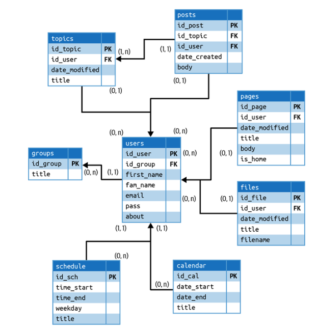
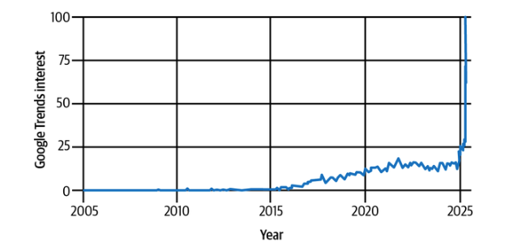
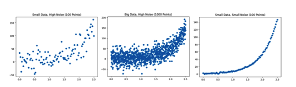
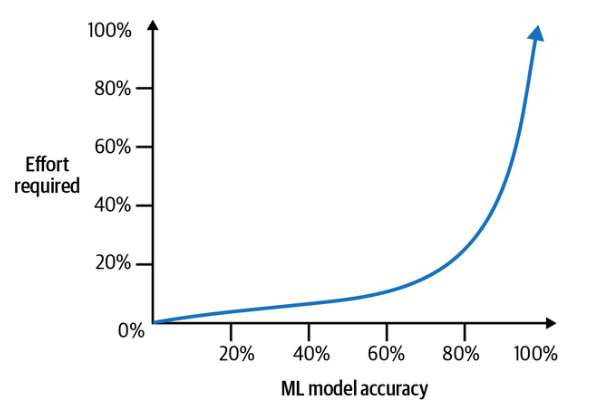

# Capítulo 1. Por qué la industria necesita ahora contratos de datos

Lamentablemente, la calidad de los datos y sus fundamentos, como el modelado de datos, han perdido gran parte de su prioridad con el auge del big data, la computación en la nube y la pila de datos moderna. Aunque estos avances han permitido un uso prolífico de los datos dentro de las organizaciones y han codificado profesiones como la ciencia de datos y la ingeniería de datos, la facilidad de uso de los datos también ha venido acompañada de una falta de restricciones, lo que ha llevado a muchas organizaciones a contraer una deuda de datos considerable. Con la presión para que los equipos de datos pasen de la I+D a generar ingresos, así como el cambio de la IA centrada en modelos a la centrada en datos, las organizaciones están aceptando una vez más las ventajas de la calidad de los datos como algo imprescindible en lugar de algo deseable. Esto se ve impulsado aún más por la estrecha relación entre los datos producidos o ingestados en las fases iniciales, normalmente por ingenieros de software, y los equipos de datos de las fases finales, que históricamente han estado aislados entre sí.

Aunque todo esto suena como problemas explícitamente técnicos, en el fondo se reducen a cuestiones relacionadas con una gestión del cambio e e dentro de sistemas complejos. Por lo tanto, creemos que los contratos de datos —acuerdos entre productores y consumidores de datos que se establecen, actualizan y aplican a través de una API— son necesarios para escalar y mantener la gestión del cambio relacionado con los datos dentro de una organización. Antes de profundizar en qué son los contratos de datos y cómo implementarlos, este capítulo destaca por qué nuestra industria ha renunciado a las buenas prácticas de calidad de datos, por qué estamos priorizando nuevamente la calidad de datos y las condiciones únicas de la industria de datos después de 2020 que justifican la necesidad de contratos de datos para impulsar la calidad de datos.

## Ciclo «basura entra, basura sale»

Si hablas con cualquier profesional del e o de datos, te dirá con fervor que el mantra «basura entra, basura sale» es la causa fundamental de la mayoría de los contratiempos y/o limitaciones de los datos. A pesar de que todos estamos de acuerdo en cuál es el problema dentro del ciclo de vida de los datos, seguimos teniendo dificultades para producir y utilizar datos de calidad. En gran parte, este problema se debe a que la mayoría de los equipos de datos no controlan la fuente de los datos que reciben y a que estos datos suelen tener un propósito principal distinto (por ejemplo, eventos CRUD para una aplicación de software). Aunque los datos pueden estar alineados con su propósito principal, a menudo es necesario que los equipos de datos los manipulen para su propósito secundario, como su uso en modelos de análisis o aprendizaje automático. Bajo estas limitaciones, incluso los equipos de datos más diligentes se ven limitados por la calidad de los datos que reciben.

## Gestión moderna de datos

Desde fuera, la gestión de datos e e parece relativamente sencilla: los datos se recopilan de un sistema de origen, se transfieren a través de una serie de tecnologías de almacenamiento para formar lo que llamamos un canal y, finalmente, terminan en un panel de control que se utiliza para tomar decisiones empresariales o crear un producto de datos, como un modelo de aprendizaje automático orientado al usuario. Esta impresión es comprensible. Los consumidores de datos, como los analistas, los gestores de productos y los ejecutivos empresariales, rara vez ven la gran infraestructura responsable de transportar los datos, limpiarlos y validarlos, descubrirlos, transformarlos y crear modelos de datos. Al igual que una operación logística de una magnitud indescriptible, el coste y la escala de la infraestructura necesaria para controlar el flujo de datos hacia las partes adecuadas de la organización son prácticamente invisibles, ya que funcionan silenciosamente en segundo plano.

Al menos, así debería ser. Con el auge del aprendizaje automático (ML) y la inteligencia artificial, los datos están cobrando cada vez más protagonismo, pero las organizaciones siguen teniendo dificultades para extraer valor de ellos. Entre las empresas que tienen dificultades, las canalizaciones utilizadas para gestionar sus flujos de datos se están colapsando, los científicos de datos contratados para crear modelos de ML e implementarlos no pueden avanzar hasta que se resuelvan los problemas de calidad de los datos, y los ejecutivos toman decisiones «basadas en datos» que cuestan millones de dólares y que resultan ser erróneas. A medida que el mundo continúa su transición a la nube, nuestra silenciosa infraestructura de datos ya no es tan silenciosa. En cambio, está sucumbiendo bajo el peso de la escala, tanto en términos de volumen como de complejidad organizativa. Justo en el momento en que los datos están a punto de alcanzar el mayor valor operativo de su historia, nuestra infraestructura se encuentra en la peor posición para cumplir ese objetivo.

El equipo de datos está sumido en el caos. Las organizaciones de ingeniería de datos se ven inundadas de tickets a medida que las canalizaciones fallan activamente en toda la empresa. Peor aún, los fallos silenciosos provocan cambios en los datos que son incompatibles con versiones anteriores sin que nadie se dé cuenta, lo que da lugar a interrupciones del servicio que cuestan millones de dólares y, lo que es peor, a una pérdida de confianza en los datos por parte de los empleados y los clientes. Esto sin tener en cuenta el alto coste que supone volver a ejecutar las canalizaciones y rellenar los datos, ni los costes de mano de obra del costoso personal técnico. Los ingenieros de datos a menudo se ven atrapados en el fuego cruzado de los equipos descendentes, que no entienden por qué sus datos importantes parecen hoy diferentes a los de ayer, y los productores de datos, que en última instancia son responsables de estos cambios, no tienen idea de quién está aprovechando sus datos y por qué motivo. La empresa suele estar confundida sobre la función que deben desempeñar los ingenieros de datos. ¿Son responsables de solucionar cualquier problema de calidad de los datos, incluso aquellos que no han causado? ¿Son responsables del rápido aumento del gasto en computación en la nube en una base de datos analítica? Si no es así, ¿quién lo es? Una vez más, los problemas de gestión del cambio y de expectativas exigibles se hacen e es entre los equipos técnicos.

Esta situación del mundo del es el resultado de la deuda de datos. La deuda de datos se refiere al resultado de las decisiones tecnológicas incrementales tomadas para acelerar la entrega de un activo de datos, como un canal, un panel de control o un conjunto de entrenamiento para modelos de aprendizaje automático. La deuda de datos es la principal villana de este libro. Inhibe nuestra capacidad para la implementación de activos de datos cuando los necesitamos, destruye la confianza en los datos y hace que la gobernanza iterativa de los datos sea casi imposible. El dolor de los equipos de ingeniería de datos es causado por la deuda de datos, ya sea gestionándola directamente o gestionando sus impactos secundarios en otros equipos. En los capítulos siguientes aprenderás qué causa la deuda de datos, por qué es más difícil de manejar que la deuda de software y cómo puede, en última instancia, paralizar las funciones de datos de una organización.

### ¿Qué es la deuda de datos?

Si has trabajado en cualquier tipo de organización de ingeniería a gran escala, es probable que hayas oído repetir docenas de veces la expresión «deuda tecnológica» a ingenieros preocupados que se secan el sudor de la frente mientras discuten un futuro con un volumen de solicitudes 100 veces superior al de su servicio.

En pocas palabras, la deuda tecnológica es el resultado de decisiones a corto plazo tomadas para implementar código más rápidamente a expensas de la estabilidad a largo plazo. Imagina un equipo de desarrollo de software que trabaja en una aplicación web para una empresa. Tienen un plazo muy ajustado para lanzar una nueva función, por lo que deciden tomar un atajo e implementar la función rápidamente sin refactorizar parte del código existente. La implementación rápida funciona y cumplen con el plazo, pero no es una solución muy eficiente ni fácil de mantener.

Con el tiempo, el equipo empieza a encontrar problemas con la implementación. El código de la nueva función está estrechamente vinculado al código base existente, lo que dificulta añadir o modificar otras funciones sin causar efectos secundarios no deseados. Siguen apareciendo errores relacionados con la nueva función y, cada vez que los desarrolladores intentan realizar cambios, les lleva más tiempo del esperado debido a la falta de documentación adecuada. El coste que supone corregir la implementación inicial con algo más escalable es la deuda. En algún momento, esta deuda debe pagarse, o el equipo de ingeniería sufrirá, ralentizando la velocidad de desarrollo hasta casi detenerla.

Si estás leyendo este libro, probablemente hayas experimentado situaciones similares de deuda de datos, como por ejemplo:

- Una métrica clave que se basa en un valor de datos mal interpretado, como la confusión entre `customers` y `active_customers` para calcular los ingresos.

- Los registros destinados a pruebas se envían a una base de datos utilizada para el entrenamiento de modelos de aprendizaje automático, lo que da lugar a predicciones incorrectas.

- Lógica de transformación codificada (por ejemplo, « `CASE WHEN` » en SQL) que inicialmente resolvió un problema de calidad de los datos, pero que ya no se ajusta a las hipótesis de los datos.

Al igual que la deuda tecnológica, la deuda de datos es el resultado de decisiones a corto plazo tomadas en beneficio de la velocidad. Sin embargo, la deuda de datos es mucho peor que la deuda tecnológica orientada al software por varias razones.

En primer lugar, en el software, la compensación típica que da lugar a la deuda tecnológica es la velocidad en favor de la mantenibilidad y la escala. En otras palabras, ¿qué tan fácil es para los ingenieros trabajar dentro de esta base de código y a cuántos clientes/solicitudes podemos atender? La función operativa de la aplicación sigue prestándose, lo que tiene por objeto resolver un problema fundamental de los clientes. En los datos, sin embargo, la principal propuesta de valor es la fiabilidad e . Si los datos que aparecen en nuestros paneles de control, modelos de aprendizaje automático y aplicaciones orientadas al cliente no son fiables, entonces no tienen ningún valor. Cuanto menos confiemos en nuestros datos, menos valiosos serán. La deuda de datos afecta directamente a la fiabilidad. Al crear rápidamente canales de datos sin los componentes básicos de una infraestructura de alta calidad, como el modelado de datos, la documentación y la validez semántica, estamos afectando directamente al valor fundamental de los propios datos. A medida que se acumula la deuda de datos, estos se vuelven menos fiables con el tiempo.

Volviendo a nuestro ejemplo de la aplicación web empresarial, imagina que la implementación del atajo no solo dificultó el mantenimiento del código, sino que cada característica adicional que se añadía hacía que el producto fuera cada vez más difícil de usar, hasta el punto de que no quedaba ningún cliente. Eso sería equivalente a la deuda de datos.

En segundo lugar, la deuda de datos es mucho más difícil de resolver que la deuda técnica. En la mayoría de las organizaciones de ingeniería de software modernas, los equipos han pasado o están pasando a los microservicios. Los microservicios son un patrón arquitectónico que cambia la forma en que se estructuran las aplicaciones, descomponiéndolas en una colección de servicios vagamente conectados que se comunican a través de protocolos ligeros. Un objetivo clave de este enfoque es permitir el desarrollo y la implementación de servicios por parte de equipos individuales, sin depender de otros. Al minimizar las interdependencias dentro de la base de código, los desarrolladores pueden hacer evolucionar sus servicios con restricciones mínimas.

Como resultado, las organizaciones se adaptan fácilmente, se integran con herramientas estándar cuando es necesario y organizan sus equipos de ingeniería en torno a la propiedad de los servicios. La estructura de los microservicios permite que la deuda tecnológica sea autónoma y se aborde a nivel local. La deuda tecnológica que afecta a un servicio no afecta necesariamente a otros servicios en la misma medida, lo que permite a cada equipo gestionar su propio trabajo pendiente sin tener que considerar los retos de escalabilidad para todo el monolito.

El ecosistema de datos se basa en un conjunto de entidades que representan objetos empresariales comunes. Estos objetos empresariales se corresponden con dominios importantes del mundo real o conceptuales dentro de una empresa. Por ejemplo, una empresa de tecnología de transporte de mercancías podría aprovechar entidades como envíos, transportistas, camiones, clientes, facturas, contratos, accidentes e instalaciones. Las entidades son sustantivos: son los componentes básicos de las preguntas que, en última instancia, pueden responderse mediante consultas.

Sin embargo, la mayoría de los datos e es útiles de una organización pasan por un conjunto de transformaciones creadas por ingenieros de datos, analistas o ingenieros de análisis. Las transformaciones combinan datos del mundo real a nivel de dominio en agregados lógicos llamados hechos, que se aprovechan en métricas utilizadas para evaluar la salud de un negocio. Una métrica de «rotación de clientes», por ejemplo, podría combinar datos de la entidad cliente y la entidad de pago. «Envíos completados por instalación» combinaría datos de la entidad de envío y la entidad de instalación. Dado que la construcción de métricas puede llevar mucho tiempo, la mayoría de las consultas escritas en una empresa dependen tanto de los objetos empresariales básicos como de las agregaciones. Eso significa que los equipos de datos están estrechamente vinculados entre sí y a los artefactos que producen, lo que supone una diferencia clara con respecto a los microservicios.

Este estrecho vínculo significa que la deuda de datos que se acumula en un entorno de datos no se puede cambiar fácilmente de forma aislada. Incluso un pequeño ajuste en una sola consulta puede tener enormes implicaciones posteriores, alterando radicalmente los informes e incluso las iniciativas de datos orientadas al cliente. Es casi imposible saber dónde se utilizan los datos, cómo se utilizan y el nivel de importancia que tiene el activo de datos en cuestión para el negocio. Cuanto más se acumula la deuda de datos entre productores y consumidores, más difícil resulta desenredar la red de consultas, filtros y modelos de datos mal construidos, lo que limita la visibilidad en las fases posteriores.

En resumen: la deuda de datos es un círculo vicioso. Desprecia la confianza en los datos, lo que ataca el valor fundamental de lo que los datos deben proporcionar. Dado que los equipos de datos están estrechamente vinculados entre sí, la deuda de datos no se puede solucionar fácilmente sin causar un efecto dominó en toda la organización. A medida que la deuda de datos crece, la falta de fiabilidad se agrava exponencialmente, acabando por infectar casi todos los dominios de datos y provocando el caos organizativo. La espiral de la deuda de datos es el mayor problema que hay que resolver en materia de datos, y no es ni de lejos un .

### Cómo se agrava el problema de «si entra basura, sale basura»

La deuda de datos es prominente en prácticamente todos los sectores verticales de la industria. A primera vista, parece que la gestión de la deuda es simplemente el estado predeterminado de los equipos de datos: un destino al que todas las organizaciones de datos están condenadas a seguir, incluso cuando los datos se toman en serio en una empresa. Sin embargo, hay una categoría de empresas que rara vez experimenta deuda de datos, y por una razón que quizá no esperes: las startups.

Cuando hablamos de startups, nos referimos a empresas en fase inicial en el sentido más estricto de la palabra: alrededor de 20 ingenieros de software o menos, un equipo de datos reducido pero funcional (aunque puede que solo sea uno o dos ingenieros de datos y unos pocos analistas) y un producto que ha encontrado su lugar en el mercado o está en camino de hacerlo. Hemos hablado con docenas de empresas que encajan en este perfil en nuestra investigación para este libro, y casi todas ellas afirman no solo tener una deuda de datos mínima, sino también no tener prácticamente ningún problema de calidad de datos. La razón por la que esto ocurre es sencilla: cuanto más pequeña es la organización de ingeniería, más fácil es comunicarse cuando las cosas cambian.

La mayoría de las grandes empresas tienen jerarquías de gestión complejas, con muchos ingenieros y equipos de datos que rara vez interactúan entre sí. Por ejemplo, los equipos de ingeniería de Convoy se dividieron en «pods», un término tomado del modelo de organización de productos de Spotify. Los pods son pequeños equipos creados en torno a problemas fundamentales de los clientes o ámbitos de negocio que maximizan la agilidad, la toma de decisiones independiente y la flexibilidad. Un pod se centró en apoyar a nuestro equipo de operaciones mediante la creación de modelos de aprendizaje automático para dar prioridad a los problemas más importantes planteados por los clientes. Otro trabajaba en el modelo de precios básico de Convoy, mientras que un tercero se centraba en proporcionar análisis en tiempo real sobre la hora estimada de llegada de los envíos a nuestros socios más importantes.

Aunque cada equipo formaba parte de una organización más grande, las hojas de ruta eran impulsadas principalmente por los gestores de producto en sus funciones de colaboradores individuales. Los gestores de producto rara vez hablaban con otros pods, a menos que necesitaran algo de ellos directamente. Esto provocó algunos problemas importantes para los equipos de datos cuando finalmente se lanzaron las nuevas funciones. Una ingeniería de software que gestiona una base de datos puede decidir cambiar el nombre de una columna, eliminar una columna, cambiar la lógica empresarial, dejar de emitir un evento o cualquier otra serie de cuestiones que resulten problemáticas para los consumidores posteriores. Los consumidores de datos solían ser los primeros en notar el cambio porque algo no cuadraba en su panel de control o porque el aprendizaje automático comenzaba a generar predicciones incorrectas.

En las startups más pequeñas, los ingenieros de datos y otros desarrolladores de datos aún no se han dividido en múltiples equipos aislados con estrategias diferentes. Todos formáis parte del mismo equipo, con la misma estrategia. Los desarrolladores de datos están al tanto de prácticamente todos los cambios que se implementan y pueden fácilmente levantar la mano en una reunión o apartar al ingeniero jefe para explicarle el problema. En una organización dinámica con docenas, cientos o miles de ingenieros, esto ya no es posible. Esta ruptura en la comunicación da lugar al fenómeno más frecuente en la calidad de los datos: si entran datos erróneos, salen datos erróneos (GIGO, por sus siglas en inglés).

GIGO ( ) se produce cuando datos que no cumplen las expectativas de las partes interesadas entran en un canal de datos. GIGO es problemático porque solo se puede tratar de forma retrospectiva, lo que significa que siempre habrá algún coste para resolver el problema. En algunos casos, ese coste puede ser grave, como la pérdida de ingresos por una mala decisión de un ejecutivo basada en un panel de control de baja calidad cuyos resultados cambiaron significativamente (por ejemplo, eran incorrectos pero parecían plausibles) de la noche a la mañana, o un modelo de aprendizaje automático que realiza predicciones incorrectas sobre el comportamiento de compra de un cliente. En otros casos, el coste podría ser menos grave: un panel de control muestra cifras erróneas que pueden corregirse fácilmente antes de la próxima presentación con una simple instrucción CASE. Sin embargo, incluso las correcciones sencillas esconden un problema más grave que se está gestando bajo la superficie: el aumento de la deuda de datos.

A medida que la cantidad de correcciones retroactivas aumenta con el tiempo, comienzan a acumularse puntos críticos de conocimiento institucional en áreas fundamentales del ecosistema de datos. Los enormes archivos SQL, con líneas y líneas de lógica empresarial, son completamente indescifrables para todos, excepto para los primeros profesionales de datos de la empresa. No está claro qué significan los datos, quién es su propietario, de dónde proceden o por qué el valor de un activo de datos está proporcionando resultados inesperados sin ninguna explicación en la documentación.

Con el tiempo, la deuda de datos causada por GIGO comienza a aumentar exponencialmente a medida que crece la proporción entre desarrolladores de software y desarrolladores de datos. El número de implementaciones aumenta de unas pocas por semana a cientos o miles por día. Los cambios radicales se convierten en algo habitual, mientras que muchos problemas de calidad de los datos que afectan al contenido de los propios datos (lógica empresarial) pueden pasar desapercibidos durante días, semanas o incluso meses. Cuando el problema ha crecido lo suficiente como para ralentizar notablemente el trabajo de los analistas y científicos de datos, ya se ha alcanzado un punto de inflexión: sin medidas drásticas, no hay salida. La deuda de datos seguirá aumentando y creará una experiencia de usuario cada vez más deficiente. Los ingenieros y científicos de datos abandonarán la empresa en busca de un entorno de trabajo menos doloroso, y el valor comercial de los activos de datos más significativos de la empresa se degradará.

Si bien GIGO es la causa más destacada de la deuda de datos, los retos en torno a los datos también tienen su origen en las arquitecturas comunes que adoptamos.

### La muerte de los almacenes de datos

Desde su aparición a finales de la década de 1980 y hasta la actualidad, el almacén de datos ha seguido siendo un componente fundamental de casi todos los ecosistemas de datos y la base de prácticamente todos los entornos analíticos.

El almacén de datos es uno de los conceptos más citados en todo el ámbito de los datos, y es un concepto esencial que hay que comprender a nivel básico cuando nos adentramos en las causas de la explosión de la deuda de datos. Bill Inmon es conocido como el «padre del almacén de datos», y con razón: él creó el concepto. En palabras del propio Inmon: «Un almacén de datos es una colección de datos orientada a temas, integrada, variable en el tiempo y no volátil que sirve de apoyo al proceso de toma de decisiones de la dirección».

Según Inmon, el almacén de datos es más que un simple repositorio; es una estructura orientada a temas que se alinea con la forma en que una organización piensa sobre sus datos desde una perspectiva semántica. Esta estructura proporciona una visión holística del negocio, lo que permite a los responsables de la toma de decisiones obtener una comprensión profunda de las tendencias y los patrones, y, en última instancia, aprovechar los datos para visualizaciones, aprendizaje automático y casos de uso operativo.

Para que una estructura de datos sea un almacén, debe cumplir tres capacidades básicas:

- El almacén de datos está diseñado en torno a los temas clave de una organización, como los clientes, los productos, las ventas y otros aspectos específicos del dominio.

- Los datos de un almacén proceden de diversos sistemas ascendentes de toda la organización. Los datos se unifican en un único formato común, lo que resuelve las inconsistencias y redundancias. Esta integración es lo que crea una única fuente de verdad y permite a los consumidores de datos aceptar dependencias ascendentes fiables sin preocuparse por la replicación.

- Los datos de un almacén se recopilan y almacenan a lo largo del tiempo, lo que permite realizar análisis históricos. Esto es esencial para los análisis con límites temporales, como comprender cuántos clientes compraron un producto en un periodo de 30 días u observar tendencias en los datos que pueden aprovecharse en el aprendizaje automático u otras formas de análisis predictivo. A diferencia de las bases de datos operativas, que cambian constantemente a medida que se producen nuevas transacciones, un almacén de datos es no volátil. Una vez que los datos se cargan en el almacén, permanecen inalterados, lo que proporciona un entorno estable para el análisis.

La creación de un almacén de datos suele comenzar con un diagrama de relaciones entre entidades (ERD), como se ilustra en la figura 1-1. Un ERD representa la estructura lógica y semántica de las operaciones centrales de una empresa y tiene por objeto proporcionar un mapa que pueda utilizarse para guiar el desarrollo del almacén. Una entidad es un tema empresarial e e que puede expresarse en formato tabular, en el que cada fila corresponde a una unidad temática única. Cada entidad se empareja con un conjunto de dimensiones que contienen detalles específicos sobre la entidad en forma de columnas. Por ejemplo, una entidad de cliente (no relacionada con el siguiente ejemplo de ERD) podría contener dimensiones como:

- `Customer_id`

- `Birthday`

- `FirstName`

- `LastName`



Las claves externas son una dimensión importante en el diseño de ERD. Son identificadores únicos que permiten a los analistas combinar datos de múltiples entidades en una sola consulta. Por ejemplo, el « `customers_table` » podría contener las siguientes claves externas relevantes:

- `Address_id`

- `Account_id`

Al aprovechar las claves externas, un científico de datos puede obtener fácilmente el número de inicios de sesión por usuario o contar el número de registros en el sitio web por ciudad o estado.

La relación que cualquier entidad tiene con otra se denomina cardinalidad. La cardinalidad es lo que permite a los analistas comprender la naturaleza de la relación entre entidades, lo cual es esencial para realizar análisis fiables a gran escala. Por ejemplo, si la entidad cliente tiene una relación 1 a 1 con la entidad cuentas, nunca esperaríamos ver más de una cuenta vinculada a un usuario o una dirección de correo electrónico.

Estas asignaciones no pueden realizarse solo con la intuición. En el nivel más alto de abstracción, los dominios de datos y su propósito dentro de una empresa se representan como un modelo de datos conceptual. A continuación, el proceso de determinar el conjunto ideal de entidades y sus dimensiones, claves externas y cardinalidad se denomina un modelo de datos lógico, mientras que el resultado de convertir este mapa semántico en tablas, columnas e índices que pueden consultarse a través de lenguajes analíticos como SQL es el modelo de datos físico. Las tres prácticas juntas representan el proceso de modelado de datos. Solo mediante un modelado de datos riguroso se puede crear un almacén de datos.

El significado original del almacenamiento de datos y el modelado de datos son componentes esenciales que hay que comprender para entender por qué el ecosistema de datos actual se encuentra en tan mal estado. Pero antes de llegar a la era moderna, veamos un poco más cómo se utilizaban los almacenes en su apogeo.

### La era premoderna

Los almacenes de datos son anteriores a la popularidad de la nube, el auge del software e incluso la proliferación de Internet. Durante la era pre-Internet, la creación de un almacén de datos implicaba una implementación especializada dentro de la red interna de una organización. Las empresas necesitaban hardware y sistemas de almacenamiento dedicados debido a los volúmenes sustanciales de datos que los almacenes de datos estaban diseñados para manejar. Se implementaban servidores de alto rendimiento para alojar el entorno del almacén de datos, en el que los datos se gestionaban mediante sistemas de gestión de bases de datos relacionales (RDBMS) como Oracle, IBM DB2 o Microsoft SQL Server.

Los casos de uso que impulsaron la necesidad de almacenes de datos eran normalmente de naturaleza operativa. Los minoristas podían examinar el comportamiento de compra de los clientes, los patrones de tráfico peatonal estacionales y las preferencias de compra entre franquicias para crear una gestión de inventario más sólida. Los fabricantes podían identificar los cuellos de botella en su cadena de suministro y realizar un seguimiento de los calendarios de producción. Ford ahorró más de 1000 millones de dólares al aprovechar un almacén de datos junto con mejoras de procesos basadas en Kaizen para optimizar las operaciones con mejores datos. Las aerolíneas aprovecharon los almacenes de datos para planificar sus rutas de vuelo óptimas, horarios de salida y tamaño de la tripulación.

Sin embargo, la creación de almacenes de datos e es no era un proceso barato. Era necesario contratar a especialistas para diseñar, construir y gestionar las implementaciones de ERD, modelos de datos y, en última instancia, el propio almacén. Los equipos de ingeniería de software tenían que trabajar en estrecha colaboración con los responsables de datos para coordinar los sistemas transaccionales y analíticos (, es decir, OLTP y OLAP, respectivamente). Las costosas herramientas ETL, como Informática, Microsoft SQL Server Integration Services (SSIS), Talend y otras, requerían expertos para su implementación y funcionamiento. En definitiva, la transición a un almacén operativo podía llevar varios años, millones de dólares en gastos tecnológicos y docenas de empleados especializados.

Los supervisores de este proceso se denominaban arquitectos de datos « », ingenieros multidisciplinares con formación en informática y especializados en la gestión de datos. El arquitecto diseñaba el modelo de datos inicial, elaboraba la hoja de ruta de implementación, compraba e incorporaba las herramientas, comunicaba la hoja de ruta a las partes interesadas y gestionaba la gobernanza y la mejora continua del almacén a lo largo del tiempo. Actuaban como administradores de los datos, garantizando que las partes interesadas y los usuarios empresariales recibieran siempre datos oportunos y fiables que se ajustaran a una necesidad empresarial clara. Este fue el mejor modelo durante un tiempo, pero luego las cosas empezaron a cambiar...

### El software se come el mundo

En 2011, Marc Andreessen, inversor de capital riesgo y cofundador de la legendaria empresa de capital riesgo Andreessen Horowitz, escribió un ensayo titulado «Why Software Is Eating the World» (Por qué el software se está comiendo el mundo) en The Wall Street Journal. En el ensayo, Andreessen explicaba el rápido y transformador impacto que el software y la tecnología estaban teniendo en diversas industrias:

_Las herramientas de programación de software y los servicios basados en Internet facilitan el lanzamiento de nuevas empresas emergentes globales impulsadas por software en muchos sectores, sin necesidad de invertir en nueva infraestructura ni formar a nuevos empleados. En 2000, cuando mi socio Ben Horowitz era director ejecutivo de la primera empresa de computación en la nube, Loudcloud, el coste para un cliente que ejecutaba una aplicación básica de Internet era de aproximadamente 150 000 dólares al mes. Hoy en día, ejecutar esa misma aplicación en la nube de Amazon cuesta unos 1500 dólares al mes._

La década de 2000 marcó un periodo de cambios increíbles en el sector empresarial. Tras la burbuja puntocom de finales de los 90, surgieron nuevas superpotencias globales en forma de startups de Internet de alto margen y bajo coste, con un ritmo de innovación tecnológica y crecimiento alucinante. Sergey Brin y Larry Page habían convertido Google, que en 1998 era un motor de búsqueda que operaba desde una habitación de la residencia de estudiantes de Stanford, en un gigante publicitario mundial con una capitalización bursátil de más de 23 000 millones de dólares a finales de la década de 2000. Amazon había sustituido prácticamente a Walmart como fuerza dominante en el comercio, Netflix había acabado con Blockbuster y Facebook había pasado de ser una aplicación universitaria para buscar personas a una empresa con 153 millones de dólares al año en ingresos en solo tres años.

Uno de los cambios internos más importantes provocados por el auge de las empresas de software fue la propagación de Agile, una metodología de desarrollo de software popularizada por la consultora Thoughtworks. Hasta ese momento, los lanzamientos de software se gestionaban de forma secuencial y, por lo general, requerían que los equipos diseñaran, construyeran, probasen e implementasen productos completos de principio a fin. El modelo en cascada era similar al lanzamiento de películas, en el que el cliente obtiene un producto completo que ha sido validado minuciosamente y ha pasado por un riguroso control de calidad. Sin embargo, Agile era diferente. En lugar de esperar a que todo el producto estuviera listo para su envío, las empresas gestionaban los lanzamientos de forma mucho más iterativa, centrándose en gran medida en la gestión rápida del cambio y en ciclos cortos de retroalimentación de los clientes.

Empresas como Google, Facebook y Amazon fueron las primeras en adoptar Agile. Mark Zuckerberg dijo una vez que la filosofía de desarrollo de Facebook era «mover rápido y romper cosas». Esta velocidad de implementación permitió a las empresas Agile acercarse rápidamente a lo que los clientes estaban más dispuestos a pagar. La alineación de las necesidades de los clientes y las características de los productos logró una especie de nirvana al que los capitalistas de riesgo se refieren como «ajuste del producto al mercado». Lo que a las empresas tradicionales les llevó décadas conseguir, las empresas de Internet pudieron lograrlo en solo unos años.

Con Agile como punto focal de las empresas orientadas al software, la estructura organizativa común comenzó a evolucionar. La ingeniería de software se convirtió en el centro de atención del departamento de I+D, que pasó a denominarse «producto» en aras de la brevedad y la precisión. Comenzaron a surgir nuevas funciones que prestaban apoyo a la ingeniería de software: diseñadores de UX especializados en diseño web y de aplicaciones. Gestores de producto que combinaban la gestión de proyectos con la estrategia de producto y el posicionamiento empresarial para ayudar a crear la hoja de ruta. Analistas y científicos de datos que recopilaban los registros emitidos por las aplicaciones para determinar métricas empresariales básicas como las tasas de registro, la rotación y el uso del producto. Los equipos se hicieron más pequeños y especializados, lo que permitió a los ingenieros enviar código aún más rápido que antes.

Con el aumento de la brecha tecnológica, las empresas tradicionales offline comenzaban a sentir la presión del mercado y de los inversores para realizar la transición y convertirse en empresas tecnológicas ágiles. La velocidad a la que crecían las empresas basadas en software era alarmante (véase la figura 1-2), y existía una profunda preocupación por que las empresas que adoptaran este modelo de negocio pudieran convertirse en competidores con una ventaja demasiado grande como para alcanzarlos. Alrededor de 2015, el término «transformación digital» comenzó a ganar popularidad de forma explosiva, ya que las principales consultoras de gestión, como McKinsey, Deloitte y Accenture, impulsaron ofertas para modernizar la infraestructura técnica de muchas empresas tradicionales offline mediante la creación de aplicaciones y sitios web y, lo que es más importante para estos autores, impulsando el paso de las bases de datos locales a la nube.

> **Nota**

> Escribimos el primer borrador de esta sección en 2023, antes del enorme aumento que se observa en el gráfico en 2025. Si bien la nube desempeñó un papel importante en el fuerte aumento entre 2013 y 2025, sería negligente por nuestra parte no señalar la fuerte correlación entre la línea casi vertical y el auge de la IA en 2025.



La mayor promesa de la nube era el ahorro de costes y la velocidad. Empresas como Amazon (AWS), Microsoft (Azure) y Google (GCP) eliminaron la necesidad de mantener servidores físicos, lo que supuso un ahorro de millones de dólares en infraestructura y capital humano. Esto encajaba en el paradigma ágil, que permitía a las empresas avanzar mucho más rápido al descargar la complejidad en un proveedor de servicios. Empresas como McDonald's, Coca-Cola, Unilever, General Electric, Capital One, Disney y Delta Airlines son ejemplos de empresas consolidadas de la lista Fortune 500 que realizaron inversiones masivas para llevar a cabo una transformación digital y, en última instancia, pasar a la nube.

### Un cambio hacia los microservicios

A principios de la década de 2000, el estilo de arquitectura de software más común era, con diferencia, el monolítico. Una arquitectura monolítica es un enfoque tradicional de diseño de software en el que una aplicación se construye como una unidad única e interconectada, con componentes estrechamente integrados y una base de datos unificada. Todos los módulos forman parte de la misma base de código y la aplicación se implementa como un todo. Debido a la naturaleza altamente acoplada de la base de código, a los desarrolladores les resulta difícil mantener los monolitos a medida que se hacen más grandes, lo que provoca una ralentización significativa en la velocidad de envío. En 2011 (el mismo año en que Marc Andreessen publicó su emblemático artículo en The Wall Street Journal ), se introdujo un nuevo paradigma denominado «microservicios».

Los microservicios son un patrón arquitectónico que cambia la forma en que se estructuran las aplicaciones, descomponiéndolas en una colección de servicios vagamente conectados que se comunican a través de protocolos ligeros. Un objetivo clave de este enfoque es permitir el desarrollo y la implementación de servicios por parte de equipos individuales, sin depender de otros. Al minimizar las interdependencias dentro del código base, los desarrolladores pueden hacer evolucionar sus servicios con restricciones mínimas. Como resultado, las organizaciones se escalan fácilmente, se integran con herramientas estándar según sea necesario y organizan sus equipos de ingeniería en torno a la propiedad de los servicios. El término «microservicio» fue introducido por primera vez por los consultores de Thoughtworks y ganó prominencia a través del influyente blog de Martin Fowler.

Las empresas de software realizaron con entusiasmo la transición a los microservicios con el fin de desacoplar aún más su infraestructura y aumentar la velocidad de desarrollo. Empresas como Amazon, Netflix, Twitter y Uber fueron algunas de las que más rápido crecieron aprovechando este patrón arquitectónico, y el impacto en la escalabilidad fue inmediato. Como dijo Werner Vogels, director de tecnología de Amazon:

_Nuestros servicios se basan en microservicios. Una arquitectura basada en microservicios, en la que los componentes de software están desacoplados y se pueden implementar de forma independiente, es muy adaptable a los cambios, altamente escalable y tolerante a fallos. Permite una implementación continua y una experimentación frecuente de « »._

### Arquitectura de datos en mal estado

En el apasionante mundo de los microservicios, la nube y Agile ( ), hubo una víctima silenciosa: el arquitecto de datos. La función original de los arquitectos de datos era la de administradores, diseñando ERD, controlando el acceso al flujo de datos, diseñando sistemas OLTP y OLAP, y actuando como proveedores de una fuente centralizada de verdad. En el nuevo mundo de la descentralización, los equipos de ingeniería de software aislados y la alta velocidad de desarrollo, se percibía al arquitecto de datos (con razón) como un obstáculo para la velocidad.

Los años que se tardaba en implementar una arquitectura de datos funcional eran demasiado largos. Pasar meses creando el ERD perfecto era demasiado lento. Los arquitectos de datos perdieron el control: ya no podían dictar a la ingeniería de software cómo diseñar sus bases de datos y, sin un modelo de datos central desde el que operar, los modelos de datos conceptuales y físicos ascendentes dejaron de estar sincronizados. Los datos tenían que moverse rápidamente y los equipos de producto no querían que un tercero les proporcionara datos bien seleccionados en bandeja de plata. Los equipos de producto estaban más interesados en crear productos mínimos viables, experimentar e iterar hasta encontrar la respuesta más útil. Los datos no tenían por qué ser perfectos, al menos al principio.

Con el fin de facilitar un acceso más rápido a los datos desde el primer día, surgió el patrón de arquitectura de lago de datos « ». Los lagos de datos son repositorios centralizados en los que se pueden almacenar datos estructurados, no estructurados y semiestructurados a cualquier escala y a un coste reducido. Los lagos de datos suelen alojarse en sistemas de almacenamiento hiperescalables, como Amazon S3, Azure Data Lake Storage y Google Cloud Storage. Los equipos de análisis y ciencia de datos pueden extraer datos del lago o analizarlos/consultarlos directamente con marcos como Apache Spark o proveedores de SaaS como Looker o Tableau.

Aunque los lagos de datos eran eficaces a corto plazo, su falta de gobernanza provocaba importantes problemas de calidad de los datos debido a la ausencia de esquemas definidos requeridos por las bases de datos OLAP. En última instancia, esto impedía que los datos se utilizaran de forma más estructurada por parte de las organizaciones en general. Surgieron bases de datos analíticas como Redshift, BigQuery y Snowflake, en las que los equipos de datos podían empezar a realizar análisis más complejos durante períodos de tiempo más largos. Los datos se extraían de los sistemas de origen y se transferían al lago de datos y a los entornos analíticos, de modo que los equipos de datos tenían acceso a datos actualizados cuando y donde los necesitaban.

Las empresas consideraban que necesitaban ingenieros de datos que crearan canalizaciones para mover los datos entre los sistemas OLTP, los lagos de datos y los entornos analíticos, más que arquitectos de datos y sus estructuras de diseño más rígidas e inflexibles.

La eliminación del arquitecto de datos dio lugar a la desaparición gradual del almacén de datos. En muchas empresas, los almacenes de datos solo existen de nombre. No hay un modelo de datos cohesionado, ni entidades claramente definidas, y lo que existe ciertamente no actúa como una capa de integración completa que sea casi 1:1 de las unidades de negocio reflejadas en el código. Hoy en día, los ingenieros de datos hacen todo lo posible por definir unidades de negocio comunes en su entorno analítico, pero se ven presionados por ambas partes: los consumidores de datos y los productores de datos. Los primeros siempre presionan para ir más rápido y «romper cosas», y los segundos operan en silos, rara vez conscientes de dónde van los datos que producen o cómo se utilizan.

Probablemente no haya forma de volver atrás. Las empresas ágiles, orientadas al software y los microservicios añaden valor real, y estos métodos permiten a las empresas experimentar de forma más rápida y eficaz que sus homólogas más lentas. Lo que se necesita ahora es una evolución tanto de la función de la arquitectura de datos como del propio almacén de datos. Necesitamos una solución diseñada para los tiempos modernos, que aporte un valor incremental donde realmente importa.

## El auge de la pila de datos moderna

El término «pila de datos moderna» (MDS, por sus siglas en inglés) se refiere a un conjunto de herramientas diseñadas para arquitecturas de datos basadas en la nube. Estas herramientas se solapan con sus homólogas offline, pero en la mayoría de los casos están más componentizadas y se amplían a una variedad de casos de uso adicionales. El MDS es una herramienta muy importante en el kit de herramientas de una startup. Dado que las nuevas empresas son nativas de la nube, lo que significa que se diseñaron en la nube desde el primer día, la realización de análisis o aprendizaje automático a cualquier escala requerirá la adopción eventual de parte o la totalidad del MDS.

### Los grandes actores

Snowflake es la mayor y más popular de las opciones de MDS, a menudo citada como la empresa que estableció por primera vez el término. Snowflake, una base de datos analítica orientada a la nube, salió a bolsa el 16 de septiembre de 2020. Durante su oferta pública inicial (OPI), la empresa fue valorada en unos 33 300 millones de dólares, lo que la convirtió en una de las mayores OPI de software de la historia. Su arquitectura nativa en la nube, que separa la computación del almacenamiento, ofrece una escalabilidad significativa, eliminando las limitaciones de hardware y el ajuste manual. Esto garantiza un alto rendimiento incluso con cargas de trabajo pesadas, con una asignación dinámica de recursos para cada consulta. Snowflake podría ahorrar a las empresas con un uso intensivo de computación entre cientos de miles y millones de dólares, proporcionando una gran cantidad de integraciones con otros productos de datos.

Existen otras alternativas populares a Snowflake, como Google BigQuery, Amazon Redshift y Databricks. Mientras que Snowflake ha acaparado eficazmente el mercado de las transformaciones SQL basadas en la nube, Databricks ofrece el entorno más completo para el análisis unificado, construido sobre el marco de procesamiento de datos distribuido a gran escala de código abierto más popular del mundo: Spark. Con Databricks, los científicos y analistas de datos pueden gestionar fácilmente sus clústeres Spark, generar visualizaciones utilizando lenguajes como Python o Scale, entrenar e implementar modelos de aprendizaje automático y mucho más. Snowflake y Databricks han entrado en una carrera armamentística de datos certificable, y su competencia por la supremacía ha dado lugar a una nueva ola de startups orientadas a los datos a lo largo de finales de la década de 2010 y principios de la de 2020.

Sin embargo, las bases de datos analíticas de tipo « » no están solas en la infraestructura de datos moderna. La herramienta de extracción, carga y transformación (ELT) Fivetran también ha ganado un amplio reconocimiento. Aunque no cotiza en bolsa en el momento de escribir este libro, el impacto de Fivetran en el panorama de los datos modernos sigue siendo notable. Gracias a una colección de interfaces fáciles de usar y conectores preconstruidos, Fivetran permite a los ingenieros de datos conectarse directamente a las fuentes y destinos de datos, lo que las organizaciones pueden aprovechar rápidamente para extraer y cargar datos de bases de datos, aplicaciones y API. Fivetran se ha convertido en el mecanismo de facto para que las empresas en fase inicial transfieran datos entre fuentes y destinos.

Abreviatura de «data build- » (herramienta de construcción y análisis de datos), dbt es uno de los componentes de código abierto de más rápido crecimiento para Modern Data Stack. Con transformaciones modulares impulsadas por Yet Another Markdown Language (YAML), dbt proporciona una CLI que permite a los ingenieros de datos y análisis crear transformaciones mientras aprovechan un flujo de trabajo orientado a la ingeniería de software. La versión alojada de dbt amplía el producto desde las simples transformaciones hasta una capa de métricas basada en YAML que permite a los equipos de datos definir y almacenar hechos y sus metadatos, que pueden aprovecharse en la experimentación y el análisis posteriores.

Esto es solo una muestra de las herramientas que hay dentro del MDS. En la última década han surgido docenas de empresas y categorías, que van desde sistemas de orquestación como Airflow y Dagster, pasando por herramientas de observabilidad de datos como Monte Carlo y Anomalo, hasta catálogos de datos nativos de la nube como Atlan y Select Star, repositorios de métricas, almacenes de características y plataformas de experimentación, y un largo etcétera.

La razón por la que la velocidad de las herramientas de datos se ha acelerado en los últimos años es principalmente la simplicidad de las integraciones que la mayoría de las herramientas tienen con las bases de datos analíticas más dominantes en el espacio: Snowflake, BigQuery, Redshift y Databricks. Todas estas herramientas proporcionan API fáciles de usar para los desarrolladores y exponen metadatos bien estructurados a los que se puede acceder y aprovechar para realizar análisis, escribir transformaciones o consultar de otro modo.

### Rápido crecimiento

La pila de datos moderna creció rápidamente entre 2012 y 2022. Fue entonces cuando los equipos comenzaron a pasar de aplicaciones solo locales a la nube, y era lógico que sus entornos de datos siguieran poco después. Tras adoptar herramientas básicas como S3 para los lagos de datos y un entorno de datos analíticos como Snowflake o Redshift, las empresas se dieron cuenta de que carecían de funcionalidades básicas en materia de movimiento de datos, transformación de datos, gobernanza de datos y calidad de los datos. Las empresas necesitaban replicar sus antiguos flujos de trabajo en un nuevo entorno, lo que llevó a los equipos de datos a adquirir rápidamente un conjunto de herramientas para que todas las piezas funcionaran correctamente.

Otros factores internos también contribuyeron a la adquisición de nuevas herramientas. Los equipos de TI, que solían ser los responsables de la adquisición de e , comenzaron a ser sustituidos con el auge del crecimiento impulsado por los productos. La principal forma de vender software durante la década anterior era la venta descendente. Los vendedores se reunían con importantes ejecutivos de la empresa, les mostraban una larga presentación con diapositivas en la que se exponía la propuesta de valor de su plataforma y los precios, y luego trabajaban en una prueba de concepto durante muchos meses para demostrar el valor del software. Este proceso era lento, requería la aprobación de múltiples partes interesadas de toda la organización y, en última instancia, daba lugar a tarifas de plataforma mucho más caras desde el primer día. El crecimiento impulsado por los productos cambió eso.

El crecimiento impulsado por el producto es un proceso de ventas que permite que sea el producto el que hable. Los proveedores de SaaS ofrecían sus productos de forma gratuita o a un precio tan bajo que los equipos podían gestionar la aprobación de forma independiente sin necesidad de recurrir al equipo de TI. Esto les permitía familiarizarse con el producto, integrarlo en sus flujos de trabajo diarios y comprobar si la herramienta resolvía los problemas que tenían sin una gran inversión inicial. Además, el modelo de pago por uso de estas soluciones y la facilidad de configuración en la nube significaban que el tamaño de los contratos se adaptaba al negocio, lo que también suponía una ventaja para los proveedores.

Las empresas de infraestructura de datos solían estar financiadas por empresas de capital riesgo debido a la elevada inversión inicial en I+D que requerían. En los inicios de una startup, los inversores de capital riesgo tienden a dar más importancia al crecimiento de la clientela que a los ingresos. Esto se debe a que un uso elevado implica que el producto se adapta al mercado, y conseguir un buen conjunto de «logos» (clientes) implica que, si empresas avanzadas y conocidas estaban dispuestas a arriesgarse con un producto nuevo y desconocido, muchas otras empresas estarían dispuestas a hacer lo mismo. Al facilitar mucho más a los equipos individuales el uso de la herramienta de forma gratuita o barata, los proveedores podían aumentar radicalmente el número de primeros usuarios y atribuirse el mérito de haber incorporado a empresas conocidas.

Además de cambiar las metodologías de adquisición y los procesos de venta, la asignación de recursos para las organizaciones de datos creció sustancialmente durante la última década. A medida que la ciencia de datos evolucionó de una disciplina incipiente a una categoría que mueve miles de millones de dólares al año, las empresas comenzaron a invertir más que nunca en personal científico, investigadores, ingenieros de datos, ingenieros analíticos, analistas, gerentes y directores de datos (CDO).

Por último, las empresas de datos en fase inicial y de crecimiento se convirtieron de repente en las favoritas del capital riesgo tras la masiva oferta pública inicial de Snowflake. Los datos pasaron de ser algo interesante y deseable a una oportunidad indiscutible a largo plazo. Gracias a los bajos tipos de interés y al enorme impulso económico que recibieron las empresas tecnológicas durante la COVID, se invirtieron miles de millones de dólares en startups de datos, lo que provocó una explosión de proveedores en todos los ámbitos del sector. La tecnología de datos tenía tanta demanda que no era raro invertir en varias empresas que podían estar compitiendo entre sí.

### Problemas en el paraíso

A pesar de todo el entusiasmo por la pila de datos moderna, con el tiempo comenzaron a aparecer fisuras notables. Los equipos que estaban empezando a alcanzar escala se quejaban: la deuda tecnológica crecía rápidamente, los canales se rompían, los equipos de datos no podían encontrar los datos que necesitaban y los analistas dedicaban la mayor parte de su tiempo a buscar y validar datos en lugar de darles un buen uso en productos de datos que generaran retorno de la inversión. ¿Qué pasó?

En primer lugar, los equipos de ingeniería de software ya no se dedicaban al modelado de datos ni al desarrollo del diseño de relaciones entre entidades a nivel de toda la empresa. Esto significaba que no existía una única fuente de verdad e e para la empresa. Los datos se replicaban en la nube en muchos microservicios diferentes. Sin arquitectos de datos que actuaran como administradores de los mismos, no había nada que impidiera que se repitieran docenas de veces implementaciones únicas del mismo concepto, con datos que quizá proporcionaban resultados variables.

En segundo lugar, los productores de datos no tenían ninguna relación con los consumidores de datos. Como era más fácil y rápido volcar los datos en un lago de datos que crear interfaces explícitas para consumidores y casos de uso específicos, la ingeniería de software lanzaba sus datos por encima de la valla a los ingenieros de datos, cuya tarea consistía en construir rápidamente canalizaciones con herramientas como Airflow, dbt y Fivetran. Aunque estas herramientas completaban el trabajo rápidamente, también creaban una distancia significativa entre los entornos de producción y análisis. Realizar un cambio en una base de datos de producción no tenía ningún tipo de protección. No se proporcionaba información sobre quién utilizaba esos datos (si es que se utilizaban), dónde fluían, por qué eran importantes y qué expectativas eran esenciales para su función.

En tercer lugar, los consumidores de datos comenzaron a perder una confianz e en los datos. Cuando un activo de datos cambiaba en la parte superior, los consumidores de la parte inferior se veían obligados a asumir el coste de ese cambio por su cuenta. Por lo general, eso significaba añadir un filtro a su consulta SQL existente para tener en cuenta el problema.

Por ejemplo, si un analista escribía una consulta destinada a responder a la pregunta «¿Cuántos clientes activos tiene la empresa este mes?», la definición de activo podía definirse a partir de la tabla de visitas, que registra información cada vez que un usuario abre la aplicación. Además, el equipo de BI podía decidir que una sola visita no era suficiente para justificar la intención detrás de la palabra «activo». Es posible que estén comprobando las notificaciones, pero no utilizando la plataforma, lo que da como resultado que el recuento mínimo de visitas se establezca en 3, como muestra este ejemplo de código:

```SQL
WITH visit_counts AS (
    SELECT
        customer_id,
        COUNT(*) AS visit_count
    FROM
        visits
    WHERE
        DATE_FORMAT(visit_date, '%Y-%m') =
        DATE_FORMAT(CURDATE(), '%Y-%m')
    GROUP BY
        customer_id
)

SELECT
    COUNT(DISTINCT customers.customer_id) AS active_customers
FROM
    customers
LEFT JOIN
    visit_counts ON
    visit_counts.customer_id = customers.customer_id
WHERE
    COALESCE(visit_counts.visit_count, 0) >= 3;
```

Sin embargo, con el tiempo, los cambios ascendentes y descendentes afectan a la evolución de esta consulta de forma sutil. Supongamos que el equipo de ingeniería de software decide distinguir entre visitas e impresiones. Una impresión es cualquier aplicación abierta en cualquier pantalla nueva o anterior, mientras que una visita se define como un periodo de actividad que dura más de 10 segundos. Antes, todas las visitas se contabilizaban en el recuento de clientes activos. Ahora, un porcentaje de esas visitas se registraría como impresiones. Para tener esto en cuenta, el analista crea una instrucción `CASE WHEN` que define la nueva lógica de impresiones y, a continuación, suma el número total de impresiones y visitas para obtener efectivamente la misma respuesta que su consulta anterior utilizando los datos actualizados:

```SQL
WITH impressions_counts AS (
    SELECT
        customer_id,
        SUM(CASE WHEN duration_seconds >= 10 THEN 1 ELSE 0 END)
            AS visit_count,
        SUM(CASE WHEN duration_seconds < 10 THEN 1 ELSE 0 END)
            AS impression_count
    FROM
        impressions
    WHERE
        DATE_FORMAT(impression_date, '%Y-%m') =
        DATE_FORMAT(CURDATE(), '%Y-%m')
    GROUP BY
        customer_id
    HAVING
        (visit_count + impression_count) >= 3
)

SELECT
    COUNT(DISTINCT customers.customer_id) AS active_customers
FROM
    customers
LEFT JOIN
    impressions_counts ON
    impressions_counts.customer_id = customers.customer_id
WHERE
    COALESCE(impressions_counts.visit_count, 0) >= 3;
```

Cuanto más cambia el upstream, más largas se vuelven estas consultas. Se pierde todo el contexto sobre por qué existen las sentencias « `CASE` » o las cláusulas « `WHERE` ». Cuando los nuevos desarrolladores de datos se incorporan a la empresa y buscan definiciones existentes de conceptos empresariales comunes, a menudo se sorprenden por la complejidad de las consultas que se escriben y no pueden interpretar las capas de deuda tecnológica que se han acumulado en el entorno analítico. `JOIN` Dado que estas consultas no son fáciles de analizar ni de comprender, los equipos de datos las revisan directamente con la ingeniería de software para entender qué significan los datos procedentes de los sistemas de origen, por qué se diseñaron de una manera concreta y cómo integrarlos con otras entidades básicas. A continuación, los equipos «recreaban la rueda» para sus propios fines, lo que daba lugar a duplicaciones y a una complejidad cada vez mayor, iniciando así un nuevo ciclo.

En cuarto lugar, los costes de las herramientas de datos comenzaron a dispararse. Muchos de los proveedores de MDS tienen precios basados en el uso. Básicamente, eso significa «pagar por lo que usas». Los precios basados en el uso son un modelo estupendo cuando puedes controlar y escalar razonablemente el uso de un producto a lo largo del tiempo. Sin embargo, el modelo se vuelve venenoso cuando el crecimiento de un servicio se dispara fuera del control de sus gestores principales. A medida que las consultas en el entorno analítico se volvían cada vez más complejas, la factura de la nube crecía exponencialmente para adaptarse a ellas. El aumento del volumen de datos se tradujo en facturas más elevadas de todo tipo de herramientas MDS, que ahora aplicaban tarifas basadas en el uso que seguían disparándose. Además, muchas herramientas MDS que dependían del capital riesgo tuvieron que subir rápidamente los precios al agotarse la fiebre de financiación posterior a la pandemia.

Casi de la noche a la mañana, el equipo de datos era más grande que nunca, más caro que nunca, más complicado que nunca y ofrecía menos valor empresarial que nunca .

## La IA centrada en los datos y el auge de las prácticas de datos «shift left»

Aunque hay artículos anteriores de arXiv ( ) que mencionan la «IA centrada en los datos», la aceptación generalizada del término fue impulsada por el Dr. Andrew Ng y la campaña de DeepLearningAI de 2021, que defendía este enfoque. En resumen, la IA centrada en los datos es el proceso de aumentar el rendimiento de los modelos de aprendizaje automático mediante la mejora sistemática de la calidad de los datos de entrenamiento, ya sea en la fase de recopilación o en la de preprocesamiento. Esto contrasta con la IA centrada en los modelos, que se basa en un mayor ajuste de los modelos de aprendizaje automático, en el aumento de la potencia de computación en la nube o en la utilización de modelos actualizados para aumentar el rendimiento. A través del trabajo de su laboratorio de IA y de las conversaciones con sus compañeros del sector, Ng observó una pauta en la que los enfoques centrados en los datos superaban ampliamente a los enfoques centrados en los modelos. Te recomendamos encarecidamente que veas el seminario web al que se hace referencia, cuyo enlace se encuentra en la sección de recursos adicionales, pero hay dos ejemplos clave que resumen perfectamente por qué el sector de los datos está cambiando hacia un enfoque de IA centrado en los datos.

En primer lugar, Ng destaca cómo los datos subyacentes afectan al ajuste de los modelos de ML en las siguientes condiciones, representadas en las figuras 1-3:

_Datos pequeños, mucho ruido_

Esto da lugar a modelos de bajo rendimiento, ya que se pueden aplicar numerosas líneas de mejor ajuste a los datos, lo que disminuye la capacidad del modelo para predecir valores. A menudo, esto obliga a los profesionales del aprendizaje automático a volver atrás y recopilar más datos o corregir el proceso de recopilación de datos para obtener datos más coherentes.

_Big data, mucho ruido_

Da como resultado un modelo de ML capaz de encontrar el patrón general, en el que los profesionales utilizan un enfoque centrado en el modelo que puede obtener beneficios ajustando el modelo de ML para tener en cuenta el ruido. Aunque los profesionales del ML pueden alcanzar un nivel de predicción aceptable mediante enfoques centrados en el modelo, Ng sostiene que, en muchos casos de uso, se obtiene un mejor retorno de la inversión si se dedica tiempo a comprender por qué los datos de entrenamiento son tan ruidosos.

_Datos pequeños, poco ruido_

Representa el enfoque centrado en los datos, en el que los datos de alta calidad y seleccionados permiten a los modelos de ML encontrar fácilmente patrones para la predicción. Estos métodos requieren un enfoque iterativo para mejorar los sistemas en los que se recopilan, etiquetan y preprocesan los datos antes del entrenamiento del modelo.



e a que pruebes este código Python adjunto para comprender de forma intuitiva cómo el ruido (es decir, los problemas de calidad de los datos) puede afectar a la capacidad de un modelo de aprendizaje automático para identificar patrones:

```SQL
import numpy as np
import matplotlib.pyplot as plt

def generate_exponential_data(min_X, max_x, num_points, noise):
    x_data = np.linspace(min_X, max_x, num_points)
    y_data = np.exp(x_data * 2)
    y_noise = np.random.normal(loc=0.0, scale=noise, size=x_data.shape)
    y_data_with_noise = y_data + y_noise

    return x_data, y_data_with_noise

def plot_curved_line_example(min_X, max_x, num_points, noise, plot_title):
    np.random.seed(10)
    x_data, y_data = generate_exponential_data(min_X, max_x, num_points, noise)
    plt.scatter(x_data, y_data)
    plt.title(plot_title)
    plt.show()

example_params = {
    'small_data_high_noise': {
        'num_points':100,
        'noise':25.0,
        'plot_title': 'Small Data, High Noise (100 Points)'
    },
    'big_data_high_noise': {
        'num_points':1000,
        'noise':25.0,
        'plot_title': 'Big Data, High Noise (1000 Points)'
    },
    'small_data_low_noise': {
        'num_points':100,
        'noise':1.0,
        'plot_title': 'Small Data, Small Noise (100 Points)'
    },
    # 'UPDATE_THIS_EXAMPLE': {
    #     'num_points':1,
    #     'noise':1.0,
    #     'plot_title': 'Your Example'
    # }
}

for persona in example_params.keys():
    persona_dict = example_params[persona]
    plot_curved_line_example(
        min_X=0,
        max_x=2.5,
        num_points=persona_dict['num_points'],
        noise=persona_dict['noise'],
        plot_title=persona_dict['plot_title']
        )
```

En segundo lugar, Ng proporcionó la analogía de de comparar a un ingeniero de ML con un chef. El entendimiento coloquial entre los profesionales de ML es que el 80 % de tu tiempo se dedica a preparar y limpiar datos, mientras que el 20 % restante se dedica a entrenar tu modelo de ML. Esto es similar a un chef, que dedica el 80 % de su tiempo a buscar y preparar los ingredientes para la mise en place, mientras que el 20 % restante lo dedica a cocinar los alimentos. Aunque un chef puede mejorar sustancialmente la comida perfeccionando sus técnicas culinarias, también puede mejorarla adquiriendo mejores ingredientes, lo que podría decirse que es más fácil que dominar las técnicas culinarias. Lo mismo ocurre con los profesionales del ML, ya que pueden mejorar sus modelos mediante el ajuste (enfoque de IA centrado en el modelo) o la mejora de los datos subyacentes durante las fases de recopilación, etiquetado y preprocesamiento (enfoque de IA centrado en los datos). Además, Ng descubrió que, con el mismo esfuerzo, los equipos que aprovechaban los enfoques centrados en los datos obtenían modelos con un mejor rendimiento que los equipos que utilizaban enfoques centrados en los modelos.

### Disminución del retorno de la inversión de la mejora de los modelos de aprendizaje automático

La mejora incrementalmente e e de los modelos de aprendizaje automático sigue el principio de Pareto, que se muestra en la figura 1-4, según el cual el 80 % de los beneficios se consiguen con el 20 % del esfuerzo. En un enfoque centrado en el modelo, llegamos a un punto en el que cada mejora se vuelve exponencialmente más difícil, como pasar de una precisión del 93 % al 95 %.

Además, adoptar un enfoque centrado en modelos para la IA a menudo requiere una cantidad considerable de datos, por lo que las grandes empresas tecnológicas de SaaS han sido las primeras en adoptar con éxito el aprendizaje automático a gran escala, dado su acceso a enormes cantidades de weblogs. Ng sostiene que, a medida que la IA se expande fuera de estos grandes dominios tecnológicos, hacia áreas como la atención sanitaria y la fabricación, los profesionales del aprendizaje automático tendrán que adoptar métodos que tengan en cuenta el acceso a una cantidad de datos considerablemente menor. Por ejemplo, una sola persona genera de media alrededor de 80 MB de imágenes sanitarias y datos de historiales médicos al año, en comparación con los aproximadamente 50 GB de datos que un solo usuario genera de media al mes a través de su actividad de navegación.



Además, Ng sostiene que, incluso con casos de uso de big data, los profesionales del aprendizaje automático siguen teniendo que lidiar con los retos que plantean los pequeños datos. Concretamente, una vez que los modelos de aprendizaje automático se ajustan a grandes conjuntos de datos, las ganancias provienen de tener en cuenta la larga cola de casos de uso, lo que en última instancia también es un problema de pequeños datos. Adoptar un enfoque de IA centrado en los datos para estos problemas de larga cola dentro del big data puede proporcionar más ganancias con un esfuerzo sustancialmente e e menor que el de optimizar el modelo de aprendizaje automático.

### Comoditización de los flujos de trabajo de la ciencia de datos

Aunque el aprendizaje automático y la IA se han desarrollado durante décadas, no fue hasta alrededor de 2010 cuando se generalizó su uso en la industria. Esto se refleja en el número de proveedores de ML, que ha pasado de unas cinco empresas en 2014 a más de doscientas en 2024, como se ilustra en los panoramas anuales de proveedores de datos de Matt Turck.

Además, a medida que la industria de los datos ha madurado, se ha puesto menos énfasis en el desarrollo de modelos de ML y, en cambio, la atención se ha centrado en ponerlos en producción. Los primeros equipos de ciencia de datos podían arreglárselas con unos pocos doctores en ciencias, tecnología, ingeniería y matemáticas que trabajaban sin descanso en cuadernos Jupyter con fines de I+D, o se limitaban a métodos tradicionales de aprendizaje estadístico, como la regresión o los algoritmos de bosques aleatorios. En la actualidad, los científicos de datos disponen de una gran cantidad de modelos avanzados que pueden descargar rápidamente de GitHub, o pueden aprovechar el aprendizaje automático automatizado a través de proveedores o productos dedicados dentro de su proveedor de nube. Además, existen ecosistemas de código abierto completos, como scikit-learn y TensorFlow, que han facilitado más que nunca el desarrollo de modelos de aprendizaje automático. No basta con que un equipo de datos cree modelos de aprendizaje automático para generar valor dentro de una organización: el valor se genera en su capacidad para implementar de forma fiable modelos de aprendizaje automático en la producción.

Por último, el auge de la IA generativa de código abierto ( ) ha afianzado aún más esta tendencia a la mercantilización de los flujos de trabajo de la ciencia de datos. Con una simple llamada a la API que cuesta unas décimas de céntimo, cualquiera puede aprovechar los modelos de Deep Learning más potentes que jamás hayan existido. Para contextualizar, en 2020 Mark AI puso en producción un modelo de procesamiento del lenguaje natural (NLP) para una startup de tecnología de recursos humanos que buscaba resumir las respuestas de texto libre de las encuestas a los empleados, utilizando la biblioteca spaCy. En ese momento, spaCy eliminó la necesidad de ajustar un modelo NLP, por lo que se eligió para un ciclo de desarrollo de funciones rápido. Si hoy se nos encargara el mismo proyecto, sería sensato considerar seriamente el uso de un LLM para la misma tarea, ya que ningún ajuste de los modelos de PLN de spaCy podría competir con la potencia de los LLM. En otras palabras, el proceso de desarrollo e implementación de un modelo de PLN se ha convertido en una simple llamada a la API de OpenAI.

### El auge de los datos frente al aprendizaje automático en la creación de una ventaja competitiva

Paralelamente a la mercantilización de los flujos de trabajo de la ciencia de datos, la ventaja competitiva de los propios modelos de ML está disminuyendo. La cantidad de conocimientos especializados, recursos y esfuerzo necesarios para entrenar e implementar un modelo de ML en producción es significativamente menor que hace tan solo cinco años. Esta menor barrera de entrada significa que las ganancias obtenidas gracias al aprendizaje automático ya no están relegadas a las grandes empresas tecnológicas y a las startups avanzadas. Especialmente entre las empresas tradicionales ajenas al sector tecnológico, la implementación de modelos avanzados de ML no solo es posible, sino que se espera. Por lo tanto, la ventaja competitiva de los modelos de ML en sí mismos ha disminuido.

La mejor representación de esta ventaja competitiva reducida es, una vez más, la aparición de la IA generativa. El desarrollo de ChatGPT y otros modelos de IA generativa de las grandes empresas tecnológicas fue la culminación de décadas de investigación, entrenamiento de modelos en costosas GPU y una cantidad inconmensurable de datos basados en la web. Los requisitos para desarrollar estos modelos eran prohibitivos para la mayoría de las empresas, por lo que los modelos en sí mismos mantuvieron una ventaja competitiva hasta hace poco. En el momento de redactar este artículo, las comunidades académicas y de código abierto han sido capaces de replicar y lanzar modelos de IA generativa igualmente potentes en cuestión de meses, tras el lanzamiento de sus homólogos de código cerrado.

Por lo tanto, la forma en que las empresas pueden mantener su ventaja competitiva, en un mercado en el que el aprendizaje automático está muy mercantilizado, es a través de sus propios datos subyacentes. El uso de un enfoque de IA centrado en los datos, dedicando tiempo a generar y/o seleccionar activos de datos de alta calidad exclusivos de una empresa, permitirá extraer el máximo valor de estos potentes pero mercantilizados modelos de IA. Además, los datos generados o procesados por las empresas son exclusivos de las propias empresas y son difíciles, si no imposibles, de replicar. Los ganadores de este nuevo cambio en nuestra industria de datos no serán aquellos que puedan implementar la tecnología de IA, sino aquellos que puedan controlar la calidad de los datos que aprovechan con la IA.

### El auge de las prácticas de datos «shift left»

Para nosotros, estas tendencias « » —la validación del aprendizaje automático para obtener ganancias desmesuradas con los datos, la mercantilización de estos modelos avanzados para que cualquier empresa pueda aprovecharlos (a través de la IA generativa y los LLMs) y la creciente importancia de los propios datos a la hora de extraer valor de estos sistemas de aprendizaje automático e IA— representan un punto de inflexión clave en la industria de los datos. Concretamente, representan que los derivados de los datos (por ejemplo, modelos, conocimientos, análisis) se desplazan más hacia arriba en la capa de aplicación y requieren el mismo rigor que los productos en lo que respecta a las pruebas y el mantenimiento. Si bien estos sistemas de software de aplicación ya utilizan ampliamente los datos para sus operaciones (por ejemplo, eventos CRUD, API), lo que diferencia a los de hoy es que las aplicaciones ahora muestran los derivados de los datos en lugar de limitarse a capturar los datos brutos para los registros y la gestión del estado. Esto también significa que los ingenieros de software de las fases iniciales tienen un mayor incentivo para participar en las prácticas de datos, así como para exponerse a sus inconvenientes.

Lo que estamos describiendo es un movimiento en auge denominado «shift left data», en el que la gestión de los datos se traslada más arriba, a los dominios donde se generan y/o se obtienen. Sostenemos que la arquitectura de contratos de datos es un mecanismo que permite las prácticas de shift left en los datos. Además, hay precedentes en otros ámbitos técnicos, como DevOps y la seguridad, que se han enfrentado a retos similares que han justificado que los equipos de ingeniería de software se hicieran cargo de las buenas prácticas de operaciones y seguridad dentro de su flujo de trabajo. Hoy en día, los datos siguen un patrón similar. Analizaremos esto con más detalle en el capítulo 9, dedicado a explicar las implicaciones del desplazamiento hacia la izquierda de los datos y lo que significa una mayor participación de los ingenieros de software en las primeras fases del ciclo de vida de los datos.

## Conclusión

En este capítulo hemos ofrecido una visión general del contexto histórico y del mercado que explica por qué la calidad de los datos ha dejado de ser una prioridad en el sector de los datos durante las últimas dos décadas. Además, hemos destacado cómo la calidad de los datos vuelve a considerarse fundamental a medida que evolucionamos desde la era de la pila de datos moderna y avanzamos hacia la IA centrada en los datos. En resumen, este capítulo ha tratado los siguientes temas:

- Qué es la deuda de datos y cómo se aplica al principio de «si entra basura, sale basura»

- La muerte del almacén de datos y el posterior auge de la pila de datos moderna

- El cambio de la IA centrada en modelos a la IA centrada en datos

Si bien este capítulo proporciona el contexto histórico y de mercado de los retos a los que nos enfrentamos hoy en día en materia de datos, también destaca que creemos firmemente que existe un problema generalizado de gestión del cambio. Siempre habrá una «nueva era» tecnológica en la que tus «buenas prácticas» previamente establecidas se consideren obstáculos o anticuadas. Del mismo modo, los nuevos contextos de mercado pueden volver a dar lugar a la necesidad de «buenas prácticas» previamente descartadas.

En el capítulo 2, definiremos la calidad de los datos y cómo encaja en el estado actual de la industria de los datos, además de destacar cómo las buenas prácticas actuales en arquitectura de datos crean un entorno que conduce a problemas de calidad de los datos.
