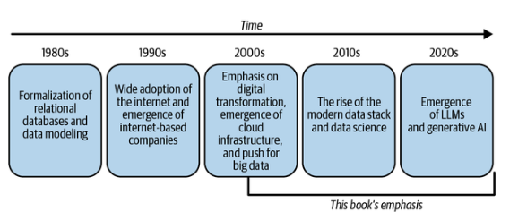
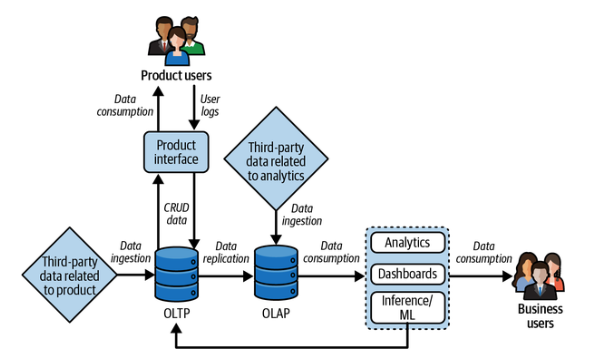
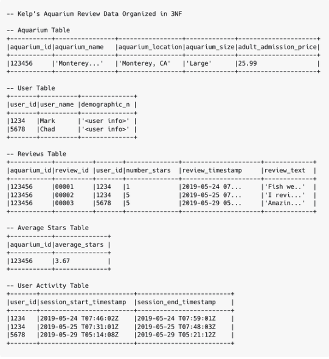
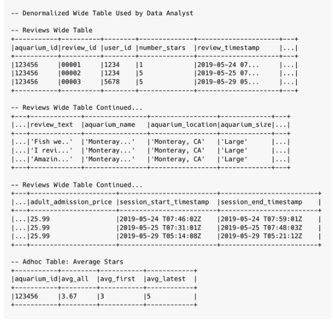

# Capítulo 2. La calidad de los datos no se refiere a datos impecables

Uno de los primeros errores que cometió Mark en su carrera profesional relacionada con los datos fue intentar vender internamente el concepto de calidad de los datos basándose en las ventajas que unos datos impecables podían aportar a la organización. La cruda realidad es que, más allá de los profesionales de los datos, muy pocas personas en la empresa se preocupan por los datos, sino por lo que pueden hacer con ellos. Si a esto le sumamos que los datos son un concepto abstracto (especialmente entre las partes interesadas sin conocimientos técnicos), gritar en el vacío corporativo sobre la calidad de los datos no te llevará muy lejos. Es difícil relacionar la calidad con el valor empresarial, por lo que se relega a ser una inversión deseable. Esta dinámica cambió drásticamente para Mark cuando dejó de intentar vender internamente los datos impecables y se centró en el riesgo que suponía la mala calidad para los flujos de trabajo empresariales importantes (a menudo los que generan ingresos). En este capítulo, ampliamos esta lección definiendo la calidad de los datos, destacando cómo nuestras buenas prácticas de arquitectura actual crean un entorno propicio para los problemas de calidad de los datos y cuál es el coste de la mala calidad de los datos para la empresa.

## Definición de la calidad de los datos

«¿Qué es la calidad de los datos?» es una pregunta aparentemente sencilla, pero que resulta engañosamente difícil de responder, dado el amplio alcance del concepto, pero su definición es fundamental para entender por qué son necesarios los contratos de datos. La primera forma de datos registrada históricamente se remonta al año 19 000 a. C., y la calidad de los datos ha sido un factor importante en todos los siglos posteriores en ámbitos que van desde la agricultura y la fabricación hasta los sistemas informáticos. En este libro, ponemos el énfasis en la calidad de los datos en relación con los sistemas de bases de datos. El libro se centra en el periodo anterior a 1970, ya que fue entonces cuando el influyente artículo de Edgar F. Codd «A Relational Model of Data for Large Shared Data Banks» (Un modelo rel acional de datos para grandes bancos de datos compartidos) dio inicio a la disciplina de las bases de datos relacionales. La figura 2-1 ilustra brevemente esta cronología y el enfoque del libro.

Durante este tiempo, surgió el campo e e de la gestión de la calidad de los datos con voces destacadas, como Richard Y. Wang, del programa de Gestión Total de la Calidad de los Datos del MIT, que formalizó la disciplina. En el artículo de investigación más citado del Dr. Wang y la Dra. Diane Strong, definen la calidad de los datos en 1996 como «datos aptos para su uso por parte de los consumidores de datos» entre las cuatro dimensiones siguientes: 1) conformidad con los valores reales que representan los datos, 2) pertinencia para la tarea del usuario de los datos, 3) claridad en la presentación de los datos y 4) disponibilidad de los datos.

> **Nota**

> Las referencias a estos primeros trabajos que definen la calidad de los datos se pueden encontrar en el apéndice.

A lo largo de los trabajos académicos de Wang y sus colegas, se hace mucho hincapié en las formas en que el campo es interdisciplinario y se ve muy afectado por «los nuevos retos que surgen de entornos empresariales en constante cambio... la creciente variedad de formas/medios de datos y las tecnologías de Internet que afectan fundamentalmente a la forma en que se genera, almacena, manipula y consume la información». Por lo tanto, aquí es donde la definición de calidad de los datos de este libro diverge de la definición de 1996. Concretamente, nuestra visión de la calidad de los datos está muy influida por el auge de la infraestructura en la nube, los macrodatos para los flujos de trabajo de la ciencia de datos y la aparición de la pila de datos moderna entre la década de 2010 y la actualidad.

Definimos la calidad de los datos e es como «la capacidad de una organización para comprender el grado de corrección de sus activos de datos y las ventajas e inconvenientes de poner en práctica dichos datos con diversos grados de corrección a lo largo del ciclo de vida de los datos, en lo que se refiere a su idoneidad para el uso por parte del consumidor de datos».

Queremos hacer especial hincapié en la frase «las ventajas e inconvenientes de poner en funcionamiento dichos datos con distintos grados de corrección», ya que es clave para un cambio importante en el sector de los datos. Concretamente, el término NoSQL fue acuñado en 1998 por Carlo Strozzi y popularizado de nuevo en 2009 por Johan Oskarsson. Desde entonces, han proliferado las formas de almacenar datos más allá de las bases de datos relacionales, lo que ha aumentado la complejidad y las compensaciones de la infraestructura de datos. Como se ha señalado anteriormente, una compensación muy popular fue el auge de la pila de datos moderna, que optó por ELT y los lagos de datos. En este caso de uso, muchos equipos de datos han renunciado a las ventajas de un modelado de datos adecuado para disponer, en cambio, de grandes cantidades de datos que pueden iterarse rápidamente en los flujos de trabajo de ciencia de datos. Aunque sería más fácil tener una forma estándar de abordar la calidad de los datos para todos los casos de uso, debemos recordar que la calidad de los datos es tanto un problema de personas y procesos como un problema técnico. Ser conscientes de las concesiones que hacen los equipos de datos, para bien o para mal, es clave para cambiar el comportamiento de las personas que operan dentro del ciclo de vida de los datos.

Además, también queremos hacer hincapié en la frase «capacidad de comprender el grado de corrección» dentro de nuestra definición. Un error común es la creencia de que los datos perfectos son un requisito e e para la calidad de los datos, lo que da lugar a expectativas poco realistas entre las partes interesadas. La triste realidad es que los datos se encuentran en un estado de deterioro constante y requieren un monitoreo y una iteración constantes que nunca serán completas.

Por ejemplo, tomemos los datos de medición de los signos vitales que se recopilan cuando visitas a un médico de atención primaria (peso, presión arterial, etc.). En cuestión de horas, tus constantes vitales han cambiado, lo que no se refleja en los datos que utilizan todos los procesadores de datos en el ámbito sanitario, y sin embargo se trata de algunos de los datos más valiosos disponibles. (Los hackers del mercado negro valoran estos datos en 250 dólares por registro, en comparación con los datos de pago, que son los siguientes en valor, con unos 5 dólares).

Al cambiar el lenguaje de un «estado deseado de corrección» para los activos de datos a un «proceso deseado para comprender la corrección» entre los activos de datos, los equipos de datos tienen en cuenta la naturaleza siempre cambiante de los datos y, por lo tanto, su calidad. Junto con la capacidad de comprender el grado de corrección de un activo de datos, un equipo de datos puede realizar concesiones debidamente informadas que equilibren las necesidades de la empresa y el esfuerzo de mantener un nivel de calidad de datos que respalde a sus respectivos consumidores de datos. Pero, ¿cuál es el coste de una mala calidad de los datos cuando una organización no acierta con esta concesión?

## OLTP frente a OLAP y sus implicaciones para la calidad de los datos

Uno de los patrones de arquitectura de datos más comunes en nuestro sector es el uso de bases de datos OLTP (procesamiento de transacciones en línea) y OLAP (procesamiento analítico en línea) como forma de separar las cargas de trabajo de acceso a los datos para transacciones y análisis. Sorprendentemente, muchos profesionales involucrados en el ciclo de vida de los datos comprenden profundamente sus áreas específicas de la arquitectura de datos, pero carecen de conocimientos sobre otras partes del sistema. Concretamente, quienes trabajáis en bases de datos OLTP a menudo os dedicáis principalmente a esos sistemas, y lo mismo ocurre con quienes trabajáis en bases de datos OLAP. Con la excepción de funciones como las de ingenieros o arquitectos de datos, pocas personas dentro del ciclo de vida de los datos de una empresa tienen una visión global de todo el sistema de datos a través de su trabajo. Sostenemos que los silos de los sistemas OLTP y OLAP son el catalizador de muchos problemas de calidad de los datos en las organizaciones, al tiempo que mantenemos la idea de que este diseño de arquitectura de datos es valioso y ha resistido el paso del tiempo.

### Breve resumen de OLTP y OLAP

Como indican sus nombres ( ), las bases de datos OLTP están optimizadas para transacciones de datos rápidas, lo que mantiene el estado actual de una aplicación de software, mientras que las bases de datos OLAP están optimizadas para escanear y calcular estadísticas sobre grandes cantidades de datos para flujos de trabajo analíticos. En las primeras etapas de la infraestructura de datos de una empresa, las bases de datos OLTP suelen satisfacer por sí solas las necesidades del negocio, ya que no hay datos suficientes ni siquiera para plantearse el análisis. Además, mientras los datos son escasos, el uso de SQL sobre estas bases de datos para responder a preguntas sencillas sobre los registros no supone una carga suficiente como para justificar preocupaciones. Esto cambia cuando el negocio comienza a plantear preguntas históricas sobre los datos de transacciones almacenados en la base de datos OLTP, ya que las consultas analíticas suelen requerir grandes cantidades de escaneo que pueden paralizar la base de datos de producción. Por lo tanto, es necesario replicar los datos transaccionales en otra base de datos para evitar que la base de datos de producción se caiga. La figura 2-2 ilustra a alto nivel el flujo de datos e e de una organización basada en datos que utiliza bases de datos OLTP y OLAP.

El paso de una empresa de utilizar únicamente una base de datos OLTP a añadir una base de datos OLAP marca un importante punto de inflexión en tu madurez en materia de datos. Esta replicación de datos de OLTP a OLAP proporciona importantes ventajas en la comprensión de los datos de la organización, con el inconveniente de una mayor complejidad. La replicación también crea silos en las respectivas «visiones del mundo de los datos» OLTP y OLAP, lo que da lugar a malentendidos. Ten en cuenta que existen otros formatos de bases de datos, como NoSQL o los lagos de datos, pero aquí nos hemos centrado en las bases de datos relacionales OLTP y OLAP para simplificar.

Bajo la visión del mundo OLTP, las bases de datos se centran en gran medida en la velocidad de las transacciones de los registros de los usuarios, haciendo hincapié en tres atributos principales:

- Tareas de creación, lectura, actualización y eliminación ( , CRUD).

- Mantener el cumplimiento de la atomicidad, consistencia, aislamiento y durabilidad ( ) de ACID.

- Los datos modelados deben estar en la tercera forma normalizada (3NF) .

Estos tres componentes permiten una baja latencia en la recuperación de datos, lo que permite que las interfaces de usuario muestren de forma rápida y fiable los datos correctos a un usuario en fracciones de segundo en lugar de minutos.

En el lado OLTP del flujo de datos, ilustrado en la figura 2-2, verás que los ingenieros de software de bases de datos son los principales usuarios de estas bases de datos y, a menudo, son ellos quienes las implementan antes de que se contrate a un ingeniero de datos. La función de estos usuarios hace mucho hincapié en la facilidad de mantenimiento, la escalabilidad y la fiabilidad de la base de datos OLTP y del software del producto relacionado; los datos en sí mismos son un medio para alcanzar un fin y no su objetivo principal. Además, aunque las implementaciones de productos pueden variar, los requisitos y el alcance suelen ser claros y con resultados tangibles.

Bajo la visión del mundo OLAP, las bases de datos se centran en gran medida en la capacidad de responder a preguntas históricas sobre este negocio mediante grandes escaneos de datos en los que los consumidores de datos se preocupan por lo siguiente:

- Utilizar datos desnormalizados para encontrar relaciones únicas.

- Validar y/o mejorar los matices de la lógica empresarial que se aplica a los datos ascendentes

- Capacidad para trabajar de forma iterativa en cuestiones empresariales complejas que no tienen requisitos claros o que pueden conducir a callejones sin salida

Aunque esta base de datos adicional aumenta la complejidad del sistema de datos, la compensación es que esta mayor flexibilidad permite a la empresa descubrir nuevas oportunidades que no son del todo evidentes en el formato de datos CRUD del producto.

En el lado OLAP del flujo de datos, ilustrado en la figura 2-2, verás que los analistas de datos, los científicos de datos y los ingenieros de ML son los principales roles que trabajan exclusivamente dentro de los sistemas de datos OLAP. La clave de estos roles es la naturaleza iterativa de los flujos de trabajo de análisis y ML, de ahí la flexibilidad de los modelos de datos resultantes en comparación con los datos de la forma normalizada por tercera vez de OLTP.

### Problemas de traducción entre las visiones del mundo de los datos OLTP y OLAP

Para ilustrar las diferentes visiones del mundo de los datos de los silos OLTP y OLAP y cómo esto da lugar a problemas de traducción, tenemos un ejemplo ficticio de un sitio web de reseñas de negocios de acuarios llamado Kelp. En este caso de uso, el equipo de ingeniería de Kelp ha habilitado recientemente la posibilidad de que los usuarios envíen reseñas actualizadas, y los analistas de datos quieren saber si esta función añadida aumenta la duración de las sesiones de los usuarios. Sin embargo, el analista de datos debe determinar un matiz importante de la lógica empresarial: «¿Cómo se calcula la media de estrellas de las reseñas?».

En la figura 2-3, tenemos los datos de reseñas de Kelp para un acuario en Monterey, con tres reseñas representadas en forma normalizada en tercera forma dentro de una base de datos OLTP. Ten en cuenta que el equipo de ingeniería utilizó el promedio de todas las reseñas para simplificar la versión de la función V1.

La figura 2-4 muestra los datos de reseñas de Kelp representados como una tabla amplia desnormalizada creada por el analista de datos en la base de datos OLAP, junto con una tabla ad hoc de varias formas en las que se pueden representar las estrellas promedio. Más allá de las preguntas sobre los cálculos de estrellas promedio, el analista de datos consideraría los matices de la lógica empresarial, tales como:

- ¿Cómo calculamos la duración de la sesión del sitio web cuando hay varias sesiones muy próximas entre sí?

- ¿Hay casos de usuarios únicos con varias cuentas de Kelp?

- ¿Qué cambio en la duración de la sesión es relevante para el negocio?

- ¿Son las reseñas de los usuarios directamente o una combinación de atributos lo que lleva a cambios en la duración de la sesión?

Estas cuestiones representan una desvinculación de la lógica empresarial de los datos representados en la visión del mundo OLTP, lo que da lugar a una multitud de interpretaciones que pueden provocar problemas de calidad de los datos y deuda de datos en las fases posteriores.

Dadas estas diferencias en las visiones del mundo de los datos, ¿cómo puede un equipo de datos determinar qué perspectiva para calcular la media de estrellas es la correcta? En realidad, ambas visiones del mundo de los datos son correctas y dependen de las restricciones que le importan al individuo y, en última instancia, a la empresa. En el lado OLTP, la ingeniería de software de Kelp se preocupaba por la simplicidad de la implementación de la función y quería evitar cualquier complejidad adicional a menos que se considerara necesaria; de ahí que se optara por promediar todas las reseñas con estrellas en lugar de aplicar la lógica empresarial; en otras palabras, se trata de una decisión sobre el producto y no sobre los datos. En el lado OLAP, el analista de datos tiene acceso a combinaciones únicas de datos que no tienen sentido en un formato OLTP, pero que informan sobre formas de mejorar la lógica empresarial existente. El analista de datos puede hacer sugerencias que son acertadas desde el punto de vista analítico, pero difíciles de implementar en la base de datos OLTP.

Esta diferencia en las restricciones y los objetivos entre los productores y los consumidores de datos es la razón fundamental por la que creemos que los contratos de datos son importantes. Este libro profundiza en los contratos de datos, pero, en resumen, un contrato de datos es un acuerdo entre los productores y los consumidores de datos que se establece, actualiza y aplica a través de una API. El proceso de definición de los contratos de datos codifica las concesiones que tanto los productores como los consumidores de datos están dispuestos a hacer con respecto a un activo de datos y por qué esa configuración es importante para el negocio.

Aunque este ejemplo destaca la arquitectura de datos OLTP y OLAP, este mismo patrón de falta de comunicación entre diferentes bases de datos persiste. Todo esto se vio agravado por el cambio de los almacenes de datos locales a las bases de datos de análisis en la nube, que eran baratas y fáciles de escalar.

## El coste de la mala calidad de los datos

El requisito fundamental de cualquier e e de software es que sea funcional. En esencia, ¿se comporta el programa de la forma prevista? Un error de software es un defecto en el comportamiento operativo esperado del código base. Dado que el software no funciona como se esperaba, se ha introducido un riesgo para el negocio. El riesgo puede ser transaccional: el sistema puede bloquear la aplicación de un cliente en medio de una compra, lo que provocaría que la empresa perdiera unos ingresos muy necesarios. El riesgo puede ser una degradación de la experiencia: tal vez la aplicación se carga demasiado lento, lo que hace que un cliente abandone la página y, potencialmente, utilice la de un competidor. O bien, el riesgo puede estar relacionado con la escalabilidad interna: se podría aplicar una enorme carga al servidor en la infraestructura de la nube, lo que provocaría que los costes se dispararan. Y así sucesivamente.

El trabajo con datos no es lo mismo que el trabajo con software, a pesar de que las herramientas se solapan en gran medida. En esencia, los datos no son funcionales cuanto más avanzan en el ciclo de vida de los datos, sino que son descriptivos. Los datos son una señal que tiene por objeto describir eficazmente el estado del mundo que nos rodea. A continuación, pueden aprovecharse con fines operativos, como la optimización de un proceso con inteligencia artificial, o analíticos, como la creación de un panel de control. Sin embargo, su requisito fundamental es que reflejen con precisión el mundo real y que los demás miembros de la empresa puedan confiar en ellos. Sin esta verdad fundamental, los datos no significan nada. En pocas palabras, los datos incorrectos no tienen ningún valor operativo. Por lo tanto, una violación de la calidad de los datos tiene tanto impacto en los productos de datos como los errores en el software destinado a los clientes.

En el software, existen diversos mecanismos para medir el impacto de los errores o los problemas de escalabilidad en los sistemas de producción. Las tasas de error, el tiempo de inactividad, la latencia y las tasas de incidentes son ejemplos de indicadores retrospectivos, que miden un resultado, ya sea positivo o negativo. En una tienda de comercio electrónico, un indicador retrospectivo podría ser los ingresos. Los ingresos (el dinero en el banco) son el último paso de un largo proceso que comienza cuando un cliente se registra en un sitio web, navega por él, añade artículos a su carrito y realiza el pago. En la gestión de la calidad de los datos, las métricas de seguimiento indican que el daño ya está hecho y que estamos midiendo el alcance de la explosión. La calidad reactiva es extremadamente eficaz para diagnosticar problemas, prescribir los siguientes pasos y descubrir lagunas en los procesos operativos.

Por ejemplo, un número elevado de errores devueltos por una aplicación JavaScript suele significar que algún aspecto de la experiencia del cliente ha empeorado con respecto a una versión anterior. Un ingeniero de software puede intentar determinar la causa raíz del problema rastreando primero el historial de errores: ¿a qué hora comenzaron los errores? ¿Cuál era el código de error que se devolvía? ¿Había puntos en común entre cada error que pudieran reducir el ámbito en el que se producía el problema? A partir de ahí, el ingeniero podría comprobar los eventos de registro o de flujo de clics para comprender dónde comenzó a surgir el comportamiento inesperado: si el número de cargas de página para una pantalla concreta ha caído a cero, o si la compra de un artículo concreto se ha reducido a la mitad, estos serían buenos puntos de partida para iniciar una investigación.

El segundo mecanismo de medición, , realiza un seguimiento de los indicadores adelantados, una aportación a una métrica de éxito que precede a la propia métrica. En el mundo del comercio electrónico, un indicador adelantado podría ser el registro de clientes. El acto de registrarse en sí mismo no aporta ningún valor al negocio, pero si existe una relación cuantificable entre los registros y las compras, un aumento de los primeros acabará traduciéndose en un aumento de las segundas. En materia de calidad, también hay indicadores adelantados que pueden utilizarse para predecir el aumento o la disminución futuros de un indicador atrasado. Un ejemplo es la cobertura del código, un mecanismo común utilizado por los equipos de ingeniería de software para medir en qué medida los servicios siguen las buenas prácticas en términos de seguridad, escalabilidad y usabilidad. ¡Una baja cobertura del código significa un mayor riesgo de!

### Medición de la calidad de los datos

, los datos siguen un patrón de medición similar al del software en lo que respecta a la calidad. Existen indicadores adelantados, como la confianza, la propiedad y la existencia de expectativas y pruebas. También hay indicadores atrasados, como el número de incidentes de datos, el tiempo de inactividad de los datos, los requisitos de latencia, la replicación y otros. Analicemos cada uno de ellos, empezando por los indicadores adelantados.

#### Deuda de datos

La deuda de datos es una medida de la complejidad de tu entorno de datos y de su capacidad de escalabilidad. Aunque la deuda en sí misma no representa un cambio radical, existe una correlación directa entre la cantidad de deuda de datos y la velocidad de desarrollo de los equipos de datos, el coste del entorno de datos en su conjunto y su escalabilidad final.

Existen algunas heurísticas para medir la deuda de datos:

- Cuántos activos de datos tienen documentación (y cuántos son útiles)

- Número medio de dependencias por conjunto de datos en el entorno de datos

- Número de trabajos de relleno realizados en el último año

- El número medio de filtros por consulta e

#### Fiabilidad

La fiabilidad de los datos ( ) es un excelente indicador adelantado, ya que está estrechamente relacionada con el aumento de la replicación y (como resultado) con el aumento de los costes de los datos. Cuanto menos confían los consumidores de datos en los datos que utilizan, más probable es que dediquen más tiempo a examinar un resultado o que no lo utilicen en absoluto, incluso si los datos son correctos.

La fiabilidad se puede medir mediante metodologías tanto cualitativas como cuantitativas. Una encuesta trimestral al equipo de datos con la siguiente pregunta es una buena forma de tomar el pulso, como se ve en este ejemplo:

_¿En qué medida estás de acuerdo o en desacuerdo con las siguientes afirmaciones?_

- _Confío en los datos de nuestra empresa._

- _Estoy seguro de que los datos que utilizo en mi trabajo representan la realidad._

- _Confío en que los datos que utilizo no cambiarán de forma inesperada._

- _Confío en que, cuando utilizo datos de otra persona, estos significan exactamente lo que tú dices que significan._

- _No me preocupa que mis partes interesadas reciban datos incorrectos._

Además, la cantidad de activos de datos replicados es una métrica difusa que está correlacionada con la confianza. Cuanto más fiable es un conjunto de datos, menos probable es que se reconstruya utilizando una lógica ligeramente diferente para responder a la misma pregunta. Cuando se da esta situación, suele significar que se cumple una de las siguientes condiciones:

- La lógica del conjunto de datos no era transparente para los desarrolladores de datos, lo que provocó un largo proceso de descubrimiento que finalmente terminó en replicación.

- Hay datos confidenciales a los que los equipos posteriores no tendrán acceso, por lo que necesitan reconstruir la lógica en torno a estas restricciones.

- El activo de datos simplemente no era detectable, lo que significa que probablemente se habría reutilizado si hubiera sido más fácil de encontrar.

Según nuestra experiencia personal, el último caso es menos frecuente de lo que los equipos de datos podrían suponer. Un desarrollador de datos motivado encontrará los datos que necesita, pero por muy motivado que esté, no dependerá de ellos para obtener resultados empresariales si no puede confiar en ellos.

#### Propiedad

La propiedad es una métrica predictiva, ya que mide la probabilidad y la rapidez con la que se resuelven los errores en las fases iniciales del problema de calidad cuando se producen. La propiedad se puede medir a nivel de tabla individual, pero recomendamos medirla como porcentaje de los datos en las fases iniciales de un activo de datos específico con propiedad explícita. Para ello, primero hay que catalogar las fuentes de datos, identificar a los propietarios o la falta de ellos y agregar el número total de fuentes propiedad dividido por el número total de fuentes registradas.

Las métricas de propiedad son excelentes para plantearlas durante las reuniones de operaciones. Aún mejor es cuando la falta de propiedad puede vincularse a una interrupción específica o a un problema de calidad de los datos, y mejor aún es cuando la falta de propiedad puede enmarcarse en el riesgo de interrupciones para productos de datos importantes en las fases posteriores. Por ejemplo, imagina que el panel ejecutivo de un director financiero depende de 10 fuentes de datos. Si solo tres de estas fuentes de datos tienen una propiedad claramente definida, es justo decir que el director financiero tiene un 70 % de posibilidades de que se prolongue el tiempo de mitigación en caso de interrupción del servicio de datos. Cuanto más importante es el producto de datos, más crítica se vuelve la propiedad.

#### Tiempo de inactividad de los datos

El tiempo de inactividad de los datos se está convirtiendo en una de las métricas más populares para los equipos de ingeniería de datos que intentan cuantificar la calidad de los datos. El tiempo de inactividad se refiere al tiempo durante el cual no se puede acceder a datos empresariales críticos debido a problemas de calidad, fiabilidad o accesibilidad. Recomendamos un proceso de tres pasos para realizar un seguimiento y tomar medidas sobre el tiempo de inactividad de los datos:

1. _Realizar un seguimiento y analizar los incidentes de tiempo de inactividad_

    Mantén un registro de todos los incidentes relacionados con los datos, incluyendo su duración, causa y proceso de resolución. Estos datos son cruciales para comprender con qué frecuencia se producen los tiempos de inactividad, cuáles son sus causas más comunes y con qué rapidez puede resolver los problemas tu equipo.

2. _Calcular las métricas de tiempo de inactividad_

    Utiliza los datos recopilados para calcular métricas específicas, como la duración media del tiempo de inactividad, la frecuencia de los incidentes de tiempo de inactividad, el tiempo medio de detección (MTTD) de un problema de datos y el tiempo medio de resolución (MTTR) del problema. Estas métricas proporcionan una medida cuantitativa de la fiabilidad de tus datos y de la eficacia de tus estrategias de respuesta.

3. _Evaluar el impacto_

    Más allá de medir el tiempo de inactividad en sí, evalúa el impacto en las operaciones comerciales. Esto puede incluir el costo de las oportunidades perdidas, la disminución de la productividad o cualquier pérdida financiera asociada con el tiempo de inactividad.

Una vez completado, los equipos de ingeniería de datos deberían tener una visión global no solo de cómo cambian tus métricas críticas a lo largo del tiempo, sino también del impacto que tiene el tiempo de inactividad en el negocio. Este impacto puede utilizarse para persuadir a los ejecutivos de que implementen herramientas adicionales para gestionar la calidad, incorporen personal adicional o impulsen una mayor responsabilidad en las fases iniciales para prevenir los problemas antes de que se produzcan.

#### Expectativas incumplidas

Las expectativas se refieren a lo que los consumidores de datos esperan de vuestros sistemas de datos ascendentes. En este caso, «ascendente» puede significar una tabla utilizada como entrada directa para una consulta o una base de datos transaccional mantenida por ingenieros de producción que dan soporte a aplicaciones de producción. Dependiendo del equipo y del caso de uso, las expectativas específicas del consumidor pueden diferir. Un ingeniero de datos responsable de orquestar una serie de canalizaciones de Airflow puede tener expectativas respecto a una base de datos PostgreSQL en el almacenamiento en la nube, mientras que un analista que se basa en un conjunto de entidades empresariales bien definidas para construir su vista de panel de control tendría expectativas respecto a un conjunto de tablas de bases de datos analíticas en Snowflake SQL.

Las expectativas pueden adoptar diversas formas:

_Esquema_

Se trata de la estructura de los datos, los tipos de datos y los nombres de las columnas. Por ejemplo, siempre esperamos que la clave principal `customer_ID` sea una cadena de seis caracteres.

_Semántica_

Esta es la lógica empresarial subyacente de los datos y la propia entidad. Por ejemplo, siempre utilizamos el campo de correo electrónico para incluir el símbolo «@».

_Acuerdos de nivel de servicio (SLA)_

Estos son los requisitos de latencia y volumen de los datos. Por ejemplo, podemos esperar un mínimo de 1000 eventos de fuentes de datos por hora.

_Información de identificación personal (PII)_

Esta es información que se puede utilizar, individualmente o en combinación con otros valores de datos, para identificar a una persona o entidad. Por ejemplo, podríamos esperar que un campo `customer_name` sea PII, por lo que se ocultará a todos los consumidores.

Lo ideal es que todas las expectativas incumplidas se registren de forma centralizada. Los equipos pueden registrar cuándo se produjeron estas infracciones, quién fue el responsable, cuál fue la fuente de datos en cuestión y cualquier activo afectado en fases posteriores. El éxito de los equipos de ingeniería de datos y de producción de datos puede medirse en función del número total de infracciones, que representan una serie de problemas de calidad y gobernanza de los datos. Si este número disminuye gradualmente trimestre tras trimestre, es una indicación de que la empresa está tomando conciencia de forma más holística de la calidad de los datos y respondiendo mejor a los problemas.

#### Recuento trimestral de incidentes

Aunque no difiere sustancialmente de ciertas métricas de tiempo de inactividad de los datos, el recuento trimestral de incidentes es una forma excelente para que los responsables empresariales y técnicos comprendan a fondo el impacto de la calidad de los datos en la empresa y sus productos de datos. Técnicamente, un incidente de datos se refiere a cualquier evento que comprometa la integridad, la disponibilidad o la confidencialidad de los datos. Esto podría incluir el acceso no autorizado a los datos (una violación de la seguridad), la pérdida de datos debido a fallos del sistema o errores humanos, la corrupción de los datos debido a errores de software o fallos de hardware, o cualquier situación en la que los datos se vuelvan inexactos, incompletos o inaccesibles.

Los tipos de incidentes de datos más significativos tienen algún tipo de impacto en el mundo real. En el ámbito del software, los incidentes suelen provocar una fuerte caída de los ingresos, la pérdida de clientes valiosos o incluso repercusiones legales o políticas. Por lo tanto, no todas las interrupciones deben tratarse necesariamente como un incidente. Si el impacto en la calidad de los datos solo provoca que algunos paneles de control no críticos muestren cifras incorrectas, es difícil argumentar que esto ha tenido un impacto tangible en el negocio. Sin embargo, si se tomó una decisión que condujo a un resultado negativo basándose en esas cifras incorrectas, la historia es muy diferente.

A continuación se presentan algunos ejemplos comunes de incidentes de datos que vale la pena reportar:

_Asignación incorrecta del gasto en marketing_

Durante la pandemia de COVID, el equipo de marketing de una popular startup tecnológica estaba en perímetro, preocupado por la posibilidad de que el número de usuarios aumentara o disminuyera debido a la imprevisibilidad del virus y la legislación vigente. Durante un informe mensual, un analista observó que las nuevas inscripciones de usuarios habían descendido más de un 25 %, lo que suponía una enorme disminución de los ingresos potenciales. Para adelantarse al problema, el equipo de marketing recibió la aprobación para aumentar significativamente su presupuesto para campañas de correo electrónico y divulgación pública. Sin embargo, unos meses más tarde, se determinó que la causa del problema no era en absoluto el comportamiento de los usuarios, sino un cambio inadecuado en la forma en que el equipo de ingeniería de productos registraba el evento de registro de usuarios. ¡Vaya!

_Retiradas de productos en el mundo real_

Una empresa de bienes de consumo que fabricaba costosos artículos para el hogar utilizaba el código de barras universal de artículos ( item_id ) en su base de datos transaccional principal como número de serialización impreso en el código de barras de cada uno de sus productos. Un día, los ingenieros de producción probaron a añadir un carácter al código de barras universal de artículos ( item_id), sin darse cuenta de cómo afectaría a los equipos posteriores. Cuando se dieron cuenta de su error, ya se habían impreso cientos de códigos de barras incorrectos, que se habían colocado en una gran variedad de artículos domésticos y se habían enviado a hogares, hoteles y restaurantes. La empresa tuvo que pagar a los repartidores para que volvieran a visitar cada punto de entrega y cambiaran los códigos de barras, lo que supuso una pérdida de tiempo y un gasto considerable para un cambio aparentemente tan pequeño.

Aunque a menudo son menos impresionantes en términos de datos cuantificables brutos, estas historias demuestran la increíble importancia de la calidad de los datos y lo que tiene la mayor tasa de éxito a la hora de impulsar la inversión. Incluso con las mejores medidas, debemos recordar que la calidad de los datos no solo se refiere a lo que se ve afectado, sino también a quién se ve afectado dentro de estos flujos de trabajo de e o de datos.

### A quién afecta

Los problemas de calidad de los datos en el e o afectan a las partes interesadas de diversas maneras, dependiendo de la personalidad del usuario. Cada persona tiene una relación diferente con los datos y, por lo tanto, siente el dolor de una manera relacionada pero única cuando las cosas van mal.

#### Ingenieros de datos

Los ingenieros de datos suelen ser los más perjudicados. Como la palabra «datos» aparece en su título, los equipos comerciales dan por sentado que cualquier problema relacionado con los datos puede recaer sobre ustedes y resolverse de forma prompt. ¡Pero esto no es así en absoluto! La mayoría de los ingenieros de datos no tienen un conocimiento profundo de la lógica empresarial que utilizan las organizaciones de productos y marketing para el análisis y el aprendizaje automático. Cuando surgen solicitudes para resolver problemas de calidad de los datos en las listas de tareas pendientes de los ingenieros de datos, les lleva días o incluso semanas localizar el problema mediante un análisis de la causa raíz y hacer algo al respecto.

El tiempo que se tarda en resolver los problemas da lugar a una enorme acumulación de trabajo y, con frecuencia, las tensiones con los equipos de análisis e inteligencia artificial son elevadas debido a una serie de interrupciones sin resolver o parcialmente resueltas. Esto resulta cada vez más problemático para los ingenieros de datos, ya que cuando todo funciona correctamente, el resto de la empresa rara vez lo reconoce. Lamentablemente, los ingenieros de datos entran en la rara categoría de trabajadores cuyas habilidades son esenciales para la empresa, pero como no pueden presumir de logros rápidos como lo hacen los científicos de datos, la ingeniería de software o los gestores de productos, su visibilidad en la organización es comparativamente menor. La vida no es fácil cuando la única vez que la gente oye hablar de ti es cuando algo falla.

#### Científicos de datos

Los científicos de datos son constructores incansables que a menudo provienen del mundo académico. En el ámbito académico, se hace más hincapié en garantizar que la investigación se lleve a cabo de forma adecuada, sea interesante y esté validada éticamente. El mundo empresarial representa un cambio repentino con respecto a este enfoque, ya que se centra en realizar ejercicios lucrativos, ejecutar rápidamente y abordar en primer lugar los objetivos más fáciles (véase: problemas aburridos). Aunque todos los científicos de datos saben cómo realizar validaciones, están mucho menos acostumbrados a que los datos cambien repentinamente, a no poder confiar en ellos o a que pierdan calidad con el tiempo.

Esto hace que los científicos de datos sean especialmente susceptibles a los efectos de la calidad de los datos. Los modelos de aprendizaje automático suelen realizar predicciones deficientes o incorrectas. Los conjuntos de datos desarrollados para apoyar el entrenamiento de modelos y otros análisis rigurosos no se mantienen durante largos periodos de tiempo hasta que fallan repentinamente. Se espera que los científicos de datos aporten un valor empresarial tangible, pero pueden encontrarse en un aprieto cuando se descubre que el modelo sobre el que han estado informando, que estaba generando millones de dólares para la empresa, en realidad tenía un error de un orden de magnitud, y que acaban de descubrirlo recientemente .

#### Analistas

Analistas es un término muy amplio. Podría referirse a analistas financieros que toman decisiones sobre datos de ingresos, o analistas de productos que revisan registros web y eventos de clics y miden el impacto de las nuevas funciones en la experiencia de los usuarios. La mayoría de los analistas utilizan el mismo conjunto de herramientas: software de visualización de terceros como Looker, Tableau, Mixpanel, Amplitude o, por supuesto, el fiable Microsoft Excel. JOINLos analistas deben tener más que un conocimiento superficial de los datos subyacentes. Es esencial que comprendan cómo se relaciona la tabla de clientes con la tabla de visitas ( items_purchased ), por qué un archivo SQL largo parece filtrar a los usuarios que no han visitado el sitio web en los últimos 45 días y a qué se refiere exactamente un evento de conversión ( purchase_order ). Más que cualquier otra función laboral, los analistas son los más conectados con la lógica empresarial de cada compañía.

La calidad de los datos afecta a los analistas al desorganizar su comprensión de la lógica empresarial. Si una columna de una base de datos de producción se refiere a kilómetros hoy y a millas mañana, duplicará efectivamente los valores de cualquier usuario posterior que utilice esa tabla. Los analistas también se encuentran en la desafortunada situación de ser culpados por cambios que no pueden controlar. Su peor pesadilla es recibir un correo electrónico a las 4:45 p. m. del viernes con el título: «¿Por qué estos datos son incorrectos?».

#### Ingenieros de ingeniería de software

Los ingenieros de software se ven afectados por la calidad de los datos de una manera más indirecta, en el sentido de que sus cambios suelen ser la causa principal de la mayoría de los problemas, ya que su función a menudo se cruza con la creación y la ingesta de datos de origen. Así que, aunque puede que no se vean afectados de la misma manera que un ingeniero de datos, un analista o un científico de datos, a menudo se encuentran con que los consumidores de datos les gritan si se realiza un cambio incompatible en la fase inicial que causa problemas en las fases posteriores.

Esto no se debe (normalmente) a la falta de esfuerzo. La ingeniería de software suele anunciar los cambios que pueden causar problemas en canales más públicos, con la esperanza de que los usuarios actuales o potenciales se den cuenta y se preparen para la migración en consecuencia. Sin embargo, es inevitable que, tras recibir muy pocos comentarios y realizar el cambio, los equipos de datos empiecen inmediatamente a protestar y a pedir que se revierta.

#### Equipos comerciales

Los equipos comerciales se refieren (normalmente) a los clientes finales no técnicos de los datos. Esto puede incluir a un responsable de marketing que utiliza un panel de control sobre atribución SEO para medir el impacto de su estrategia de marketing de contenidos, o a un gestor de productos que revisa los embudos de clics de una nueva función que han lanzado en el sitio web.

Los equipos comerciales tienen muy poca capacidad de acción a la hora de resolver o identificar problemas de calidad de los datos. Cuando algo está claramente mal, lo único que pueden hacer es enviar un mensaje a los analistas y pedirles que lo investiguen. Peor aún, para un usuario comercial es muy difícil diferenciar entre un cambio inesperado legítimo y un problema de calidad de los datos.

En una empresa en la que trabajó Chad anteriormente, un equipo de aplicaciones utilizaba un proveedor externo común para la instrumentación de eventos. Cuando se produjo la COVID, los análisis de la aplicación comenzaron a informar de una caída incremental pero notable en las sesiones de clientes activos. Esta caída continuó día tras día, hasta que se estabilizó en torno a una disminución del 25 % con respecto al pico anterior a la COVID. Los directores de producto y los responsables de marketing estaban fuera de sí. Convencidos de que la pandemia había afectado de forma permanente a las tasas de abandono, invirtieron dinero en marketing para reequilibrar las cifras. Resultó ser una falsa alarma. Un analista que estaba investigando un tema totalmente distinto descubrió que se había producido una caída similar en el tiempo medio de permanencia en la página. Era una extraña coincidencia que dos métricas aparentemente no relacionadas experimentaran exactamente la misma disminución. Tras investigar el problema y ponerse en contacto con el proveedor, el equipo descubrió que la caída inicial se debía a un error de implementación que, en última instancia, provocó un fallo. Todo ese gasto en marketing, desperdiciado. Vaya.

## Conclusión

En este capítulo, hemos definido la calidad de los datos y la hemos contextualizado en el estado actual del sector de los datos, incluyendo las implicaciones para la arquitectura de datos y el coste de una mala calidad de los datos. En resumen, este capítulo ha tratado los siguientes temas:

- Definir la calidad de los datos de una manera que tenga en cuenta las prácticas establecidas, pero que también refleje los cambios recientes en el sector de los datos.

- Cómo los patrones de arquitectura de datos OLTP y OLAP crean silos que provocan errores de comunicación de datos

- El coste de la mala calidad de los datos en términos de pérdida de confianza en uno de los activos más importantes de la empresa

Un aspecto fundamental de este capítulo es la idea de que la calidad de los datos no consiste en que estos sean impecables, sino en que sean «aptos para su uso» por parte de las partes interesadas. Un error común que cometen los profesionales de los datos cuando intentan conseguir apoyo para mejorar la calidad de los datos es poner demasiado énfasis en las buenas prácticas asociadas a los datos de alta calidad. Al fin y al cabo, la deuda técnica y de datos debería ser, idealmente, una compensación estratégica en la que se equilibra el esfuerzo y la solidez con el retorno de la inversión. Por lo tanto, es imperativo que los profesionales de los datos basen su posicionamiento en el impacto empresarial asociado con la adopción de mejores prácticas de calidad de los datos y, lo que es más importante, en por qué resolver su problema empresarial concreto en torno a los datos es más urgente que otros problemas de la organización.

En el capítulo 3, analizaremos los retos que plantea el escalado de la infraestructura de datos en la era de la pila de datos moderna, por qué el escalado de datos no es como el escalado de software y por qué los contratos de datos son necesarios para permitir la escalabilidad de los datos.
