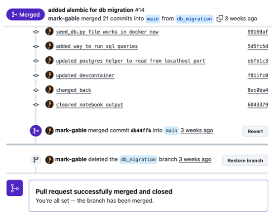
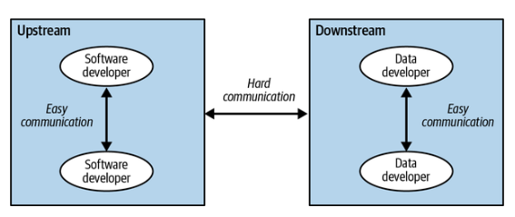
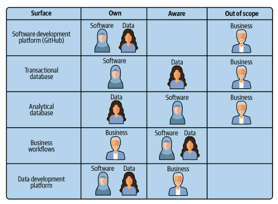
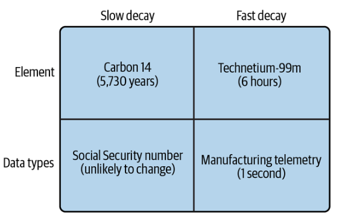
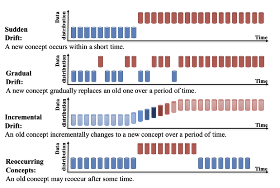
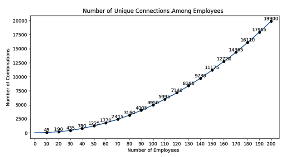
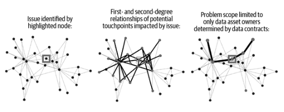

# Capítulo 3. Los retos de ampliar la infraestructura de datos

En este capítulo profundizaremos en los retos que plantean los flujos de trabajo cotidianos de los productores y consumidores de datos a la hora de crear y mantener sistemas complejos de software y datos. Además, explicaremos en qué se diferencia el desarrollo de datos del desarrollo de software y las implicaciones que estas diferencias tienen en nuestra capacidad para generar valor con los datos en una organización. Ser consciente de estos retos te permitirá comprender cómo encajan los contratos de datos en los flujos de trabajo de los desarrolladores, qué problemas mitigan y cómo puedes ayudar a los desarrolladores a comprender su papel dentro de una arquitectura de contratos de datos.

## En qué se diferencia el desarrollo de datos del desarrollo de software

Como se menciona en el capítulo 1, las buenas prácticas de desarrollo de datos precedieron al desarrollo de software en décadas. Anteriormente, existía un conjunto de buenas prácticas, filosofías de diseño y metodologías de gestión totalmente independientes de los flujos de trabajo de ingeniería de software que surgieron después. Naturalmente, existen diferencias únicas entre el desarrollo de datos y el desarrollo de software que impiden que uno sea una copia exacta del otro en términos de herramientas o procesos. Es útil repasar estos flujos para comprender mejor por qué los datos requieren un paradigma similar pero único para gestionar la escala.

Quizás la mayor de estas diferencias se encuentre al comparar los patrones previos al desarrollo. El tiempo previo al desarrollo ( ) se refiere al tiempo de ingeniería dedicado a un proyecto fuera de la escritura de código. En ingeniería de software, los pasos más importantes previos al desarrollo son la recopilación de requisitos y el diseño de la arquitectura. Sin embargo, para los desarrolladores de datos, los pasos previos al desarrollo más esenciales son la formulación de la hipótesis correcta y la exploración/comprensión de los datos.

### Cómo crean productos los ingenieros de software

Una buena ingeniería de software siempre comienza de la misma manera: con un documento de requisitos . Un documento de requisitos es un conjunto de necesidades del cliente creado por el ingeniero de software o por otra persona del equipo de producto responsable de la investigación de usuarios. Por lo general, esta función recae en los diseñadores de UX o en los gestores de producto. El documento de requisitos se centra en un problema concreto que, si se resuelve, hipotéticamente daría lugar a un valor añadido para el cliente y a un aumento significativo de la métrica de éxito objetivo.

Los ingenieros de software revisan los documentos de requisitos y, tras realizar un análisis de viabilidad, convierten las historias de usuario en especificaciones arquitectónicas . Si el documento de requisitos define el porqué, las especificaciones definen el cómo. Aquí, los ingenieros deciden qué tecnologías utilizar, explican por qué esas tecnologías son las más adecuadas para su aplicación, enumeran las hipótesis y toman decisiones sobre si comprar herramientas o crearlas internamente.

Las especificaciones técnicas e es suelen ser objeto del mayor escrutinio por parte de otros ingenieros. Durante la fase de revisión, cuestionarán al arquitecto principal sobre por qué tomaron ciertas decisiones y, potencialmente, plantearán cuestiones que aún no se habían considerado. ¿Es necesario disponer de una fuente de datos en tiempo real? ¿Esto va a requerir una revisión de seguridad exhaustiva? ¿Cómo se autenticarán los usuarios? ¿Cómo mantendremos baja la latencia en la interfaz? Todas estas son preguntas habituales durante las reuniones de diseño de la arquitectura.

En este punto, los ingenieros comienzan a construir. Si bien el acto real de escribir código ciertamente requiere un nivel de experiencia y velocidad, lo que separa a los grandes ingenieros de los no tan grandes es cuánto pensamiento y planificación dedican a la arquitectura inicial (aún más cierto con el auge de la codificación asistida por IA). Si las especificaciones técnicas se han elaborado bien, no hay mucho trabajo que hacer después de la implementación y el control de calidad en un entorno de desarrollo. La función se pone en marcha, el equipo anuncia su trabajo y la empresa lo celebra. Salvo en caso de errores, es raro que la función implementada tenga que cambiar significativamente si ha sido bien diseñada.

### Cómo crean productos los desarrolladores de datos

Aunque sin duda existen similitudes e es entre el desarrollo de datos y el desarrollo de software, los flujos de trabajo presentan una disparidad significativa.

Por un lado, la mayor parte del desarrollo de datos comienza con la comprensión de una pregunta, en lugar de crear inmediatamente una aplicación en torno a una experiencia de usuario conocida. Estas preguntas pueden provenir de los propios desarrolladores de datos, pero más a menudo provienen de un socio comercial. A continuación se muestran algunos ejemplos:

_Responsable de operaciones_

«¿Cuántos recursos necesitáis para hacer frente al aumento de las compras navideñas?».

_Director de ingresos_

«¿Cómo va nuestra nueva estrategia de precios? ¿Les gusta a los clientes?».

_Gerente de marketing_

«¿Cuántas personas están descargando nuestro libro electrónico y eso se traduce en ventas?».

_Responsable de ventas_

«¿Nuestro equipo ha cumplido sus objetivos? ¿Qué región ha obtenido los mejores resultados?».

_Gerente de producto_

«¿Cuál ha sido el impacto en los ingresos de la nueva función que hemos lanzado?».

_Jefe de RR. HH._

«¿Cuál es la tasa de rotación de empleados? ¿Cuáles son las causas más comunes de desgaste?»

Sin embargo, antes de empezar a comprender qué productos de datos operativos podemos crear a partir de estas consultas, los desarrolladores de datos deben comprender si la pregunta puede responderse con los datos existentes. Esto implica el descubrimiento de datos. El descubrimiento de datos es el proceso de búsqueda de datos con el fin de responder a una pregunta. Hay varios componentes que un desarrollador de datos debe tener en cuenta al iniciar el proceso de descubrimiento:

- ¿Existen estos datos?

- ¿Dónde se encuentran los datos?

- ¿Quién es el propietario de los datos?

- ¿Puede el propietario explicar qué significan?

- ¿Cómo utilizo los datos?

- ¿Tienes permiso para acceder a los datos?

Cada una de estas preguntas orientadas al descubrimiento puede llevar horas, o más realísticamente días, responder.

> **Nota**

> Consulta el capítulo 5, donde analizamos en detalle los distintos tipos de activos de datos que se pueden descubrir y las diversas herramientas para hacerlo, incluidos los catálogos de datos y el linaje.

Dependiendo de las respuestas a las preguntas anteriores, el siguiente paso podría ser radicalmente diferente. Por ejemplo, si los datos no existen, el desarrollador de datos debe decidir si prefiere intentar que un productor de datos genere los datos en su nombre o informar al jefe del equipo sobre el fracaso del proyecto. Del mismo modo, si los datos no tienen ningún propietario, debe decidir si seguir adelante con un prototipo aunque no haya nadie que se ocupe de la calidad, o si informar al equipo solicitante de que ninguna respuesta que se les proporcione será fiable.

A continuación, el desarrollador de datos debe construir la consulta para responder a la pregunta. Pero aquí surge otra diferencia. El hecho de que alguien haya proporcionado una respuesta no significa que sea útil por sí sola. Por ejemplo, un diseñador de productos puede hacer las siguientes preguntas: «¿Cómo interactúa la gente con el nuevo chatbot que hemos lanzado? ¿Está generando más ventas?».

Para responder a esa pregunta, primero el desarrollador de datos debe encontrar los datos de comportamiento de los usuarios que muestren el número de veces que se mostró el chatbot a un usuario y el número de eventos de clics registrados cuando interactuaron con él.

A continuación, debe comprender la naturaleza de esas interacciones. Al fin y al cabo, hacer una pregunta al chatbot es diferente a cerrar la ventana del chatbot. El analista tendría que comprender más detalles sobre la sesión del usuario. ¿Cuánto tiempo interactuó con el chatbot? ¿Añadió algo a su carrito después? ¿Compró lo que había en su carrito?

Por último, el desarrollador tendría que hacer un ejercicio comparativo para comprender si el número actual de compras era significativamente diferente del estado anterior al lanzamiento del chatbot. Las cosas se complican aún más si se tiene en cuenta que es probable que un porcentaje de los usuarios que vieron el chatbot hubieran comprado de todos modos. ¿Cómo tratamos a esas personas en nuestra investigación y cómo podemos identificarlas?

Durante esta fase, el desarrollador de datos no suele buscar una precisión extrema. Simplemente intenta descubrir los datos lo más rápido posible, comprenderlos lo mejor que puede y consultarlos de la manera más eficiente posible para llegar a una respuesta. Cosas como las comprobaciones de calidad de los datos, las pruebas, el monitoreo y la validez semántica son lo último en lo que piensan. Una vez que se han desarrollado todas estas consultas y se ha entregado el informe final al diseñador, es posible que la señal simplemente no sea lo suficientemente fuerte como para justificar una investigación más profunda o medidas de seguimiento. Los datos pueden mostrar que hay muchas más interacciones con los clientes, pero la tasa de compra general parece relativamente plana. Este tipo de resultado generaría más preguntas que una aplicación operativa tangible: «¿Por qué la tasa de compra es plana a pesar de que las interacciones con el chatbot han aumentado? ¿El chatbot no es útil o no hay cambios en las compras por otra razón?».

Todo esto significa que el desarrollador de datos se encuentra en un estado constante de cambio y fluctuación. Responden a nuevas preguntas, realizan descubrimientos y proporcionan análisis, lo que difiere significativamente del flujo de trabajo más estructurado y rígido de la ingeniería de software.

Sin embargo, cuando las preguntas respondidas son útiles, otros equipos y usuarios comienzan a depender de ellas. Las respuestas a preguntas comunes como «¿Cuántos clientes activos ha tenido la empresa durante el último mes?» son útiles para casi todo el mundo, y es probable que los resultados se aprovechen en una gran variedad de otras consultas. Una vez que se ha demostrado que una pregunta respondida es valiosa, surge una expectativa de confianza (hasta cierto punto). En este punto, ¡los controles de calidad cobran mucho más sentido!

De estos ejemplos se desprende claramente que los desarrolladores de software y los desarrolladores de datos tienen flujos de trabajo únicos y, por lo tanto, necesidades diferentes en cuanto a las herramientas y los procesos que utilizan. Además, cada grupo requiere un entorno específico que se adapte a sus necesidades.

Los ingenieros de software necesitan un entorno que les permita escribir código sin problemas, realizar pruebas de errores y pasar fácilmente a la producción. Los desarrolladores de datos necesitan un entorno que facilite la creación de prototipos y la experimentación: descubrir los datos que existen, identificar cuáles son fiables y cuáles no, seleccionar las respuestas útiles y, a continuación, crear controles de calidad de los datos sobre lo que se espera que genere valor.

## Retos fundamentales para los equipos de ingeniería de datos modernos

La gestión del cambio de ha existido en el mundo de la ingeniería de software como disciplina durante muchos años. A principios de la década de 2010, los marcos de control de versiones y las plataformas que los soportaban, como GitHub y GitLab, se generalizaron. Además de ser plataformas fáciles de usar para alojar código, proporcionaban mecanismos ágiles e iterativos para llevar a cabo la revisión del código a través de una función llamada pull requests (PR).

Una PR es una solicitud para fusionar una rama de desarrollo con la rama principal, lo que supone, en la práctica, la puesta en producción de un cambio en el código. En concreto, las PR permiten a los ingenieros registrarse como revisores de cualquier cambio dentro de un repositorio de código, ya que los cambios en el código pueden tener efectos negativos si no se piensan detenidamente. Esto, a su vez, permite gestionar la revisión del código sin largas reuniones y sin conflictos de programación. Un desarrollador puede presentar una PR y luego trabajar en otros proyectos durante la revisión del código, como se muestra en la figura 3-1.

Las plataformas de control de versiones se han convertido en sistemas de gestión de cambios de código, y las características que poseen están diseñadas para reflejar la gama de casos de uso en los que la gestión de cambios es esencial. Entre estas características se incluyen:

- Control de versiones, para deshacer cambios

- Solicitudes de extracción, para revisar directamente los cambios

- Diferencias de código, para revisar visualmente los cambios

- Vistas y revisores, para recibir alertas cuando se producen cambios

Estos sistemas permiten que las personas adecuadas estén al tanto de la evolución del código. Sin embargo, ¡no existe ningún sistema de este tipo para los datos! Es increíblemente difícil, a veces imposible, comprender cómo los cambios en el código base de una aplicación afectarán a los equipos de datos. No hay una buena manera de que aquellos que se verían afectados por los cambios puedan defenderse a sí mismos como lo haría un revisor de relaciones públicas, ni hay ninguna indicación para el ingeniero de lo que va a suceder con sus dependientes una vez que se realice un cambio. Esta falta de contexto hace que la gestión de cambios sea una tarea extremadamente difícil en el ámbito de los datos. Pero, ¿por qué?

Una de las razones principales tiene que ver con la estructura organizativa de la mayoría de las empresas con inclinación tecnológica. Por lo general, los equipos de ingeniería de software quieren que su código sea revisado por otros miembros del mismo equipo. Esto se debe a que tus compañeros de equipo son los que mejor entienden tus servicios. No tendría mucho sentido pedir al propietario de un servicio backend no relacionado que revisara un cambio en la página de configuración frontend de tu aplicación. Es probable que los dos ingenieros no hablaran el mismo idioma, carecieran de contexto y no comprendieran los inconvenientes, los posibles problemas de seguridad y otras buenas prácticas dentro de la organización.

Por esa razón, la revisión de cambios es fácil de mantener. Cada vez que un ingeniero de software se une a un nuevo equipo, se suscribe inmediatamente a los repositorios que posee su equipo. Muchos equipos de ingeniería tienen canales de Slack a través de los cuales envían nuevas solicitudes de incorporación de cambios desde GitHub, de modo que los compañeros de equipo se mantienen activamente informados. Aunque es posible que este sistema no cubra completamente todas las bases, es suficiente para detectar la mayoría de los problemas de calidad importantes y permitir que los equipos sean funcionalmente autosuficientes.

Sin embargo, en el ámbito de los datos, este sistema orientado al equipo no funciona (como se ilustra en la figura 3-2). Los equipos de datos descendentes no producen datos por sí mismos y, por lo tanto, dependen de los equipos ascendentes que mantienen los sistemas transaccionales para proporcionarles datos, o de aplicaciones de terceros operadas por usuarios empresariales o incluso por los propios clientes. Los cambios en esos sistemas son invisibles para los equipos de datos.

El mayor reto a la hora de crear una gestión eficaz de los cambios en los datos es que debe funcionar entre equipos, formando **efectivamente** un vínculo entre el productor de datos y el consumidor de datos. Lo que aumenta el reto es que diferentes equipos pueden tener diferentes requisitos para sus datos. Un equipo que aprovecha la información de los pedidos de los clientes para elaborar un informe semanal para el director de marketing solo necesita que los datos se actualicen desde la producción cada siete días, mientras que un equipo de ciencia de datos que aprovecha la información de los pedidos para un sistema de recomendaciones en tiempo real puede necesitar que los datos de entrenamiento se actualicen diariamente para evitar desviaciones.

Los retos que plantea la creación de un sistema de gestión de cambios en los datos son tanto culturales como técnicos. Entre ellos se incluyen:

_Sin visibilidad_

Tanto los productores como los consumidores de datos carecéis de visibilidad mutua de diferentes maneras. Los productores de datos no entienden quién utiliza sus datos, por qué se utilizan, cómo se transforman y cuál es su nivel de importancia. Los consumidores de datos, por su parte, no entienden de dónde proceden sus datos, por qué cambian, quién los cambia y cuándo se producen los cambios. Dado que no hay nada que vincule a los productores y los consumidores, es difícil que esta conciencia se desarrolle de forma orgánica.

_No todo necesita visibilidad_

Como hemos mencionado anteriormente, los desarrolladores de datos pueden pasar por muchas rondas de prototipos y descubrimientos antes de decidirse por un caso de uso que requiera una calidad de datos de nivel de producción. En algunas organizaciones, estos casos de uso de producción pueden representar el 10 % del total de los activos de datos o menos. Hacer visibles todos los datos podría dar lugar a una cantidad abrumadora de información. Esto provoca fatiga por alertas.

_Fatiga por alertas_

La fatiga por alertas es el resultado de que los equipos crean demasiados monitores que o bien no comunican suficiente información para ser procesables, o bien comunican suficiente información, pero sin que nadie esté dispuesto o sea capaz de tomar medidas. La fatiga por alertas es, con diferencia, la mejor manera de convertir las pruebas en un ejercicio inútil, creando una respuesta pavloviana en la que cualquier monitor de datos se ignora por defecto. A menos que el sistema de gestión del cambio pueda discriminar entre lo que es importante y lo que no lo es, y entre lo que es procesable y lo que no lo es, no resulta útil ni para los productores ni para los consumidores de datos.

_No es el momento adecuado_

El mayor reto cultural de la gestión del cambio entre equipos es la priorización. Por lo general, los equipos de producto definen su hoja de ruta al comienzo de cada trimestre, tras lo cual suele quedar fijada. Es poco probable que se pida a otro equipo que considere la calidad de los datos como una prioridad a expensas de sus propias funciones. No basta con pedir a los demás que sean buenos ciudadanos. Los equipos de datos deben estar facultados para iniciar una resolución por su cuenta.

_«No toques mis cosas»_

Algunos equipos son muy territoriales y (por desgracia) poco considerados. Estas organizaciones o personas también pueden tener muy buenas razones para mostrarse distantes. El servicio que mantienen puede ser de vital importancia para el negocio, y los datos pueden palidecer en importancia en comparación.

Si estás leyendo esto desde la perspectiva de una empresa, puede parecer que no hay luz al final del túnel. La magnitud y el alcance del problema de calidad de los datos al que te enfrentas parece ineludible: a cada paso hay un nuevo desastre que limpiar y un problema diferente (pero relacionado) que resolver. Si eres una empresa en fase de crecimiento, ¡puede que la situación no sea mejor! Probablemente te uniste a una empresa tecnológica esperando que los datos fueran de alta calidad, de fácil acceso y muy útiles, solo para encontrar exactamente lo contrario: un desastre inconexo y desordenado que se rompe constantemente. Entonces, ¿te interesaría saber que hay un tipo único de empresa que casi no tiene problemas de calidad de datos?

Las startups en fase inicial. Para ser aún más específicos, las startups con unos 20 ingenieros o menos.

Hemos hablado con docenas de startups en fase inicial y, en casi todos los casos, los problemas de calidad de los datos eran mínimos, si no inexistentes. La razón es clara: como se destaca en el capítulo 1, cuanto más pequeño es el equipo de ingeniería, más fácil es que el equipo de datos esté representado cuando se lanzan nuevas funciones. (Proporcionaremos más detalles sobre el motivo más adelante en el capítulo, cuando hablemos de la ley de Conway y el número de Dunbar).

Al contrario de lo que algunos equipos de datos pueden pensar, los productores de datos no están ahí para perjudicarlos. Son personas inteligentes y reflexivas que tienen un gran interés en mitigar los riesgos. Romper cosas debido a la implementación de un código que ellos mismos han introducido es uno de sus mayores temores. Cuando los ingenieros de datos son capaces de explicar claramente por qué y cómo una nueva función puede causar problemas antes de que se produzca la implementación, es muy raro que los productores de datos no se muestren receptivos al respecto.

Entonces, si ese enfoque funciona en las pequeñas empresas, ¿cuál es el problema para el resto de nosotros? Bueno, las empresas no se quedan pequeñas. Crecen. Y hoy en día, la mayor palanca de crecimiento para las empresas orientadas a la tecnología son los ingenieros de software. Según Mikkel Dengsøe, la proporción media entre desarrolladores de datos y desarrolladores de software es de 1:4 entre las 50 principales empresas tecnológicas europeas. En las empresas anteriores de Chad, tenía un equipo de ingenieros de más de 200 personas y un equipo de ingeniería de datos de solo 5. Hay varias razones para ello:

- Los ingenieros de datos trabajan en la infraestructura, la ingeniería de software trabaja en el producto. Siempre es más fácil conseguir más recursos cuando se genera dinero para la empresa que cuando se gestionan canalizaciones.

- Los ejecutivos de alto nivel no saben qué hacen los ingenieros de datos. Saben que son importantes, pero debido a la falta de visibilidad, su equipo rara vez cuenta con el personal adecuado.

- Es difícil contratar ingenieros de datos. La triste realidad es que no hay suficientes ingenieros de datos en comparación con la ingeniería de software. ¡Los buenos tienen muchas opciones!

- Es difícil retener a los ingenieros de datos. Cuanto más se convierte la calidad de los datos en un problema, más difícil es retenerlos.

- Nadie sabe muy bien dónde encajan. Hemos visto a ingenieros de datos como parte del equipo de la plataforma de datos, parte del equipo de ciencia de datos e incluso (sorprendentemente) parte del equipo de producto. La mayoría de las organizaciones no parecen saber muy bien cómo gestionar a los ingenieros de datos, lo que les lleva a marcharse en busca de pastos más verdes.

E incluso si se contratara un número razonable de ingenieros de datos, se necesitaría una mejora de varios órdenes de magnitud para que los ingenieros de datos estuvieran presentes en todas las reuniones para cada función. Los equipos de datos no pueden moverse tan rápido como los equipos de software; al fin y al cabo, tenemos que pensar en una gigantesca fuente de verdad monolítica.

Pero hay buenas noticias: los equipos de datos no necesitan estar en todas partes. Solo necesitamos estar donde importa, cuando importa; en otras palabras, en el lugar adecuado en el momento adecuado. Si los equipos de datos pueden introducirse en el ciclo de vida del desarrollo en el momento en que los productores de datos son más receptivos a sus comentarios, podemos replicar lo que hacen las pequeñas empresas emergentes a una escala enorme. El truco está en cómo hacerlo de forma e e mediante programación.

## Por qué el desarrollo de datos necesita una superficie de diseño

Seremos sinceros: cualquier sistema que requiera datos con calidad de producción debe ir precedido de algún tipo de marco de gestión del cambio. El objetivo de la gestión del cambio de datos es garantizar que los equipos adecuados participen en la revisión en el momento oportuno. El resultado de dicho sistema es evitar el problema de «basura que entra, basura que sale», lo que aumenta la confianza en los datos al crear visibilidad entre los productores y los consumidores de datos.

Una vez establecida la alineación teórica, podemos discutir los requisitos prácticos de la gestión del cambio de datos y cómo podemos aprovechar la tecnología para lograr estos resultados, lo que haremos en los siguientes capítulos:

_La prevención es lo primero_

La mayoría de las soluciones de gestión de datos ( ) actuales se basan en medidas reactivas. Estas incluyen el monitoreo, las pruebas y la detección de anomalías. Los sistemas preventivos están diseñados para detectar cambios importantes antes de que se produzcan. Desde el punto de vista de la implementación, esto significa la integración con el proceso de integración continua/implementación continua (CI/CD) del productor de datos.

_Comunicativo_

La mejor manera de prevenir cambios importantes es conectar a las personas, es decir, a los desarrolladores de datos que entienden sus propios datos y los procesos que los respaldan, con los productores de datos, que están familiarizados con los cambios que se producirán en sus fuentes ascendentes. Cerrar la brecha entre los consumidores y los productores de datos es, en esencia, un ejercicio de eficiencia en la comunicación.

_Contextual_

No basta con proporcionar alertas . Los productores de datos deben comprender más detalles sobre cómo cambiarán los datos para que sean realmente útiles. Esto incluye información como:

- ¿Cómo se espera que sean los datos y cómo son en realidad?

- ¿Cuál es el esquema de los datos?

- ¿Cuál es la semántica de los datos?

- ¿Los datos contienen información de identificación personal (PII) o no?

- ¿Cómo se utilizan realmente los datos en las etapas posteriores: en un panel de control, en un conjunto de entrenamiento para un modelo de aprendizaje automático o en otra cosa?

Cuanta más información se pueda proporcionar, más fácil será para los consumidores actuar en consecuencia.

_En el momento adecuado_

El momento adecuado para comunicar los cambios es justo antes de que algo falle, no mucho antes ni mucho después. Si alguien se dirige a un productor para informarle de los cambios con demasiada antelación, estos se ignorarán y se dejarán para más adelante. Si se hace después de que se haya realizado el cambio, lo normal es que el ingeniero ya haya pasado a otra cosa y esté trabajando en proyectos más interesantes. El mejor momento para comunicar un cambio importante es antes de la implementación, no después de que se detecte, a menudo por otras personas, como los consumidores de datos descendentes dentro de la empresa. Esto te permite intervenir en el momento en que el productor de datos es más propenso a escuchar.

_Incluyendo a las personas adecuadas_

Es fundamental que las personas adecuadas participen en el proceso de gestión del cambio. Las personas adecuadas son los consumidores de datos que se verán afectados por un cambio ascendente. Estos consumidores van desde ingenieros de datos y científicos de datos altamente técnicos hasta gestores de productos no técnicos, diseñadores y otro personal a nivel empresarial. Estas personas deben poder interactuar con los productores de datos en una interfaz independiente del contexto, en una capa de abstracción fuera de los productos a la que los equipos no técnicos pueden no tener acceso (véase la figura 3-3).

En las siguientes secciones, abordaremos uno de los procesos en los que la gestión del cambio y la colaboración son e es: las refactorizaciones a gran escala.

## El coste de las refactorizaciones a gran escala

La refactorización es un paso esperado dentro del ciclo de vida del software para mejorar continuamente el código base. Martin Fowler, una de las voces más destacadas en prácticas de refactorización, define la refactorización en Refactoring: Improving the Design of Existing Code (Addison-Wesley) como «un cambio realizado en la estructura interna del software para que sea más fácil de entender y más barato de modificar sin cambiar su comportamiento observable». Por lo general, estas refactorizaciones son oportunistas, ya que se producen pequeños cambios dentro del flujo de trabajo de desarrollo, ya que dichos cambios facilitan la implementación de nuevas funciones dentro del código base. Sin embargo, a veces las refactorizaciones requieren un esfuerzo enorme si una organización se encuentra con una deuda técnica demasiado elevada.

Las refactorizaciones que son más bien oportunistas se consideran «refactorizaciones con hilo dental», ya que son pequeños esfuerzos a lo largo del tiempo para mantener la limpieza y prevenir problemas a largo plazo. En el extremo opuesto se encuentran las «refactorizaciones de conducto radicular», que son procedimientos de extensión para tratar una sección podrida de la base de código. Estas refactorizaciones de conducto radicular suelen ser esfuerzos a gran escala para desbloquear la capacidad del código base para implementar nuevas funciones o hacer que la experiencia del desarrollador sea menos dolorosa. Emerson Murphy-Hill y Andrew Black utilizaron esta metáfora de la higiene bucal, ya que representaba mejor el comportamiento de los desarrolladores de software, donde se sabe que el uso del hilo dental o la refactorización es una práctica que se debe realizar todos los días, pero muchos la posponen y, al final, pagan un precio mucho más alto para resolver el problema.

### Consideraciones sobre la refactorización a gran escala

Según una encuesta realizada por James Ivers y sus colegas, las organizaciones que respondieron han dedicado una media de 1500 días-persona a trabajar en refactorizaciones a gran escala. Suponiendo un salario medio de 115 000 dólares y 260 días laborables al año, estas empresas gastan más de 650 000 dólares al año solo en refactorizaciones a gran escala. Teniendo en cuenta esta gran inversión y los meses o años de tiempo dedicados, ¿por qué una organización consideraría que una refactorización a gran escala merece la pena?

Mientras que la «refactorización floss» se considera una buena práctica de higiene del código que se espera de los ingenieros, las refactorizaciones a gran escala son más una decisión empresarial que un deseo de mejorar la base del código. A medida que aumenta la magnitud de los cambios y el coste de implementar una refactorización, también lo hace el alcance del cambio, que debe ser aprobado por el personal técnico más experimentado, así como la necesidad de conseguir la aceptación de los ejecutivos no técnicos. Por lo tanto, se necesita un retorno de la inversión claro para garantizar la aprobación de una iniciativa de este tipo. En la misma encuesta, los encuestados señalaron que las tres razones principales para llevar a cabo una refactorización a gran escala eran las siguientes:

- Reducir el coste de implementar un cambio en el código base

- Aumentar la velocidad a la que los ingenieros pueden entregar el código

- Migrar a una nueva arquitectura que a menudo viene impulsada por una decisión empresarial externa

Uno de los encuestados capturó a la perfección el problema que empuja a las organizaciones a realizar una inversión tan cuantiosa con la siguiente cita: «El ciclo de modernización se retrasó cuatro años... Los costes de mantenimiento se mantuvieron altos... Los costes de implementación, implementación y validación siguen aumentando».

Todo ello conduce a una mala experiencia de los desarrolladores, lo que dificulta tanto el lanzamiento de productos significativos para el negocio como la retención de los mejores talentos de ingeniería.

### Caso práctico: la refactorización a gran escala de Alan

Por último, la encuesta « » (Modernización de la infraestructura de software) permitió identificar siete pasos distintos para una refactorización a gran escala entre las organizaciones que respondieron:

- Determinar dónde se necesitan cambios

- Elegir qué cambios realizar

- Implementar los cambios

- Generar nuevas pruebas y migrar las pruebas existentes

- Validar el código refactorizado (inspección, ejecución de pruebas, etc.).

- Recertificar el código refactorizado

- Actualizar la documentación

Aplicaremos estos pasos a Alan, una compañía de seguros médicos fundada en 2016 que necesitaba llevar a cabo una refactorización a gran escala en 2021 para tener en cuenta un cambio importante en las hipótesis de su producto y, en última instancia, en sus datos subyacentes. Estos cambios importantes a menudo sacan a la luz problemas de calidad de los datos del sistema anterior o incorporan hipótesis ocultas en la nueva infraestructura que pueden convertirse en nuevos problemas de calidad de los datos.

En el caso de Alan, la empresa partió de la hipótesis fundamental de que existe una relación uno a uno entre una empresa y sus contratos (no contratos de datos) y que una empresa solo tendrá un contrato a la vez. Esta hipótesis impregnaba el código base, la documentación y otros aspectos no técnicos. La retrospectiva es 20/20, pero tales suposiciones son parte del viaje de una startup, en el que se formulan hipótesis de negocio con el objetivo de refutarlas lo más rápidamente posible para iterar hasta llegar a la suposición correcta. Veamos los siete pasos de la encuesta.

#### Determinar dónde se necesitan cambios

A medida que una startup crece, la población de clientes disponibles aumenta y, por lo tanto, se rompen más supuestos. En el caso de Alan, 2019 fue el año en que empezó a ver que los clientes rompían el supuesto de un solo contrato, pero no eran suficientes para justificar una refactorización a gran escala. Por lo tanto, Alan asumió estratégicamente la deuda técnica creando múltiples entidades empresariales para las empresas que necesitaban múltiples contratos. En 2021, el número de empresas que rompían la suposición de un solo contrato aumentó lo suficiente como para justificar una refactorización a gran escala en todos los ámbitos en los que se suponía una relación de un solo contrato para las empresas.

#### Elegir qué cambios realizar

El equipo de ingeniería de Alan determinó que el cambio más importante que permitiría múltiples contratos con empresas era actualizar su modelo de datos. Antes, la relación del modelo de datos era empresa-contrato y se limitaba a una relación uno a uno. La refactorización tenía como objetivo cambiar la relación a empresa-población de contratos y población de contratos-contrato, lo que permitía relaciones uno a muchos.

#### Implementación de los cambios

La clave del éxito de Alan fue dar prioridad a la refactorización a gran escala en la hoja de ruta del producto y crear un equipo para llevarla a cabo. Con la decisión de actualizar el modelo de datos, ahora estaba claro qué partes del código debían quedar obsoletas, aunque no era fácil hacerlo. En un caso, Alan observó cómo una propiedad se llamaba más de quinientas veces y, posteriormente, era heredada por muchas otras propiedades. Debido a esta complejidad, era esencial contar con un único equipo para gestionar los conocimientos adquiridos sobre el dominio y los cambios.

#### Generación de nuevas pruebas y migración de las pruebas existentes

Aunque, lamentablemente, las pruebas se consideran algo prescindible en el ámbito de los datos, son un requisito en los flujos de trabajo de ingeniería. Muchos equipos de ingeniería se adhieren al desarrollo basado en pruebas, en el que las pruebas unitarias se escriben junto con el nuevo código que se implementa. Lo mismo se aplica a las refactorizaciones a gran escala. Además de crear nuevas pruebas, los equipos también deben tener en cuenta cómo su refactorización romperá las pruebas existentes. Aunque se trata de un proceso doloroso e iterativo, la creación inicial de estas pruebas unitarias es lo que permite a los ingenieros implementar con confianza actualizaciones, como una refactorización importante.

#### Validación del código refactorizado (inspección, ejecución de pruebas, etc.)

Dada la complejidad de una refactorización a gran escala, sería conveniente aprovechar también herramientas para el monitoreo del progreso de la refactorización, la utilización de los componentes recién refactorizados y los nuevos errores que puedan introducirse. Alan utilizó específicamente una herramienta de observabilidad de aplicaciones y creó monitores para cada caso de uso que estaba refactorizando. Además, Alan ejecutó tanto la implementación antigua como la nueva para asegurarse de que la refactorización no introdujera ninguna desviación con respecto al resultado del código original.

#### Recertificación del código refactorizado

Aunque Alan no lo menciona, puedo hablar de esto desde mi propia experiencia trabajando en una startup de tecnología sanitaria en el sector de los seguros: los datos de los seguros médicos están muy regulados, ya que se encuentran en la intersección entre los datos médicos y los de recursos humanos. Pasar de una hipótesis uno a uno a una uno a muchos significaba que el equipo de Alan tenía que ser extremadamente consciente del riesgo de fuga de datos o de que estos se expusieran en áreas a las que no pertenecían. Supongo que esta refactorización fue un punto importante de debate en la revisión anual de cumplimiento de la normativa de seguridad SOC 2 de la empresa.

#### Actualización de la documentación

Una vez más, las refactorizaciones a gran escala no son un problema técnico, sino un problema empresarial que va mucho más allá del código base. Durante cinco años, la noción de «un contrato activo por cliente» estuvo integrada en la cultura, la formación y la documentación de Alan. Por lo tanto, además de refactorizar el código base, la empresa también necesitaba «refactorizar» la cultura empresarial incluyendo en el proceso a puestos no relacionados con la ingeniería. Alan actualizó la documentación para todas las partes afectadas y comunicó estos cambios repetidamente para garantizar que también se adoptaran fuera del código base.

Recomendamos encarecidamente leer el artículo de Chaïmaa Kadaoui sobre la refactorización a gran escala de Alan para obtener más información. En la siguiente sección, nos alejamos de la perspectiva de la ingeniería con experiencia en refactorizaciones a gran escala y nos centramos en el tipo de cambio de código base que suelen experimentar los profesionales de los datos: las migraciones de bases de datos.

## Los peligros de las migraciones de bases de datos

Mientras que los desarrolladores de softwar es se centran en crear sistemas de software que sean fáciles de mantener y escalar, los desarrolladores de datos, por desgracia, tienen dificultades para hacerlo, dada la cantidad de incógnitas que existen en nuestros flujos de trabajo con respecto a los datos. Incluso con herramientas que permiten la lógica de transformación como código (por ejemplo, dbt) o el control de versiones de tablas en bases de datos en la nube (por ejemplo, Snowflake y Databricks), lo que representan los datos cambia constantemente. Por lo tanto, la infraestructura de datos se centra en la capacidad no solo de mantener el código base, sino también de proporcionar datos coherentes y fiables que puedan ser iterados. Cuando los datos no pueden hacer esto, lo llamamos deuda de datos y, por lo tanto, consideramos la posibilidad de una migración de la base de datos. Incluso con la ventaja de reducir la deuda de datos, las posibles dificultades de las migraciones de bases de datos incluyen:

_Pérdida de datos_

Al trasladar datos de un a de la base de datos A a la base de datos B, existe el riesgo de pérdida de datos si se produce un error durante el tiempo de ejecución o debido a una lógica defectuosa. Por ejemplo, hemos experimentado casos en los que faltaban datos de algunos de nuestros primeros clientes, ya que la fecha de esos datos específicos era posterior a la del filtro de fecha implementado y, por lo tanto, nunca llegaron a la nueva base de datos. Un año después de la migración, como consumidor de datos, no entiendo por qué no puedo responder a preguntas históricas sobre determinadas organizaciones.

_Introducción de problemas de calidad de los datos_

Nos regimos por el mantra « » (el movimiento de datos es malo), según el cual los datos se degradan cada vez que se mueven. Aunque se trata de una idea conservadora, este escepticismo es fundamental para ser consciente de la naturaleza frágil de los datos. En el caso de una migración de base de datos, a menudo se mueven datos en tamaños en los que es inviable determinar una correspondencia 1:1 entre tablas y, por lo tanto, hay que basarse en métricas agregadas, como el recuento de filas. Dependiendo de los datos, puede ser aceptable un cierto nivel de error, pero este límite debe determinarse en función de las necesidades del negocio.

_Grandes cantidades de gestión del cambio_

Como se indica en la sección sobre refactorización a gran escala, los cambios a esta escala son más una decisión empresarial que una decisión técnica. Por lo tanto, la gestión del cambio debe ir más allá del personal técnico que implementa el cambio y llegar a las partes interesadas afectadas (por ejemplo, un usuario empresarial que revisa los paneles de control). Lo ideal es que una migración de bases de datos sea una mejora, pero, en cualquier caso, el cambio se está produciendo y requerirá una comunicación de extensión y repetida.

_Personal apartado de sus funciones principales_

Como se ha indicado anteriormente, es mucho más fácil obtener una asignación presupuestaria para los flujos de trabajo que generan ingresos que para la infraestructura. Esta falta de priorización es a menudo la razón por la que la deuda de datos puede acumularse durante tanto tiempo antes de que se incluya la migración de la base de datos en la hoja de ruta, lo que hace que muchos equipos de datos dediquen demasiado tiempo a reaccionar en lugar de centrarse en sus funciones principales. Este escollo no tiene tanto que ver con la migración como con poner de relieve cómo las migraciones de bases de datos pueden convertirse en un problema importante que hay que resolver.

_Desentrañar la lógica empresarial es complicado_

Como se señala en el caso de uso de refactorización de Alan en « », pasaron cinco años antes de que se implementara una refactorización. En ese tiempo, los miembros del equipo se marcharon, las hipótesis sobre el negocio cambiaron y los procesos anteriores perdieron madurez. El resultado es un intento de reconstruir una lógica empresarial compleja que se ha expandido durante años y garantizar que se mantenga en la nueva base de datos. Es poco probable que esto se haga a la perfección, por lo que los desarrolladores de datos deben ser conscientes de esta limitación.

Al igual que una refactorización a gran escala, una migración de bases de datos es una experiencia compleja y desafiante para los desarrolladores de software.

A pesar de estos inconvenientes, las organizaciones siguen realizando migraciones de bases de datos de forma regular. Una vez más, estos grandes cambios en el software y los sistemas de datos son una decisión empresarial más que técnica, y por lo tanto el retorno de la inversión justifica estas iniciativas. Entre estas consideraciones se incluyen:

_El dolor de la deuda de datos_

Aunque los proyectos de infraestructura se pasan por alto en favor de los proyectos que generan ingresos, resulta mucho más fácil vender proyectos de infraestructura cuando el problema de la deuda de datos es mayor que el de la migración. Concretamente, a medida que aumenta la deuda de datos, disminuye la confianza en los datos, lo que limita la capacidad de una organización para extraer valor de los datos. Un ejemplo de ello es una base de datos que se acerca a su límite de memoria y, por lo tanto, corre el riesgo de que se interrumpan los flujos de datos para los paneles de control ejecutivos clave.

_Modelos de negocio cambiantes_

El modelo de negocio ha cambiado, por lo que existen nuevos requisitos para el trabajo generador de ingresos. Por ejemplo, el producto de una empresa puede pasar de los informes por lotes al análisis en tiempo real como característica principal del producto. Esto cambia por completo los supuestos subyacentes del negocio, por lo que es necesario migrar la tecnología y las bases de datos para cumplir los requisitos técnicos.

_Cambios normativos_

Muchas empresas están experimentando el impacto del Reglamento General de Protección de Datos (RGPD) de la Unión Europea en el procesamiento y almacenamiento de datos, lo que ha dado lugar a importantes migraciones de bases de datos para cumplir con la normativa y evitar sanciones. A medida que Estados Unidos se pone al nivel de Europa en materia de leyes de privacidad de datos, como la Ley de Privacidad del Consumidor de California (CCPA), vemos que las migraciones de bases de datos cobran cada vez más importancia.

_Aumento vertiginoso de los costes de la nube_

Uno de los primeros logros que puede alcanzar un nuevo equipo de datos es realizar una auditoría de su gasto en la nube. Ante la incertidumbre del mercado en general, los directores financieros están revisando los presupuestos de toda la organización y observando los precios desorbitados del gasto en la nube. Las migraciones de bases de datos pueden ayudar a los equipos a reducir drásticamente el gasto en la nube mediante la migración a un almacenamiento más barato.

_Oportunidades con las nuevas tecnologías_

Por último, a medida que surgen nuevas tecnologías, también lo hacen nuevos casos de uso en los que se pueden utilizar los datos. En 2023, la aparición de grandes modelos de lenguaje en producción ha impulsado a las empresas a empezar a considerar las bases de datos vectoriales para gestionar sus propios LLMs en producción, por lo que se necesita otra migración de bases de datos.

Una vez más, los puntos anteriores deben considerarse en el contexto de las necesidades empresariales. Por lo tanto, es esencial que los equipos de datos traduzcan cómo estas consideraciones técnicas se aplican al negocio como medio de gestión del cambio.

## El papel de la gestión del cambio en la calidad de los datos

En el capítulo 2 definimos la calidad de los datos como «la capacidad e e de una organización para comprender el grado de corrección de sus activos de datos y las ventajas e inconvenientes de poner en práctica dichos datos con diversos grados de corrección a lo largo del ciclo de vida de los datos, en lo que se refiere a su idoneidad para el uso por parte del consumidor de datos». Una forma simplificada de ver esta definición es «la capacidad de una organización para gestionar el cambio en los procesos relacionados con los datos». En concreto, la mala calidad de los datos es el síntoma de que los datos, que representan una tecnología y/o un proceso, se desvían de la realidad.

Por lo tanto, los equipos de datos deben estar atentos tanto a 1) los cambios impulsados externamente que afectan a sus flujos de trabajo (por ejemplo, una nueva característica de un producto), como a 2) el impacto de los cambios implementados por su equipo (por ejemplo, una nueva lógica de transformación de datos). Si bien la gestión del cambio también es necesaria en la ingeniería de software, se amplifica en los procesos relacionados con los datos, dado que su gestión debe realizarse tanto en torno al código como a los datos; lamentablemente, los datos también son significativamente menos estables que el código, ya que se encuentran en un estado de deterioro constante. Este deterioro de los datos es lo que dificulta su manejo en comparación con la estabilidad de los sistemas de software.

### El comportamiento entrópico de los datos

Al igual que la entropía e , los datos se encuentran en un estado constante de cambio y deterioro desde el momento en que se registran. Mientras que la tasa de deterioro de algunos datos es relativamente lenta, como en el caso de los números de la Seguridad Social, otros tipos de datos, como los datos de telemetría, se deterioran rápidamente. Comprender dónde se sitúan tus datos en este espectro de entropía es fundamental para comprender la gestión del cambio necesaria para tu sistema de datos. Dicho esto, la tasa de descomposición de los datos no implica un nivel de valor, sino más bien las limitaciones de los datos para su utilización. A modo de analogía, los elementos químicos experimentan entropía, también conocida como vida media, lo que da lugar a peculiaridades valiosas para su uso industrial. Por ejemplo, como se ilustra en la figura 3-4, la lenta desintegración del carbono 14 permite a los científicos datar artefactos y fósiles de miles de años de antigüedad, mientras que la rápida desintegración del tecnecio 99m permite su uso para la obtención de imágenes médicas.

Del mismo modo, el número de la Seguridad Social, que siempre es único y poco probable que cambie para una persona, lo convierte en un excelente identificador único (aparte de la información de identificación personal). Al mismo tiempo, la rápida desintegración de los datos de telemetría los hace extremadamente útiles para la transmisión en tiempo real.

Cómo se desvían los datos de la lógica empresarial establecida
Dado que los datos de un o experimentan entropía, lo que hace que las organizaciones tengan que gestionar estos cambios para extraer continuamente valor de los datos, ¿qué tipo de patrones de cambio pueden esperar las organizaciones? Una vez más, recurrimos al campo del aprendizaje automático, que ha establecido el concepto de deriva de datos para describir cómo los cambios en los datos y/o la comprensión de los mismos pueden afectar al rendimiento de los modelos. Aunque existen múltiples tipos de deriva de datos, el subconjunto de deriva conceptual es el que mejor se ajusta a la perspectiva de la calidad de los datos y la gestión del cambio.

En el citado artículo «Learning Under Concept Drift: A Review» (Aprendizaje bajo la deriva conceptual: una revisión), Jie Lu y sus colegas definen la deriva conceptual como «cambios imprevisibles en la distribución subyacente de... los datos a lo largo del tiempo». Como se ilustra en la figura 3-5, extraída de su artículo de investigación, la deriva conceptual puede presentarse en forma de deriva repentina, deriva gradual, deriva incremental o conceptos recurrentes.

Entre los ejemplos de aplicación de las cuatro formas de deriva conceptual a la perspectiva de la calidad de los datos se incluyen los siguientes:

_Desviación repentina_

Para que un producto de e ing cumpla con el RGPD, los datos de los usuarios deben eliminarse o modificarse para cumplir con los requisitos de privacidad. En el extremo opuesto, algunos medios de comunicación estadounidenses bloquean el acceso a sus sitios web a los países de la UE para eludir la normativa y, por lo tanto, eliminan por completo a un grupo demográfico.

_Desviación gradual_

Con el tiempo, el cliente objetivo de un producto cambia a medida que la empresa logra el ajuste entre el producto y el mercado. Por ejemplo, Netflix pasó de la venta de DVD al streaming y, finalmente, dejó de ofrecer DVD.

_Desviación incremental_

La edad media de la base de usuarios cambia gradualmente, como en el caso de la empresa de videojuegos Roblox, cuyo público objetivo inicial eran los niños pequeños. A medida que esos niños crecieron con la plataforma, su edad media supera ahora los 13 años, y los proyectos de código abierto de la plataforma reflejan ese cambio.

_Conceptos recurrentes_

Se espera que las recesiones en la economía se repitan, aunque es imposible predecirlas con precisión. Un indicador significativo de una recesión es la caída del gasto discrecional de los consumidores; por lo tanto, las organizaciones de consumidores que han existido durante décadas tendrán conceptos recurrentes presentes en sus datos.

Aunque estos cuatro ejemplos son cambios legítimos en los datos, pueden dar lugar a problemas de calidad de los datos si los equipos de datos no están alineados con el negocio en su gestión del cambio.

### La gestión del cambio debe alinearse con las necesidades de la empresa

Las cuatro formas e es de deriva conceptual de los datos pueden estar claras para un equipo técnico, pero es poco probable que las partes interesadas no técnicas de la empresa capten estos matices hasta que se vean directamente afectadas. En concreto, las partes interesadas ajenas a los datos tienen dificultades con la naturaleza abstracta de estos y, por lo tanto, les cuesta relacionar la infraestructura de datos con el valor. Por ejemplo, si se le pregunta a una parte interesada sobre una fila de una hoja de cálculo de Excel, puede proporcionar rápidamente los datos específicos sobre el registro. Si se le pregunta a la misma parte interesada sobre cien mil filas de la misma hoja de cálculo de Excel, es probable que tenga dificultades. El mismo nivel de escala que se requiere para la infraestructura de datos es igualmente abstracto y muy alejado de los flujos de trabajo de las partes interesadas del negocio. Por lo tanto, los profesionales de datos deben relacionar claramente las necesidades de infraestructura de datos con los resultados empresariales como parte de sus procesos de gestión del cambio.

Por ejemplo, profundizando en el caso de uso del «desvío repentino» del RGPD, ¿por qué los medios de comunicación estadounidenses bloquearían el acceso de los países de la UE a sus sitios web para evitar la normativa? Según el organismo regulador del RGPD, «las infracciones menos graves podrían dar lugar a una multa de hasta 10 millones de euros, o el 2 % de los ingresos anuales mundiales de la empresa del ejercicio financiero anterior, cualquiera que sea la cantidad más alta». En el caso de los medios de comunicación estadounidenses, cuya principal fuente de ingresos es la audiencia de Estados Unidos, justificar la calidad de los datos para cumplir con el RGPD no tendría sentido, ya que la iniciativa de calidad de los datos no se ajusta a su modelo de negocio. En comparación, para un importante medio de comunicación estadounidense con una audiencia mundial que genera ingresos, realizar las inversiones necesarias en calidad de datos es mucho más fácil de vender.

Estos esfuerzos no se centran en la calidad de los datos por la calidad de los datos en sí misma, sino en la calidad de los datos para impulsar el valor empresarial. Como ejemplo adicional, la calidad de los datos es similar a las encuestas. Si bien una encuesta exhaustiva de todas las personas posibles de una población obtendría, en teoría, los resultados más precisos, la mayoría de las encuestas no siguen esos métodos, dado lo inviable o prohibitivo que resulta su coste. Lo mismo ocurre con la calidad de los datos y la gestión del cambio asociada a ella, en el sentido de que los datos perfectos son teóricamente ideales, pero conseguirlos es improbable y no compensa la inversión de capital para la empresa.

Por lo tanto, los equipos de datos deben trabajar con la empresa para alinear las prácticas de calidad de los datos con las necesidades de la misma. En concreto, la infraestructura de calidad de los datos debe permitir a las organizaciones escalar la gestión del cambio a través de:

- Codificar el conocimiento del dominio de las partes interesadas del negocio con respecto a casos de uso de datos valiosos y difundir dicho conocimiento en toda la organización.

- Crear restricciones significativas en los sistemas de datos para mantener los estándares de datos acordes con el conocimiento del dominio esperado.

- Identificar cuándo se produce una desviación de los datos, qué tipo de desviación se produce y su impacto en el negocio.

- Alertar a las partes interesadas clave cuando la deriva afecta a un umbral acordado de calidad de los datos.

- Rectificar la calidad de los datos o actualizar la lógica empresarial para que se ajuste mejor a la realidad tras la deriva de datos.

Estos cinco requisitos son la razón por la que creemos firmemente en los contratos de datos como un mecanismo necesario para permitir la calidad de los datos a gran escala.

## Cómo deben cambiar las necesidades de infraestructura a gran escala

Al considerar la escala e e de los sistemas técnicos, los desarrolladores suelen dar prioridad a la capacidad técnica del sistema frente a la necesidad de escalar las personas y los procesos a través de la tecnología. Si bien la capacidad técnica es esencial para cumplir los requisitos establecidos, los equipos técnicos también deben tener en cuenta cómo las nuevas tecnologías cambiarán las relaciones interpersonales y los procesos, tanto entre sus respectivos equipos como entre otras partes interesadas internas. Dos patrones que reflejan mejor el impacto de las personas y los procesos en la escala técnica son el número de Dunbar y la ley de Conway. Los equipos técnicos que tienen en cuenta estos dos patrones están mejor preparados no solo para implementar con éxito proyectos de ampliación, sino también para garantizar que dichos proyectos se ajusten al negocio.

### El número de Dunbar y la ley de Conway

El antropólogo Robin Dunbar postuló que las respectivas especies tienen:

_[una] capacidad de procesamiento de la información y que esto limita el número de relaciones que un individuo puede monitorear simultáneamente. Cuando el tamaño de un grupo supera este límite, se vuelve inestable y comienza a fragmentarse. Esto establece un límite máximo en el tamaño de los grupos que cualquier especie dada puede mantener como unidades sociales cohesionadas a lo largo del tiempo._

En el caso de los seres humanos, Dunbar determinó que este número de relaciones es de unas 150 personas, de media, ya que este número se ha observado en empresas, unidades militares y se ha mencionado en la cultura popular, como en el libro de Malcolm Gladwell The Tipping Point (Back Bay Books). Chris Cox, director de producto de Meta, lo calificó como «uno de los números mágicos en el tamaño de los grupos» en una entrevista de 2016, y añadió: «He hablado con tantos directores generales de empresas emergentes que, una vez superan este número, empiezan a ocurrir cosas extrañas... Las cosas extrañas significan que la empresa necesita más estructura para las comunicaciones y la toma de decisiones».

La clave para comprender este fenómeno es que el número de relaciones potenciales dentro de una organización crece exponencialmente, mientras que el número de empleados crece linealmente, como se ve en la figura 3-6. Con 150 empleados, hay 11 175 relaciones potenciales dentro de una organización, y el simple hecho de añadir 10 empleados aumenta el número de relaciones potenciales en unas 1500. Esto es aproximadamente 10 veces más que el aumento de las conexiones potenciales al pasar de 10 a 20 empleados. Para reiterar, esta es la razón por la que los equipos técnicos también deben tener en cuenta cómo las nuevas tecnologías cambiarán las relaciones interpersonales, especialmente cuando superan el número de Dunbar.

Además del número de conexiones, también es importante cómo se comunican las organizaciones entre estas conexiones. Como afirmó Melvin Conway en su artículo de 1968, «How Do Committees Invent?», «Cualquier organización que diseñe un sistema... producirá inevitablemente un diseño cuya estructura sea una copia de la estructura de comunicación de la organización». Incluso Martin Fowler, a quien hemos mencionado anteriormente en relación con la refactorización, señaló cómo incluso los ingenieros escépticos aceptan el poder de la ley de Conway y que es «lo suficientemente importante como para afectar a todos los sistemas con los que [él] se ha encontrado, y lo suficientemente poderosa como para que estés condenado al fracaso si intentas luchar contra ella». En última instancia, estas dos leyes reflejan los retos que plantea el mantenimiento de sistemas técnicos complejos dentro de las organizaciones a medida que estas crecen, y por qué es tan importante la gestión del cambio entre los desarrolladores de software y datos. Un buen ejemplo de ello es la organización Atlassian, que se enfrentó a ambas leyes al ampliar su ingeniería.

### Caso práctico: equipo de ingeniería de Atlassian

Incluso los equipos de ingeniería es de los proveedores especializados en la colaboración y la comunicación en el desarrollo de software siguen estando sujetos a los efectos del número de Dunbar y la ley de Conway. Atlassian, la empresa responsable del popular producto de seguimiento de incidencias Jira, tuvo que tener en cuenta estos fenómenos cuando amplió su equipo de ingeniería.

Cuando Atlassian trasladó su equipo de Confluence Cloud, una de las primeras cosas que tuvo en cuenta la dirección fue el número de Dunbar, reduciendo el equipo a un número manejable. Al reducir el equipo, los ingenieros pudieron establecer una relación más sólida y mejorar las prácticas de colaboración. Durante esta fase, el equipo de Confluence Cloud de Atlassian se centró en establecer relaciones y compartir el trabajo entre los equipos, asegurándose de que los directivos tuvieran menos de cinco subordinados directos y que los compañeros de equipo directos estuvieran ubicados en el mismo lugar. Antes incluso de plantearse volver a ampliar el equipo, se aseguró de que sus herramientas, sistemas y procesos pudieran hacer frente a la mayor complejidad que suponía la incorporación de más personas.

Aunque Atlassian logró superar el número de Dunbar, al principio tuvo dificultades con el poder de la ley de Conway. En concreto, Atlassian probó un modelo de «escuadrones y tribus», pero pronto se dio cuenta de que esa organización de equipos era ineficaz para gestionar sistemas de software complejos. Los grupos individuales del modelo de escuadrones y tribus no reflejaban el sistema que intentaban construir, y los ingenieros tenían dificultades para ponerse al día y ser eficaces cuando se trasladaban a otro grupo dentro de la organización. A partir de esta dura lección, Atlassian se centró en detectar señales que indicaran que la organización de un equipo no se ajustaba al sistema que intentaba construir o que había esfuerzos duplicados. En los casos en que se detectaban tales señales, se hacía hincapié en que un solo equipo trabajara en los sistemas duplicados como catalizador para que los dos sistemas convergieran y se redujera la complejidad.

El caso de uso de Atlassian va más allá de estos dos ejemplos, y te animamos a que obtengas más información a través de esta entrada del blog de Stephen Deasy.

### Cómo los contratos de datos permiten la gestión del cambio a gran escala

En resumen, el número de Dunbar implica que la comunicación y las relaciones comienzan a romperse cuando una organización alcanza los 150 empleados. Este nivel de escala requiere nuevos procesos y estructuras de equipo para permitir una comunicación eficaz mientras se escala, especialmente cuando se construyen sistemas técnicos complejos, como los que dependen de datos. Además, la ley de Conway enfatiza el impacto de la comunicación y la estructura de equipo de una organización en el resultado de su sistema producido.

Juntos, el número de Dunbar y la ley de Conway ponen de relieve que la ampliación de sistemas de datos complejos no puede lograrse únicamente mediante requisitos técnicos. Además, la simple ampliación de un equipo o proceso solo añade más complejidad y, por lo tanto, provoca una avería de los sistemas. Defendemos que los equipos de datos deben ampliar primero su capacidad para comunicarse y colaborar entre un equipo en crecimiento antes de centrarse en ampliar sus requisitos técnicos. En concreto, los contratos de datos permiten a las organizaciones ampliar la colaboración y la gestión del cambio dentro de los sistemas de datos.

La figura 3-7 ilustra esto con un ejemplo de una red organizativa en la que los nodos representan a individuos y las líneas representan una conexión entre dos individuos. Cuando un nodo específico identifica un problema, este no se produce en el vacío, sino que está vinculado a las contingencias de su red respectiva, como por ejemplo, que un productor de datos upstream cambie el esquema de un activo de datos y, por lo tanto, rompa los paneles de control downstream. Sin contratos de datos, esta persona tiene una gran cantidad de conexiones de primer y segundo grado con las que debe coordinarse para resolver el problema. A menudo, esto se traduce en mensajes generalizados a los equipos para informarles de un problema o solicitarles ayuda. Los contratos de datos limitan significativamente el alcance del problema al realizar un monitoreo programático de los cambios en las restricciones conocidas, realizar un seguimiento de los propietarios de los activos de datos y notificar solo a las partes pertinentes. Así, los contratos de datos permiten a las organizaciones superar las limitaciones del número de Dunbar al limitar el número de relaciones que una persona necesita seguir. Además, los contratos de datos aprovechan el poder de la ley de Conway para optimizar la comunicación entre las partes pertinentes dentro de sistemas complejos.

Volviendo a Martin Fowler, también señaló que:

_Si puedo hablar fácilmente con el autor de algún código, me resulta más fácil desarrollar una comprensión profunda de ese código. Esto facilita que mi código interactúe y, por lo tanto, se acople a ese código. No solo en términos de llamadas de función explícitas, sino también en las suposiciones implícitas compartidas y la forma de pensar sobre el ámbito del problema._

Esto nos lleva al quid de la cuestión que los contratos de datos pretenden resolver. En lo que respecta a la gestión de los cambios en los datos, los contratos de datos son el pegamento que mantiene unidos a las personas y los procesos en unos sistemas técnicos cada vez más complejos e inter es.

## Conclusión

En este capítulo, hemos analizado los retos de los flujos de trabajo cotidianos de los productores y consumidores de datos a la hora de crear y mantener sistemas complejos de software y datos. En resumen, este capítulo ha tratado los siguientes temas:

- En qué se diferencia el desarrollo de datos del desarrollo de software

- Las implicaciones de estas diferencias en vuestra capacidad para generar valor con los datos en una organización

- Cómo abordan las empresas las refactorizaciones a gran escala, como la gestión de la deuda técnica y las migraciones de bases de datos

- Por qué el escalado dificulta enormemente la gestión y cómo el número de Dunbar y la ley de Conway permiten comprender por qué es tan complicado

Entre todos estos retos, defendemos que los contratos de datos son necesarios para escalar estos flujos de trabajo entre los equipos técnicos y gestionar los cambios necesarios en los flujos de trabajo de datos.

Dicho esto, también queremos destacar que centrarse en la gestión del cambio no significa tanto hacer hincapié en el cambio de los datos, sino más bien en el cambio de las suposiciones en torno a los datos. Estas suposiciones son fundamentales, ya que determinan cómo interpretamos los datos subyacentes y si son fiables y adecuados para la tarea para la que se utilizan. En el siguiente capítulo, comenzaremos a profundizar en qué son los contratos de datos y sus diversos componentes.

1. Muchas gracias al Dr. Jie Lu por permitirnos utilizar la imagen de este artículo de investigación: Jie Lu et al., «Learning Under Concept Drift: A Review», IEEE Transactions on Knowledge and Data Engineering 31, n.º 12 (2019): 2346-2363.
