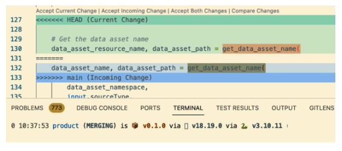
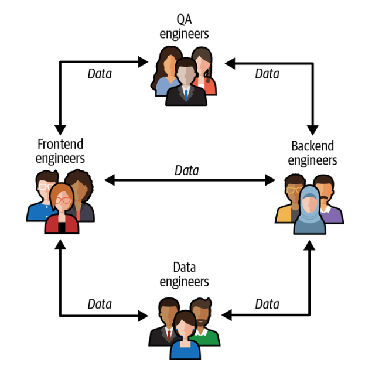
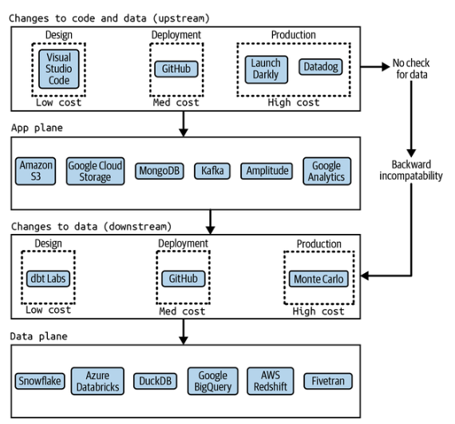
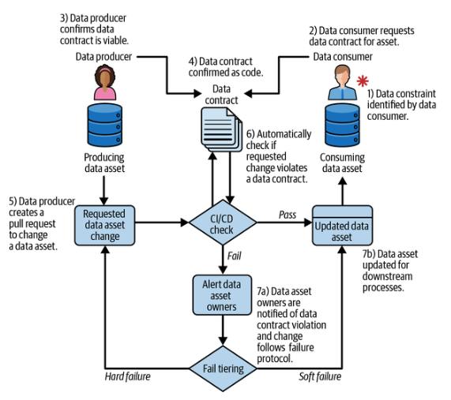
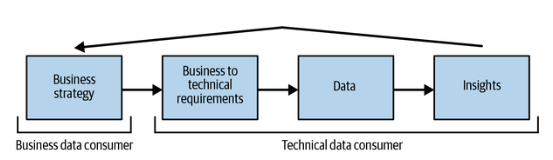
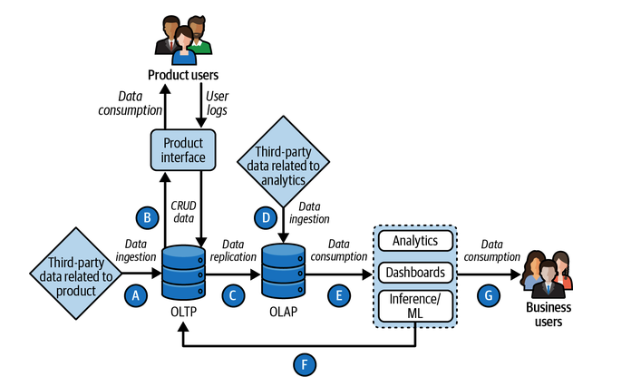
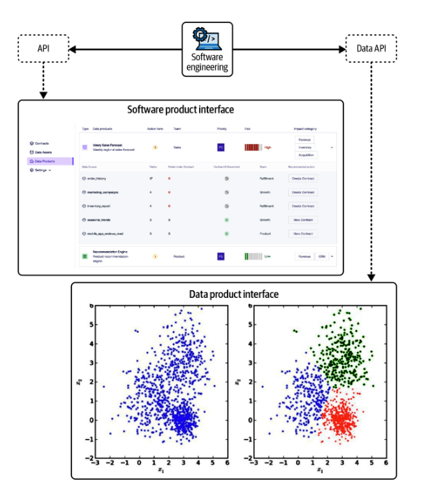
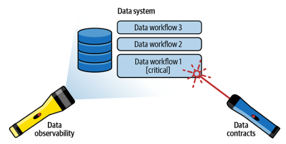

# Capítulo 4. Introducción a los contratos de datos

Los tres capítulos anteriores se centraron principalmente en el porqué de los contratos de datos y en el problema que estos pretenden resolver. A partir del capítulo 4, pasamos a definir qué es exactamente la arquitectura de los contratos de datos y cómo es su flujo de trabajo. Este capítulo servirá de base teórica antes de pasar a discutir las implementaciones en el mundo real en el capítulo 5 y a implementarlo tú mismo en los capítulos 6 y 7. Además de la base teórica, también discutiremos las partes interesadas clave y los flujos de trabajo a la hora de utilizar los contratos de datos.

## La colaboración es diferente en el ámbito de los datos

Dependiendo de a quién le preguntes, la «colaboración» puede ser una palabra de moda ejecutiva nebulosa o una promesa vaga y grandilocuente sobre la mejora de las relaciones entre los miembros de un equipo que ya tienen bastante trabajo que hacer.

A efectos de este libro, nuestra definición de colaboración técnica es la siguiente: «La colaboración se refiere a una forma de desarrollo distribuido en la que varias personas y equipos, independientemente de su ubicación, pueden contribuir a un proyecto de manera eficiente y eficaz».

Los equipos pueden colaborar en línea o fuera de línea, y con modelos de trabajo completos o sin ellos. El objetivo de la colaboración es aumentar la calidad del desarrollo de software mediante la revisión humana y la mejora continua.

En el ecosistema tecnológico moderno, hay muchos componentes de la colaboración que se han convertido en parte del ciclo de vida estándar de los desarrolladores y del proceso de lanzamiento, siendo los dos más destacados:

_Control de versiones_

Permite a varios colaboradores de trabajar en un proyecto sin interferir en los cambios de los demás. El control de versiones es un componente fundamental de la colaboración facilitada a través de sistemas de gestión de código fuente como Git.

_Solicitudes de extracción_

Otra característica colaborativa común de que se ha convertido en un componente esencial de DevOps. Los colaboradores pueden realizar cambios en las ramas de código que mantienen y, a continuación, proponer estos cambios a la base de código principal mediante PR. A continuación, la ingeniería de software del mismo equipo revisa las PR para garantizar la alta calidad y coherencia del código.

Con la automatización, la colaboración en torno al código base puede proporcionar ciclos de retroalimentación cortos entre los desarrolladores que garantizan la mitigación de los errores antes del lanzamiento. El equipo tiene una comprensión general de los cambios que se están incorporando a la producción y cómo afectan al código base, lo que garantiza una mayor responsabilidad en los lanzamientos, que ahora suelen realizarse varias veces al día.

En última instancia, todo esto se hace para mejorar la calidad del código. Si eres ingeniero, imagina cómo sería tu vida si tu empresa no utilizara software como GitHub, GitLab, Azure DevOps o BitBucket. Los equipos tendrían que hacer copias de seguridad manuales de su código base y utilizar sistemas de bloqueo centralizados para garantizar que solo un desarrollador trabajara en un archivo concreto a la vez. Los equipos también tendrían que consultarse constantemente entre sí para planificar qué aspectos del código base trabajarían y quién lo haría, y todas las actualizaciones se compartirían a través del correo electrónico o sistemas FTP. Dado el margen para el error humano, se dedicaría una cantidad significativa de tiempo a lidiar con errores y conflictos de software, como se ilustra en la Figura 4-1.

Sin embargo, una colaboración eficaz no solo consiste en implementar la tecnología subyacente básica, sino que, en última instancia, depende de los patrones de interacción entre los responsables de los cambios y los encargados de aprobarlos. Estos patrones de interacción variarán en función del cambio que se realice, la importancia del mismo y el diseño organizativo de la empresa.



GitHub, el sistema de control de versiones más popular del mundo , fue lanzado en 2008 por Tom Preston-Werner, Chris Wanstrath y PJ Hyett. En 2011, GitHub albergaba más de un millón de repositorios de código y creció diez veces más en los dos años siguientes. GitHub no solo resolvió un importante reto técnico al crear una interfaz fácil de usar para Git y proporcionar una serie de funciones orientadas a la colaboración, sino que también permitió a los equipos directivos, entusiasmados con los principios del desarrollo ágil de software, cambiar de forma significativa a nuevas estructuras organizativas más acordes con los rápidos y iterativos calendarios de lanzamiento y la federación.

Estas estructuras organizativas situaban a los ingenieros de software en el centro de los equipos de producto. Los equipos de producto estaban compuestos por un equipo central de ingeniería, reforzado por una variedad de otras funciones, como gestores de productos y programas, diseñadores, científicos de datos e ingenieros de datos. Cada equipo de producto actuaba como un microorganismo único dentro de la empresa, persiguiendo metas y objetivos distintos que, aunque estaban en consonancia con las iniciativas de alto nivel de la empresa, se adaptaban a componentes de aplicación específicos. GitHub permitió a los desarrolladores de estos equipos subdividir aún más sus tareas, muchas de las cuales se solapaban, sin consecuencias.

A pesar de que la colaboración federada se ha convertido en un componente fundamental del flujo de trabajo de un equipo de desarrollo de productos, este mismo ciclo de revisión y lanzamiento no está presente en las organizaciones de datos, ni en los ingenieros de software que mantienen fuentes de datos como bases de datos de producción, API o flujos de eventos. Esto se debe principalmente a que los ingenieros de software operan dentro de equipos, mientras que los datos fluyen entre equipos, como se ilustra en la figura 4-2.



Cada miembro de un equipo de producto tiene un incentivo inherente para tomarse en serio la colaboración. Un código defectuoso enviado por un ingeniero podría provocar una pérdida de ingresos o retrasos en la hoja de ruta de las funciones. Dado que los equipos de producto se evalúan en función de sus objetivos a nivel de componentes, cada ingeniero de es igualmente responsable de los cambios en su código base.

Sin embargo, la ingeniería de datos es una historia muy diferente. En la mayoría de los casos, los datos se almacenan en sistemas fuente propiedad de los equipos de producto, que fluyen hacia abajo hasta los desarrolladores de datos en finanzas, marketing o producto. Los equipos ascendentes y descendentes tienen objetivos y plazos únicos. Debido a la naturaleza altamente iterativa y experimental de la construcción de una consulta (o de hacer/responder una pregunta), a menudo no está claro en el momento en que se crea la consulta si será útil o no. Esto conduce a una división en la forma en que se utilizan los datos y a una divergencia de responsabilidades y propiedad.

Cuando los ingenieros de software de arriba realizan cambios en su base de datos, estos cambios son revisados por su propio equipo, pero no por los equipos de abajo que aprovechan estos datos para un conjunto de casos de uso totalmente diferentes. Debido al aislamiento de los equipos de producto, los ingenieros de arriba no saben cómo afectan estos cambios a otros miembros de la empresa, y los equipos de abajo no tienen tiempo para colaborar y proporcionar comentarios a sus proveedores de datos de arriba. Cuando los equipos de datos detectan que algo ha cambiado, ya es demasiado tarde: los procesos se han interrumpido, los paneles de control muestran resultados incorrectos y el equipo de producto que realizó el cambio ya ha pasado a otra cosa.

El objetivo principal de los contratos de datos es resolver este problema. Los contratos son un mecanismo para ampliar la colaboración orientada al software a los equipos de datos, aportando calidad a los datos mediante la revisión humana, del mismo modo que los mismos sistemas facilitaron la calidad del código para los equipos de producto. En la siguiente sección se explica con más detalle quiénes son estas partes interesadas y cómo colaboran.

## Las partes interesadas con las que trabajarás

Como se ha indicado en la sección anterior, los contratos de datos se centran en la colaboración en la gestión de sistemas complejos que aprovechan el software y los datos. Para colaborar de la mejor manera posible, primero debes comprender con quién trabajas. En la siguiente sección se detallan las distintas partes interesadas y su función en el ciclo de vida de los datos con respecto a los contratos de datos.

### El papel de los productores de datos

Hasta ahora hemos hablado bastante sobre las diferencias entre los productores y los consumidores de datos, que culminan en problemas de calidad de los datos. Pero antes de profundizar en el porqué de los contratos de datos como solución, es esencial comprender las responsabilidades de todos los que participan en la recopilación, transformación y uso de los datos. Al comprender las estructuras de incentivos de los actores clave en esta compleja cadena de valor del movimiento de datos, podemos identificar mejor cómo la tecnología nos ayuda a abordar y superar los retos de la comunicación entre cada una de las partes.

Los datos no se materializan de la nada. Deben ser recopilados explícitamente por ingenieros de software que crean aplicaciones aprovechadas por los clientes u otros servicios. Los productores de datos son los ingenieros responsables de recopilar y almacenar estos datos. Si bien funciones únicas como las de los ingenieros de datos pueden ser tanto de productores como de consumidores, o equipos no técnicos como los comerciales o incluso los propios clientes pueden ser responsables de la introducción de datos, por ahora nos centraremos principalmente en la función de la ingeniería de software, que asumen casi exclusivamente el trabajo de la mayoría de los productores de datos en una empresa.

La mayoría de los datos estructurados pueden desglosarse en una colección de eventos que corresponden a acciones realizadas por algún cliente que utiliza la aplicación o por el propio sistema. En general, hay dos tipos de eventos que son útiles para los consumidores posteriores:

_Eventos transaccionales_

Los eventos transaccionales se refieren a registros de transacciones individuales que se registran cuando un cliente o una tecnología realizan alguna acción explícita que normalmente (aunque no siempre) da lugar a un cambio de estado. Un ejemplo de evento transaccional podría ser un cliente que realiza un pedido, un servicio backend que procesa y valida ese pedido, o el pedido que se envía y se entrega en la dirección del cliente. Los eventos transaccionales se almacenan en sistemas de gestión de bases de datos relacionales (RDBMS) o se emiten utilizando marcos de procesamiento de flujos como Apache Kafka.

_Eventos de clics_

Los eventos de flujo de clics están diseñados para capturar las interacciones de un usuario con una aplicación web o móvil con el fin de realizar un seguimiento de su interacción con las funciones. Un ejemplo de evento de flujo de clics podría ser un usuario que inicia una nueva sesión web, un cliente que añade un artículo a su carrito o un comprador que realiza una búsqueda en la web. Existen muchas herramientas disponibles para capturar eventos de flujo de clics, como Amplitude, Google Analytics o Segment.

Los eventos de clickstream suelen estar limitados en su forma y contenido por los kits de desarrollo de software proporcionados por empresas externas para emitir, recopilar y analizar datos de comportamiento. Estos eventos se almacenan a menudo en el entorno de almacenamiento en la nube del proveedor, donde los gestores de productos y los científicos de datos pueden realizar análisis de embudo, pruebas A/B y segmentar a los usuarios en cohortes para ver las tendencias de comportamiento entre los grupos. Los datos de clickstream pueden cargarse desde estos proveedores externos en bases de datos analíticas propias, como Snowflake, Redshift o BigQuery.

Los eventos transaccionales dependen totalmente de la función de las aplicaciones y pueden variar enormemente en cuanto a su esquema, contenido de datos y complejidad. Por ejemplo, en algunos bancos, los eventos transaccionales pueden contener cientos o incluso miles de columnas con información detallada sobre la propia transacción, la cuenta, el pagador, el beneficiario, la sucursal, el canal de transacción, la información de seguridad (que se aprovecha en gran medida para los modelos de detección de fraudes), las comisiones o cambios, y mucho más. En muchos casos, hay tantos datos registrados en los eventos transaccionales que gran parte del esquema no se utiliza o simplemente no se aprovecha de manera significativa por el servicio.

Dado que los eventos transaccionales registran datos que se consideran relevantes únicamente para el funcionamiento de la aplicación propiedad del equipo de ingeniería (a diferencia de los eventos de flujo de clics, que están diseñados específicamente para el análisis de productos), a menudo se dice que los datos transaccionales son un subproducto de la aplicación. Los productores de datos tratan sus bases de datos relacionales como una extensión de sus aplicaciones y, por lo general, las modifican utilizando procesos de CI/CD similares a su proceso típico de lanzamiento de software .

En el entorno de datos moderno, la función de los productores de datos finaliza una vez que los datos se han recopilado, procesado y almacenado en un formato accesible. En el pasado, la responsabilidad del productor de datos también estaba muy influenciada por el diseño de la aplicación y la arquitectura de datos. Sin embargo, en entornos de productos federados, esta función es cada vez menos frecuente y se considera innecesaria. Para el productor de datos es más fácil y rápido recopilar los datos que desee de la aplicación, almacenarlos en su base de datos en el formato más beneficioso para su aplicación y, a continuación, ponerlos a disposición de los consumidores de datos para que puedan aprovecharlos para su análisis.

Para que quede claro, esto no es una afirmación sobre lo que creemos que está bien o mal, sino simplemente una descripción de cómo se comportan realmente una cantidad significativa de productores de datos en organizaciones tecnológicamente avanzadas.

### El papel de los consumidores de datos

Un consumidor de datos e es es un empleado de una empresa que tiene acceso a los datos proporcionados por un productor de datos y los aprovecha para construir canalizaciones, responder preguntas o crear modelos de aprendizaje automático. Los consumidores de datos se dividen en dos categorías: técnicos y no técnicos.

Los consumidores de datos técnicos son lo que se podría llamar desarrolladores de datos. Los desarrolladores de datos son ingenieros o analistas que aprovechan lenguajes de programación orientados a datos como SQL, Spark, Python, R y otros para analizar grandes volúmenes de datos con el fin de descubrir tendencias y conocimientos, o para construir canalizaciones que permitan que los datos fluyan a través de una serie de transformaciones según un calendario antes de ser aprovechados para la toma de decisiones. Los consumidores de datos técnicos se ocupan de los aspectos prácticos de la gestión de datos, desde el descubrimiento de datos, la generación de consultas, la documentación, la limpieza de datos, la validación de datos y mucho más.

Los consumidores de datos no técnic es suelen ser usuarios empresariales o gestores de productos que carecen de la capacidad técnica para construir consultas por sí mismos (o solo pueden hacerlo con datos previamente limpiados y validados). Esta categoría de usuarios suele ser la que formula las preguntas y, en última instancia, tiene el poder de decisión sobre qué resultado se debe adoptar, en función de la direccionalidad de los datos.

En el resto de este capítulo, nos centraremos en los consumidores de datos técnicos, aunque más adelante volveremos a la función que desempeñan los equipos no técnicos. Hay muchos tipos diferentes de consumidores de datos técnicos y muchos lugares en los que encajan en el ciclo de vida de los datos, como se ilustra en la Tabla 4-1:

_Ingenieros de datos_

Los ingenieros de datos son más conocidos como ingenieros de software especializados en datos. Se centran en extraer datos de los sistemas de origen, trasladarlos a un almacenamiento de archivos económico (como lagos de datos o lagos delta) y, finalmente, trasladarlos a bases de datos analíticas, limpiar y formatear los datos entrantes para su uso adecuado y garantizar que los procesos se hayan coordinado correctamente. Los ingenieros de datos constituyen la columna vertebral de la mayoría de los equipos de datos y son responsables de garantizar que toda la empresa obtenga datos actualizados y de alta calidad según lo previsto.

_Científicos de datos_

Los científicos de datos, que en su día fueron uno de los trabajos más atractivos del mundo, son ingenieros informáticos con un mayor enfoque en la estadística y el aprendizaje automático. Los científicos de datos se asocian con mayor frecuencia a la creación de funciones que pueden aprovechar los modelos de aprendizaje automático, la realización y evaluación de pruebas de hipótesis y el desarrollo de modelos predictivos para pronosticar mejor el éxito de los objetivos empresariales clave.

_Analistas de datos_

Los analistas de datos son especialistas en SQL. Utilizan principalmente SQL para construir consultas con el fin de responder a preguntas empresariales. Los analistas están en primera línea de la composición de consultas: es su responsabilidad comprender de dónde provienen los datos, si son fiables y qué significan.

_Ingenieros analíticos_

La ingeniería de análisis de datos es una disciplina relativamente nueva que gira en torno a la aplicación de las buenas prácticas de desarrollo de software al análisis. Los ingenieros de análisis o los ingenieros de BI utilizan técnicas de modelado de datos y herramientas como dbt para construir modelos de datos bien definidos que pueden ser aprovechados por los analistas y los científicos de datos.

_Ingenieros de plataformas de datos_

Aún más nuevos que los ingenieros de análisis, los ingenieros de plataformas son responsables de la implementación, la adopción y el crecimiento continuo de la infraestructura de datos y los conjuntos de datos básicos. Los ingenieros de plataformas suelen tener formación en ingeniería de datos o ingeniería de software, y se ocupan principalmente de seleccionar las bases de datos analíticas, las soluciones de streaming, los catálogos de datos y los sistemas de orquestación adecuados para las necesidades de una empresa.

Tabla 4-1. Consumidores de datos y sus puntos de contacto en el ciclo de vida de los datos

| Función del consumidor de datos        | Gestión de la infraestructura de datos | Ingesta de datos | Operaciones con datos de transacciones | Replicación de datos | Operaciones con datos analíticos | Análisis, información y paneles de control | Creación de modelos de aprendizaje automático | Acción basada en conocimientos y predicciones |
| -------------------------------------- | -------------------------------------- | ---------------- | -------------------------------------- | -------------------- | -------------------------------- | ------------------------------------------ | --------------------------------------------- | --------------------------------------------- |
| Ingeniero de plataformas de datos      | X                                      | X                | X                                      | X                    | X                                |
| Ingeniero de datos                     |                                        | X                | X                                      | X                    | X                                |
| Ingeniero analítico                    |                                        |                  |                                        | X                    | X                                |
| Analista de datos                      |                                        |                  |                                        |                      |                                  | X                                          |
| Científico de datos                    |                                        |                  |                                        |                      |                                  | X                                          | X                                             |
| Parte interesada interna de la empresa |                                        |                  |                                        |                      |                                  |                                            |                                               | X                                             |
| Usuario externo del producto de datos  |                                        |                  |                                        |                      |                                  |                                            |                                               | X                                             |

La mayoría de los consumidores de datos técnicos siguen un flujo de trabajo similar al iniciar un nuevo proyecto:

1. Definir o recibir requisitos de consumidores no técnicos.

2. Intentar comprender qué datos están disponibles y de dónde proceden.

3. Investigar si los datos se comprenden claramente y son fiables.

4. Si no es así, intentar localizar la fuente de los datos y trabajar con los productores de datos para comprender mejor qué significan los datos y cómo se están implementando en la aplicación.

5. Validar los datos.

6. Crear una consulta (y posiblemente un canal más completo) que aproveche los valiosos activos de datos.

Los consumidores de datos acceden a datos técnicamente complejos a través de una variedad de canales diferentes, dependiendo de tus habilidades y experiencia. Los ingenieros de datos extraen datos por lotes de múltiples fuentes utilizando tecnologías ELT de código abierto como Airbyte, o herramientas de código cerrado como Fivetran. Los ingenieros de datos también pueden crear una infraestructura que mueva los datos en tiempo real. El ejemplo más común de esto es la captura de datos de cambio (CDC) . La CDC captura las transformaciones a nivel de registro en los sistemas de origen ascendentes antes de enviar cada registro a un entorno analítico, normalmente utilizando tecnologías de streaming como Apache Kafka o Redpanda. Una vez que los datos llegan al entorno analítico, los ingenieros de datos los limpian, estructuran y transforman en objetos empresariales clave que pueden ser aprovechados por otros consumidores descendentes.

Los científicos de datos, los ingenieros analíticos y los analistas suelen trabajar con datos que ya han sido procesados por los ingenieros de datos. Dependiendo del caso de uso, sus actividades más comunes pueden incluir el modelado dimensional y la creación de data marts, la construcción de modelos de aprendizaje automático o la creación de vistas que luego pueden utilizarse para alimentar paneles de control o informes.

El resultado del trabajo de la mayoría de los consumidores de datos son consultas. Las consultas son código escrito en un lenguaje diseñado para bases de datos analíticas o transaccionales, normalmente SQL, aunque Python también es una alternativa popular en ciencia de datos. Dependiendo de la complejidad de la operación, las consultas pueden variar desde simples bloques de código de 5 a 10 líneas hasta archivos increíblemente complejos con cientos o incluso miles de líneas llenas de sentencias CASE WHEN. Dado que estas consultas se utilizan para responder a preguntas comerciales, pueden ampliarse, replicarse o modificarse de diversas maneras.

### El impacto de los productores y los consumidores

Como puedes imaginar, los productores de datos desempeñan un papel importante en el trabajo diario de los consumidores de datos. Los productores de datos controlan la creación y el acceso a los datos de origen. Los datos de origen representan la información más cercana posible a la realidad, dado que se recopilan directamente de las aplicaciones. Los consumidores de datos suelen preferir utilizar datos ascendentes, ya que puede resultar complicado reutilizar las consultas creadas por otros consumidores de datos. El significado de las consultas es, en última instancia, subjetivo: un científico de datos puede tener una opinión sobre lo que hace que un cliente activo sea «activo» o que un pedido perdido sea «perdido». Estas opiniones suelen incorporarse al código de la consulta con muy poca explicación o documentación. Dependiendo de la longitud y la complejidad de la consulta, puede ser casi imposible para otros científicos de datos comprender completamente lo que uno de sus compañeros del equipo de datos quiso decir.

> **Nota**

> Este problema de pérdida de contexto se agrava con el tiempo. Los consumidores de datos suelen abandonar su lugar de trabajo y, a menudo, se llevan consigo el conocimiento de su código. Esto se conoce como conocimiento institucional.

Por estas razones, a los consumidores de datos les encanta acudir a la fuente. Del mismo modo, siempre es más fácil obtener información sobre una persona concreta directamente de ella misma que basarse en rumores y habladurías. Sin embargo, acudir a la fuente puede ser complicado. Puede requerir comprender el linaje de tu ecosistema de datos. El linaje se refiere a la red de conexiones que une los activos de datos entre sí dentro de un entorno analítico. Cuanto más antiguo y denso sea el entorno, más difícil puede resultar rastrear el linaje a través de los nodos del gráfico. El gráfico de linaje crea un problema adicional: la gestión del cambio.

A medida que los productores de datos actualizan su aplicación, realizan cambios periódicos en el código de su software. Los cambios en el software pueden afectar o no a las estructuras de datos, como el esquema o el contenido de los objetos que generan datos, como los eventos transaccionales, los registros o los eventos analíticos. Dado que no existe una base de referencia que establezca el estado esperado de estos objetos de datos, los productores de datos realizan sus cambios de forma efectiva a ciegas, como se ilustra en la figura 4-3. Si bien las pruebas de integración pueden ayudar a detectar errores de integración con el propio código, y el software de gestión de la producción como LaunchDarkly (gestión de funciones) o Datadog (observabilidad) puede detectar problemas o evitar que degraden la experiencia del cliente, este control de calidad solo se aplica a la capa de aplicación, no a la capa de datos donde los consumidores de datos realizan su trabajo. La capa de datos queda oculta tras el gráfico de linaje. Estos entornos de datos tan enrevesados y enmarañados hacen muy difícil que los desarrolladores de aplicaciones comprendan cómo y dónde se utilizan sus datos.

Una opción para los productores de datos podría ser tratar cualquier impacto en la capa de datos como parte de CI/CD. Por desgracia, esto rara vez funciona bien. En la mayoría de las grandes empresas, la cantidad de datos en un lago de datos es tan grande que es raro que incluso el 25 % de los datos tenga una utilización significativa dentro de la empresa. Ralentizar a tu equipo de ingeniería para garantizar las pruebas de integración de datos que ni siquiera son relevantes o útiles para los consumidores de datos es una pérdida de tiempo. Los productores deben tener libertad para iterar siempre que tengan dependencias limitadas.



En segundo lugar, a menudo los cambios incompatibles con versiones anteriores son requisitos imprescindibles. Los equipos de producto lanzan regularmente nuevas funciones, refactorizan el código antiguo y modifican los eventos de acuerdo con un diseño arquitectónico más amplio que cuenta con la aceptación de toda la organización. Aunque estos cambios pueden pillar desprevenidos a los consumidores posteriores, a menudo tienen demasiado impulso como para detenerlos. Los productores de datos pueden intentar comunicar las migraciones a los consumidores de datos enviando correos electrónicos, anunciando sus intenciones durante las revisiones de diseño o publicando planes en los canales de Slack. Lamentablemente, este ciclo de retroalimentación rara vez llega a los consumidores de datos, quienes (una vez más, debido a la complejidad del linaje) rara vez se dan cuenta de que se verán afectados por un cambio ascendente, incluso si conocen el contexto.

Cuando se produce un cambio, rara vez se detecta con antelación. En la mayoría de los casos, los consumidores finales (y, en el peor de los casos, las partes interesadas no técnicas de la empresa) son los primeros en darse cuenta de que existe un problema, lo que les lleva a una larga búsqueda inútil para identificar y resolver los errores causados por un equipo anterior que apenas sabe que existís.

### Las tribulaciones de los consumidores de datos que gestionan la calidad de los datos

A la mayoría de los profesionales de la gestión de datos ( ) se les helan las sangre cuando oyen la frase «estas cifras no cuadran». Este tipo de afirmaciones suelen dar lugar a horas o días de investigación de los datos y sus respectivos sistemas para descubrir y solucionar los problemas de calidad de los datos. A menudo, los equipos de datos son los «chivos expiatorios» de estos problemas de calidad de los datos dentro de la empresa, a pesar de que muchos de ellos se deben a cambios en las fases iniciales que escapan a su control. Durante su etapa en startups como científico e ingeniero de datos, Mark ideó un patrón repetible para resolver estos problemas de calidad de los datos en organizaciones cuya madurez en materia de datos era relativamente temprana. Aunque este proceso es relativamente manual, muchas organizaciones se encuentran en situaciones similares. El proceso de resolución de la calidad de los datos constaba de los siguientes pasos, sobre los que ya hemos escrito con más detalle anteriormente:

1. Las partes interesadas plantean el problema

2. Clasificación de problemas

3. Alcance de los requisitos

4. Replicación del problema

5. Perfilado de datos

6. Investigación del proceso posterior

7. Investigación del proceso ascendente

8. Consultar a las partes interesadas técnicas

9. Implementación: implementar la corrección de DQ

10. Implementación: aplicar la corrección de calidad de datos

11. Comunicación con las partes interesadas

Cabe señalar que la mayoría de estos pasos no son técnicos, sino que se centran en la comunicación dentro de la empresa para clasificar las interrupciones en el ciclo de vida de los datos y coordinar una solución entre varios equipos. Más concretamente, cada paso consiste en lo siguiente desde la perspectiva de la base de datos analítica:

1.  _Las partes interesadas plantean el problema_

    El mejor escenario es que un consumidor de datos, como un analista de datos, detecte un problema de calidad de los datos antes de que lo noten las partes interesadas del negocio aguas abajo. Anticiparse al problema de calidad de los datos no consiste tanto en evitar que los usuarios aguas abajo lo noten como en asegurarse de que las partes interesadas confíen en que estás gestionando los problemas de manera oportuna. La forma en que respondes a estas solicitudes da forma a la cultura de datos entre las partes interesadas.

2.  _Clasificación del problema_

    Aunque es importante responder rápidamente, los equipos de datos no deben intentar resolver el problema hasta que lo hayan clasificado adecuadamente como una corrección urgente, lo hayan asignado para más adelante o hayan decidido no trabajar en él. Para ello, es fundamental que los responsables del equipo de datos actúen como amortiguadores y establezcan expectativas. Además, las solicitudes nunca deben aceptarse en canales de chat individuales (por ejemplo, mensajes directos de Slack), sino que deben dirigirse a un canal compartido con visibilidad, como Jira.

3.  _Definición del alcance de los requisitos_

    Los errores que Mark cometió al principio de su carrera en el ámbito de los datos a menudo se debían a que se lanzaba directamente a resolver el problema sin analizarlo adecuadamente. A menudo hay que sopesar el esfuerzo y el impacto de la solución, por lo que es necesario consultar con las partes interesadas para comprender por qué estos datos son importantes y cómo afectan a sus flujos de trabajo. Además, este paso fomenta aún más la confianza con las partes interesadas, ya que demuestra la diligencia debida que estás aplicando y las incluye en el proceso de resolución.

4.  _Reproducción del problema_

    Una vez que se ha definido el alcance del problema , la replicación del problema proporciona las primeras pistas sobre el origen del problema de calidad de los datos. Además, evita que se persiga un problema de calidad de los datos que es el resultado de un error humano, lo que en cambio implica un problema de comunicación o de proceso. Por lo general, la replicación del problema se puede realizar utilizando el producto de datos en cuestión o extrayendo los datos de la tabla de origen mediante SQL.

5.  _Perfilado de datos_

    En esta etapa, tú puedes realizar una serie de agregados y recortes de las tablas en cuestión. Aunque no son exhaustivos, los siguientes son excelentes puntos de partida:
    - Líneas temporales de datos

    - Patrones nulos

    - Picos o caídas en el recuento de datos

    - Recuentos por agregado (por ejemplo, ID de la organización)

    - Revisiones del linaje de datos de las tablas afectadas

    El objetivo no es encontrar el problema, sino reducir el alcance de la superficie del problema para poder profundizar de forma específica. Estas búsquedas rápidas de datos se convierten en hipótesis que hay que comprobar.

6.  _Investigación del proceso posterior_

    Con las hipótesis creadas a partir del perfilado de datos, comprueba las suposiciones mediante una investigación posterior en las bases de datos analíticas y los productos de datos. Aunque el problema pueda estar causado por un cambio anterior, su visibilidad suele ser mayor en la fase posterior. Una vez más, se hace hincapié en crear una imagen completa del problema de calidad de los datos y en descubrir otras superficies afectadas por el problema que no estaban en el problema original. Dos problemas comunes que surgen en esta etapa son los siguientes:
    - Se introdujo un error en el código de transformación SQL, como un uso incorrecto de un « `JOIN` », una cláusula « `WHERE` » en la que faltaba un caso extremo o datos extraídos de la tabla incorrecta (por ejemplo, « `user_table` » en lugar de « `user_information_table` »).

    - El código SQL ya no se ajusta a la lógica empresarial en evolución, por lo que las transformaciones deben actualizarse en consecuencia.

7.  _Investigación del proceso ascendente_

    Después de explorar los impactos posteriores de , el siguiente paso es rastrear el linaje de los datos hacia arriba hasta la base de datos transaccional. En concreto, ve más allá de la base de datos y revisa el código subyacente que genera los datos, realiza las operaciones CRUD y captura los registros. En este paso, el linaje pasa de las tablas y bases de datos a revisar también las llamadas a funciones y la herencia de estas funciones. Por ejemplo, el `product_table` en la base de datos se actualiza mediante la función `product_sold_count()` dentro de la clase `ProductSold` en el archivo product_operations.py, como se ve en este ejemplo:

    ```PYTHON
    # product_operations.py example code

    import db_helper_functions as db_helper

    class ProductSold:
      def **init**(self) -> None:
        # Connect to the database
        self.db_connection = db_helper.connect_to_database()
        pass

      def product_sold_count(self, product_id, sold_count):
        # Update the product_table in the database with new count
        <python code implementing logic>

        # Update database
        db_connection.commit()
        db_connection.close()
    ```

    A menudo, los problemas de calidad de los datos más «ocultos» se esconden en los códigos base fuera del alcance del equipo de datos. Sin este paso, los equipos de datos suelen crear transformaciones adicionales en fases posteriores para resolverlos rápidamente.

8.  _Consulta a las partes interesadas técnicas_

    Con los datos recopilados por , puedes pensar que la solución es evidente, pero conocer la solución es solo la mitad del camino si el problema de origen está fuera de tu jurisdicción técnica (por ejemplo, acceso limitado de lectura y escritura a la base de datos transaccional). La otra mitad consiste en convencer a los equipos de arriba de que la solución propuesta es correcta y que vale la pena darle prioridad sobre su trabajo actual. Por lo tanto, se hace hincapié en consultar ( en lugar de solicitar) a las partes interesadas para que se conviertan en parte de la solución y ayudarlas a comprender dónde encaja dentro de sus prioridades. Además, puede haber algunos matices que solo aquellos que trabajan a menudo en el sistema de arriba conocerían.

9.  _Preimplementación: implementar la corrección de DQ_

    Una vez que se determina una solución , toma los resultados de la etapa de perfilado de datos como referencia de base e identifica qué valores deben cambiar o permanecer iguales. Esto es clave tanto para garantizar que tu solución no introduzca más problemas de calidad de los datos como para documentar la diligencia debida en la resolución del problema para las partes interesadas afectadas.

    En el caso de los problemas de calidad de datos descendentes, esto suele consistir en cambiar el código SQL subyacente que realiza las transformaciones hasta que estés satisfecho con el comportamiento esperado de los datos. Lo ideal es que estos archivos SQL se controlen mediante una herramienta como dbt y, por lo tanto, se sometan a una revisión del código antes de cambiar la base de datos. En el caso de los problemas de calidad de los datos ascendentes, los cambios sin duda se someterán a una revisión del código, pero el reto es conseguir que un equipo independiente implemente la solución. Es de esperar que esto no suponga un problema si la fase de consulta con las partes interesadas técnicas va bien, pero es necesario tener en cuenta un calendario que escapa a tu control.

10. _Implementación: aplicar la corrección de calidad de datos_

    Una vez que se confirman los cambios y se incorporan a la rama principal del repositorio de código, la solución debe realizarse la implementación en producción y luego someterse al monitoreo para garantizar que los cambios funcionen según lo esperado. Una vez que se ha realizado la implementación del cambio en el código subyacente, se debe considerar y aplicar el relleno de los datos afectados si se justifica.

11. _Comunicación con las partes interesadas_

    Un aspecto que muchos equipos técnicos olvidan tener en cuenta es el papel de la comunicación entre las partes interesadas, especialmente los líderes empresariales afectados por la calidad de los datos. Resolver los problemas de calidad de los datos de manera oportuna es principalmente un esfuerzo por mitigar la pérdida de confianza en la organización de datos; por lo tanto, no basta con resolver el problema en silencio. Las partes interesadas clave deben estar continuamente informadas sobre el estado del problema de calidad de los datos, el plazo para su resolución y la solución definitiva. La forma en que se gestiona un problema de calidad de los datos es tan importante para mantener la confianza en la organización de datos como la resolución del problema.

Aunque este proceso es tremendamente útil para gestionar los problemas de calidad de los datos, sigue siendo bastante manual y reactivo. Si bien existen numerosas alternativas para automatizar y escalar la calidad de los datos (por ejemplo, la observabilidad de los datos), creemos que los contratos de datos son la opción ideal para implementar una solución que implique a varios equipos a lo largo del mismo ciclo de vida de los datos dentro de una organización.

## Una alternativa: el flujo de trabajo del contrato de datos

El estado actual de la resolución de los problemas de calidad de los datos gira en torno a procesos reactivos que requieren una considerable iteración durante los cambios disruptivos. Además, el mayor cuello de botella en este proceso es la coordinación de las distintas partes para resolver un cambio disruptivo, especialmente entre las partes que no se centran en la calidad de los datos.

El flujo de trabajo del contrato de datos traslada el proceso de resolución de la calidad de los datos de reactivo a proactivo, en el que las restricciones, los propietarios y los protocolos de resolución se establecen mucho antes de que se produzca un cambio disruptivo. Además, aunque lo ideal es que los contratos de datos eviten un cambio disruptivo, en caso de que sea inevitable el incumplimiento de un contrato, se informa automáticamente a las partes pertinentes para que lo resuelvan en consecuencia y se evite el cuello de botella de la coordinación de las partes interesadas.

### Pasos del flujo de trabajo del contrato de datos

Como se destaca en la figura 4-4, el flujo de trabajo del contrato de datos consta de los siguientes pasos:

1. Restricción de datos identificada por el consumidor de datos.

2. El consumidor de datos solicita un contrato de datos para el activo.

3. El productor de datos confirma que el contrato de datos es viable.

4. El contrato de datos se confirma como código.

5. El productor de datos crea una solicitud de extracción para cambiar un activo de datos.

6. Comprobación automática de si el cambio solicitado incumple un contrato de datos.

7. Dependiendo de si la comprobación de CI/CD se supera o se suspende:

    a. Se notifica a los propietarios de los activos de datos la violación del contrato de datos y el cambio sigue el protocolo de fallo.

    b. Los activos de datos se actualizan para los procesos posteriores.



Veamos cada paso en detalle:

1. _Restricción de datos identificada por el consumidor de datos._

    Como se menciona en el capítulo 1, las necesidades de los consumidores de datos determinan qué datos se capturan y, por lo tanto, los requisitos de calidad de los datos. Esto se debe a que el consumidor de datos es la interfaz entre los activos de datos disponibles y la puesta en práctica de dichos activos para generar valor para la empresa. Aunque es posible que un productor de datos sea consciente de estos matices empresariales, su trabajo suele estar muy alejado de las partes interesadas de la empresa y sus necesidades. Un buen ejemplo de esta división es la comparación entre los conocimientos empresariales de un analista de datos y un ingeniero de software. Aunque ambos pueden tener conocimientos empresariales, el trabajo del analista de datos gira en torno a responder a las preguntas de la empresa con datos y, por lo tanto, es probable que esté más al tanto de los requisitos pertinentes de la empresa en tiempo real.

2. _El consumidor de datos solicita un contrato de datos para el activo._

    Una de las funciones más e es de un consumidor de datos es traducir los requisitos empresariales en requisitos técnicos con respecto a los datos, como se destaca en la figura 4-5. Esto se refleja en el hecho de que las partes interesadas de la empresa a menudo se ven relegadas a interactuar con los datos a través de paneles de control en lugar de acceder directamente a los datos sin procesar. Por lo tanto, debemos diferenciar entre consumidores de datos técnicos y consumidores de datos empresariales cuando pensamos en el flujo de trabajo del contrato de datos. Así, los consumidores de datos técnicos utilizarán su conocimiento de los requisitos empresariales y de datos para solicitar un contrato de datos que los productores de datos deberán cumplir.

    

3. _El productor de datos confirma que el contrato de datos es viable._

    Si bien los consumidores de datos e es técnicos son expertos en hacer coincidir los requisitos empresariales con los requisitos técnicos, su limitación es comprender cómo los requisitos técnicos se alinean con todo el sistema de software. Por lo tanto, el productor de datos será quien determine la viabilidad de una solicitud y realice los ajustes necesarios en el contrato de datos propuesto.

    Por ejemplo, un consumidor de datos puede ser consciente de que el grado de actualidad de los datos que requiere el negocio es de un día para una necesidad empresarial específica. La necesidad puede ser una simple actualización del calendario de un canal de datos o una refactorización masiva para ampliar las capacidades del canal de datos. El productor de datos puede ayudar al consumidor de datos a tomar conciencia de estas limitaciones y a comunicarlas al negocio.

4. _El contrato de datos se confirma como código._

    Los contratos de datos hacen mucho hincapié en la prevención automática y la alerta sobre las infracciones de la calidad de los datos, pero el paso de crear el contrato de datos es en realidad el más importante. En concreto, este paso sirve como una función coercitiva para que los equipos de datos comuniquen sus necesidades, informen a los productores de las implicaciones comerciales de los activos de datos y establezcan propietarios y flujos de trabajo cuando se produce una infracción. Como se ha señalado en el paso anterior, no se trata de una solicitud unidireccional, sino más bien de una negociación entre las partes interesadas para ponerse de acuerdo sobre la mejor manera de servir a la empresa con los datos.

    Además, dado que el contrato de datos se almacena como código controlado por versiones (normalmente archivos YAML), se guarda la evolución de la correspondencia entre los requisitos históricos del negocio y los requisitos técnicos. Esta información histórica es muy valiosa para los consumidores de datos técnicos, que a menudo trabajan con datos que abarcan líneas temporales de diversos cambios en los productos y/o el negocio.

5. _El productor de datos crea una solicitud de extracción para cambiar un activo de datos._

    Este paso es evidente, ya que el código controlado por versiones y las revisiones de código son un requisito mínimo para cualquier sistema de software. Dicho esto, los cambios en los activos de datos para satisfacer los requisitos cambiantes del software pueden parecer inocuos, pero estos cambios son el combustible de importantes incendios técnicos que comienzan como fallos silenciosos. Esto se debe a que los productores de datos a menudo no están al tanto de las implicaciones comerciales posteriores y se ven alejados de las consecuencias de dichos fallos hasta que se lleva a cabo un análisis de la causa raíz. Los contratos de datos hacen que estos requisitos pasen de ser posteriores y ocultos a estar fácilmente disponibles para que cualquier parte interesada técnica los revise.

6. _Se comprueba automáticamente si el cambio solicitado incumple un contrato de datos._

    Una vez que los contratos de datos están en vigor para los activos de datos relevantes, la prevención de la calidad de los datos puede producirse en el flujo de trabajo del desarrollador, en lugar de ser una respuesta reactiva. En concreto, CI/CD requiere nuevas solicitudes de extracción para que los cambios en el código superen una serie de pruebas, y las comprobaciones de los contratos de datos encajan en este flujo de trabajo.

7. _a. Se notifica a los propietarios del activo de datos la violación del contrato de datos y el cambio sigue el protocolo de fallo._

    Como se ha indicado anteriormente en este capítulo, no basta con ser consciente de los problemas de calidad de los datos. En cambio, es necesario notificar a las partes interesadas pertinentes y proporcionarles el contexto para motivarlas a tomar medidas para resolver el problema. Si bien la calidad de los datos es un requisito para los consumidores de datos, el estado de los datos tiene un impacto limitado en las restricciones de los productores de datos, que se centran principalmente en el software. Como se ilustra en la Tabla 4-2, los contratos de datos realinean el impacto de la calidad de los datos con las motivaciones de los productores de datos a través de alertas en sus solicitudes de extracción.

    Tabla 4-2. Diferencias entre productores y consumidores de datos

    |              | Productor de datos                                                                                                                                                                                                                 | Consumidor de datos                                                                                                                                                                                                      |
    | ------------ | ---------------------------------------------------------------------------------------------------------------------------------------------------------------------------------------------------------------------------------- | ------------------------------------------------------------------------------------------------------------------------------------------------------------------------------------------------------------------------ |
    | Problema     | Necesidad de actualizar el sistema de software subyacente para adaptarlo a los requisitos técnicos cambiantes.                                                                                                                     | Necesidad de garantizar que los datos subyacentes sean fiables para obtener información significativa para el negocio.                                                                                                   |
    | Motivaciones | Necesidad de superar las comprobaciones de CI/CD para fusionar las solicitudes de extracción. <br> No se quiere que un punto de fallo crítico para el negocio se remonte a un cambio en el código en el que se notificó el riesgo. | Garantizar que se ha llevado a cabo la debida diligencia en torno a los datos para conocer las limitaciones de un activo de datos.<br> Contar con información aceptada por la empresa, especialmente por los ejecutivos. |
    | Resultado    | Software robusto que tiene en cuenta no solo las compensaciones técnicas, sino también la lógica empresarial crítica vinculada a los datos.                                                                                        | Reducción del tiempo dedicado a investigar y resolver problemas de calidad de los datos para flujos de trabajo empresariales críticos.                                                                                   |

    Ten en cuenta que una violación del contrato de datos no equivale a un bloqueo automático total del cambio. Una vez más, la función de los contratos de datos es satisfacer las necesidades de la empresa en lo que respecta a los datos. Puede darse el caso de que sea necesario modificar el contrato en sí o que se produzca una compensación técnica en la que la calidad de los datos tenga una prioridad menor. Por ejemplo, hay ocasiones en las que las interrupciones importantes requieren soluciones urgentes por parte de los ingenieros y que el código se implemente rápidamente. Estos cambios no pueden esperar a que se aprueben más allá de la «sala de guerra», y los demás equipos no serán informados hasta después del informe de análisis de la causa raíz. Un fallo grave no sería lo ideal en este escenario, pero un fallo leve que solo alerte a los equipos afectados aguas abajo automatizaría la comunicación (una cosa menos de la que preocuparse en un momento ya de por sí estresante). En cualquier caso, lo ideal es que la propia especificación del contrato indique si la infracción da lugar a un fallo grave o leve y en qué contextos deben producirse las excepciones.

8. _b. Se actualiza el activo de datos para los procesos posteriores._

    Una vez superadas las comprobaciones de CI/CD del contrato de datos, el código con el cambio solicitado en el activo de datos se fusionará con la rama principal y, finalmente, se realizará la implementación en producción. Lo ideal es que este flujo de trabajo se produzca con una intervención mínima, pero en caso de incumplimiento del contrato de datos, el proceso de resolución se documentará en la propia solicitud de extracción, siempre que se haya notificado a las partes interesadas pertinentes para que participen.

Lo que hace que este flujo de trabajo sea tan potente es que no se limita a una sola sección del ciclo de vida de los datos (por ejemplo, herramientas que solo se centran en el almacén de datos), sino que funciona en cualquier lugar donde haya movimiento de datos desde un origen a un destino. En la siguiente sección, analizaremos dónde puedes implementar contratos de datos y sus diversas ventajas e inconvenientes a lo largo del ciclo de vida de los datos.

### Dónde implementar contratos de datos

Ten en cuenta que el flujo de trabajo del contrato de datos abstrae la lógica empresarial, las reglas de calidad de los datos y la información sobre los activos de datos circundantes como una API. Al crear esta abstracción, las partes interesadas ya no necesitan interactuar con una multitud de puntos de contacto para comprender los datos y resolver los problemas de calidad. En cambio, ahora solo necesitan interactuar con el contrato en sí y solo intervenir cuando se les avisa de una infracción del contrato.

La arquitectura de los contratos de datos se puede agrupar en cuatro componentes distintos:

- Activos de datos

- Definición del contrato

- Detección

- Prevención

Analizaremos en profundidad cada componente en el capítulo 5 desde un punto de vista conceptual, el capítulo 6 proporcionará las herramientas de código abierto que recomendamos para crear contratos de datos y el capítulo 7 proporcionará una implementación integral.

Además de los numerosos componentes, también hay múltiples etapas en el ciclo de vida de los datos en las que puedes implementar contratos de datos, como se ilustra en la Figura 4-6.



Estas son las consideraciones para cada etapa del ciclo de vida de los datos:

A. _Datos de terceros → Base de datos transaccional (OLTP)_

Aunque recomendamos ir lo más arriba posible en la cadena para los contratos de datos, una de las áreas más difíciles para hacer cumplir los contratos de datos es la de los datos de terceros. Aunque es posible, es poco probable que un tercero acepte restricciones adicionales sin que tu organización tenga influencia. Dicho esto, aunque no puedes controlar los datos de terceros, los contratos de datos se pueden utilizar entre la ingestión y tu base de datos transaccional como una forma de clasificar los datos que violan un contrato y proporcionar alertas tempranas. (El capítulo 5 ofrece una ilustración más detallada de este escenario).

B. _Interfaz del producto → Base de datos transaccional_

Los cambios en el esquema y la semántica subyacentes para las operaciones CRUD suelen ser la raíz de los problemas de calidad de los datos y serían un lugar ideal para la primera implementación de los contratos de datos. Sin embargo, una consideración importante es si tu equipo supervisa la base de datos transaccional; a menudo, los equipos de ingeniería de software controlan esta base de datos, lo que significa que no sería un lugar ideal para una primera implementación si eres un equipo de datos.

C. _Base de datos transaccional → Base de datos analítica (OLAP)_

La canalización de datos entre las bases de datos transaccionales y las bases de datos analíticas es donde recomendamos a la mayoría de las organizaciones que comiencen a implementar contratos de datos. Concretamente, tanto la ingeniería de software como los equipos de datos son partes interesadas activas en esta etapa del ciclo de vida de los datos, y los equipos de datos suelen tener una autonomía considerablemente mayor para implementar cambios. Además, esta etapa del ciclo de vida suele ser la fuente de datos más ascendente para los flujos de trabajo analíticos y de aprendizaje automático, por lo que tiene la mayor probabilidad de prevenir problemas importantes de calidad de los datos.

D. _Datos de terceros → Base de datos analítica_

Al igual que ocurre con los datos de terceros que entran en las bases de datos transaccionales, a menudo no es factible establecer contratos entre los datos de terceros y una base de datos analítica. Una excepción importante son las plataformas de gestión de relaciones con los clientes (CRM) basadas en la nube (por ejemplo, Salesforce y HubSpot), que a menudo se sincronizan con una base de datos analítica mediante conectores de datos. Aunque los datos son de terceros, las CRM permiten personalizar los modelos y columnas de datos subyacentes, que pueden controlarse con contratos de datos. Esto es especialmente cierto en el caso de estas fuentes de datos.

E. _Base de datos analítica → Productos de datos_

De nuestras conversaciones con organizaciones interesadas en los contratos de datos, muchos equipos de datos consideran seriamente la posibilidad de colocar primero los contratos de datos en su base de datos analítica para controlar las transformaciones de datos utilizadas para el análisis, el aprendizaje automático y los paneles de control. Aunque esto es valioso, recomendamos encarecidamente a los equipos que se centren en la etapa entre las bases de datos transaccionales y analíticas y luego trabajen en sentido descendente. Concretamente, empezar demasiado abajo en el proceso disminuirá tu capacidad para prevenir problemas de calidad de los datos antes de que se almacenen en la base de datos analítica. Dicho esto, se trata de una ubicación excelente después de colocar los contratos de datos aguas arriba.

F. _Base de datos analítica → Base de datos transaccional_

Aunque es posible colocar contratos de datos para flujos de trabajo de «ETL inverso», es menos común, ya que los contratos de datos en la base de datos analítica evitan idealmente que las transformaciones de datos tengan problemas de calidad. Además, a menos que el equipo de ingeniería lidere la implementación de contratos de datos, es poco probable que los desarrolladores aguas arriba soliciten contratos de datos, ya que a menudo esto es competencia del equipo de datos.

G. _Productos de datos → Usuarios empresariales_

Establecer contratos de datos entre bases de datos analíticas y consumidores finales es una forma de garantizar la confianza y la coherencia de los datos que se proporcionan a través de productos de datos. Aunque es demasiado tardío para evitar problemas de calidad de los datos, permite a los equipos de datos clasificar los datos que proporcionan y establecer expectativas. Por ejemplo, ¿te gustaría tomar decisiones empresariales clave basándote en un panel de control que utilizaba o no datos sujetos a contrato?

El factor clave para decidir dónde implementar los contratos de datos es la relación entre los productores ascendentes y descendentes. Aunque lo ideal es que esta relación sea siempre buena, en la realidad es más matizada y compleja. En los capítulos 9 a 12, detallaremos cómo manejar estos matices en la dinámica de equipo dentro de la empresa y cómo conseguir la aceptación de los contratos de datos.

### La curva de madurez de los contratos de datos: concienciación, propiedad y gobernanza

Si bien los contratos de datos son un mecanismo técnico para identificar y resolver problemas de calidad y gobernanza de los datos en las etapas iniciales, el cambio cultural es tan importante como la tecnología. El cambio cultural se refiere aquí a los cambios de comportamiento que deben adoptar los productores de datos, los consumidores de datos y los equipos de liderazgo para ayudar a sus empresas a implementar contratos de datos y poner en marcha con éxito una gobernanza federada a gran escala. Aunque en esta sección se aborda brevemente el cambio cultural, dedicamos los capítulos 9 a 12 a detallar exactamente cómo conseguir que los contratos de datos se adopten en toda la organización.

Es importante reconocer que no todas las empresas están igualmente preparadas para los contratos de datos desde el primer día. Algunas empresas ya se basan en los datos: estas empresas comprenden y aprecian el valor de los datos por su capacidad para añadir funciones operativas y analíticas desde la cúpula de la organización hasta la base. Otras simplemente son conscientes de los datos: comprenden que los datos se utilizan en su empresa, pero fuera de la organización de datos no se reconoce mucho la necesidad de invertir en infraestructura, herramientas y procesos. Otras ignoran los datos: ¡su viaje en el mundo de los datos apenas ha comenzado!

Para complicar aún más las cosas, estas diferencias en madurez y comunicación pueden variar no solo entre organizaciones, sino también dentro de las organizaciones entre equipos. Por ejemplo, un equipo de aprendizaje automático puede tener una apreciación sofisticada del valor de los datos que el equipo de ventas puede no tener. Según nuestra experiencia, es importante reconocer estas diferencias. ¡Las empresas no pueden tratarse como si fueran monolíticas! Para tener éxito en la implementación de contratos de datos, los héroes de los datos deben adoptar un enfoque pragmático que se base en la implantación de contratos a lo largo de una curva de madurez, en función de la preparación de la organización y del equipo.

La curva de madurez e e de los contratos de datos tiene tres pasos: 1) concienciación, 2) colaboración y 3) propiedad. A continuación, describiremos cada paso, así como sus objetivos correspondientes.

#### Concienciación

_Objetivo: Crear visibilidad sobre cómo los equipos posteriores utilizan los datos anteriores._

El objetivo de la fase de concienciación es ayudar tanto a los productores como a los consumidores de datos a tomar conciencia de sus responsabilidades como partes interesadas activas en la cadena de suministro de datos. Como se ha mencionado anteriormente, los requisitos de los contratos de datos deben partir de los consumidores, que son los únicos que comprenden explícitamente sus propios casos de uso y expectativas en materia de datos. Para limitar la superficie sobre la que los equipos de datos deben comenzar a implementar los contratos, es aconsejable seleccionar un subconjunto de activos de datos útiles en las fases posteriores, conocidos como productos de datos de primer nivel.

El término«producto de datos» tiene muchas definiciones diferentes. Preferimos recurrir a nuestros homólogos de ingeniería de software para obtener orientación. Un producto de software es la suma de muchos sistemas de ingeniería organizados para satisfacer una necesidad empresarial explícita. Los productos tienen interfaces (API, interfaces de usuario) y backends. Del mismo modo, un producto de datos es la suma de componentes de datos organizados para satisfacer una necesidad empresarial, como se ilustra en la figura 4-7.

Un panel de control es un producto de datos. Es la suma de muchos componentes, como visualizaciones, consultas y un canal de datos. La interfaz: un editor de arrastrar y soltar, gráficos y tablas de datos. El backend: un canal de datos y fuentes de datos. Este marco es válido para el conjunto de entrenamiento de un modelo, los productos de datos integrados u otras aplicaciones de datos. El contrato de datos debe crearse al servicio de estos productos, y no al revés.

En la fase de concienciación, los productores de datos deben comprender que los cambios que realizan en los datos perjudicarán a los consumidores. En nuestro trabajo ayudando a otras empresas a adoptar contratos de datos, encontramos numerosos casos de equipos de ingeniería de software que no tenían ni idea de que un equipo posterior dependía de sus datos. Lamentablemente, la mayoría de los productores de datos operan en una caja negra en lo que respecta a los datos que emiten. No quieren causar interrupciones, pero sin ningún contexto proporcionado antes de la implementación, es increíblemente difícil hacerlo.

Incluso sin la implementación de un contrato de datos definido por el productor, este debe ser consciente de cuándo está realizando cambios en el código que afectarán a los datos, qué impacto tendrán exactamente esos cambios y con quién debe hablar antes de enviarlos. Esta conciencia previa a la implementación fomenta la responsabilidad y, lo que es más importante, el diálogo.



#### Colaboración

_Objetivo: Garantizar que los datos estén protegidos de forma e e en el origen mediante contratos._

Una vez que un productor de datos comprende cómo tus cambios afectarán a otros miembros de la organización, se enfrenta a una serie de opciones: 1) realizar el cambio radical y provocar a sabiendas una interrupción del servicio o 2) comunicar a los consumidores de datos que se va a producir el cambio. La segunda opción es mejor por una amplia variedad de razones que deberían ser obvias.

La comunicación resuelve la mayoría de los problemas de los consumidores de datos. Se les informa con antelación antes de que se realicen cambios radicales, tienen tiempo suficiente para prepararse y pueden retrasar o disuadir la implementación de los ingenieros de software defendiendo sus propios casos de uso de los datos. Este tipo de gestión del cambio funciona de manera similar a las solicitudes de extracción. Al igual que un ingeniero solicita comentarios sobre su cambio de código, con un contrato impulsado por el consumidor también puede «solicitar» comentarios sobre su cambio en los datos.

> **Nota**

> No se puede subestimar la importancia de que esta colaboración se produzca antes de la implementación, en función del contexto. Una vez que el código se ha fusionado, ya no es responsabilidad del ingeniero. No se puede rendir cuentas por un cambio del que nunca se ha sido informado.

#### Propiedad

Este cambio hacia la responsabilidad de los datos, que se ha desplazado hacia la izquierda en el modelo « », resuelve problemas, pero también crea nuevos retos. Imagina que eres un ingeniero de software que envía regularmente cambios de código que afectan a tu base de datos. Cada vez que lo haces, ves que hay docenas de consumidores descendentes, cada uno con dependencias críticas de tus datos. No es imposible comunicarte simplemente con ellos sobre los cambios que se avecinan, ¡pero hacerlo con cada consumidor lleva muchísimo tiempo! No solo eso, sino que resulta que ciertos consumidores han adquirido dependencias de datos que no deberían tener o están haciendo un uso indebido de los datos que tú proporcionas.

En este punto, es beneficioso para los productores definir un contrato de datos, por las siguientes razones:

- Los productores ahora comprenden los casos de uso y a los consumidores/clientes.

- Los productores pueden definir explícitamente qué campos deben ser accesibles para toda la organización.

- Los productores cuentan con procesos claros para la gestión del cambio, el control de versiones de los contratos y la evolución de los contratos.

Los productores de datos comprenden claramente cómo los cambios en sus datos afectan a otros, tienen un sentido claro de la responsabilidad sobre sus datos y pueden aplicar contratos de datos donde más importan para el negocio. En resumen, los contratos definidos por los consumidores crean visibilidad de los problemas, y la visibilidad crea un cambio cultural. En la siguiente sección se detallan los resultados de habilitar este cambio.

### Resultados de la implementación de contratos de datos

Hay varios resultados extremadamente importantes que se producen como consecuencia de la implementación de contratos de datos en tu organización. Algunos de ellos son obvios y pueden medirse cuantitativamente, mientras que otros son más difusos, pero sin embargo tienen un gran impacto en el cambio cultural y las condiciones de trabajo como desarrollador de datos. Las tres métricas principales son las siguientes:

_Iteración más rápida de la ciencia de datos y el análisis_

Cuando Mark era científico de datos, dedicaba la mayor parte de su tiempo en cualquier proyecto a buscar datos de calidad suficiente para utilizarlos en un lago de datos, y dedicaba mucho tiempo a comprender las peculiaridades de los datos en cuestión y a validarlos. Concretamente, en su anterior puesto en una empresa de tecnología de recursos humanos, uno de los activos de datos más importantes era el «estado de los empleados con respecto a sus superiores». A pesar de ser un activo de datos fundamental para una empresa de recursos humanos, cambiaba constantemente a medida que los nuevos clientes creaban diversos casos en el perímetro o el producto evolucionaba. Por ejemplo, un cliente empresarial cambiaba los sistemas de gestión de empleados y, por lo tanto, los datos de los empleados que se incorporaban pasaban de ser un trabajo diario por lotes a uno mensual; lamentablemente, el estado de gestión no se ajusta a una cadencia mensual. Por lo tanto, la misma fase de exploración y validación estaba presente en cada nuevo proyecto con el mismo activo de datos.

Al implementar contratos de datos, el resultado reduciría considerablemente esta etapa de exploración y validación. En primer lugar, tener activos de datos bajo contrato crea una lista reducida de datos que se pueden utilizar para proyectos de ciencia de datos y garantiza que ya se haya llevado a cabo la debida diligencia. En segundo lugar, el propio contrato de datos documenta las peculiaridades de los datos que hay que tener en cuenta y sus expectativas. En tercer lugar, dado que los contratos de datos están controlados por versiones, los equipos de datos también disponen de un registro de los cambios anteriores en las restricciones y supuestos, así como de un mecanismo para documentar y aplicar los nuevos que surjan o evolucionen. En resumen, los contratos de datos proporcionan un mecanismo para gestionar el descubrimiento y la validación de activos de datos a gran escala, al tiempo que difunden esta información entre los equipos de una manera controlada por versiones.

_Comunicación entre desarrolladores y equipos de datos_

En el capítulo 3, hicimos referencia al número de Dunbar y a la ley de Conway como dos fenómenos poderosos dentro de las empresas que determinan la forma en que los equipos técnicos se comunican (o no) entre sí. En concreto, revisamos cómo el aumento del número de empleados se corresponde con un aumento exponencial de las conexiones potenciales que, en última instancia, rompen las comunicaciones, lo que se refleja en los sistemas técnicos creados por la organización. Los contratos de datos tienen como objetivo superar este reto mediante la automatización y la integración en los flujos de trabajo de CI/CD existentes.

Los contratos de datos aumentan la visibilidad de las dependencias relacionadas con los activos de datos que son generados y/o transformados por los productores upstream (por ejemplo, los ingenieros de aplicaciones) de las tres formas siguientes:

- Para que un contrato de datos sea ejecutable, tanto los consumidores como los productores deben aceptar las especificaciones del contrato de datos antes de implementarlo en el proceso de CI/CD, lo que sirve como una función impulsora para la comunicación entre ambas partes.

- Dado que un contrato ejecutable se encuentra dentro del proceso de CI/CD, las infracciones generan notificaciones de pruebas fallidas dentro de las solicitudes de extracción y notifican a los propietarios de los activos de datos, lo que respalda las revisiones de código con información relevante y las personas que pueden ayudar a resolver los problemas.

- Puede haber casos en los que una infracción del contrato ya no sea relevante debido a la evolución de las necesidades, lo que implica que se necesita una nueva restricción. Por lo tanto, los cambios en las especificaciones del contrato informan a los propietarios de los activos de datos posteriores, en lugar de que estos lo descubran de forma reactiva con los propios datos.

_Mitigación de problemas de calidad de datos_

En última instancia, la razón e para realizar el esfuerzo de implementar contratos de datos y la coordinación entre los equipos técnicos es reducir los problemas de calidad de los datos críticos para el negocio. Pero, reiteramos, la calidad de los datos no se refiere a datos impecables, sino a la idoneidad de su uso por parte del consumidor y sus correspondientes compensaciones. Además, la mala calidad de los datos es un problema de personas y procesos que se disfraza de problema técnico. Los contratos de datos sirven como mecanismo para mejorar la forma en que las personas (es decir, los productores y consumidores de datos) se comunican sobre el proceso capturado del negocio (es decir, los datos). La resolución de los problemas de calidad de los datos pasa entonces de ser un problema reactivo a ser un problema de gestión del cambio en el que los equipos pueden iterar, como en los casos de uso de los consumidores que se aclaran con el tiempo.

Aunque en esta sección se destacan los resultados generales de los contratos de datos, te recomendamos que revises el capítulo 11, donde se analizan las métricas específicas utilizadas para medir de forma cuantitativa el éxito de la implementación de un contrato de datos.

## Contratos de datos frente a observabilidad de datos

A través de nuestras conversaciones con empresas sobre contratos de datos ( ), a menudo se planteaba una pregunta: «¿En qué se diferencian los contratos de datos de la observabilidad de los datos y cuándo necesitaría contratos de datos u observabilidad?». Esta sección tiene como objetivo responder a esta pregunta.

Según Gartner, la observabilidad de datos se define de la siguiente manera:

_La capacidad de una organización para tener una amplia visibilidad de su panorama de datos y de las dependencias de datos multicapa (como los flujos de datos, la infraestructura de datos y las aplicaciones de datos) en todo momento, con el objetivo de identificar, controlar, prevenir, escalar y remediar rápidamente las interrupciones de datos dentro de los SLA de datos aceptables._

La clave aquí es el término «interrupciones de datos», que significa que los datos no son accesibles o están disponibles, pero no son fiables. La única salvedad que haremos a esta definición es que la observabilidad de los datos no puede ser preventiva en sí misma, ya que es necesario que se produzca un evento para que sea observable, pero la observabilidad puede sin duda informar a los flujos de trabajo preventivos, como los propios contratos de datos. La tabla 4-3 proporciona más información sobre la comparación entre ambos.

Tabla 4-3. Contratosde datos frente a observabilidad de datos

| Contratos de datos                                                                                                                                                                                                                                                                                                                                                                                                                                                                                                 | Observabilidad de datos                                                                                                                                                                                                                                                                                                                                                                                                                                     |
| ------------------------------------------------------------------------------------------------------------------------------------------------------------------------------------------------------------------------------------------------------------------------------------------------------------------------------------------------------------------------------------------------------------------------------------------------------------------------------------------------------------------ | ----------------------------------------------------------------------------------------------------------------------------------------------------------------------------------------------------------------------------------------------------------------------------------------------------------------------------------------------------------------------------------------------------------------------------------------------------------- |
| **Evita problemas específicos de calidad de los datos.**<br> Los contratos de datos hacen hincapié en evitar cambios en los metadatos que darían lugar a cambios disruptivos en los activos de datos relacionados.                                                                                                                                                                                                                                                                                                 | **Destaca las tendencias en la calidad de los datos.**<br> La principal propuesta de valor de la observabilidad de los datos es que te ofrece visibilidad de tu sistema de datos y de cómo ese sistema está cambiando en tiempo real.                                                                                                                                                                                                                       |
| **Incluido en el flujo de trabajo de CI/CD.**<br> Las comprobaciones de los contratos de datos se integran en el flujo de trabajo de los desarrolladores, concretamente en CI/CD, de modo que los cambios importantes pueden abordarse antes de que se fusione una solicitud de extracción.                                                                                                                                                                                                                        | **Complementa el flujo de trabajo de CI/CD.**<br> La observabilidad sirve como medida de tus procesos de datos y, por lo tanto, no forma parte del flujo de trabajo del desarrollador, pero el resultado de la observabilidad te indicará qué pruebas adicionales necesitas realizar dentro de tu flujo de trabajo de CI/CD.                                                                                                                                |
| **Basada en la lógica empresarial.**<br>Los contratos de datos son una tecnología para escalar la comunicación entre los productores y los consumidores de datos. Uno de los consumidores de datos más importantes son las partes interesadas del negocio, que aportan conocimientos del dominio que permiten generar valor a partir de los datos.                                                                                                                                                                 | **Refleja cómo los datos capturan la lógica empresarial.**<br> Mientras que la lógica empresarial es una entrada en los contratos de datos, la observabilidad mide el resultado de la lógica empresarial dentro de los sistemas de datos y en qué medida se ajustan a la realidad (por ejemplo, captando la deriva de los datos).                                                                                                                           |
| **Visibilidad específica.**<br>Los contratos de datos no deben estar en todos los activos y canales de datos, sino solo en los más importantes (por ejemplo, los que generan ingresos o los que utilizan los ejecutivos). Esto evita la fatiga de las alertas, ya que el objetivo de los contratos de datos no es solo alertar, sino también animar al productor de datos a tomar medidas cuando se incumple un contrato. El capítulo 11 explica en detalle cómo identificar los activos de datos más importantes. | **Amplia visibilidad.**<br> La observabilidad de los datos debe abarcar todos los aspectos de tu pila de datos, desde la ingestión y el procesamiento hasta el servicio. Si bien se pueden refinar los umbrales de calidad de los datos en etapas posteriores de la implementación, la amplia visibilidad de la observabilidad de los datos permite establecer métricas de referencia y detectar posibles problemas con respecto a una plataforma de datos. |
| **Alertas antes del cambio.**<br>Los contratos de datos cambian los acuerdos entre los productores y los consumidores de datos de implícitos a explícitos. Esto permite prevenir cambios en los metadatos que darían lugar a la ruptura de activos de datos relacionados por problemas conocidos.                                                                                                                                                                                                                  | **Alertas después del cambio.**<br>Por definición, un evento observable significa que ya ha tenido lugar y, por lo tanto, no se puede prevenir. Dicho esto, estos flujos de trabajo posteriores a un evento son esenciales para detectar problemas desconocidos que sirvan de base para futuros contratos de datos.                                                                                                                                         |

La diferencia clave entre los contratos de datos y la observabilidad de los datos es que los contratos hacen hincapié en la prevención de problemas conocidos de calidad de los datos, mientras que la observabilidad hace hincapié en la detección de problemas desconocidos de calidad de los datos. Uno no sustituye al otro, sino que ambos, los contratos de datos y la observabilidad de los datos, se complementan entre sí. Otra forma de pensar en ambos es en términos de la linterna y el puntero láser, ya que ambos iluminan un área para llamar la atención sobre ella, pero tienen fines diferentes. Como se ilustra en la figura 4-8, la observabilidad de los datos es similar a la linterna, que ilumina todo el sistema de datos y los flujos de trabajo, mientras que la alternativa es «quedarse a oscuras» con respecto a tus datos y esperar a toparte con problemas de calidad de los datos. Los contratos de datos pueden considerarse como el puntero láser. Aunque su luz se limita a una pequeña zona, su valor reside en su capacidad para apuntar y llamar la atención sobre un área específica dentro de un sistema.



La observabilidad y los contratos son útiles por separado para los equipos de datos, pero su uso conjunto permite a los equipos trabajar de forma más eficiente. Así, pueden automatizar el proceso de comprensión de todo su sistema de datos con la observabilidad y, a continuación, utilizar esta información para establecer restricciones de observabilidad ( ) aplicables con contratos.

## Conclusión

En este capítulo se han presentado los fundamentos teóricos de la arquitectura de los contratos de datos y se han analizado las partes interesadas clave y los flujos de trabajo a la hora de utilizar los contratos de datos. En concreto, hemos tratado los siguientes temas:

- En qué se diferencia la colaboración en el ámbito de los datos

- Las funciones de los productores y consumidores de datos dentro del ciclo de vida de los datos

- El estado actual de la resolución reactiva de los problemas de calidad de los datos.

- Una descripción general de alto nivel del flujo de trabajo de los contratos de datos

- Las diversas compensaciones entre la implementación de contratos de datos a lo largo del ciclo de vida de los datos

- La curva de madurez de la implementación de contratos de datos y sus resultados

Una de las principales conclusiones de este capítulo es la importancia de situar los contratos de datos lo más arriba posible en la cadena. Con el objetivo de prevenir los problemas de datos, en lugar de reaccionar ante ellos, es prudente establecer restricciones en el origen o la generación de los datos, de modo que los pasos posteriores del ciclo de vida de los datos no se vean afectados por problemas. Esta idea clave es fundamental para las prácticas de datos shift-left, que detallaremos en el capítulo 9, pero también para la forma en que analizamos sus componentes y su implementación en los próximos capítulos.

1. Melody Chien y Ankush Jain, «Data and Analytics Essentials: Data Observability» (Gartner, 2023), citado en Andy Petrella, Fundamentals of Data Observability (O’Reilly, 2023), 28 en una versión anterior.
