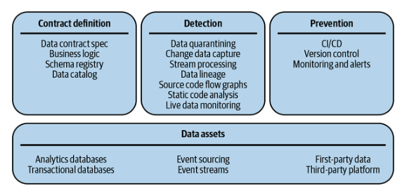
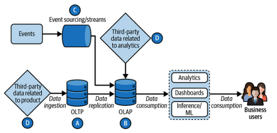
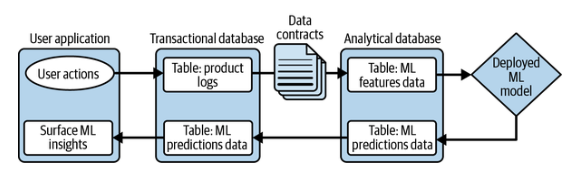
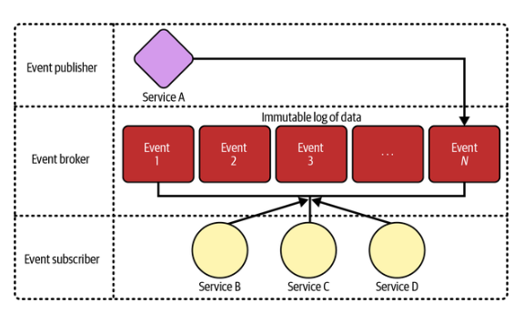
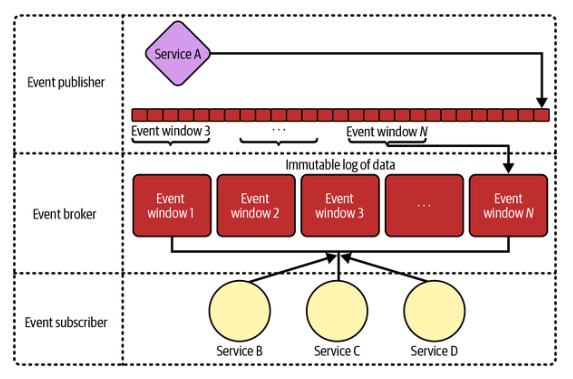
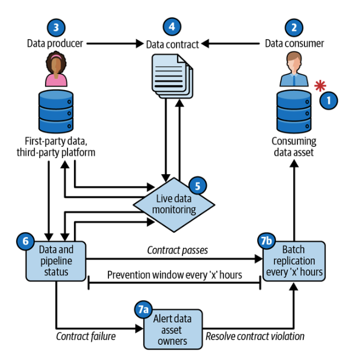
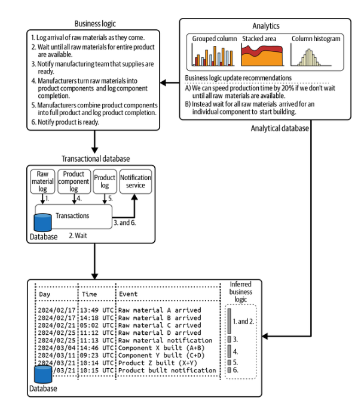
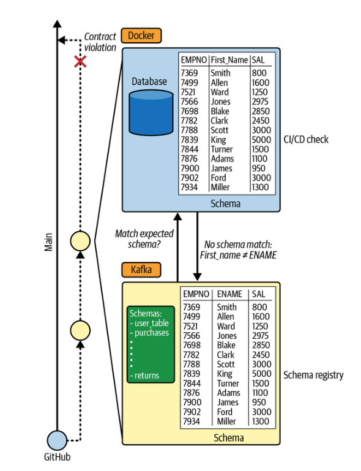
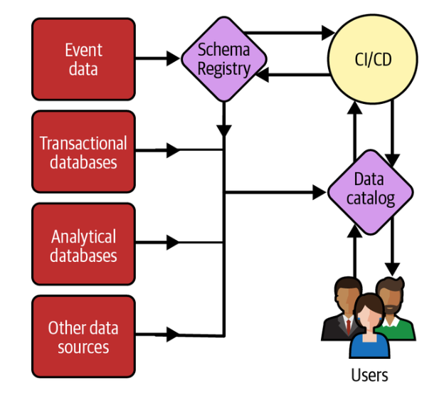

# Capítulo 5. Los componentes del contrato de datos: activos de datos y definición del contrato

En los capítulos 1 a 5 analizamos los contratos de datos desde una perspectiva teórica, y en el capítulo 6 pasaremos a aplicar los contratos de datos en un proyecto real. Concretamente, en los capítulos 6 y 7 proporcionaremos los componentes de los contratos de datos y nuestras herramientas de código abierto preferidas para implementarlos. En el capítulo 8, partiremos de los capítulos 6 y 7 con un proyecto guiado que une estos componentes de código abierto para crear la arquitectura de los contratos de datos. Te recomendamos encarecidamente que consultes nuestro repositorio público de GitHub, que complementa estos capítulos y te guía a través de la implementación técnica.

Comencemos con nuestra descripción general de los componentes de los contratos de datos.

## Descripción general de los componentes

Lo que hace que los contratos de datos ( ) sean tan potentes es también lo que hace que sea difícil que se adopten más allá del equipo de datos. El poder de los contratos de datos radica en que están diseñados para unir a equipos y disciplinas de toda la empresa, al tiempo que se integran perfectamente en las herramientas y los flujos de trabajo individuales en todas las etapas del ciclo de vida de los datos. Por lo tanto, la arquitectura de los contratos de datos requiere el uso de un conjunto de herramientas de infraestructura, en el que los componentes se pueden dividir en cuatro categorías principales y sus respectivas subcategorías, como se ilustra en la figura 5-1.

> **Nota**

> En este capítulo solo trataremos en profundidad los activos de datos y la definición de contratos, pero ofreceremos una visión general de alto nivel de todos los componentes para que quede claro cómo encajan todos ellos en el panorama general. El capítulo 6 tratará los componentes restantes de detección y prevención.



Veamos cada uno de los componentes básicos con un poco más de detalle :

_Activos de datos_

La base de toda infraestructura de datos son las bases de datos y, aunque la variedad de bases de datos es muy amplia, en este libro nos centraremos en las cuatro categorías siguientes:

- Bases de datos analíticas

- Bases de datos transaccionales

- Event sourcing y flujos de eventos

- Datos propios, plataforma de terceros

_Definición de contratos_

La superficie para integrar las expectativas en torno al esquema y la lógica empresarial (es decir, la semántica) de un activo de datos respectivo, que luego se compara con fuentes centralizadas de metadatos. Los tres componentes son los siguientes:

- Especificaciones del contrato de datos

- Lógica empresarial

- Registro de esquemas y catálogos de datos

_Detección_

La detección debe realizarse a nivel de código para el esquema y en tiempo de ejecución para la semántica de los datos, a fin de garantizar que se capturen los cambios, idealmente antes de que los datos se escriban en la base de datos de destino. Las siguientes siete categorías representan las áreas en las que puedes detectar cambios en los datos:

- Cuarentena de datos

- Captura de datos modificados

- Procesamiento de flujos

- Gráficos de flujo de código fuente

- Linaje de datos

- Análisis de código estático

- Monitoreo de datos en tiempo real

_Prevención_

Aunque lo ideal es que la prevención sea automática a la hora de gestionar las infracciones de los contratos, esto no es posible dado que la naturaleza de muchos problemas de calidad de los datos tiene su origen en las personas y los procesos. Por lo tanto, la automatización consiste en alertar a las personas adecuadas en el momento oportuno dentro del flujo de trabajo de los desarrolladores. Las tres categorías siguientes son las más habituales en las que se puede informar a alguien de posibles cambios importantes:

- Flujos de trabajo de CI/CD

- Control de versiones (revisión del código de datos)

- Monitoreo y alertas

Aunque se trata de bastantes componentes, muchos de ellos ya se utilizan en el software y la infraestructura de datos, por lo que, en su mayoría, estamos reutilizando la infraestructura existente y/o añadiendo flujos de trabajo adicionales.

Comenzaremos nuestro análisis en profundidad de cada componente analizando más detenidamente los activos de datos.

## Activos de datos

En el capítulo 4, la figura 4-7 destacaba las consideraciones e es para implementar contratos de datos en los distintos puntos de contacto del ciclo de vida de los datos. En la figura 5-2 presentamos una iteración de ese diagrama, en la que profundizamos en las cuatro categorías de activos de datos: bases de datos transaccionales (A), bases de datos analíticas (B), datos de eventos (C) y datos propios dentro de plataformas de terceros (D).



### Bases de datos analíticas

Los desarrolladores de datos suelen trabajar con bases de datos analíticas, dado su papel central en el análisis (como su nombre indica), el aprendizaje automático y la inteligencia artificial, y almacenan los datos subyacentes de los paneles de control que se presentan a las partes interesadas no técnicas de la empresa. Las bases de datos analíticas pueden incluir almacenes de datos, lagos de datos, casas de lagos de datos y otras variaciones en las que se hace hincapié en la capacidad de escanear y agregar grandes cantidades de datos. Además, el rendimiento se centra en la calidad y la fiabilidad de los datos, más que en el tiempo de respuesta; por ejemplo, procesar una consulta SQL de extensión en minutos en comparación con recuperar un punto de datos específico en fracciones de segundo. Dada esta distinción, los contratos de datos resultan muy útiles para mantener la fiabilidad y la calidad de los datos dentro de una base de datos analítica.

Mientras que las primeras implementaciones de bases de datos analíticas se centraban principalmente en almacenes de datos de tipo « » —orientados a temas, integrados, variables en el tiempo y no volátiles—, el auge de las herramientas de big data (por ejemplo, Google File System y Hadoop) cambió estas premisas, y la pila de datos moderna consolidó aún más este cambio. Concretamente, MDS se basa en gran medida en ELT, donde se implementan transformaciones mínimas o nulas para que los datos ascendentes sean útiles para el análisis. Esto ha dado lugar a que las bases de datos analíticas se conviertan en vertederos de datos para toda la empresa, a través de la replicación, con la esperanza de que algún día los datos puedan llegar a ser valiosos. En realidad, esto hace que el pequeño porcentaje de datos que son realmente valiosos para la empresa sea mucho más complejo de utilizar y más difícil de encontrar, como una aguja en un pajar. En el capítulo 8, ofrecemos casos prácticos reales en los que varias empresas están introduciendo datos por lotes y en streaming en los pipelines post-ELT del lago de datos y analizamos cómo este patrón plantea retos a gran escala (a pesar de la gran utilidad de los lagos de datos).

Muchos equipos de datos suelen poner un parche al problema creando numerosas capas de transformaciones « » (crear, transformar, almacenar) a través de dbt para iterar rápidamente y aportar valor al negocio, pero esto no resuelve el problema de fondo. Concretamente, las bases de datos analíticas modernas no se adhieren a la no volatilidad, lo que hace que estas capas de transformación sean frágiles. Por ejemplo, una tabla ascendente que se replica en la base de datos analítica tiene un cambio de esquema, lo que provoca que todas las transformaciones descendentes posteriores se rompan.

Este reto se ve aún más agravado por el aumento de tamaño tanto de los equipos como de la infraestructura, donde el número de supuestos y dependencias crece exponencialmente (como se destaca en el capítulo 3). Mark lo experimentó de primera mano al supervisar la base de datos analítica en una startup de tecnología de recursos humanos. Cuando te contrataron inicialmente para el equipo de ciencia de datos, era relativamente fácil gestionar la base de datos analítica, ya que su uso se limitaba a unas pocas personas del equipo de datos y el equipo de ingeniería upstream estaba bajo la dirección de un solo responsable. Dos años más tarde, la base de datos analítica era utilizada por un equipo de datos que había duplicado su tamaño, alimentaba la mayoría de los paneles de control utilizados por la empresa y la ingeniería se había dividido en tres equipos diferentes. Lo que antes era un simple conjunto de tablas se había convertido en un sistema complejo que dependía de tres equipos diferentes, daba soporte a numerosas iniciativas de I+D y flujos de trabajo analíticos entre el equipo de ciencia de datos, y era motivo de controversia entre los usuarios empresariales que recibían datos erróneos en sus paneles de control. Si bien nuestros flujos de trabajo manuales en la base de datos analítica eran suficientes en la etapa inicial, nuestra capacidad para mantenerlos se vio afectada a medida que crecíamos.

Aunque estos problemas de escalabilidad eran un reto, forman parte de los dolores de crecimiento de una organización en evolución. A medida que aumenta el número de dependencias de un activo de datos, también lo hace la conciencia de los distintos casos de perímetro y problemas de calidad de los datos entre las partes interesadas de la empresa. No se trata de si surgirá un problema con los datos, sino de cuándo surgirá, y el aumento del alcance conlleva una mayor probabilidad de que se pongan de relieve los problemas. Aunque es doloroso lidiar con ellos, estos problemas sirven como prueba de fuego para determinar si los datos subyacentes se ajustan a las expectativas de las partes interesadas del negocio, especialmente cuando son expertos en la materia (por ejemplo, un médico que revisa datos clínicos). Concretamente, estos casos permiten saber si las transformaciones posteriores del equipo de datos son erróneas, si los datos iniciales se están capturando de forma incorrecta o si las hipótesis subyacentes de los flujos de datos no se ajustan a la realidad que representan los datos. Todo ello hace que los contratos de datos sean útiles tanto para documentar la lógica empresarial como para aplicar automáticamente esas restricciones a medida que surgen problemas e es.

### Bases de datos transaccionales

Mientras que los desarrolladores de datos es trabajan con bases de datos analíticas, los desarrolladores de software suelen trabajar con bases de datos transaccionales, ya que estas son las más pertinentes para las capas de aplicaciones y servicios de la mayoría de las empresas. Como se menciona en el capítulo 1, estas bases de datos transaccionales se centran en operaciones CRUD, el cumplimiento de ACID y datos en forma normalizada de tercer grado, lo que permite una recuperación de información ultrarrápida (por ejemplo, acciones en sitios web que tardan menos de un segundo). Y lo que es más importante, las bases de datos transaccionales son el lugar donde las empresas capturan «instantáneas de la verdad», como registros de productos e información de usuarios (es decir, el punto B de la figura 5-2). Por eso las bases de datos transaccionales son el lugar ideal para los contratos de datos: son la fuente de datos más upstream que controla una organización, dado que las bases de datos analíticas suelen ser réplicas. El reto es que la calidad de los datos transaccionales no es una prioridad para muchos equipos de ingeniería de software, ya que sus limitaciones giran en torno al mantenimiento del código y no a los datos subyacentes. Por lo tanto, una iniciativa de contratos de datos dejaría de ser prioritaria a menos que la impulsara el propio equipo de ingeniería.

Profundizar en el concepto de ACID ( ) es esencial para comprender la importancia de los contratos de datos en el mantenimiento de la calidad de los datos. ACID son las siglas de atomicidad, consistencia, aislamiento y durabilidad, pero el énfasis de los contratos de datos se centrará en la consistencia por la siguiente razón, destacada en el libro de Martin Kleppmann Designing Data-Intensive Applications (O'Reilly):

_Esta idea de coherencia depende de la noción de invariantes de la aplicación [es decir, condiciones verdaderas sobre tus datos], y es responsabilidad de la aplicación definir correctamente sus transacciones para que mantengan la coherencia. Esto no es algo que la base de datos pueda garantizar: si escribes datos incorrectos que violan tus invariantes, la base de datos no puede detenerte. (Algunos tipos específicos de invariantes pueden ser verificados por la base de datos, por ejemplo, utilizando restricciones de claves externas o restricciones de unicidad. Sin embargo, en general, la aplicación define qué datos son válidos o no válidos; la base de datos solo los almacena)._

_La atomicidad, el aislamiento y la durabilidad son propiedades de la base de datos, mientras que la coherencia (en el sentido ACID) es una propiedad de la aplicación. La aplicación puede basarse en las propiedades de atomicidad y aislamiento de la base de datos para lograr la coherencia, pero no depende únicamente de la base de datos._

Una excelente manera de pensar en las invariantes de los datos intensivos en una base de datos es plantearse la pregunta «¿Quién es un cliente?».

- ¿Es una empresa con un contrato activo con la organización?

- ¿Es una empresa que ha tenido algún contrato con la organización?

- ¿Es una empresa que no tiene contrato pero que ha realizado pagos mensuales actualizados?

Como puedes ver, el problema está en los detalles de lo que exactamente debe permanecer coherente dentro de tu base de datos de datos intensivos, y los contratos de datos son los más adecuados para mantener estas restricciones a medida que evoluciona el negocio (y, en última instancia, las invariantes).

Un excelente ejemplo real de esto proviene de los cientos de llamadas que hemos recibido de empresas interesadas en los contratos de datos. Una empresa de aplicaciones para consumidores partía de la hipótesis de que su negocio sería de empresa a consumidor (B2C), por lo que esta hipótesis se incorporó en todos los ámbitos, desde la arquitectura del software hasta las bases de datos y la documentación. Sin embargo, unos 10 años más tarde, la empresa se dio cuenta de que necesitaba ampliar su oferta a las empresas, por lo que pasó a ser de empresa a empresa (B2B), además de B2C. En otras palabras, su invariante de «cada cliente y usuario individual es una relación uno a uno» dejó de ser cierta, ya que los usuarios podían cambiar rápidamente entre cuentas individuales y empresariales (por ejemplo, un autónomo que se une a una empresa con un contrato de tres meses). Los 10 años de supuestos y arquitectura que impulsaban los ingresos se convirtieron rápidamente en deuda tecnológica y de datos con una sola decisión empresarial importante, lo que provocó la imposibilidad de facturar adecuadamente a los clientes y, por lo tanto, una pérdida de ingresos. Así, la empresa exploró los contratos de datos como una vía para poner barreras de seguridad en su sistema de datos, ya que llevó a cabo una importante refactorización (véase el capítulo 3). Al establecer contratos para el estado final deseado de los datos (por ejemplo, pasar de incluir solo a consumidores a incluir también a clientes empresariales), la empresa pudo identificar en qué parte de la base de datos transaccional se infringían estos contratos de forma e e y repetir el proceso hasta que las infracciones dejaron de existir.

Además de las operaciones CRUD, las bases de datos transaccionales también sirven como punto de ingestión de datos de terceros relevantes para la capa de aplicación (es decir, el punto A de la figura 5-2). Por ejemplo, como se ha señalado anteriormente, Mark trabajó anteriormente en una startup de tecnología de recursos humanos que ingestaba datos demográficos confidenciales de los empleados proporcionados directamente por sus respectivos clientes empresariales. Una consideración clave a lo largo de este flujo de trabajo era: ¿cómo podemos gestionar los diferentes patrones de carga de datos de los clientes? Aunque es poco probable que puedas imponer un contrato de datos a un tercero, debido a la falta de influencia (por ejemplo, un cliente empresarial importante no está dispuesto a cambiar), los contratos de datos son muy útiles entre la preparación de los datos sin procesar y la ingesta en la base de datos transaccional.

En el caso de uso de RR. HH. de Mark, los clientes proporcionaban los datos en forma de archivos CSV manuales, protocolo de transferencia segura de archivos o una API directa, todos ellos proporcionados en intervalos variables, como diarios, mensuales o trimestrales. Esto acabó causando dolorosos problemas de calidad de los datos, ya que los datos de los empleados determinaban los organigramas y el estatus de los directivos, que eran factores clave para las características del producto. Tuvimos que lidiar con problemas como: ¿por qué falta un archivo? ¿El cliente pasó de intervalos diarios a mensuales? ¿Cambiaron el formato del archivo CSV? Estos cambios inesperados crearon problemas de calidad de los datos visibles en la aplicación y dieron lugar a que el equipo de ingeniería dedicara una gran cantidad de tiempo a depurar problemas en la base de datos transaccional, corregir manualmente los datos de terceros y realizar rellenos. En esta situación, los contratos de datos permitirían:

- Documentación de los flujos de trabajo diferenciales de los activos de datos de terceros subyacentes

- Evitar que los datos que infringen un contrato entren en la base de datos transaccional y creen problemas de calidad de los datos orientados al cliente en la aplicación

- Registro de los patrones de incumplimiento de los contratos de los datos de terceros proporcionados, que el equipo comercial puede utilizar para destacar ante los clientes el impacto de proporcionar datos de mala calidad

No es de extrañar que hayamos hablado con numerosas empresas que experimentan dificultades con los proveedores de datos de terceros y consideren los contratos de datos como una vía para aliviar su problema.

Por último, un patrón menos robusto pero más sencillo de implementar consiste en devolver los resultados de los productos de datos de la base de datos analítica a la base de datos transaccional (es decir, el punto F de la figura 4-6). Con la categoría emergente de la IA generativa, esperamos que este patrón crezca considerablemente a medida que más empresas amplíen sus casos de uso de la IA. Un buen ejemplo de ello es el patrón de diseño de «predicción por lotes» para modelos de aprendizaje automático, como se destaca en la figura 5-3.



Ya existe una gran cantidad de bibliografía sobre el aprendizaje automático (que queda fuera del alcance de este libro), pero el lugar donde encajan los contratos de datos en este caso de uso es entre la replicación de un activo de datos entre las bases de datos analíticas (OLAP) y transaccionales (OLTP). En otras palabras, se desarrolló un «producto de datos» utilizando los activos de la base de datos analítica, y ahora la base de datos transaccional tiene una gran dependencia de este producto de datos para las superficies de cara al cliente. Algunas consideraciones son las siguientes:

- ¿Es adecuado el formato de salida de este producto de datos para la base de datos transaccional?

- ¿Se sobrescribirían o se añadirían los nuevos datos de los mismos usuarios?

- ¿Qué ocurre si el monitoreo del aprendizaje automático señala resultados con poca capacidad predictiva?

- ¿Se va a versionar el activo de datos de predicción con las versiones del modelo de aprendizaje automático que lo acompañan?

- ¿Existen requisitos normativos para los datos de predicción (por ejemplo, datos sanitarios o financieros)?

Al establecer restricciones entre la base de datos analítica y la base de datos transaccional, las organizaciones pueden garantizar que los datos mantengan las expectativas antes de llegar a las superficies de interacción con el cliente ( ).

### Origen de eventos y flujos de eventos

La arquitectura basada en eventos (EDA) es un tema muy denso en materia de e es que merece un libro completo en sí mismo, por lo que, en aras de la brevedad, nos centraremos principalmente en dos aspectos: 1) el origen de eventos y 2) los flujos de eventos y su relación con los contratos de datos. Para un análisis más profundo sobre el streaming, recomendamos encarecidamente leer el capítulo 11 del libro Designing Data-Intensive Applications, de Kleppmann.

Lo mejor es entender el streaming de datos e es en relación con los datos por lotes, que proporcionan volcados de datos del sistema A al sistema B en intervalos predeterminados (por ejemplo, un día). Este enfoque es el más sencillo y el que muchos equipos de datos utilizan por defecto. Sin embargo, hay casos en los que un intervalo de tiempo fijo no se adapta al caso de uso, como el seguimiento de cambios cuando se producen en tiempo real o cuando hay un gran volumen de datos en un breve periodo de tiempo (por ejemplo, datos de telemetría). En estos casos de uso, se justifica la complejidad adicional de EDA. Entre los ejemplos de esta complejidad adicional, y por lo tanto de problemas de calidad de los datos, se incluyen:

_Condiciones de carrera y concurrencia_

Las múltiples escrituras conflictivas en la base de datos provocan sobrescrituras erróneas, lo que da lugar a que los datos de destino se desincronicen.

_Tolerancia a fallos y durabilidad_

Capacidad de un sistema para tener en cuenta que un nodo se desconecta y, por lo tanto, se pierden datos (por ejemplo, computación distribuida).

_Retención_

¿Cuánto tiempo deben conservarse los datos dentro de un flujo para garantizar su precisión sin causar problemas de memoria?

_Latencia_

Ventana de tiempo aceptable que pueden representar los datos (por ejemplo, segundos frente a milisegundos).

Ten en cuenta que, aunque estos retos pueden estar presentes en los procesos por lotes, son más pronunciados en el streaming.

Estas consideraciones nos llevan a las diferencias entre el abastecimiento de eventos y los flujos de eventos que se destacan en la Tabla 5-1. Chad utilizó ambos en una empresa anterior, como se describe con más detalle en sus artículos «An Engineer’s Guide to Data Contracts» (Guía de un ingeniero para los contratos de datos), parte 1 y parte 2.

Tabla 5-1. Comparación entre el origen de eventos y la transmisión

|                   | Origen de eventos                                                                                                                                                                                                          | Transmisión de eventos                                                                                                                                                          |
| ----------------- | -------------------------------------------------------------------------------------------------------------------------------------------------------------------------------------------------------------------------- | ------------------------------------------------------------------------------------------------------------------------------------------------------------------------------- |
| Caso de uso       | Registro inmutable que tiene todos los eventos registrados añadidos al registro                                                                                                                                            | Gran volumen de datos capturados en intervalos de tiempo establecidos (es decir, «ventanas»).                                                                                   |
| Ejemplos de datos | Actualizaciones de la información demográfica de los usuarios que vos mismos proporcionáis en una aplicación<br>Transacciones de carritos de compra en línea<br>Estado de los envíos a lo largo de la cadena de suministro | Datos de telemetría para dispositivos<br>Transacciones financieras de gran volumen (por ejemplo, el mercado de valores)<br>Seguimiento de clics en un sitio web de alto tráfico |

Aunque hay numerosas formas de implementar EDA, recomendamos encarecidamente el patrón de publicación-suscripción para la implementación de contratos de datos. Apache Kafka es un ejemplo de herramienta de código abierto que lo permite. Con este patrón, se dispone de un servicio que envía eventos, un agente de mensajes que gestiona estos eventos y, en esencia, proporciona un búfer, y un conjunto de suscriptores de eventos que leen desde el agente. La diferencia entre el origen de eventos y los flujos radica en cómo se utiliza el agente de eventos. Como se ilustra en la figura 5-4, el origen de eventos crea un registro inmutable de cada evento del servicio de publicación de eventos, como por ejemplo las actualizaciones del estado de los envíos a lo largo de una cadena de suministro.



Lo que lo hace tan potente desde el punto de vista de la calidad de los datos es que el registro inmutable puede recrear bases de datos e historiales de eventos en caso de que se caiga una base de datos descendente. Además, diferentes consumidores descendentes pueden utilizar el registro para sus respectivos casos de uso, como el análisis de todos los registros de un historial o una aplicación orientada al usuario que solo muestra el registro más reciente en la interfaz de usuario. Volviendo al ejemplo de la cadena de suministro, es posible que el equipo de análisis quiera saber el tiempo medio de espera de los envíos entre cada paso de la cadena de suministro, mientras que un usuario final solo quiera saber dónde se encuentra el envío en ese momento.

Aunque el abastecimiento de eventos y la transmisión tienen muchas similitudes, hay casos en los que crear un registro inmutable de cada evento es inviable y daría lugar a un error de memoria insuficiente o a una factura de servicio en la nube muy elevada. En los casos en los que hay un gran volumen de datos (por ejemplo, datos de telemetría), se aprovecha el windowing para capturar un registro de datos en intervalos de tiempo establecidos (por ejemplo, cada segundo), como se ilustra en la figura 5-5. Aunque no se capturan todos los datos, sus tendencias y patrones generales pueden agregarse en un único valor en un registro, que luego sigue un patrón similar al de un búfer a través del agente de eventos y un consumidor de datos a través de los suscriptores de eventos. Por ejemplo, un equipo de ingeniería de fiabilidad del sitio podría calcular las métricas de salud del sitio cada segundo durante los últimos 10 segundos de datos para obtener una imagen continua y actualizada del rendimiento del sitio.



A menudo, las organizaciones emplean tanto el abastecimiento de eventos como la transmisión en la misma pila de datos. Además, el EDA se vuelve más común a medida que una organización crece y aumenta la madurez de los datos. En su anterior puesto en una startup, Mark logró la replicación de una base de datos transaccional a una base de datos analítica mediante cargas diarias por lotes. Al principio, las operaciones por lotes eran ligeras y fiables, pero esto cambió cuando la empresa aumentó el número de clientes empresariales. Las operaciones por lotes, que antes eran sencillas, tardaban horas en ejecutarse, los errores en el proceso provocaban fallos en los trabajos, lo que daba lugar a datos obsoletos, y el lote sustituía por completo la tabla. El último punto de las sustituciones era el más problemático, ya que los cambios radicales en el esquema y la semántica se propagaban a la base de datos analítica y requerían horas de relleno. Esto provocaba que el equipo de ciencia de datos se viera paralizado en su trabajo durante días o semanas, y estaba claro que había llegado el momento de empezar a pagar la deuda técnica que se había adquirido a cambio de una solución inicialmente más sencilla (y acertada en ese momento). El equipo consideró seriamente el event sourcing a través de la captura de datos de cambio, ya que permitiría la integridad transaccional y les permitiría pasar de trabajos por lotes de varias horas a actualizaciones incrementales de e s en la base de datos analítica.

### Datos propios, plataforma de terceros

Normalmente, no se pueden imponer contratos de datos a terceros debido a la falta de influencia, pero hay un caso extremo en el que esto no se aplica: los casos en los que los datos son propios y se puede controlar el modelo de datos subyacente, pero la plataforma en la que se almacenan y procesan los datos es de terceros. Algunos ejemplos de esto son los programas de gestión de relaciones con los clientes, como HubSpot y Salesforce, o los programas de planificación de recursos empresariales (ERP), como SAP. Estas fuentes de datos suelen ser críticas para el negocio y muchas son anteriores a la implementación de bases de datos analíticas, por lo que incorporan una enorme cantidad de lógica empresarial sin tener en cuenta un modelo de datos subyacente. Aunque estos sistemas no tienen el mismo nivel de personalización que una base de datos tradicional, los objetos de datos subyacentes pueden modificarse y replicarse en la base de datos analítica de una organización (véase el punto D de la figura 5-2), normalmente mediante trabajos por lotes.

Por ejemplo, en un puesto anterior, Mark replicó los datos de Salesforce en BigQuery utilizando la herramienta ELT Fivetran. A continuación, generó informes que vinculaban el uso de los productos, los datos de seguimiento del tiempo y el volumen y la salud de las operaciones con los clientes (de Salesforce) para ayudar a reasignar los recursos de personal dentro del equipo de éxito del cliente, con el objetivo final de optimizar el número de horas de trabajo de los empleados dedicadas por dólar de ingresos recurrentes anuales (ARR).

Dada la naturaleza de las plataformas de terceros, los flujos de trabajo de CI/CD no suelen ser posibles, por lo que la prevención pasa de evitar infracciones en los datos de origen a evitar que las infracciones de los datos de origen se repliquen en una base de datos de destino. La figura 5-6 ilustra esto, concretamente los pasos 6, 7a y 7b, donde hay una ventana de prevención entre la preparación y la ejecución de la replicación de datos en la base de datos de destino.



Así es como se ve este proceso en detalle :

1. Restricciones de datos identificadas por el consumidor de datos.

2. El consumidor de datos solicita un contrato de datos para un activo.

3. El productor de datos confirma que el contrato de datos es viable.

4. Contrato de datos confirmado como código.

5. Monitoreo continuo de los datos y los contratos pertinentes.

6. Cola de trabajos de replicación por lotes.

7. Dependiendo de si el contrato se aprueba o se rechaza:

    a. Se notifica a los propietarios de los activos de datos el incumplimiento del contrato de datos para un trabajo por lotes y se sigue el protocolo de fallo.

    b. Los activos de datos se actualizan para los procesos posteriores cuando el contrato de datos supera las pruebas del trabajo por lotes.

> **Nota**

> La figura 4-4 ayuda a visualizar mejor la diferencia entre los casos de uso de datos propios y plataforma frente a datos propios y plataforma de terceros.

En el ejemplo de Mark sobre la optimización de las horas de los empleados y los ingresos anuales recurrentes (ARR), había una ventana de una semana (es decir, 168 horas) en la que los datos incorrectos de Salesforce podían llegar al flujo de trabajo de generación de informes y alterar erróneamente las decisiones empresariales relacionadas con los ingresos. Sin contratos de datos, estos problemas suelen pasar desapercibidos hasta que un interesado de la empresa, gracias a su experiencia en el sector, se da cuenta de que las cifras no cuadran. Los contratos de datos sirven como mecanismo para sacar a la luz el problema dentro del plazo de prevención e implementar una solución o bloquear la replicación antes de que llegue a la base de datos de destino (como se ilustra en la figura 5-6).

En esta sección hemos tratado las cuatro categorías de activos de datos con las que probablemente te encontrarás al considerar los contratos de datos, y dónde colocarlos. En la siguiente sección, ampliaremos el uso de los metadatos para alinear las expectativas con los activos de datos a través de las especificaciones de los contratos de datos.

## Definición del contrato

Ahora que sabemos qué activos de datos queremos incluir en el contrato, debemos establecer nuestras expectativas como código a través de una especificación de contrato, codificar la lógica empresarial dentro de la especificación del contrato y comparar las expectativas dentro de la especificación del contrato con los metadatos de los activos de datos incluidos en el contrato a través de registros de esquemas y/o catálogos de datos. En esta sección se detallan cada uno de estos aspectos y las diversas consideraciones que debes tener en cuenta.

### Especificaciones de los contratos de datos

En nuestras conversaciones sobre e o con profesionales, una pregunta común pero fuera de lugar gira en torno a la estandarización de las especificaciones de los contratos de datos. Si bien las especificaciones son un componente integral de los contratos de datos, son una herramienta para ayudar a implementar la arquitectura de los contratos de datos; las especificaciones no son un contrato de datos en sí mismas. Una analogía sería la pregunta: «¿Qué base de datos debemos utilizar para implementar un data lakehouse?». Independientemente de si se trata de Snowflake, Databricks, BigQuery, etc., lo único que importa es lo que tienes disponible y lo que funciona para tu caso de uso empresarial.

En el momento de escribir este artículo, existen especificaciones de contratos de datos de código abierto, pero no se han adoptado de forma generalizada. En nuestras conversaciones con las empresas, muchas de ellas están desarrollando sus propias especificaciones para abordar los matices únicos de sus sistemas de datos. A medida que este patrón arquitectónico se vaya adoptando y madurando, prevemos que surgirán varios formatos estandarizados como opciones populares. Sin embargo, el objetivo de este libro no es recomendar un formato específico, sino detallar los mecanismos subyacentes, independientemente de la especificación utilizada. Un cómic clásico de xkcd (927) ilustra aún más por qué orientarte hacia una especificación concreta es una tarea inútil.

Para crear tu propia especificación de contrato de datos, te recomendamos utilizar JSON Schema, «un lenguaje declarativo para definir la estructura y las restricciones de los datos JSON», y combinándolo con YAML. Además, JSON Schema también forma parte de un ecosistema más amplio de herramientas que amplían su potencia, como validadores para varios lenguajes y bases de datos. Este capítulo solo ofrece una visión general de alto nivel, pero proporcionaremos más detalles y código en el capítulo 8.

Las consideraciones clave de una especificación de contrato de datos incluyen lo siguiente:

- Capacidad de ser tecnológicamente agnóstico para permitir la integración en todo el ciclo de vida de los datos.

- Capacidad para describir las expectativas de un activo de datos en un formato legible para los humanos, de ahí que YAML sea un formato común.

- Capacidad para cubrir tanto el esquema de los datos como la semántica.

- Capacidad para que la especificación del contrato en sí misma tenga versiones semánticas, ya que los contratos tendrán que evolucionar con el tiempo.

- Capacidad para tener en cuenta la heterogeneidad de las formas en que las tecnologías definen o restringen los datos (por ejemplo, la tipificación obligatoria en JavaScript frente a la tipificación opcional en Python).

Aquí tienes una especificación de contrato de datos de nuestra implementación en el capítulo 7 que utiliza una base de datos Postgres para almacenar información relativa a objetos de museo. Ten en cuenta que, aunque utilizamos JSON Schema, JSON y YAML se pueden convertir fácilmente uno a uno:

```JSON
{
    "spec-version": "1.0.0",
    "name": "object-images-contract-spec",
    "namespace": "met-museum-data",
    "dataAssetResourceName": "postgresql://postgres:5432/postgres.object_images",
    "doc": "Data contract for the object_images table containing image URLs and
metadata for museum objects, including primary images, additional images, and
creation timestamps.",
    "owner": {
      "name": "Data Engineering Team",
      "email": "data-eng@museum.org"
    },
    "schema": {
      "$schema": "https://json-schema.org/draft/2020-12/schema",
      "title": "Object Images Table Schema",
      "table_catalog": "postgres",
      "table_schema": "public",
      "table_name": "object_images",
      "properties": {
        "object_id": {
          "description": "Identifying number for each artwork (unique, can be
used as key field)",
          "examples": [437133],
          "constraints": {
            "primaryKey": true,
            "data_type": "integer",
            "numeric_precision": 32.0,
            "is_nullable": false,
            "is_updatable": true
          }
        },
        "primary_image": {
          "description": "URL to the primary image of an object (JPEG)",
          "examples": ["https://images.metmuseum.org/.../DT1234.jpg"],
          "constraints": {
            "primaryKey": false,
            "data_type": "text",
            "is_nullable": true,
            "is_updatable": true
          }
        },
        "additional_images": {
          "description": "Array of URLs to additional JPEG images of the
object",
          "constraints": {
            "primaryKey": false,
            "data_type": "ARRAY",
            "is_nullable": true,
            "is_updatable": true
          },
          "array_element": {
            "data_type": "text"
          }
        },
        "created_at": {
          "description": "Timestamp when this record was created in the
database",
          "examples": ["2025-01-15T10:30:00.000Z"],
          "items": null,
          "constraints": {
            "primaryKey": false,
            "data_type": "timestamp without time zone",
            "datetime_precision": 6.0,
            "is_nullable": false,
            "is_updatable": true
          }
        }
      }
    }
  }
```

En las subsecciones siguientes, desglosaremos esta especificación de contrato en sus componentes clave: gestión de contratos de , esquema de datos y semántica de datos.

#### Gestión de contratos

La clave para una infraestructura como código e e es la capacidad de gestionar los metadatos que se almacenan (es decir, los metametadatos) y realizar un seguimiento de sus cambios a medida que evolucionan inevitablemente. Aunque técnicamente esto se puede rastrear a través de `git blame` y el historial controlado por versiones, eso solo satisface parcialmente los requisitos necesarios de un contrato de datos. Además, debemos ser capaces de crear automatizaciones sobre la base de estos cambios, de ahí los siguientes valores:

`spec-version`

La versión de la especificación del contrato de datos utilizada en tu sistema, donde este valor cambiará con cada iteración de la estructura de la especificación a medida que tu caso de uso cambie o se vuelva más complejo (por ejemplo, al añadir más restricciones semánticas).

`name`

El nombre definido por el usuario del contrato de datos correspondiente, donde el nombre y el espacio de nombres forman un identificador único combinado.

`namespace`

Un nombre definido por el usuario que representa una colección de contratos de datos, similar a una «carpeta» de nivel superior dentro de un repositorio.

`dataAssetResourceName`

La ruta URL de la fuente de datos bajo contrato, donde se alinea con el patrón de nomenclatura de la fuente de datos (por ejemplo, `s3://<your path>/<your file name>` o `postgres://db/<database-name>`).

`doc`

La documentación que describe lo que representa y aplica el contrato de datos, así como cualquier otra información pertinente.

`owner`

El propietario asignado (ya sea una persona o un grupo) del contrato de datos y la información de contacto utilizada para notificar cuando se incumple un contrato, cuando es necesario realizar un cambio o si una persona está tratando de determinar un punto de contacto para obtener más contexto:

```JSON
{
    "spec-version": "1.0.0",
...
    "owner": {
        "name": "Data Engineering Team",
        "email": "data-eng@museum.org"
    }
...
}
```

Aunque creemos que estos son los componentes esenciales para la gestión de contratos, puede haber valores adicionales que sean pertinentes para tu caso de uso empresarial específico.

#### Esquema de datos

La aplicación de los esquemas de datos será probablemente el primer caso de uso que se implemente en el proceso de contrato de datos de una empresa y protegerá los cambios ascendentes más obvios, pero también los más desastrosos. Cuando utilices JSON Schema como lenguaje subyacente, tendrás que asignar los tipos de datos a tu estándar y/o utilizar las extensiones disponibles para otros lenguajes (por ejemplo, Go, Rust, etc.). El esquema JSON estándar incluye lo siguiente:

- `string`

- `number`

- `integer`

- `object`

- `array`

- `boolean`

- `null`

Además de esos tipos estándar, también es beneficioso habilitar los tipos « `optional` » y « `union` » para manejar casos de uso de tipos más complejos, como cuando un valor « `null` » es válido para un valor « `string` ». Por ejemplo:

```YML
schema:
  - name: aquarium_id
    doc: The id of the aquarium
    type: string32
  - name: exhibit_id
    doc: (Optional) The id of an exhibit within a specific aquarium.
    type: union
    types: ['null', 'string32']
  - name: exhibit_status
    doc: The status of the aquarium exhibit.
    type: enum
    symbols: ['OPEN', 'CLOSED', 'MAINTENANCE', 'FEEDING']
  - name: exhibit_location
    doc: (optional) The location of an aquarium exhibit.
    type: union
    types:
      - type: 'null'
      - type: struct
        alias: Location
        name: location
        doc: A geographic location
        fields:
          - name: latitude
            doc: The latitude of the location
            type: float64
          - name: longitude
            doc: The longitude of the location
            type: float64
  - name: last_exhibit_update_time
    doc: >
     The last known real-time update from the aquarium exhibit status
     (in milliseconds since the Unix epoch)
    type: date64
```

#### Semántica de datos

A medida que una empresa avanza en sus casos de uso de contratos de datos, es posible que desee implementar restricciones más allá del esquema y en los datos subyacentes, así como utilizar condiciones if-else específicas basadas en múltiples valores de datos. JSON Schema admite esto a través de la composición de esquemas y subesquemas:

```YML
schema:
  - name: aquarium_id
    constraints:
      - charLength: 32
      - isNull: FALSE
      - isNotEmpty: TRUE
  - name: exhibit_id
    constraints:
      - isNullThreshold: 0.8
  - name: exhibit_status
    constraints:
      - isNullThreshold: 0.3
      - length: 1
  - name: exhibit_location
    types:
      - name: location
        fields:
          - name: latitude
            constraints:
              - isNull: False
          - name: longitude
            constraints:
              - isNull: False
    constraints:
      - isNullThreshold: 0.45
  - name: last_exhibit_update_time
    constraints:
      - isNull: FALSE
      - max: today
```

Esta sección sirve como introducción a la especificación del contrato de datos, pero proporcionaremos una descripción más detallada y un caso de uso en el capítulo 8, donde crearemos una especificación de contrato de datos desde cero y la utilizaremos para evitar un cambio de datos importante. En resumen, las especificaciones de los contratos de datos deben admitir, como mínimo, la gestión de contratos y la aplicación de esquemas. Para implementaciones más complejas, puedes considerar el requisito de la aplicación semántica, que impone restricciones a los propios valores de datos y a las propiedades condicionales de uno o más valores de datos dentro del esquema. Aunque existen numerosas formas de implementar una especificación de contrato y un número cada vez mayor de estándares, creemos que el marco JSON Schema ofrece una excelente vía para comprender los mecanismos subyacentes de una especificación de contrato que puedes seguir utilizando, o que te permite comprender bien qué debes buscar al elegir un estándar de código abierto emergente.

### Lógica empresarial

En la sección anterior sobre el esquema de datos, destacamos la función de gestionar la semántica de datos a través de la especificación del contrato, que sirve como medio para codificar la lógica empresarial. Definimos la lógica empresarial como el conocimiento específico del dominio de una función empresarial concreta, una línea de negocio y/o un conjunto de procedimientos que sustentan el funcionamiento de una organización. De forma similar a la existencia de un ciclo de vida de los datos, sostenemos que también existe un ciclo de vida de la lógica empresarial, tal y como se representa en la figura 5-7. Además, al igual que los datos que representan la lógica empresarial, esta lógica no es estática y se repite constantemente, aunque surgen problemas de calidad de los datos cuando estos no se mantienen al día en la representación de la lógica empresarial.

Para resumir el ciclo de vida de la lógica empresarial:

1. Los dominios empresariales establecen la lógica empresarial que detalla las funciones y los procedimientos de la organización, como los procedimientos operativos estándar.

2. Los ingenieros de upstream ponen en práctica esta lógica empresarial y almacenan los distintos pasos y sus marcas de tiempo en la base de datos transaccional.

3. Las canalizaciones de replicación trasladan los datos de la base de datos transaccional (y otras fuentes) a la base de datos analítica, donde se transforman para inferir la lógica empresarial.

4. Los equipos de datos descendentes proporcionan recomendaciones a la empresa e informan a otros sobre cómo se debe iterar la lógica empresarial realizando análisis sobre los datos de la base de datos analítica.



Aunque esta lógica empresarial es fundamental para el negocio, a menudo se mantiene a través del conocimiento institucional dentro de los equipos y departamentos. Si tienes suerte, este conocimiento está documentado, se mantiene y es fácil de encontrar en toda la organización. Lamentablemente, la mayoría de las personas no tienen esa suerte. No es raro que este conocimiento se comparta de boca en boca, se documente solo en mensajes de Slack o correos electrónicos poco claros o, lo que es peor, solo lo conozca una persona que dejó la organización hace años. Esto es lo que hace que los contratos de datos sean tan poderosos y por qué los campos de gestión dentro de las especificaciones del contrato son fundamentales. Si bien los contratos de datos no sustituyen por completo la documentación de los procesos empresariales, ni pretenden hacerlo, sí proporcionan un medio para mantener la lógica empresarial crítica en lo que se refiere a los procesos de datos.

En concreto, la sección «gestión de contratos» de la especificación del contrato de datos crea un identificador único compuesto para un activo de datos concreto y su respectiva lógica empresarial. Además, dado que esta lógica se almacena como un archivo YAML dentro de un repositorio controlado por versiones, se mantiene un historial de los cambios realizados en la lógica empresarial de los datos como código detectable por cualquier desarrollador con acceso al repositorio.

### Registro de esquemas y catálogos de datos

La especificación del contrato de datos captura el esquema y la lógica empresarial esperados, pero es necesario disponer de un medio para capturar el esquema y la lógica empresarial reales dentro de los sistemas de datos de una organización. Aunque hay numerosas formas de lograrlo, desde implementaciones improvisadas hasta herramientas gestionadas por proveedores, nos centraremos en dos: el registro de esquemas y los catálogos de datos, donde el registro de esquemas hace hincapié en el procesamiento de flujos y los catálogos de datos en el procesamiento por lotes.

#### Registro de esquemas

El registro de esquemas proporciona un medio para que los editores y suscriptores de eventos mantengan la coherencia y la compatibilidad de los activos de datos, por lo que se centra principalmente en el origen de eventos y los activos de datos en streaming. La figura 5-8 ofrece una visión general de alto nivel de cómo podemos utilizar el registro de esquemas con contratos de datos dentro de los flujos de trabajo de CI/CD. Confluent, el mantenedor del registro de esquemas de Kafka, define la herramienta de la siguiente manera:

_Schema Registry proporciona un repositorio centralizado para gestionar y validar esquemas para datos de mensajes temáticos, así como para la serialización y deserialización de los datos a través de la red. Los productores y consumidores de temas de Kafka pueden utilizar esquemas para garantizar la coherencia y compatibilidad de los datos a medida que estos evolucionan. El Registro de esquemas es un componente clave para la gobernanza de datos, ya que ayuda a garantizar la calidad de los datos, el cumplimiento de las normas, la visibilidad del linaje de los datos, las capacidades de auditoría, la colaboración entre equipos, los protocolos de desarrollo de aplicaciones eficientes y el rendimiento del sistema._

Es importante señalar que, aunque en este libro hemos puesto el énfasis en Kafka y el Registro de esquemas, ya que ambos son de código abierto y están ampliamente adoptados, los conceptos generales siguen siendo aplicables a herramientas gestionadas, como AWS Kinesis y el correspondiente registro de esquemas AWS Glue.



Independientemente de la herramienta, utilizaremos el mismo patrón para aplicar los esquemas a través de contratos de datos:

1. Un desarrollador crea una solicitud de extracción en la que se modifica un activo de datos sujeto a un contrato.

2. La solicitud de extracción inicia el flujo de trabajo de CI/CD, donde se crea una imagen de Docker con una base de datos.

3. La base de datos Docker replica una fracción del activo de datos que cambia, donde se puede extraer la información del esquema.

4. El esquema extraído de la base de datos Docker se compara con la fuente de verdad de los esquemas de los respectivos activos de datos (por ejemplo, el registro de esquemas de Kafka).

5. La prueba de CI/CD se supera si los dos esquemas coinciden, pero fallará y bloqueará la fusión si hay una discrepancia entre ellos.

Este mismo flujo de trabajo también se aplica a los catálogos de datos, donde la base de datos replicada dentro de Docker se compara con los metadatos del catálogo. Detallaremos esto más adelante en la siguiente sección, y también destacaremos cuándo te conviene utilizar el registro de esquemas en lugar de un catálogo de datos de para los contratos de datos.

#### Catálogos de datos

Los catálogos de datos de sirven como un inventario centralizado de metadatos dentro de la organización, con énfasis en la capacidad de descubrimiento (qué datos existen y dónde), un glosario de datos (qué significan estos datos), el linaje de los datos entre los activos (cómo se mueven los datos a través de un sistema) y una gobernanza definida (quién tiene acceso a los datos y cómo deben utilizarse). En el momento de redactar este artículo, en 2024, los catálogos de datos se han convertido en un tema candente, y los principales proveedores de infraestructura de datos han convertido sus catálogos de datos en código abierto, como Databricks con su Unity Catalog y Snowflake con su Polaris Catalog. Dicho esto, cualquier herramienta será suficiente para los contratos de datos, siempre que exista un medio para extraer los metadatos almacenados dentro del flujo de trabajo de CI/CD.

Los registros de esquemas y los catálogos de datos almacenan metadatos de esquemas, pero difieren en sus implicaciones para el procesamiento por lotes y en tiempo real. Concretamente, los catálogos de datos pueden consumir metadatos de los registros de esquemas, lo que plantea la pregunta: «¿A qué fuente se debe hacer referencia para la aplicación de los contratos de datos?». Por lo general, los catálogos de datos consumen metadatos mediante el procesamiento por lotes, lo que limita la aplicación de los contratos de datos al momento de los intervalos de lotes en todo el nivel de activos de datos. Por el contrario, los datos en streaming procesan los eventos en tiempo real, lo que permite a los registros de esquemas hacer cumplir los contratos de datos a nivel de registro. Por lo tanto, si tu arquitectura lo justifica, te sugerimos que utilices ambos, como se muestra en la figura 5-9, donde los flujos de trabajo de CI/CD hacen referencia al registro de esquemas y al catálogo de datos.

Además, los catálogos de datos cobran mayor importancia para la aplicación de los contratos de datos una vez que las organizaciones van más allá de la simple validación de esquemas. Como se ha señalado anteriormente, además de los esquemas, los catálogos de datos incluyen otras categorías de metadatos, como el linaje, las definiciones, las políticas de gobernanza y la ubicación de diversos activos de datos dentro de diferentes bases de datos. El capítulo 9 detalla las aplicaciones avanzadas de los contratos de datos, pero algunos ejemplos son:

- Aplicación de la protección de la información de identificación personal en los cambios de los activos de datos, basada en políticas de gobernanza documentadas.

- Análisis del impacto de los cambios ascendentes basado en el linaje de los datos

- Umbrales de perfilado de datos para garantizar que los datos se mantengan dentro de los rangos esperados o sigan patrones de expresión regular específicos.



Estos casos de uso avanzados son ideales, pero seguimos recomendando un enfoque gradual para los contratos de datos, en el que las iteraciones de la implementación se basan unas en otras y proporcionan conocimientos e es adicionales para manejar una mayor complejidad.

## Conclusión

En este capítulo, hemos tratado los dos componentes iniciales de la arquitectura de contratos de datos: los activos de datos y la definición del contrato. Entre los activos de datos, hemos detallado las diferencias entre las bases de datos analíticas y transaccionales, el abastecimiento y la transmisión de eventos, y los datos propios en plataformas de terceros. Aunque los datos en sí mismos presentan una gran variabilidad, estas categorías de activos de datos son las que más probablemente encontrarás y sobre las que querrás establecer contratos de datos. Además de los activos de datos, también describimos los fundamentos subyacentes para las definiciones de contratos de datos a través de la especificación del contrato de datos, la lógica de negocio y las fuentes de metadatos centralizadas, como el registro de esquemas y los catálogos de datos.

Además, destacamos la estructura subyacente de una especificación de contrato de datos con las siguientes consideraciones clave:

- Capacidad de ser independiente de la tecnología para permitir la integración en todo el ciclo de vida de los datos

- Capacidad para describir las expectativas de un activo de datos en un formato legible para los humanos

- Capacidad para abarcar tanto el esquema de los datos como la semántica

- Capacidad para que la propia especificación del contrato tenga versiones semánticas.

- Capacidad para tener en cuenta la heterogeneidad de las formas en que las tecnologías definen o restringen los datos

El capítulo 5 se centró en gran medida en los datos y metadatos subyacentes utilizados por los contratos de datos. En el capítulo 6, continuaremos describiendo los dos componentes finales de la arquitectura de los contratos de datos, la detección y la prevención, que hacen hincapié en cómo actuar sobre los datos y metadatos tratados en este capítulo.
