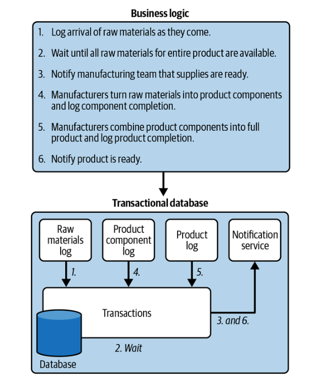
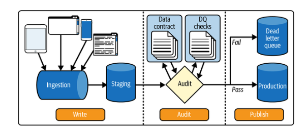
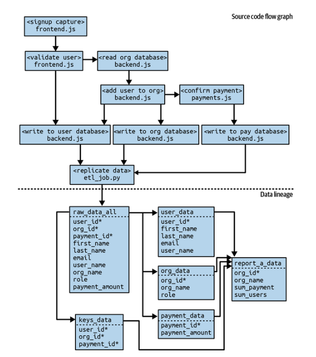
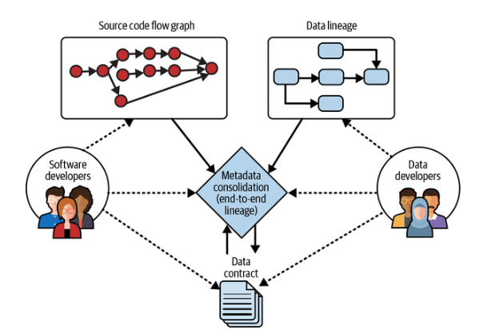
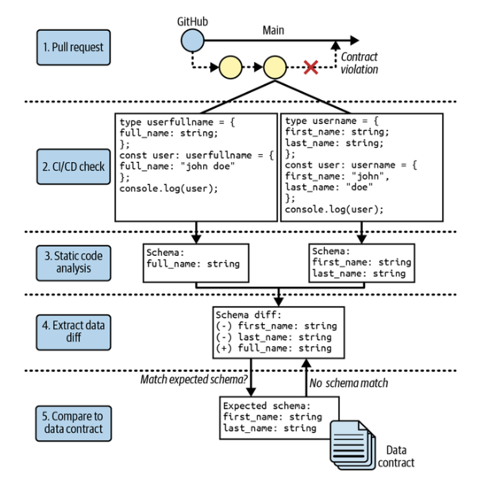
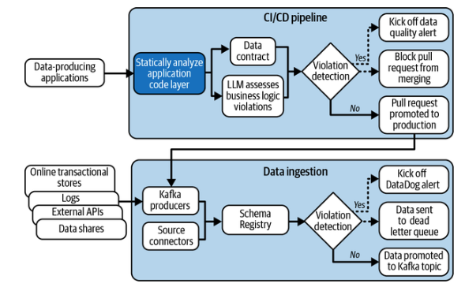
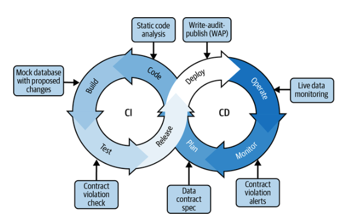
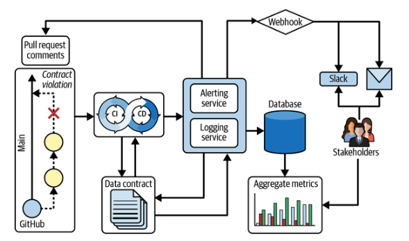

# Capítulo 6. Los componentes del contrato de datos: detección y prevención

En el capítulo 5, ofrecimos una descripción general de los componentes del contrato de datos y analizamos en detalle la función de los activos de datos y las definiciones de contrato dentro del patrón de arquitectura del contrato de datos. En este capítulo, ofreceremos una descripción general de todos los componentes de la arquitectura y, a continuación, dedicaremos las secciones siguientes a los componentes de detección y prevención de los contratos de datos. Al final de este capítulo, tendrás una base sólida de lo que necesitas para implementar la arquitectura de contratos de datos, lo que haremos a través de un proyecto de codificación guiado en el capítulo 7.

Recordemos del capítulo 5 que la arquitectura de contratos de datos requiere el uso de un conjunto de herramientas de infraestructura, con cada componente dividido en cuatro categorías principales y sus respectivas subcategorías (puedes consultar la figura 5-1 para ver una representación visual):

_Activos de datos_

La base de toda infraestructura de datos son las bases de datos y, aunque la gama de bases de datos es muy amplia, en este libro nos centraremos en las cuatro categorías siguientes:

- Bases de datos analíticas

- Bases de datos transaccionales

- Origen de eventos y flujos de eventos

- Datos propios, plataforma de terceros

_Definición de contratos_

La superficie para integrar las expectativas en torno al esquema y la lógica empresarial (es decir, la semántica) de un activo de datos respectivo, que luego se compara con fuentes centralizadas de metadatos. Los tres componentes son los siguientes:

- Especificaciones de contratos de datos

- Lógica empresarial

- Registro de esquemas y catálogos de datos

_Detección_

La detección debe realizarse a nivel de código para el esquema y en tiempo de ejecución para la semántica de los datos, a fin de garantizar que se capturen los cambios, idealmente antes de que los datos se escriban en la base de datos de destino. Las siguientes siete categorías representan las áreas en las que puedes detectar cambios en los datos:

- Cuarentena de datos

- Captura de datos modificados

- Procesamiento de flujos

- Gráficos de flujo de código fuente

- Linaje de datos

- Análisis de código estático

- Monitoreo de datos en tiempo real

_Prevención_

Aunque lo ideal es que la prevención de la violación de contratos sea automática, esto no es posible, ya que muchos problemas de calidad de los datos tienen su origen en las personas y los procesos. Por lo tanto, la automatización consiste en alertar a las personas adecuadas en el momento oportuno dentro del flujo de trabajo de los desarrolladores. Las tres categorías siguientes son las más habituales en las que se puede informar de posibles cambios importantes:

- Flujos de trabajo de CI/CD

- Control de versiones (revisión del código de datos)

- Monitoreo y alertas

En el capítulo 5, la definición de contratos y los activos de datos cubrieron los datos y metadatos necesarios para los contratos de datos. Las secciones siguientes sobre detección y prevención explicarán cómo poner en práctica estos componentes dentro de un ar el ciclo de vida de los datos.

## Detección

Bajo la perspectiva de los contratos de datos de , definimos la detección como la capacidad de detectar los metadatos asociados a los activos de datos y las diferencias en las expectativas de un cambio propuesto dentro del ciclo de vida de los datos. Las siguientes categorías son tres de los métodos que podemos utilizar para detectar estos cambios:

_Detección a nivel de código_

Detección de qué código está asociado a un activo de datos bajo contrato y cómo sus cambios se ajustarían a las expectativas y restricciones del contrato.

_Detección de datos en movimiento_

Analizar datos en tiempo real de , dentro de un intervalo de tiempo predeterminado entre las bases de datos de origen y destino, para garantizar la alineación con las expectativas y restricciones del contrato, especialmente en lo que respecta a los cambios semánticos.

_Detección histórica_

Revelar activos de datos y/o código relacionados con activos de datos que se modificaron antes de que se estableciera un contrato de datos, pero que violan las nuevas expectativas impuestas.

La tabla 6-1 ilustra cómo se relacionan los métodos de detección y las categorías de activos de datos, así como los diversos activos de datos que protegería un contrato de datos.

Tabla 6-1. Métodos de detección y su relación con los activos de datos y sus categorías de detección

| Método de detección                   | Cuarentena de datos | Captura de datos modificados | Procesamiento de flujos | Gráficos de flujo del código fuente | Linaje de datos | Análisis de código estático | Monitoreo de datos en tiempo real |
| :------------------------------------ | :-----------------: | :--------------------------: | :---------------------: | :---------------------------------: | :-------------: | :-------------------------: | :-------------------------------: |
| **Activos de datos**                  |                     |                              |                         |                                     |                 |                             |                                   |
| Bases de datos transaccionales        |          X          |              X               |                         |                  X                  |        X        |              X              |                 X                 |
| Bases de datos analíticas             |          X          |              X               |                         |                  X                  |        X        |              X              |                 X                 |
| Datos de streaming                    |                     |              X               |            X            |                  X                  |        X        |              X              |                 X                 |
| Datos propios, plataforma de terceros |          X          |              X               |                         |                                     |        X        |                             |                 X                 |
| **Categoría de detección**            |                     |                              |                         |                                     |                 |                             |                                   |
| Detección a nivel de código           |                     |                              |            X            |                  X                  |        X        |              X              |
| Detección de datos en movimiento      |          X          |              X               |            X            |                                     |                 |                             |                 X                 |
| Detección histórica                   |          X          |                              |                         |                  X                  |        X        |              X              |

Pero, ¿cuáles son exactamente los problemas de calidad de los datos que intentamos detectar con estos métodos? Este tema puede dar para todo un libro, con muchas variaciones, dependiendo de a quién le preguntes. Un libro clásico que recomendamos es el DAMA Data Management Body of Knowledge (DAMA International), que clasifica los problemas de calidad de los datos en las siguientes nueve dimensiones:

_Validez_

El grado en que tus datos se ajustan a la lógica empresarial esperada (por ejemplo, una marca de tiempo que muestre la ocurrencia durante el horario comercial).

_Integridad_

Si un valor de datos tiene toda la información necesaria para considerarse completo (por ejemplo, una fecha de nacimiento con día, mes y año).

_Coherencia_

La medición de la coherencia de si los valores están estructurados de la misma manera en toda la columna (por ejemplo, no tener [1, 2, 3, 4, 5] y [a, b, c, d, e] presentes en una columna).

_Integridad_

La plausibilidad de un valor de datos (por ejemplo, no es de esperar que la ciudad de San Francisco esté asociada al país de Alemania).

_Actualidad_

Si los datos se reciben dentro del plazo previsto con respecto a las necesidades empresariales requeridas (por ejemplo, recibir constantemente una actualización de datos en un plazo de 24 horas, dado que hay un SLA de 1 día).

_Actualidad_

La actualidad de los datos en comparación con el momento actual (por ejemplo, una fecha de última actualización superior a seis meses para un activo de datos con un SLA de un mes infringiría la actualidad).

_Razonabilidad_

Si puede existir un conjunto de valores es para una columna (por ejemplo, solo se esperarían 12 tipos de valores como máximo para una columna que represente el mes).

_Singularidad_

Si todos los valores de datos pertinentes dentro de una columna son distintos (por ejemplo, todos los `user_ids` son únicos).

_Precisión_

El grado de corrección de un valor dentro de un activo de datos, según lo determine la lógica empresarial (por ejemplo, un servicio de entrega de alcohol espera que la edad mínima de los usuarios sea de 21 años en Estados Unidos, en comparación con los países europeos, donde los requisitos de edad son menores).

La dimensión de calidad de los datos que quieras aplicar depende de tus requisitos empresariales específicos (de nuevo, «adecuados para el uso») y del umbral de errores aceptable. En el contexto de la detección dentro de los contratos de datos, lo más importante es comprender cómo se manifiestan estas dimensiones de calidad de los datos en forma de errores. Muchos profesionales de los datos se centran en gran medida en el esquema o la semántica de los datos en sí, pero, aunque esto es útil, no llega a la raíz de donde se manifiestan estos problemas: el código en sí.

Para resaltar la importancia de la detección a nivel de código, la Figura 6-1 muestra un subconjunto del diagrama del ciclo de vida de la lógica empresarial del Capítulo 5. En esencia, los datos son un intento de tomar una instantánea del mundo real, y la lógica empresarial estructura cómo deben ser esos datos. El código es el mecanismo mediante el cual los eventos del mundo real y la estructura de la lógica empresarial se transforman en datos. Por lo tanto, esto sirve como el punto más temprano en el que puedes prevenir programáticamente las violaciones de la calidad de los datos.

Si bien la detección a nivel de código es la forma más ideal de prevención a través de contratos de datos, no todos los problemas de calidad de los datos pueden detectarse mediante código, ni todas las organizaciones tienen la capacidad de inspeccionar su código mediante la automatización. La deriva de datos es un buen ejemplo (véase «Cómo se desvían los datos de la lógica empresarial establecida»), en el que el código no ha cambiado, pero la lógica empresarial ya no se ajusta al mundo real. En este caso, es necesaria la detección de datos en movimiento para evitar que el problema de calidad de los datos se propague aguas abajo, por lo que la atención se centra en la rapidez con la que puedes detectar que los datos capturados se han desviado del mundo real que intentas representar. Por último, los contratos de datos rara vez se establecen antes de que una organización haya acumulado años de datos, a menos que se utilicen para tareas de migración de datos, por lo que también debemos tener en cuenta la detección histórica, especialmente cuando se contrata por primera vez un activo de datos establecido. En esta sección profundizaremos en los distintos métodos de detección y su tecnología asociada.

### Cuarentena de datos

Hay casos en los que tú eres un consumidor de datos que no tiene control sobre los datos proporcionados por un productor y no tiene medios para interactuar con el productor de forma constante (por ejemplo, un servicio de intermediación de datos). Si bien lo ideal sería prevenir por completo las infracciones de modificación de los activos de datos, la siguiente mejor opción es la cuarentena de datos, es decir, el proceso de monitoreo de las infracciones de datos y etiquetar los datos para separarlos o advertir a los consumidores posteriores.

> **Nota**

> Otro nombre para poner en cuarentena es «cola de mensajes no entregados», especialmente en el contexto de datos en streaming. Nuestros casos prácticos del capítulo 8 proporcionan dos ejemplos específicos de su uso con contratos de datos.

Por ejemplo, en uno de los primeros trabajos de Mark , se ocupó de la gestión de archivos de ingestión para la elegibilidad del seguro médico. Estos archivos eran críticos y podían suponer la diferencia entre que alguien recibiera la atención clínica necesaria o tuviera que pagar de su bolsillo unos costosos servicios sanitarios a pesar de tener seguro médico. Debido a su naturaleza sensible, todos los datos pasaban primero por una comprobación de ingestión en la fase de preparación y, a continuación, se ponían en cuarentena para su revisión manual si no cumplían los requisitos especificados (por ejemplo, si faltaba la fecha de nacimiento). Estas revisiones manuales fueron una de las primeras tomas de contacto de Mark con los datos JSON y con los problemas de calidad de los datos, y le llevaron a explorar los contratos de datos para determinar una forma de gestionar este proceso de gestión del cambio de forma programática.

Aunque los procesos manuales eran suficientes para esa tarea, se necesitaba todo un equipo de operaciones para revisar y gestionar la comunicación con los productores de datos externos durante semanas. Además, en múltiples ocasiones el trabajo acumulado era tan grande que todo el equipo tenía que dejarlo todo y resolver los problemas. Muchos de esos problemas se debían a ligeros cambios en el esquema de los datos, que a menudo provocaban el fallo de la ingesta de archivos completos con miles de registros a granel. Con los contratos de datos, este proceso manual podría mejorarse de la siguiente manera:

- Creación de fallos más descriptivos, teniendo en cuenta las comparaciones con el contexto del dominio a partir de las especificaciones del contrato

- Automatización de la comunicación con terceros y suministro de los metadatos necesarios para señalar los problemas

- Comunicación del alcance de los datos afectados en cuarentena a los consumidores de datos internos posteriores

La decisión de poner o no los datos en cuarentena depende una vez más del caso de uso empresarial y de las dimensiones de calidad de los datos valoradas para el caso de uso. Por ejemplo, en el caso de uso de los seguros médicos, era mejor no tener datos que transmitir datos erróneos. Concretamente, aunque el hecho de que un paciente no tuviera acceso a la atención sanitaria era un problema enorme, existía un proceso para gestionar el caso de uso y introducir manualmente los datos correctos en el sistema y obtener al instante la prueba de la cobertura mediante una llamada telefónica. Si, en cambio, hubiéramos introducido los datos erróneos, el paciente seguiría sin tener la atención cubierta o se le facturaría incorrectamente debido al error en los datos, lo que daría lugar a una menor satisfacción del cliente. Por el contrario, introducir datos erróneos puede ser útil, como en el caso de los datos de telemetría, en los que los datos erróneos pueden indicar un fallo en el hardware.

Aunque la cuarentena de datos e es puede ser bastante sencilla mediante trabajos ETL por lotes, como en el caso del seguro médico, puedes obtener un mayor nivel de detalle con tus automatizaciones a nivel de valor. En las siguientes subsecciones se profundizará en este tema mediante la captura de cambios en los datos, el procesamiento de flujos y el monitoreo de datos en tiempo real.

### Captura de datos modificados, procesamiento de flujos y monitoreo de datos en tiempo real

Hay muchos casos de uso empresarial en los que un trabajo por lotes diario tradicional a través de un canal ETL no es suficiente, como los sistemas de recomendación, la detección de fraudes y el análisis de telemetría. Por lo tanto, las organizaciones recurren a métodos de transmisión de datos para complementar su procesamiento por lotes. Tres técnicas comunes utilizadas para la transmisión son la captura de datos modificados, el procesamiento de flujos y el monitoreo de datos en directo (también llamado monitoreo de datos en tiempo real). Se definen de la siguiente manera:

_Captura de cambios en los datos_

Una técnica para monitorear las operaciones CRUD en una base de datos ascendente y propagar esos cambios en la base de datos a las bases de datos descendentes en tiempo real, lo que da lugar a cambios incrementales

_Procesamiento de flujos_

Una técnica para procesar y analizar los datos ingestados en tiempo real en el momento de su creación

_Monitoreo de datos en tiempo real_

Una técnica para observar y analizar únicamente datos en tiempo real para determinar la calidad de los datos.

Cuando se combinan con el patrón write-audit-publish (WAP), estas técnicas permiten detectar infracciones de contratos de datos entre datos en movimiento, al tiempo que evitan que los activos de datos infringidos se propaguen a bases de datos posteriores. El patrón WAP aplica a los datos las buenas prácticas de ingeniería de software de entornos de ensayo y pruebas, antes de pasar a producción. La figura 6-2 ilustra cómo funciona el patrón WAP y dónde:

1. Los nuevos datos se escriben en una base de datos provisional.

2. Los datos de la base de datos provisional se auditan mediante diversas comprobaciones de calidad y pruebas semánticas dentro de la especificación del contrato de datos.

3. Si los datos provisionales superan las comprobaciones de auditoría, se transfieren a una base de datos de producción a la que pueden acceder los consumidores de datos posteriores.

4. Si los datos provisionales no superan las comprobaciones de auditoría, se envían a una «cola de mensajes no entregados» para evitar cambios disruptivos y dar al equipo de datos la oportunidad de revisar los errores.

En la siguiente sección, comenzaremos a describir cómo trasladar las comprobaciones de contratos de datos más arriba en la cadena y al código base de la aplicación.

### Linaje de extremo a extremo: gráficos de flujo de código fuente y linaje de datos

En el capítulo 9 analizaremos con más detalle el papel de los ingenieros de software en la implementación de la arquitectura de contratos de datos. Una de las diferencias lingüísticas clave que observamos entre los desarrolladores de software y los desarrolladores de datos al describir el movimiento de los datos fueron los gráficos de flujo del código fuente y el linaje de los datos. Siempre que hablábamos con los ingenieros de software sobre el impacto de las violaciones de los contratos en los flujos de trabajo de datos posteriores, hacíamos referencia al linaje de los datos. A cambio, a menudo nos miraban con cara de desconcierto hasta que les mostrábamos un ejemplo visual, y entonces respondían: «Ah, te refieres a un gráfico de flujo de código». Por lo tanto, rápidamente pasamos a utilizar su lenguaje. Aunque esto es útil para explicar el movimiento de datos a tus colegas de arriba, es importante reconocer que hay diferencias entre ambos términos, que se ilustran en la figura 6-3 y se definen de la siguiente manera:

_Gráfico de flujo del código fuente_

Gráfico direccional que representa cómo se hacen referencia los objetos y/o archivos entre sí dentro de una base de código con respecto a las llamadas a funciones

_Linaje de datos_

Un gráfico direccional que representa cómo se obtienen, transforman y/o mueven los datos entre las tablas dentro de las bases de datos, especialmente pertinente para comprender qué datos utilizar y/o dónde buscar problemas de depuración.

En adelante, en describiremos la combinación del gráfico de flujo del código fuente y el linaje de datos como linaje de extremo a extremo.

Lo que nos quedó claro en nuestras carreras en el ámbito de los datos fue que el linaje de datos en su estado actual no era suficiente para resolver la causa raíz de los retos de calidad y gobernanza de los datos. Si has leído hasta aquí, entonces está claro que nuestra postura es que, para hacerlo, debemos desplazarnos hacia la izquierda tanto como sea posible e, idealmente, hacia las operaciones de la base de datos transaccional. Sin embargo, la mayoría de las herramientas de linaje de datos solo proporcionan información dentro de la base de datos analítica después de que se haya replicado desde la base de datos transaccional.

En un puesto anterior de ingeniería de datos, Mark solía rastrear manualmente los datos descendentes hasta el código ascendente que generaba y replicaba los datos. En concreto, seguía esta ruta para resolver los problemas de calidad de los datos que surgían debido a los cambios ascendentes:

1. Replica el problema de calidad de los datos en el producto de datos posterior.

2. Determina qué activos de datos estaban causando los errores.

3. Utiliza el linaje de datos para comprender todos los puntos en los que los activos de datos entraron en contacto entre la replicación y la aparición en el producto de datos.

4. Revisa el código de transformación (por ejemplo, SQL y/o PySpark) para determinar si el problema se debe a una lógica de transformación incorrecta o si un cambio en el producto de datos está rompiendo las suposiciones.

5. Identifica los activos de datos sin procesar replicados y el código responsable de la replicación.

6. Rastrea las llamadas a funciones del código desde el código de replicación hasta la función responsable de generar el código para los activos de datos de interés.

7. A lo largo de los distintos archivos y llamadas a funciones, utiliza `git blame` para determinar si alguno de los archivos y funciones resaltados ha cambiado y quién lo ha hecho.

8. Abre la solicitud de incorporación de cambios (PR) para revisar `git diff`, lee los comentarios de la PR que describen los cambios y busca referencias a tickets (por ejemplo, en Jira) o documentos de requisitos del producto.

9. Revisa la documentación para comprender los cambios.

10. Trabaja con los ingenieros de upstream, específicamente con los resaltados con `git blame`, para resolver el problema de upstream.

Observa cómo los pasos 1 a 5 se centran en el linaje de datos, y los pasos 6 a 10 se centran en los gráficos de flujo del código fuente. Este flujo de trabajo tardaba días, en el mejor de los casos, y semanas, en el peor, en completarse, y fue lo que finalmente convenció a Mark de la importancia de los contratos de datos.

Con respecto a la arquitectura de los contratos de datos, cuanto mejor seas capaz de capturar y conectar los metadatos del linaje de extremo a extremo, más sólida será tu lógica de aplicación. Sostenemos que estos son, con mucho, los metadatos más importantes que puedes capturar más allá de los cambios que desencadenan la aplicación. Proporcionan una línea de visión clara para que los ingenieros de software ascendentes vean el impacto de su código en los informes descendentes.

Por ejemplo, si nos remitimos a la figura 6-3, la ruta más corta entre los nodos `<signup capture> frontend.js` y `report_a_data` dentro del linaje de extremo a extremo es de seis perímetros, o seis grados de separación entre el productor ascendente de `frontend.js` y el consumidor descendente de `report_a_data`. No es razonable esperar que ninguna de las partes sea consciente de estas dependencias en este sencillo ejemplo ficticio, y es imposible una vez que se escala a una instancia real de una empresa con miles de llamadas a funciones y tablas.

La figura 6-4 destaca cómo la arquitectura de contratos de datos ayuda a unificar estos silos.

Los desarrolladores individuales ya no tienen que rastrear manualmente las dependencias y el linaje, sino que solo se les presentan los metadatos más pertinentes para el problema que están resolviendo, tal y como los muestra la aplicación del contrato de datos.

> **Nota**

> Recomendamos Fundamentals of Metadata Management, de Ole Olesen-Bagneux (O’Reilly), que ofrece una visión en profundidad de cómo está creciendo la necesidad de conectar los silos de metadatos a través de lo que él describe como arquitectura de metagrid.

Todo esto suena muy bien en teoría, pero ¿cómo se consigue realmente un linaje de extremo a extremo? Afortunadamente, el linaje de datos es un problema resuelto gracias a las numerosas herramientas de código abierto disponibles (como OpenLineage). Lo que resulta difícil es extraer los metadatos de los gráficos de flujo del código fuente dentro de bases de código que evolucionan rápidamente y utilizan varios lenguajes de programación. En la siguiente sección, analizaremos el método que te permitirá crear un gráfico de flujo del código fuente: el análisis de código estático ( ).

### Análisis estático de código

El análisis estático de código (SCA) es un subconjunto de ingeniería de software que determina cómo debe comportarse el código. Ha sido muy útil para los compiladores desde la década de 1960, y probablemente hayas experimentado el SCA al utilizar un depurador o un linter en un IDE. Para ser claros, el tema requiere un libro entero para explicarlo, y esta pequeña sección solo se centrará en su intersección con los contactos de datos.

Recomendamos Static Program Analysis, de Anders Møller y Michael I. Schwartzbach, que describe el SCA como:

_El arte de razonar sobre el comportamiento de los programas informáticos sin ejecutarlos realmente. Esto es útil no solo para optimizar los compiladores con el fin de producir código eficiente, sino también para la detección automática de errores y otras herramientas que pueden ayudar a los programadores. Un analizador de programas estático... tiene como objetivo responder automáticamente a preguntas sobre los posibles comportamientos de los programas._

Pensando en la sección anterior sobre los gráficos de flujo del código fuente, esta es la razón por la que creemos que el SCA es una de las herramientas más poderosas para generar los metadatos del ciclo de vida de los datos. Los tres problemas siguientes nos empujaron hacia el SCA cuando implementamos por primera vez los contratos de datos en las empresas:

- Los problemas con la calidad de los datos se producían antes de la base de datos analítica, por lo que necesitábamos desplazarnos hacia la izquierda para ser verdaderamente preventivos.

- La mayoría de los equipos de datos no tienen visibilidad del código que genera, transforma y mueve los datos a lo largo de su ciclo de vida antes de las bases de datos analíticas, por lo que necesitamos la participación de los ingenieros de software.

- Si queremos que los ingenieros de software participen, debemos hacer que sea increíblemente fácil de usar y proporcionar valor de forma inmediata.

El SCA cumplía todos los requisitos para este problema, ya que 1) extraía los metadatos mucho antes de los puntos de contacto con la base de datos, 2) aportaba valor a la ingeniería de software al mapear rápidamente su código en todos los sistemas, y 3) era automático y, por lo tanto, increíblemente fácil de usar para la ingeniería de software.

Dicho esto, crear herramientas SCA es extremadamente difícil y requiere conocimientos especializados en ingeniería de software. En el momento de escribir este artículo, hemos creado una cantidad considerable de código personalizado propio con el fin de crear contratos de datos, y este método es una aplicación avanzada de los contratos de datos. Un buen punto de partida para las herramientas SCA lo ofrece Meta (Facebook cuando se lanzó), que hizo que Pysa e Infer fueran de código abierto en 2020 y 2015, respectivamente. Pysa es la herramienta SCA de Python que utiliza el equipo de Instagram de Meta para identificar vulnerabilidades de seguridad en sus servidores, mientras que Infer es la herramienta SCA que utiliza Meta para identificar errores antes de que se envíe el código móvil para los lenguajes Java y C.

La SCA funciona para los contratos de datos al integrarse en el flujo de trabajo de CI/CD, concretamente en la revisión de código, donde los contratos de datos aplican la SCA al código fuente ( `main` ) y al código de implementación ( `branch` ) del cambio propuesto. A continuación, los comportamientos del código determinados se comparan con respecto a su impacto en los activos de datos mediante el contrato de datos. Si el contrato de datos identifica un cambio que afecta a un activo de datos, se lleva a cabo el flujo de trabajo de aplicación del contrato de datos. La figura 6-5 ilustra esto mediante un ejemplo sencillo de un evento de registro de frontend que se cambia de `first_name` y `last_name` a solo `full_name`, lo que da lugar a una violación del contrato de datos.

Proporcionaremos más detalles en el estudio de caso de la implementación del contrato de datos de Glassdoor en el capítulo 8, donde mencionamos que utilizó SCA como uno de los primeros pasos en sus comprobaciones de calidad de datos a través de contratos de datos. La figura 6-6 está adaptada del artículo del blog de ingeniería de Glassdoor «Data Quality at Petabyte Scale: Building Trust in the Data Lifecycle» (Calidad de datos a escala de petabytes: generar confianza en el ciclo de vida de los datos), de Zakariah Siyaji, en el que se detalla la implementación.

Aunque creemos que SCA proporciona los metadatos más útiles para la detección temprana de cambios en los activos de datos, también reconocemos la dificultad de este método. Aún puedes obtener un gran valor de los contratos de datos sin SCA, especialmente en lo que respecta a la evolución de los esquemas y el monitoreo de datos en tiempo real, pero SCA es imprescindible para hacer cumplir los contratos de datos a nivel de código y puede reducir drásticamente las infracciones de los contratos de datos en producción.

En la siguiente sección describiremos cómo aplicar automáticamente métodos de prevención de la calidad de los datos una vez que un contrato de datos detecta una infracción.

## Prevención

En el contexto de los contratos de datos, definimos la prevención como la capacidad de evitar mediante programación que los datos incorrectos de una fuente de datos ascendente se escriban en una base de datos de destino descendente. Los tres medios principales de prevención a través de los contratos de datos son el control de versiones, CI/CD y el monitoreo y las alertas. En las secciones siguientes se ofrece más información sobre cada función de prevención con respecto a la arquitectura de los contratos de datos.

### Control de versiones

Si has trabajado como desarrollador de software en cualquier empresa en los últimos 10 años, es muy probable que hayas utilizado el control de versiones para gestionar tu código base entre varios desarrolladores independientes, concretamente Git. Lo que diferencia a Git de otros programas es su alto nivel de adopción y su omnipresencia entre los desarrolladores actuales. Git se convirtió en el programa de control de versiones más dominante entre 2005, cuando Linus Torvalds compartió su primera fusión oficial de Git a través de la lista de correo electrónico de Linux, y 2015. Diez años después, en 2025, la mayoría de los desarrolladores no pueden imaginar no utilizar Git, a menos que trabajen en un sistema heredado que utilice un software de control de versiones menos popular.

Git transformó de manera fundamental la gestión del cambio entre los desarrolladores e hizo que fuera trivial realizar pequeños cambios iterativos distribuidos entre varias personas, en comparación con el desarrollo sin Git. La cantidad de coordinación activa entre los desarrolladores para gestionar las bases de código se volvió insignificante. Además, los cambios solo requerían el contexto necesario de las solicitudes de extracción cada vez más pequeñas y sus diferencias, lo que hacía posible las revisiones y la iteración.

Creemos que la arquitectura de contratos de datos puede hacer por los datos lo que Git hizo por el software. Con respecto a los contratos de datos, las principales ventajas del control de versiones son las siguientes:

- Disponer de un mecanismo para actualizar el archivo de especificaciones del contrato de datos y tener un historial de sus restricciones y contexto cambiantes

- Proporcionar la base para la gestión del cambio dentro del ciclo de vida del desarrollo de software sobre el que construimos la arquitectura del contrato de datos, específicamente con respecto a los flujos de trabajo de CI/CD

Dada la ubicuidad del control de versiones, no insistiremos en este punto, pero si deseas obtener más información, te recomendamos encarecidamente este vídeo de 2007 en el que Linus Torvalds comparte sus opiniones sobre Git dos años después de crearlo.

### CI/CD

Esta sección se centrará principalmente en la intersección entre CI/CD y los contratos de datos, en lugar de describir el componente en detalle. Dicho esto, Henry van Merode ofrece el siguiente excelente resumen de la bibliografía básica sobre CI/CD en la que podemos basarnos, extraído de su libro Continuous Integration (CI) and Continuous Delivery (CD): A Practical Guide to Designing and Developing Pipelines (O’Reilly):

_La integración continua se basa en el hecho de que el código de la aplicación se almacena en un sistema de gestión de control de código fuente (SCM). Cada cambio en este código desencadena un proceso de compilación automatizado que produce un artefacto de compilación, que se almacena en un repositorio central accesible. El proceso de compilación es reproducible, por lo que cada vez que se ejecuta la compilación a partir del mismo código, se espera el mismo resultado. Los procesos de compilación se ejecutan en una máquina específica, el servidor de integración o compilación. El servidor de integración tiene un tamaño tal que la ejecución de la compilación es rápida._

_La entrega continua se basa en el hecho de que siempre hay una línea principal estable del código, y la implementación en producción puede realizarse en cualquier momento desde esa línea principal. La línea principal se mantiene lista para la producción, lo que se facilita mediante la automatización de las implementaciones y las pruebas. Un artefacto se compila una sola vez y se recupera de un repositorio central. Las implementaciones en entornos de prueba y producción se realizan de la misma manera, y se utiliza el mismo artefacto para todos los entornos de destino. Cada compilación se prueba automáticamente en una máquina de pruebas que se asemeja al entorno de producción real. Si funciona en una máquina de pruebas, también debería funcionar en la máquina de producción. Se realizan diversas pruebas para garantizar que la aplicación cumple tanto los requisitos funcionales como los no funcionales. El equipo de DevOps tiene una visión completa del progreso del proceso de entrega continua gracias a la rápida retroalimentación del servidor de integración (a través de bucles de retroalimentación cortos)._

La última frase, que menciona al «equipo de DevOps», es el aspecto más relevante de CI/CD con respecto a la implementación de contratos de datos. Vale la pena repetir que la arquitectura de contratos de datos sirve para tender puentes entre los silos a lo largo del ciclo de vida de los datos y, por lo tanto, es importante trabajar con partes interesadas dispares con diversas limitaciones para garantizar que tomen medidas para mantener una calidad de datos aceptable. La mayor parte de este libro se centra en los ingenieros de software que trabajan en el código de las aplicaciones que modifican los activos de datos, pero en este componente de la arquitectura de contratos de datos comenzamos a trabajar con ingenieros de DevOps. Hemos descubierto que el siguiente paso más común entre los equipos de ingeniería de software que finalmente han aceptado los contratos de datos es incorporar al equipo de DevOps. Afortunadamente, hemos descubierto que los ingenieros de DevOps rara vez se oponen a la implementación de contratos de datos, pero a menudo son la primera impresión que tiene la organización de ingeniería de los contratos de datos.

> **Nota**

> Aunque es posible que los ingenieros de software de aplicaciones también se centren en las funciones de DevOps, nuestra hipótesis es que la inversión en contratos de datos se justifica principalmente para organizaciones con una plantilla más amplia (véase el número de Dunbar en el capítulo 3) y, por lo tanto, la necesidad de división del trabajo que justifica la contratación de perfiles especializados, como DevOps.

Lo que hace que CI/CD sea tan potente para la arquitectura de contratos de datos es que ahora las necesidades de los equipos de datos están integradas directamente en el ciclo de vida del desarrollo de software y en un proceso familiar para los desarrolladores de software. Cabe destacar que las limitaciones de la mayoría de los ingenieros de software no incluyen los datos, por lo que la persona que implementa los contratos de datos debe facilitar al máximo la adopción de las medidas deseadas para la calidad de los datos. Para más detalles, la figura 6-7 ilustra el clásico ciclo de CI/CD en forma de ocho y dónde encajan los contratos de datos dentro del ciclo.

Una vez integrado en el ciclo de vida del desarrollo de software, CI/CD da soporte a los siguientes aspectos del flujo de trabajo de los contratos de datos:

- Un mecanismo para activar el flujo de trabajo para la detección de violaciones de contratos de datos en cada nueva rama del código propuesto.

- La capacidad de bloquear la fusión del código en la rama principal si se detecta una violación del contrato de datos.

- La capacidad de proporcionar alertas en tiempo real a las partes relevantes establecidas en la especificación del contrato.

Dadas estas capacidades, sostenemos que CI/CD es el componente más crítico de la arquitectura de contratos de datos, ya que pone en práctica el cumplimiento de las expectativas codificadas en las especificaciones del contrato de datos. Sin CI/CD, solo se dispone de una lista de restricciones deseadas y un frágil acuerdo verbal de que todas las partes se adherirán a el documento.

### Monitoreo de infracciones y alertas

Al igual que otros retos de que hemos presentado en este libro, el monitoreo de infracciones y las alertas son un problema de personas y procesos sobre una estructura técnica. Las alertas más avanzadas y detalladas pierden todo su valor si las personas de tu organización las ignoran.

Como punto de partida, utiliza el marco de las cinco preguntas básicas del periodismo como medio para desarrollar un monitoreo de infracciones y alertas significativas:

- ¿Quiénes son las partes interesadas más relevantes a las que hay que notificar?

- ¿Cuál es la información más relevante para la infracción presentada?

- ¿Cuándo debe producirse la alerta de infracción?

- ¿Dónde deben recibir las alertas de infracción las partes interesadas destinatarias?

- ¿Por qué debería importarle a la parte interesada en cuestión en relación con sus necesidades?

- ¿Cómo deben resolver la infracción las partes interesadas destinatarias?

La tabla 6-2 describe cómo puedes aplicar el marco a las distintas partes interesadas en lo que respecta a las alertas de violación de contratos de datos.

Tabla 6-2. Las cinco preguntas básicas y una más sobre las alertas de incumplimiento de contratos de datos por parte de las partes interesadas

| Componente de alerta | Desarrolladores de software                                                                                                                           | Desarrolladores de datos                                                                                                                                                                              | Partes interesadas empresariales                                                                                                                                                                                     | Dirección                                                                                                                                                                                                                                                                | Clientes externos                                                                                                                                                                      |
| :------------------- | :---------------------------------------------------------------------------------------------------------------------------------------------------- | :---------------------------------------------------------------------------------------------------------------------------------------------------------------------------------------------------- | :------------------------------------------------------------------------------------------------------------------------------------------------------------------------------------------------------------------- | :----------------------------------------------------------------------------------------------------------------------------------------------------------------------------------------------------------------------------------------------------------------------- | :------------------------------------------------------------------------------------------------------------------------------------------------------------------------------------- |
| **Quién**            | El desarrollador que realiza el cambio en el código.                                                                                                  | El desarrollador responsable del activo de datos afectado, tal y como se indica en el contrato de datos.                                                                                              | Las partes interesadas que no pueden completar un flujo de trabajo empresarial crítico.    Los expertos en el ámbito empresarial que han aceptado ser incluidos en las especificaciones del contrato de datos. | El líder designado para la resolución de SEV-0 (sin comunicación activa en caso contrario).                                                                                                                                                                              | Usuario activo del producto en el momento del impacto.    Punto de contacto del cliente.                                                                                         |
| **Qué**              | Qué líneas de código específicas están infringiendo la normativa.    La solicitud de extracción del cambio propuesto que provoca la infracción. | Qué partes interesadas clave se ven afectadas en fases posteriores.    Los activos de datos específicos en riesgo.    La persona de contacto para más preguntas sobre el equipo de datos. | El impacto significativo para el negocio.    El flujo de trabajo específico del negocio afectado.    Qué medidas deben tomarse para tener en cuenta el flujo de trabajo afectado.                        | Las especificaciones del contrato relacionadas con la infracción.    Las especificaciones contractuales asociadas a la infracción.    Plazo previsto para resolver el problema.    Información agregada relacionada con sus métricas clave de interés. | Qué servicio o producto se ve afectado.    El estado de la resolución.                                                                                                           |
| **Cuándo**           | Cuando se confirma un cambio de código en una rama de solicitud de extracción a través del flujo de trabajo de CI/CD.                                 | Cuando se ve afectado un activo de datos que gestionas o del que dependes.    Cuando se asocia con el contrato de datos infringido.                                                             | Cuando un activo de datos del que dependen se ve afectado de forma activa.    Cuando se necesita el conocimiento del dominio de la parte interesada específica, tal y como se define en el contrato de datos.  | Establece un intervalo en función de las necesidades empresariales.    Incidentes SEV-0 que amenacen el negocio.                                                                                                                                                   | Cuando se ve afectado un número significativo de usuarios activos.    Cuando se produce un evento de riesgo significativo (por ejemplo, incumplimiento del acuerdo de servicio). |
| **Dónde**            | Comentario de relaciones públicas                                                                                                                     | Comentario de relaciones públicas                                                                                                                                                                     | Mensajes comerciales (por ejemplo, Slack, correo electrónico, etc.).    Panel de control e informes                                                                                                            | Mensajes comerciales (por ejemplo, Slack, correo electrónico, etc.)    Panel de control e informes                                                                                                                                                                 | Dentro del producto    Comunicación con las partes interesadas (por ejemplo, éxito de los clientes)                                                                              |
| **Por qué**          | El cambio de código tendrá un impacto significativo en el negocio (respaldado por datos).                                                             | Los activos de datos de los que son responsables están en peligro.                                                                                                                                    | Un flujo de trabajo empresarial específico que depende del activo de datos afectado ya no es viable.    Cambios significativos en una métrica clave de tu propiedad.                                           | Riesgo inminente para la viabilidad de la función empresarial que lideran.                                                                                                                                                                                               | Impacto significativo en la usabilidad del producto y/o servicio.                                                                                                                      |
| **Cómo**             | Actualizar el código basándose en los comentarios de la infracción y/o de las partes interesadas etiquetadas antes de fusionarlo con el principal.    | Proporcionar apoyo al desarrollador de software dentro de la solicitud de extracción.    Comunicarse con los consumidores de datos afectados (si aún no se les ha alertado automáticamente).    | No realizar ninguna acción si solo se trata de un consumidor del activo de datos.    Si es necesario, proporcionar conocimientos sobre el dominio del negocio a los desarrolladores.                           | Toma decisiones estratégicas basadas en los datos agregados de infracciones y alertas.                                                                                                                                                                                   | El cliente no debe tomar ninguna medida.                                                                                                                                               |

Aunque este marco de comunicación puede parecer obvio, su ejecución suele ser una idea secundaria para muchos productos de datos. En el capítulo 10 analizaremos la adopción de contratos de datos y, en concreto, la analogía entre la construcción de aviones y la experiencia de las aerolíneas, donde destacamos cómo el éxito de los vuelos ya no depende tanto de la tecnología, sino que se centra en la experiencia de utilizar la aerolínea. Por lo tanto, debes ser muy consciente de cómo reaccionarán las partes interesadas a las que te diriges ante las alertas de infracción para que estas sean aceptadas.

Un ejemplo real que ilustra esto a la perfección fue el fracaso del lanzamiento del modelo de sepsis de Epic. Epic, la mayor empresa de historias clínicas electrónicas para hospitales del mundo por cuota de mercado, lanzó un producto de clasificación basado en el aprendizaje automático para alertar al personal clínico sobre los pacientes con riesgo de sepsis. El resultado fue una gran preocupación por la seguridad y un artículo de investigación completo de JAMA (una de las revistas médicas más destacadas) en el que se señalaban sus problemas con la fatiga por alertas. El artículo «External Validation of a Widely Implemented Proprietary Sepsis Prediction Model in Hospitalized Patients» (Validación externa de un modelo patentado de predicción de sepsis ampliamente implementado en pacientes hospitalizados), de Andrew Wong et al., destacaba lo siguiente:

_Una [alerta del modelo épico de sepsis (ESM)]... se produjo en el 18 % de las hospitalizaciones... incluso sin tener en cuenta las alertas repetidas. Si el ESM generara una alerta solo una vez por paciente cuando el umbral de puntuación [utilizara estrategias de minimización de alertas]... los médicos seguirían teniendo que evaluar a ocho pacientes para identificar a un solo paciente con sepsis eventual (tabla 2). Si los médicos estuvieran dispuestos a reevaluar a los pacientes cada vez que la puntuación del ESM [alertara]... para encontrar a los pacientes que desarrollaran sepsis en las siguientes 4 horas, tendrían que evaluar a 109 pacientes para encontrar un solo paciente con sepsis._

Aunque la mayoría de los productos de datos no son e es para la vida o la muerte, este ejemplo pone de relieve cómo el hecho de proporcionar alertas que no son significativas para las partes interesadas erosiona rápidamente la confianza, lo que frustra por completo el propósito de implementar contratos de datos.

Una vez establecido qué y por qué se monitorean las infracciones y se envían alertas, en los siguientes párrafos se describirá cómo se hace. Dentro del flujo de trabajo del contrato de datos, el monitoreo de infracciones y las alertas consisten en lo siguiente:

_Interfaz de control de versiones_

La superficie en la que los desarrolladores aprovechan Git para gestionar los cambios en el código (por ejemplo, GitHub).

_CI/CD_

El mecanismo de activación para ejecutar el flujo de trabajo del contrato de datos cuando se propone un cambio de código en la interfaz de control de versiones

_Especificaciones del contrato de datos_

La fuente de verdad para las expectativas de un activo de datos y, con respecto a la tutoría y las alertas, proporciona los ID de usuario de las personas a las que se debe notificar a través de comentarios de relaciones públicas o superficies de comunicación empresarial

_Servicio de registro_

Scripts que registran los resultados del flujo de trabajo del contrato de datos para la depuración y el análisis

_Servicio de alertas y webhooks_

Scripts que determinan a quién hay que alertar y en qué superficie o superficies hay que proporcionar las alertas, tal y como se indica en la especificación del contrato de datos, que se ejecutan a través de webhooks.

_Superficie de comunicación empresarial_

Las superficies en las que las partes interesadas no técnicas pueden recibir alertas por incumplimientos del contrato de datos (por ejemplo, Slack, correo electrónico, etc.).

La figura 6-8 ilustra cómo estos componentes funcionan conjuntamente para proporcionar alertas oportunas de infracciones de contratos de datos a las partes interesadas en sus respectivas superficies de comunicación.

Un desarrollador activa el flujo de trabajo de CI/CD al enviar un cambio de código a través de Git y la interfaz de control de versiones. El flujo de trabajo de CI/CD activa la ejecución del flujo de trabajo del contrato de datos al evaluar si el cambio propuesto está asociado con una especificación de contrato de datos existente y si viola el contrato; todos los registros del flujo de trabajo de CI/CD suelen ser visibles dentro de la interfaz de control de versiones. Si se produce una infracción, el servicio de alertas consulta la especificación del contrato de datos para determinar a quién hay que notificarlo y envía la carga útil de la alerta tanto a un comentario en la solicitud de extracción dentro de la interfaz de control de versiones como a los webhooks pertinentes para la superficie de comunicación empresarial. Además, el servicio de registro captura los registros del flujo de trabajo del contrato de datos y los almacena en una base de datos para su análisis y generación de informes.

## Conclusión

En este capítulo, hemos tratado los dos últimos componentes de la arquitectura de contratos de datos: la detección y la prevención. Entre los métodos de detección, hemos detallado las diversas superficies y métodos para la detección a nivel de código, la detección de datos en movimiento y la detección histórica. Hemos hecho hincapié en la necesidad de incorporar formas dispares de metadatos, ya que cuantos más tipos de metadatos captures en los sistemas de tu empresa, más sólidos serán tus contratos de datos. Además de los métodos de detección, también hemos descrito los mecanismos de prevención mediante el flujo de trabajo de los contratos de datos: control de versiones, flujos de trabajo de CI/CD y monitoreo y alertas de infracciones.

Además, hemos destacado la necesidad de ser intencionales con las alertas para evitar la pérdida de confianza en el flujo de trabajo de los contratos de datos debido a la fatiga de las alertas. Hemos sugerido utilizar el marco de las cinco preguntas y una respuesta del periodismo, enmarcando las alertas de la siguiente manera:

- ¿Quiénes son las partes interesadas más relevantes a las que hay que notificar?

- ¿Cuál es la información más relevante para la infracción presentada?

- ¿Cuándo debe producirse la alerta de infracción?

- ¿Dónde deben recibir las alertas de infracción tus partes interesadas objetivo?

- ¿Por qué debería importarle a la parte interesada destinataria en relación con sus necesidades?

- ¿Cómo debe resolver la infracción la parte interesada destinataria?

Otra forma de ver la detección y la prevención es a través de la lente de la experiencia del desarrollador. Muchas veces, los componentes de detección y prevención son la primera interacción de los desarrolladores con los contratos de datos (si no fueron ellos quienes los implementaron). También es la primera vez que se establece la impresión del valor que los contratos de datos pueden proporcionar a los desarrolladores. Presta especial atención a esta consideración en cuanto a cómo esperan los desarrolladores que se les notifique una infracción y qué trabajo adicional están dispuestos a realizar para dar cuenta de tus necesidades de datos (lo ideal es que sea mínimo, dado que el contrato proporciona el contexto necesario).

Los capítulos 5 y 6 detallan los componentes de la arquitectura del contrato de datos y las diversas consideraciones que debes tener en cuenta. En el capítulo 7 lo uniremos todo proporcionando un tutorial práctico de codificación para crear una especificación de contrato de datos, detectar cambios en los activos de datos en una pila de datos simulada con datos del mundo real, activar el flujo de trabajo del contrato de datos a través de CI/CD y mostrar alertas de infracción.
