# Capítulo 7. Implementación de contratos de datos

Los capítulos 5 y 6 trataron en profundidad los cuatro componentes de la arquitectura de contratos de datos. En este capítulo, pasaremos de la teoría a la implementación real de contratos de datos mediante herramientas de código abierto. Nuestro repositorio GitHub correspondiente proporciona un entorno sandbox completo que puedes ejecutar localmente o en el navegador a través de GitHub Codespaces con:

- Una guía completa de la implementación de una arquitectura de contrato de datos y sus scripts correspondientes

- Implementación de una especificación de contrato de datos

- Un proyecto de escenario que simula un flujo de trabajo de violación de contrato de datos

Aunque recomendamos encarecidamente utilizar el repositorio de código, este capítulo es suficiente por sí solo, ya que incluye diagramas de arquitectura, las herramientas correspondientes y fragmentos de código relevantes. Los objetivos de este capítulo son los siguientes:

- Comprende cómo implementar los cuatro componentes del contrato de datos: activos de datos, especificación del contrato de datos, detección y prevención

- Crea una especificación de contrato de datos mediante JSON Schema como medio para comprender cómo evaluar las especificaciones disponibles en el mercado o si conviene crear una propia para casos de uso específicos

- Aprender a aprovechar los metadatos de las bases de datos para crear tu propio «catálogo de datos» con el que comparar las especificaciones de los contratos de datos

- Incrustar contratos de datos en pruebas unitarias para realizar pruebas locales e incrustarlos en el flujo de trabajo de CI/CD

- Recorre completamente el flujo de trabajo de violación de contratos de datos en una solicitud de extracción.

Por último, te sugerimos las tres formas siguientes de trabajar con el material de este capítulo, de más sencillo a más complejo:

_Exploración del entorno de pruebas_

Lee este capítulo y luego explora el entorno de pruebas por tu cuenta.

_Sigue los pasos_

Sigue este capítulo con un entorno sandbox activo a tu lado.

_Crea tu propia implementación_

Aprovecha los capítulos 5 y 6 para crear tu propia implementación (cómo creamos este capítulo) y luego compárala con el entorno sandbox.

No hay un enfoque correcto o incorrecto, y a menudo utilizamos una combinación de estos enfoques cuando aprendemos nuevas tecnologías. En la siguiente sección, presentaremos el escenario simulado que enmarcará todo el proyecto y los scripts correspondientes.

## Introducción al escenario de contrato de datos simulado

En este escenario de « », eres un ingeniero de plataformas de datos que da soporte al equipo de ingeniería de software backend, encargado de crear la base de datos OLTP que dará soporte a una nueva línea de productos para el negocio del software de entretenimiento. En concreto, la línea de productos es un asistente de IA para usar en museos que aprovecha la visión por computadora para identificar objetos y, a continuación, proporciona información específica del contexto: tu propio guía personal del museo.

Por supuesto, la aplicación de IA es muy ambiciosa, y el trabajo inicial requiere configurar la base de datos para comenzar a procesar imágenes y metadatos relevantes de los objetos dentro de los museos. Además de sentar las bases de la aplicación, estos datos de imágenes son esenciales para los científicos de datos que están desarrollando los modelos para la aplicación.

Dada la importancia de esta base de datos para la aplicación que se va a crear próximamente y la fuerte dependencia del equipo de ciencia de datos posterior, has conseguido que se apruebe la implementación de contratos de datos, ya que otras partes de la empresa han experimentado problemas de calidad de los datos en situaciones similares. (Hablaremos más sobre la aceptación y la adopción en los capítulos 9 a 12).

Por lo tanto, en este escenario simulado, el equipo de la plataforma de datos creó previamente la documentación sobre el conjunto de datos, la aplicación del museo y los flujos de datos que supervisas y que estarán cubiertos por la implementación del contrato de datos.

### Conjunto de datos

Aunque el objetivo final de es integrar esta aplicación con todos los principales museos, el producto mínimo viable de esta aplicación se centrará en el Museo Metropolitano de Arte de Nueva York. En concreto, el conjunto de datos de acceso abierto del Museo Metropolitano de Arte, que incluye «más de 406 000 imágenes en alta resolución de obras de dominio público de la colección del Met, todas las cuales se pueden descargar, compartir y remezclar sin restricciones».

Para simplificar tu trabajo de desarrollo inicial, se ha extraído una muestra de unos 3000 registros de la API de la colección del Museo Metropolitano de Arte (API del museo) y se ha almacenado como una matriz JSON para alimentar tu base de datos Postgres (ten en cuenta que puedes ejecutar el script `get_data_subset_from_met_api.py`, pero con los límites de velocidad de la API tarda horas). En este momento, la base de datos tiene el esquema que se muestra en la figura 7-1, donde cada tabla tiene la clave principal `object_id`.

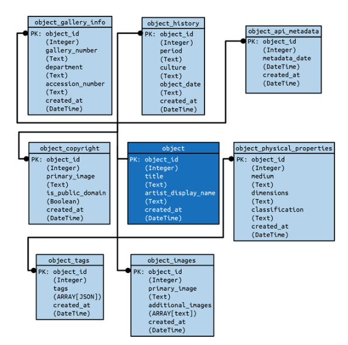

Ten en cuenta que en este escenario simulado aún queda mucho trabajo por hacer para llegar al modelo de datos final para la base de datos OLTP, y por eso es conveniente utilizar contratos de datos que ayuden a realizar un seguimiento de los cambios y las expectativas a medida que evolucionan con la aplicación.

### Aplicación del museo

La arquitectura de alto nivel de la aplicación del museo, tal y como se muestra en la figura 7-2, consiste en una base de datos Postgres que obtiene datos de la API del museo. Además, la base de datos Postgres gestiona las operaciones CRUD desde la interfaz de productos del museo, que es el principal objetivo del trabajo de desarrollo en este momento.

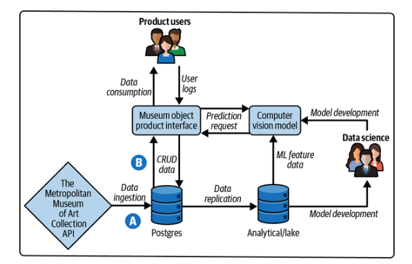

Como se destaca en la figura 7-2, nuestro único enfoque para este escenario simulado es la ingesta de datos y las operaciones CRUD, etiquetadas como A y B, respectivamente. Podemos suponer que el canal de replicación y las actividades relacionadas con el aprendizaje automático funcionan según lo previsto (siempre que no haya violaciones del contrato de datos).

### Descripción general del repositorio del proyecto

El siguiente árbol de directorios ofrece una descripción general de la implementación de la arquitectura del contrato de datos a nivel de archivo, así como breves descripciones. A alto nivel, el proyecto se compone de lo siguiente:

- Archivos de configuración (por ejemplo, docker-compose) para el entorno sandbox y los flujos de trabajo de CI/CD

- Un cuaderno sencillo como medio ligero para consultar la base de datos Postgres y probar scripts

- La arquitectura del contrato de datos en sí, organizada por sus respectivos componentes:
    - Activos de datos

    - Definición del contrato

    - Detección

    - Prevención

Te recomendamos que te tomes un momento para familiarizarte con este árbol de directorios antes de continuar con el capítulo:

```TEXT
/workspace
├── .devcontainer.json                        # VS Code dev container config
├── .gitignore                                # Git ignore rules
├── README.md                                 # Project documentation
├── docker-compose.test.yml                   # Docker compose for testing
├── docker-compose.yml                        # Docker compose for development
├── requirements.txt                          # Python dependencies
├── run_sql_queries_here.ipynb                # Jupyter notebook for SQL queries
├── .github/                                  # GitHub configuration
│   └── workflows/                            # GitHub Actions workflows
│       └── docker-image.yml                  # Docker image build workflow
└── data_contract_components/                 # Data contract components
    ├── contract_definition/                  # Data contract specifications
    │   ├── __init__.py                       # Python package init
    │   └── object_images_contract_spec.json  # Contract spec for object_images
    ├── data_assets/                          # Data management and assets
    │   ├── __init__.py                       # Python package init
    │   ├── _query_postgres_helper.py         # PostgreSQL query helper
    │   ├── alembic.ini                       # Alembic database migration config
    │   ├── seed_db.py                        # Database seeding script
    │   └── db_migrations/                    # Database migration files
    │       ├── __init__.py                   # Python package init
    │       ├── env.py                        # Alembic environment config
    │       ├── script.py.mako                # Alembic migration template
    │       ├── raw_data/                     # Raw data files
    │       │   ├── __init__.py               # Python package init
    │       │   ├── get_data..._api.py        # Met Museum API data fetcher
    │       │   └── objects.json              # Met Museum objects data sample
    │       └── versions/                     # Database migration versions
    │           └── 00e9b3375...tables.py     # Migration to create tables
    ├── detection/                            # Data contract violation detection
    │   ├── __init__.py                       # Python package init
    │   ├── _get_data_catalog.py              # Data catalog retrieval
    │   ├── _get_data_contract_specs.py       # Contract specifications retrieval
    │   ├── contract_coverage_detector.py     # Contract coverage analysis
    │   └── contract_violation_detector.py    # Contract violation detection
    └── prevention/                           # Prevent data contract violations
        ├── __init__.py                       # Python package init
        └── test_data_contract_violations.py  # Contract violation tests
```

Ahora que hemos establecido el escenario y proporcionado la información básica, pasemos a repasar la implementación de los contratos de datos .

## Implementación de contratos de datos

Como se ha indicado anteriormente en el escenario simulado, esta implementación del contrato de datos se centra en los datos ascendentes entre la ingestión desde una API de terceros (representada como el archivo data_assets/db_migrations/raw_data/objects.json ) y la base de datos transaccional (es decir, Postgres) que permitirá operaciones CRUD con la interfaz de productos de objetos del museo. Para nuestro primer contrato de datos, vamos a proteger nuestro activo de datos más importante: `object_images`. Este activo de datos es fundamental, ya que está previsto que muestre imágenes al usuario una vez que el modelo de aprendizaje automático identifique un objeto del museo a partir de la foto proporcionada por el usuario. Además, `object_images.primary_image` y `object_images.additional_images` proporcionan los enlaces de texto que utiliza el equipo de ciencia de datos para acceder a los archivos de imagen para el entrenamiento del modelo (lo cual queda fuera del alcance de este tutorial).

Es importante señalar que, aunque hemos intentado que la implementación sea lo más realista posible, la realidad es que la mayoría de las empresas no van a ser totalmente de código abierto ni van a utilizar una única base de datos. Por lo tanto, esta implementación tiene por objeto enseñarte el patrón de arquitectura de los contratos de datos que puedes extrapolar a otras herramientas dentro de tu caso de uso respectivo. Además, hay casos en los que creamos herramientas que podríamos haber integrado con una herramienta externa más robusta (por ejemplo, especificaciones de contratos de datos, catálogos de datos, etc.). Esto es intencionado para ayudar a ilustrar mejor el patrón de los contratos de datos y facilitar la comprensión a los lectores, pero nos aseguraremos de señalar dónde, para que puedas evaluar mejor cuál sería la mejor implementación y/o integración para tu caso de uso.

### Descripción general de la arquitectura de contratos de datos

Volviendo al capítulo 4, la figura 7-3 ilustra el flujo de trabajo del contrato de datos que hemos implementado en nuestro repositorio. Esta implementación del flujo de trabajo se divide en cuatro componentes distintos:

- Activos de datos

- Definición del contrato

- Detección

- Prevención

`object_images` Con esta implementación, podemos definir nuestras expectativas para el activo de datos de la implementación a través de nuestra especificación de contrato, detectar cambios en los metadatos dentro de nuestra base de datos Postgres (con especial atención a `object_images`), comparar nuestra especificación de contrato de datos con estos metadatos a través de una prueba unitaria, ejecutar esta prueba unitaria a través de comprobaciones de CI/CD y alertar automáticamente de las infracciones a través de un comentario de solicitud de extracción.

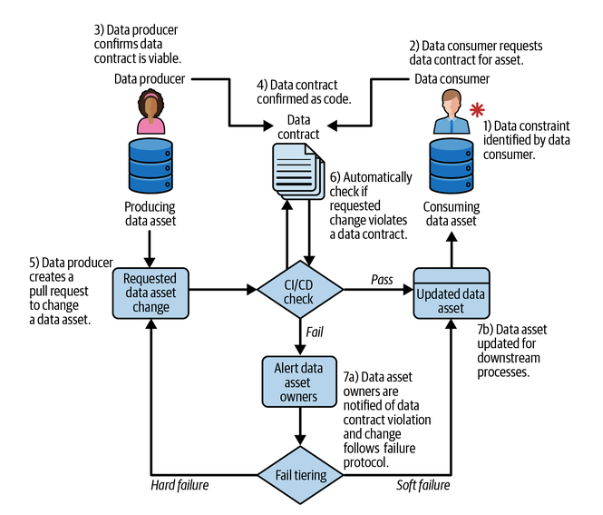

En las secciones siguientes, proporcionaremos más detalles sobre cada componente respectivo y discutiremos las consideraciones que debes tener en cuenta para tu propia implementación.

### Componente A: Activos de datos

La base de todos los contratos de datos son los propios activos de datos. Es importante señalar que, aunque puedes explorar los datos inicializados dentro de la base de datos por ti mismo, a través de run_sql_queries_here.ipynb, la implementación del contrato de datos solo requiere metadatos para funcionar. Esto es fundamental, ya que reduce en gran medida la barrera necesaria para que las implicaciones de seguridad no lean los datos reales, dado que los contratos de datos abarcan varios departamentos (es decir, en este escenario simulado, ingeniería de backend, ingeniería de plataformas de datos y ciencia de datos). El siguiente fragmento de código es un subconjunto del árbol de directorios completo en lo que se refiere a los activos de datos:

```TEXT
/workspace
├── docker-compose.test.yml                   # Docker compose for testing
├── run_sql_queries_here.ipynb                # Jupyter notebook for SQL queries
└── data_contract_components/                 # Data contract components
    └── data_assets/                          # Data management and assets
        ├── _query_postgres_helper.py         # PostgreSQL query helper
        ├── alembic.ini                       # Alembic database migration config
        └── db_migrations/                    # Database migration files
            ├── env.py                        # Alembic environment config
            ├── script.py.mako                # Alembic migration template
            └── versions/                     # Database migration versions
                └── 00e9b3375...tables.py     # Migration to create tables

```

A alto nivel, nuestro archivo docker-compose.test.yml contiene las instrucciones de Docker para configurar el contenedor de desarrollo, la base de datos Postgres y los activos de datos. Como se ilustra en la figura 7-4, los contenedores con Postgres y Python se activan al mismo tiempo y, una vez que la base de datos devuelve una comprobación «correcta» de Postgres, el contenedor Python (es decir, `devcontainer`) ejecuta la migración de la base de datos para crear todas nuestras tablas para la base de datos transaccional de nuestra aplicación dentro del contenedor Postgres (es decir, `postgres`). Junto al diagrama de la figura 7-4 hay un fragmento de código del archivo de migración de la base de datos data_assets/db_migrations/versions/00e9b3375a5f_create_met_museum_seed_tables.py para crear la tabla `object_images` y asignar el esquema y las claves primarias.

Es importante destacar que es probable que encuentres otras herramientas de migración de bases de datos o incluso scripts SQL con `CREATE TABLE` en lugar de la herramienta de migración de bases de datos que hemos elegido (es decir, Alembic) para este entorno de pruebas. Un punto clave aquí es que puedes representar un activo de datos como código y disponer de un medio para extraer metadatos de este activo de datos. Además, utilizamos Docker, ya que facilitará la integración en el proceso de CI/CD en una fase posterior, lo que también es otra razón por la que optamos por utilizar solo metadatos.

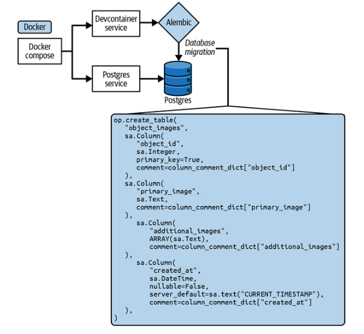

Ten en cuenta que el entorno sandbox tiene dos archivos similares, docker-compose.test.yml y docker-compose.yml. El primero se utiliza dentro de nuestras canalizaciones CI/CD e incluye llamadas para ejecutar los scripts de prueba, mientras que el segundo es utilizado por el propio entorno sandbox y ejecuta scripts para alimentar la base de datos Postgres con data_assets/raw_data/objects.json. En la siguiente sección discutiremos cómo podemos utilizar los metadatos definidos por el archivo de migración de la base de datos para informar qué incluir en la especificación del contrato de datos.

### Componente B: Definición del contrato

Una vez que hayamos identificado nuestros activos de datos más importantes en , debemos establecer nuestras expectativas a través de un archivo de especificación de contrato de datos . Un punto de partida típico es utilizar el estado actual del activo de datos como base para la especificación del contrato (como en esta implementación actual), pero también puedes utilizarlo para establecer un estado deseado que informe tus migraciones de bases de datos, lo que destacaremos en una sección posterior. El siguiente subconjunto del árbol de directorios destaca los componentes relacionados con la definición del contrato:

```TEXT
/workspace
└── data_contract_components/                 # Data contract components
    └── contract_definition/                  # Data contract specifications
        └── object_images_contract_spec.json  # Contract spec for object_images

```

> **Advertencia**

> Queremos reiterar que la creación de nuestra propia especificación de contrato de datos para este escenario simulado tiene fines educativos. Puede tener sentido crear una propia si tus necesidades son bastante sencillas (por ejemplo, solo la aplicación del esquema) o si tienes un caso de uso específico para tu empresa. De lo contrario, será mucho más fácil aprovechar las especificaciones de contratos de datos existentes, como el Estándar de Contratos de Datos Abiertos de la Fundación Linux, que también tiene una adaptación del esquema JSON.

Actualmente solo hay una especificación de contrato de datos para `object_images`, pero añadiremos una especificación de contrato adicional para otro activo de datos en una fase posterior. El contenido de object_images_contract_spec.json consiste en lo siguiente:

```JSON
{
    "spec-version": "1.0.0",
    "name": "object-images-contract-spec",
    "namespace": "met-museum-data",
    "dataAssetResourceName": "postgresql://postgres:5432/postgres.object_images",
    "doc": "Data contract for the object_images table containing image URLs and
metadata for museum objects, including primary images, additional images, and
creation timestamps.",
    "owner": {
      "name": "Data Engineering Team",
      "email": "data-eng@museum.org"
    },
    "schema": {
      "$schema": "https://json-schema.org/draft/2020-12/schema",
      "title": "Object Images Table Schema",
      "table_catalog": "postgres",
      "table_schema": "public",
      "table_name": "object_images",
      "properties": {
        "object_id": {
          "description": "Identifying number for each artwork (unique, can be
used as key field)",
          "examples": [437133],
          "constraints": {
            "primaryKey": true,
            "data_type": "integer",
            "numeric_precision": 32.0,
            "is_nullable": false,
            "is_updatable": true
          }
        },
        "primary_image": {
          "description": "URL to the primary image of an object (JPEG)",
          "examples": ["https://images.metmuseum.org/.../DT1234.jpg"],
          "constraints": {
            "primaryKey": false,
            "data_type": "text",
            "is_nullable": true,
            "is_updatable": true
          }
        },
        "additional_images": {
          "description": "Array of URLs to additional JPEG images of the
object",
          "constraints": {
            "primaryKey": false,
            "data_type": "ARRAY",
            "is_nullable": true,
            "is_updatable": true
          },
          "array_element": {
            "data_type": "text"
          }
        },
        "created_at": {
          "description": "Timestamp when this record was created in the
database",
          "examples": ["2025-01-15T10:30:00.000Z"],
          "items": null,
          "constraints": {
            "primaryKey": false,
            "data_type": "timestamp without time zone",
            "datetime_precision": 6.0,
            "is_nullable": false,
            "is_updatable": true
          }
        }
      }
    }
  }
```

Como se explica en el capítulo 5, es necesario que haya metadatos asociados a la gestión de la especificación del contrato a lo largo de su ciclo de vida y que permitan utilizarlo de forma programática sin conflictos. Sugerimos lo siguiente (también destacado en el capítulo 5):

`spec-version`

La versión de la especificación del contrato de datos utilizada en tu sistema, donde este valor cambiará con cada iteración de la estructura de la especificación a medida que tu caso de uso cambie o se vuelva más complejo (por ejemplo, añadiendo más restricciones semánticas).

`name`

El nombre definido por el usuario del contrato de datos correspondiente, donde el nombre y el espacio de nombres forman un identificador único combinado.

`namespace`

Un nombre definido por el usuario que representa una colección de contratos de datos, similar a una «carpeta» de nivel superior dentro de un repositorio.

`dataAssetResourceName`

La ruta URL de la fuente de datos bajo contrato, donde se alinea con el patrón de nomenclatura de la fuente de datos (por ejemplo, postgres://db/database-name).

`doc`

La documentación que describe lo que representa y aplica el contrato de datos, así como cualquier otra información pertinente.

`owner`

El propietario asignado (ya sea una persona o un grupo) del contrato de datos y la información de contacto utilizada para notificar cuando se incumple un contrato, se necesita un cambio o si una persona está tratando de determinar un punto de contacto para obtener más contexto.

También tenemos el campo `schema`, que contiene los metadatos `table_catalog`, `table_schema` y `object_images`. Queremos destacar que estos metadatos sirven para facilitar el trabajo con Postgres en este escenario simulado. Una implementación o herramienta más robusta tendría en cuenta diferentes activos de datos, como el código de la aplicación o múltiples tipos de bases de datos, o la conexión directa a un catálogo de datos. Además, se debe hacer hincapié en seguir el patrón que se ilustra aquí, en lugar de tratar los nombres y la estructura específicos como un dogma.

Por último, queremos destacar la necesidad de tener en cuenta las variables anidadas , como `object_images.additional_images`, que es una matriz de cadenas, y sus metadatos anidados bajo ese valor. Si bien es una tarea relativamente sencilla extraer los metadatos de un valor anidado de una sola capa de Postgres, añadir más capas y diferentes tipos de fuentes de activos de datos aumenta considerablemente la complejidad, especialmente en el componente de detección de violaciones de contratos de datos. En la siguiente sección, detallaremos cómo este entorno de sandbox detecta los cambios en la base de datos Postgres y creamos un sencillo «catálogo de datos» con el fin de validar el contrato de datos .

### Componente C: Detección

La detección de contratos de datos e es requiere tres pasos clave: 1) detectar lo que existe en el estado actual del activo de datos, 2) detectar qué especificaciones de contratos de datos existen y 3) comparar estas dos fuentes y detectar las infracciones si existen. El siguiente subconjunto del árbol de directorios destaca el componente de detección:

```TEXT
/workspace
└── data_contract_components/                 # Data contract components
    └── detection/                            # Data contract violation detection
        ├── _get_data_catalog.py              # Data catalog retrieval
        ├── _get_data_contract_specs.py       # Contract specifications retrieval
        ├── contract_coverage_detector.py     # Contract coverage analysis
        └── contract_violation_detector.py    # Contract violation detection
```

Como se ilustra en la Figura 7-5, dentro de este entorno de pruebas, los scripts contract_coverage_detector.py y contract_violation_detector.py extraen metadatos de Postgres y las especificaciones del contrato del directorio data_contract_components/contract_definition/... Se comparan las dos fuentes de metadatos de , donde la especificación del contrato se trata como la fuente de verdad y cualquier infracción se devuelve como una lista.

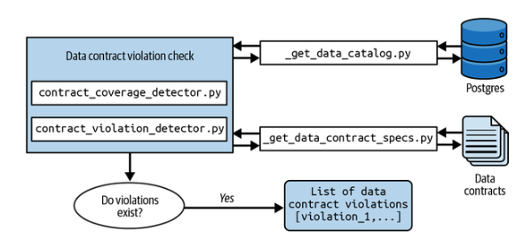

Podemos profundizar en los dos scripts anteriores para comprender cómo se realizan estas comparaciones. En los dos fragmentos de script siguientes, convertimos los metadatos de nuestro «catálogo de datos» y las especificaciones de nuestro contrato de datos en dos `DataFrames` respectivos que tienen las columnas `table_catalog`, `table_schema` y `table_name`. En el caso de contract_coverage_detector.py, hacemos una unión izquierda, en la que los activos de datos que están presentes en el directorio de especificaciones del contrato pero no en el «catálogo de datos» se marcan como una infracción:

```PYTHON
# contract_coverage_detector.py
...
def detect_coverage_in_data_catalog(self) -> List[str]:
    coverage = self.get_contract_spec_coverage()
    coverage_df = pd.DataFrame(coverage)
    catalog_df = get_data_catalog()

    merged = coverage_df.merge(
        catalog_df,
        on=['table_catalog', 'table_schema', 'table_name'],
        how='left',
        indicator=True
    )

    missing_assets_df = merged[merged['_merge'] == 'left_only']
    missing_table_names = missing_assets_df['table_name'].tolist()

    return missing_table_names
```

En contract_violation_detector.py, utilizamos un proceso similar para crear dos `DataFrames` a partir del «catálogo de datos» y las especificaciones del contrato, pero esta vez también realizamos una unión en `column_name` para obtener una mayor granularidad:

```PYTHON
# contract_violation_detector.py
...
def detect_constraint_violations(self) -> List[Dict[str, str]]:
    contract_specs_df = pd.DataFrame(
        self.transform_contract_specs_to_catalog_format()
        )
    catalog_df = get_data_catalog()

    merged = contract_specs_df.merge(
        catalog_df,
        on=['table_catalog', 'table_schema', 'table_name', 'column_name'],
        how='left',
        suffixes=('_contract', '_catalog'),
        indicator=True
    )
...
```

Como se ha indicado anteriormente, comparar infracciones más allá de un solo tipo de activo de datos aumenta considerablemente la complejidad. Aunque no vamos a profundizar aquí en esta lógica de comparación, ten en cuenta que contract_violation_detector.py tiene una función completa, `transform_contract_specs_to_catalog_format()`,, dedicada a analizar las especificaciones del contrato de datos para que coincidan con el formato de los metadatos del «catálogo de datos». Una vez más, este es uno de los momentos en los que pecamos de simplicidad y claridad con fines didácticos.

Además, esta es también la razón por la que recomendamos encarecidamente el uso de una herramienta dedicada al catálogo de datos (hay muchas opciones de código abierto disponibles), de modo que las diversas fuentes de activos de datos se abstraigan en un único formato de metadatos con el que comparar. Es posible que hayas notado a lo largo de este capítulo que hemos estado utilizando el término «catálogo de datos» entre comillas para que quede claro que estamos representando un catálogo de datos, pero en realidad nuestra implementación es bastante sencilla. Concretamente, \_get_data_catalog.py es un script SQL con un envoltorio Python que lee la tabla `information_schema` de Postgres (donde se almacenan sus metadatos). Aunque Postgres ofrece tablas de metadatos aún más detalladas, la tabla `information_schema` es común en muchas bases de datos basadas en SQL. En resumen, así es básicamente como funciona la funcionalidad principal de los catálogos de datos, y te animamos a que eches un vistazo al script para verlo por ti mismo. La diferencia clave es que los catálogos de datos gestionan la recopilación de metadatos, recopilan metadatos de múltiples fuentes y actualizan automáticamente los metadatos de forma coherente (lo que supondría un gran esfuerzo de programación).

En la siguiente sección, detallaremos cómo integramos estas detecciones en el flujo de trabajo de CI/CD a través de pruebas unitarias y, a continuación, activamos comentarios de solicitud de extracción si se detectan infracciones.

### Componente D: Prevención

Por último, el último componente de es la detección, como se destaca en el siguiente subconjunto del árbol de directorios. Para esta implementación, estamos utilizando GitHub Actions para nuestra prueba de integración continua, como se indica en el archivo .github/workflows/docker-image.yml. En segundo plano, GitHub Actions está activando un contenedor Docker y ejecutando dos trabajos: `build` y `test`. El trabajo `build` consiste en garantizar que el entorno de desarrollo sandbox funciona correctamente para nuestro repositorio; por lo tanto, nos centraremos en el trabajo `test`, que obtiene sus configuraciones de contenedor de docker-compose.test.yml (esto configura la base de datos Postgres con el esquema, pero no introduce los datos).

```TEXT
/workspace
├── docker-compose.test.yml                   # Docker compose for testing
├── .github/                                  # GitHub configuration
│   └── workflows/                            # GitHub Actions workflows
│       └── docker-image.yml                  # Docker image build workflow
└── data_contract_components/                 # Data contract components
    ├── detection/                            # Data contract violation detection
    │   ├── contract_coverage_detector.py     # Contract coverage analysis
    │   └── contract_violation_detector.py    # Contract violation detection
    └── prevention/                           # Prevent data contract violations
        └── test_data_contract_violations.py  # Contract violation tests
```

A alto nivel, docker-compose.test.yml configura la infraestructura necesaria e instala los requisitos, ejecuta el archivo de migración de la base de datos y, a continuación, realiza una comprobación de prueba unitaria mediante el siguiente comando, que luego exporta su registro a una carpeta del contenedor que puede aparecer en un comentario de solicitud de extracción:

```BASH
python -m unittest \
  data_contract_components/prevention/\
  test_data_contract_violations.py -v \
  > /workspace/test_output.log 2>&1
```

La figura 7-6 ilustra cómo funciona test_data_contract_violations.py dentro del flujo de trabajo de CI/CD en una solicitud de extracción de GitHub que quiere fusionarse con main. La prueba unitaria falla si la lista de infracciones devuelta por contract_coverage_detector.py o contract_violation_detector.py tiene una longitud superior a cero.

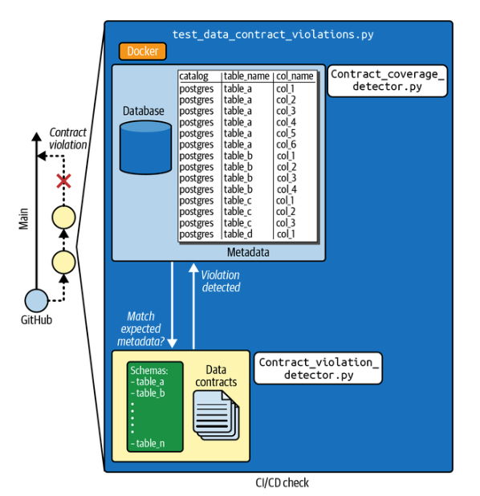

Por último, si la prueba devuelve una infracción, el registro se guarda y se pasa a GitHub a través de un comando de script en .github/workflows/docker-image.yml. La Figura 7-7 ofrece un ejemplo de un mensaje de infracción del contrato de datos a través de un comentario de solicitud de extracción de GitHub. Se trata de un error forzado al cambiar los valores dentro de la especificación del contrato de datos por valores que no tienen sentido (por ejemplo, `text -> integer`).

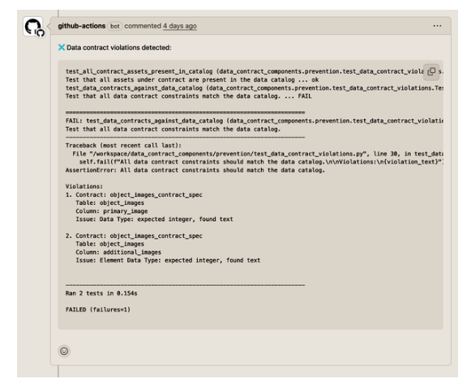

Ahora hemos completado el flujo de trabajo completo del contrato de datos y esperamos que te sientas cómodo navegando por el entorno de pruebas para crear contratos de datos adicionales o desarrollar este repositorio para probar contratos de datos en diferentes fuentes de activos de datos. En la siguiente sección, resumiremos todo el flujo de trabajo y proporcionaremos un gráfico de flujo del código fuente que destaca los archivos que debes examinar más detenidamente al revisar el flujo de trabajo de infracción del contrato de datos.

### Poniendo todo junto

A lo largo de las secciones anteriores, hemos detallado los cuatro componentes del contrato de datos (activos de datos, definición del contrato, detección y prevención) y cómo cada archivo importante dentro del directorio del proyecto se corresponde con cada componente y con el flujo de trabajo de violación del contrato. En resumen, el flujo de trabajo de violación del contrato de datos consta de lo siguiente:

1. GitHub Actions inicia el flujo de trabajo de CI/CD.

2. La tarea de integración continua (`test` en .github/workflows/docker-image.yml) inicia Docker Compose para crear un contenedor para la comprobación de incumplimiento del contrato de datos.

3. docker-compose.test.yml se utiliza para el contenedor en la capa de infraestructura.

4. El contenedor crea un servicio llamado `postgres`.

5. Este servicio `postgres` prepara una base de datos `PostgresSQL17` y envía una señal de verificación «correcta» a Docker Compose cuando se completa.

6. Después de recibir una señal de verificación «correcta» de `postgres`, el contenedor también crea un servicio llamado `devcontainer` que instala Python y los paquetes necesarios.

7. `devcontainer` El servicio ejecuta el archivo de migración de la base de datos en la base de datos dentro del servicio `postgres` a través de Alembic.

8. Una vez que `devcontainer` completa la instalación de las dependencias y confirma que la base de datos se ha configurado correctamente, ejecuta la prueba unitaria a través de test_data_contract_violations.py.

9. test_data_contract_violations.py ejecuta contract_coverage_detector.py y contract_violation_detector.py a través de la prueba unitaria integrada en Python.

10. Estas dos funciones de detección extraen los metadatos relevantes de la base de datos dentro del servicio `postgres` y los directorios de especificaciones de contratos de datos a través de \_get_data_catalog.py y \_get_data_contract_specs.py.

11. El objeto de especificación del contrato de datos object_images_contract_spec.json es referenciado por \_get_data_contract_specs.py, lo que permite la comparación entre los metadatos de la base de datos y las expectativas de la especificación del contrato de datos.

12. Si se detecta una infracción del contrato de datos, Python guarda los registros de test_data_contract_violations.py como test_output.log en el servicio `devcontainer`.

13. La tarea de integración continua, `test`, finaliza comprobando si se ha producido un fallo en la prueba y, en caso afirmativo, devuelve test_output.log como comentario dentro de la solicitud de extracción de GitHub correspondiente.

La Figura 7-8 resume todo este flujo de trabajo en un gráfico que puedes utilizar como guía para navegar por los pasos del flujo de trabajo del contrato de datos y saber a qué archivo debes hacer referencia.

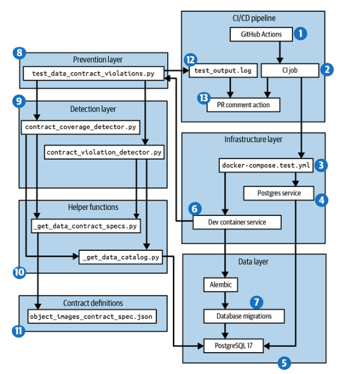

En la sección final de este capítulo, nos basaremos en nuestra comprensión de los componentes del contrato de datos y sus respectivos archivos para llevar a cabo un escenario simulado en el que se crea un cambio que incumple el contrato, se pasa por el proceso de incumplimiento y, a continuación, se utilizan contratos de e e de datos para informar de los cambios que deben existir.

## Escenario de violación del contrato de datos

Una vez más, en nuestro escenario simulado , el equipo de ingeniería de software backend tiene la tarea de crear la base de datos OLTP que dará soporte a una nueva línea de productos del negocio de software de entretenimiento. En la sección anterior asumimos el papel del ingeniero de la plataforma de datos que implementó los componentes del contrato de datos. A partir de ahora, asumiremos el papel del ingeniero de software backend que está pasando por el flujo de trabajo de violación del contrato.

### Solicitud recibida para normalizar la tabla object_images

Has recibido una solicitud para normalizar la tabla `object_images` desanidificando `object_images.additional_images`, renombrando `primary_image` a `image` y creando un booleano llamado `is_primary_image`:

```TEXT
-- Current                                 -- Requested
┌────────────────────────────────────┐     ┌─────────────────────────────────┐
│        object_images               │     │       object_images             │
├────────────────────────────────────┤     ├─────────────────────────────────┤
│ PK: object_id (Integer)            │     │ PK: object_id (Integer)         │
│     primary_image (Text)           │ --> │     image (Text)                │
│     additional_images (ARRAY[text])│     |     is_primary_image (Boolean)  |
│     created_at (DateTime)          │     |     created_at (DateTime)       │
└────────────────────────────────────┘     └─────────────────────────────────┘
```

La solicitud tiene sentido, ya que se ajusta a los objetivos de esta base de datos y facilitará el trabajo con los datos de las imágenes. Además, dado que se encuentra en las primeras fases de desarrollo, solo sabes que el equipo de ingeniería de software que respalda el proyecto necesita esta base de datos, que aún no está conectada a la aplicación. Por lo tanto, también crees que tiene sentido eliminar la tabla por completo, por lo que implementas la versión más actualizada de `object_images` dentro de la base de datos transaccional.

### Actualizar el archivo de migración de datos para el nuevo esquema

En primer lugar, creas una nueva rama con el siguiente comando en tu terminal:

```BASH
git checkout -b 'update-objects-images-schema'
```

A continuación, en una rama de desarrollo dentro de data_assets/db_migrations/ver⁠sions​/00e9b3375a5f_create_met_museum_seed_tables.py, actualizas el archivo de migración de la base de datos para reflejar el esquema correcto de la tabla `object_images` sustituyendo este código por la siguiente actualización:

```PYTHON
# old schema to replace
    op.create_table(
        "object_images",
        sa.Column(
            "object_id",
            sa.Integer,
            primary_key=True,
            comment=column_comment_dict["object_id"]
        ),
        sa.Column(
            "primary_image",
            sa.Text,
            comment=column_comment_dict["primary_image"]
        ),
        sa.Column(
            "additional_images",
            ARRAY(sa.Text),
            comment=column_comment_dict["additional_images"]
        ),
        sa.Column(
            "created_at",
            sa.DateTime,
            nullable=False,
            server_default=sa.text("CURRENT_TIMESTAMP"),
            comment=column_comment_dict["created_at"]
        ),
    )

# new schema for `object_images`
    op.create_table(
        "object_images",
        sa.Column(
            "object_id",
            sa.Integer,
            primary_key=True,
            comment=column_comment_dict["object_id"]
        ),
        sa.Column(
            "image",
            sa.Text,
            comment=column_comment_dict["primary_image"]
        ),
        sa.Column(
            "is_primary_image",
            sa.Boolean,
            comment="Identifies if it's the primary image for the object."
        ),
        sa.Column(
            "created_at",
            sa.DateTime,
            nullable=False,
            server_default=sa.text("CURRENT_TIMESTAMP"),
            comment=column_comment_dict["created_at"]
        ),
    )
```

A continuación, ejecuta los siguientes comandos en tu terminal para eliminar todas las tablas y los datos inicializados de Postgres en tu área de desarrollo, y luego implementa una nueva migración de la base de datos con las actualizaciones de `object_images`:

```BASH
cd ~/../workspace/data_contract_components/data_assets
alembic downgrade base
alembic upgrade head
```

Deberías esperar los siguientes registros de de Alembic:

```TEXT
(update-objects-images-schema) $ alembic downgrade base
INFO  [alembic.runtime.migration] Context impl PostgresqlImpl.
INFO  [alembic.runtime.migration] Will assume transactional DDL.
INFO  [alembic.runtime.migration] Running downgrade 00e9b3375a5f -> , create met
      museum seed tables

(update-objects-images-schema) $ alembic upgrade head
INFO  [alembic.runtime.migration] Context impl PostgresqlImpl.
INFO  [alembic.runtime.migration] Will assume transactional DDL.
INFO  [alembic.runtime.migration] Running upgrade  -> 00e9b3375a5f, create met
      museum seed tables
```

### Comprueba las pruebas unitarias y activa la violación del contrato

Antes de enviar tu cambio a tu rama remota, primero regresa a tu carpeta de directorio raíz, `workspace`, y ejecuta tus pruebas unitarias localmente mediante los siguientes comandos:

```BASH
cd ~/../workspace
python -m unittest data_contract_components/prevention/test_data_contract
_violations.py -v
```

Para tu sorpresa, recibes la siguiente prueba fallida para los dos campos exactos que actualizaste. Parece que el equipo de ingeniería de la plataforma de datos finalmente ha implementado contratos de datos en este repositorio:

```BASH
(update-objects-images-schema) $ python -m unittest data_contract_components/
prevention/test_data_contract_violations.py -v
test_all_contract_assets_present_in_catalog
(data_contract_components.prevention.test_data_contract_violations.
TestContractViolations.test_all_contract_assets_present_in_catalog)
Test that all assets under contract are present in the data catalog ... ok
test_data_contracts_against_data_catalog (data_contract_components.
prevention.test_data_contract_violations.TestContractViolations.
test_data_contracts_against_data_catalog)
Test that all data contract constraints match the data catalog. ... FAIL

======================================================================
FAIL: test_data_contracts_against_data_catalog (data_contract_components.
prevention.test_data_contract_violations.TestContractViolations.
test_data_contracts_against_data_catalog)
Test that all data contract constraints match the data catalog.
----------------------------------------------------------------------
Traceback (most recent call last):
  File "/workspace/data_contract_components/prevention/test_data_contract_
violations.py", line 30, in test_data_contracts_against_data_catalog
    self.fail(f"All data contract constraints should match the data
catalog.\n\nViolations:\n{violation_text}")

Violations:
1. Contract: object_images_contract_spec
   Table: object_images
   Column: primary_image
   Issue: Column 'primary_image' is defined in contract but missing from
          data catalog

2. Contract: object_images_contract_spec
   Table: object_images
   Column: additional_images
   Issue: Column 'additional_images' is defined in contract but missing from
          data catalog


----------------------------------------------------------------------
Ran 2 tests in 0.240s

FAILED (failures=1)
```

### Enviar a la rama remota y ver los registros de errores

Para que esta infracción se registre en la solicitud de extracción, envías tu rama local a tu rama remota mediante los siguientes comandos:

```BASH
git add .
git commit -m 'adding updates that caused contract violation'
git push --set-upstream origin update-objects-images-schema
```

Como era de esperar, las comprobaciones de CI/CD a través de GitHub Actions fallan, como se ve en la Figura 7-9.

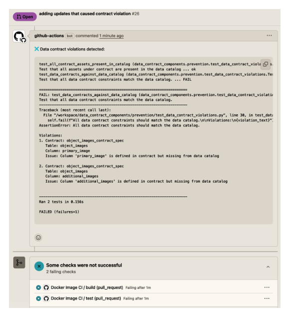

Esto también será útil cuando intentes explicar el problema a tus compañeros.

### Revertir los cambios de migración de la base de datos

Para deshacer esta confirmación enviada a tu rama remota, utiliza los siguientes comandos:

```BASH
git revert HEAD
git push
```

> **Nota**

> La forma en que abordes la gestión de las ramas y los cambios de Git dependerá de tu organización y/o equipo específico. Se ha elegido este enfoque por su simplicidad para este tutorial.

También confirmas que las pruebas de CI/CD vuelven a pasar, como se ve en la Figura 7-10.

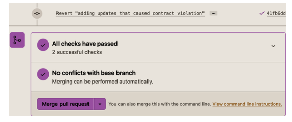

Los siguientes pasos son encontrar la especificación del contrato de datos que está causando tus infracciones y determinar con qué equipo debes hablar para obtener más información sobre sus necesidades.

### Habla con el equipo descendente para conocer el caso de uso

Localizas la especificación del contrato en data*contract_components/contract_defini⁠tion/​object*​images_contract_spec.json e identificas en la especificación que el propietario es el siguiente:

```JSON
"owner": {
      "name": "Data Engineering Team",
      "email": "data-eng@museum.org"
    },
```

Te pones en contacto con el equipo de ingeniería de datos y obtienes la siguiente información nueva:

- El equipo de ciencia de datos comenzó el entrenamiento de su modelo la semana pasada y depende en gran medida de `object_images`.

- Dicho esto, al tener las imágenes divididas entre `object_images.primary_image` y `object_images.additional_images`, siendo esta última una matriz, se requiere un preprocesamiento de datos adicional y una lógica de negocio que el equipo de ciencia de datos tiene que mantener.

- El equipo de ciencia de datos está entusiasmado con la tabla normalizada y está de acuerdo con el cambio, pero necesita tiempo para actualizar sus canalizaciones de preprocesamiento de datos para tener en cuenta el nuevo esquema de `object_images`.

Por lo tanto, tú y tus partes interesadas decidís 1) no eliminar `object_images`, 2) crear una nueva tabla llamada `object_images_normalized` y 3) mantener `object_images` durante un mes para dar tiempo al equipo de ciencia de datos a realizar la transición.

### Crear un nuevo contrato de datos para la tabla object_images_normalized

Ahora que los contratos de datos están en vigor, puedes aprovecharlos para definir tus expectativas para `object_images_normalized` y utilizar la prueba unitaria de violación de contrato para confirmar que la migración de tu base de datos no causará un fallo. Ejecuta el siguiente comando para crear un nuevo archivo de contrato:

```BASH
touch
data_contract_components/contract_definition/object_images_normalized
_contract_spec.json
```

Antes de seguir leyendo, intenta crear tu propia especificación de contrato de datos para `object_images_normalized` adaptando la especificación existente object_images_contract_spec.json. También puedes simplemente copiar y pegar lo siguiente en object_images_normalized_contract_spec.json:

```JSON
{
    "spec-version": "1.0.0",
    "name": "object-images-normalized-contract-spec",
    "namespace": "met-museum-data",
    "dataAssetResourceName": "postgresql://postgres:5432/postgres.object_
images_normalized",
    "doc": "Data contract for the object_images_noralized table containing
image URLs and metadata for museum objects and creation timestamps.",
    "owner": {
      "name": "Data Engineering Team",
      "email": "data-eng@museum.org"
    },
    "schema": {
      "$schema": "https://json-schema.org/draft/2020-12/schema",
      "title": "Object Images Normalized Table Schema",
      "table_catalog": "postgres",
      "table_schema": "public",
      "table_name": "object_images_normalized",
      "properties": {
        "object_id": {
          "description": "Identifying number for each artwork (unique, can be
used as key field)",
          "examples": [437133],
          "constraints": {
            "primaryKey": true,
            "data_type": "integer",
            "numeric_precision": 32.0,
            "is_nullable": false,
            "is_updatable": true
          }
        },
        "image": {
          "description": "URL to the image of an object (JPEG)",
          "examples": ["https://images.metmuseum.org/.../DT1234.jpg"],
          "constraints": {
            "primaryKey": false,
            "data_type": "text",
            "is_nullable": true,
            "is_updatable": true
          }
        },
        "is_primary_image": {
          "description": "Boolean flagging if the image is a primary image
for the museum.",
          "constraints": {
            "primaryKey": false,
            "data_type": "boolean",
            "is_nullable": true,
            "is_updatable": true
          }
        },
        "created_at": {
          "description": "Timestamp when this record was created in the
database",
          "examples": ["2025-01-15T10:30:00.000Z"],
          "items": null,
          "constraints": {
            "primaryKey": false,
            "data_type": "timestamp without time zone",
            "datetime_precision": 6.0,
            "is_nullable": false,
            "is_updatable": true
          }
        }
      }
    }
  }
```

Nuestro siguiente paso es ver qué errores se producen ahora que tenemos una nueva especificación de contrato, pero el archivo de migración de la base de datos aún no refleja la nueva tabla.

### Ejecuta las pruebas unitarias y observa el error por falta de activos en el catálogo

Una vez más, ejecuta los siguientes comandos para restablecer tu base de datos Postgres basándote en el archivo de migración de la base de datos más actualizado:

```BASH
cd ~/../workspace/data_contract_components/data_assets
alembic downgrade base
alembic upgrade head
```

Después, ejecuta de nuevo el comando de prueba unitaria:

```BASH
cd ~/../workspace
python -m unittest data_contract_components/prevention/test_data_contract
_violations.py -v
```

Como era de esperar, obtienes el siguiente mensaje de error, que destaca que tu nuevo contrato de datos existe pero no está presente en el catálogo de datos:

```BASH
AssertionError: False is not true : All assets under contract should
be present in data catalog.
Missing: ['object_images_normalized']

======================================================================

AssertionError: All data contract constraints should match the data
catalog.

Violations:
1. Contract: object_images_normalized_contract_spec
   Table: object_images_normalized
   Column: object_id
   Issue: Column 'object_id' is defined in contract but missing from
          data catalog

2. Contract: object_images_normalized_contract_spec
   Table: object_images_normalized
   Column: image
   Issue: Column 'image' is defined in contract but missing from data
          catalog

3. Contract: object_images_normalized_contract_spec
   Table: object_images_normalized
   Column: is_primary_image
   Issue: Column 'is_primary_image' is defined in contract but missing
          from data catalog

4. Contract: object_images_normalized_contract_spec
   Table: object_images_normalized
   Column: created_at
   Issue: Column 'created_at' is defined in contract but missing from
          data catalog


----------------------------------------------------------------------
Ran 2 tests in 0.213s

FAILED (failures=2)
```

Una vez más, envía los cambios locales a tu rama remota para que los errores se registren en la solicitud de extracción:

```BASH
git add .
git commit -m 'added new contract, but need to update the db migration
file still'
git push
```

Por lo tanto, el siguiente paso es actualizar el archivo de migración de la base de datos para añadir el activo de datos `object_images_normalized` hasta que ya no recibas violaciones del contrato de datos de las pruebas unitarias.

### Corregir la migración de la base de datos hasta que todas las comprobaciones sean satisfactorias

Ejecuta los siguientes comandos para restablecer tu base de datos Postgres a través de `alembic downgrade base`:

```BASH
cd ~/../workspace/data_contract_components/data_assets
alembic downgrade base
```

Antes de seguir leyendo, intenta actualizar data_contract_components/data_assets/db_migrations/versions/00e9b3375a5f_create_met_museum_seed_tables.py para incluir la creación de la tabla `object_images_normalized`. Cuando hayas terminado, deberías tener el siguiente fragmento de código añadido en `def upgrade() -> None:`:

```PYTHON
op.create_table(
    "object_images_normalized",
    sa.Column(
        "object_id",
        sa.Integer,
        primary_key=True,
        comment=column_comment_dict["object_id"]
    ),
    sa.Column(
        "image",
        sa.Text,
        comment="URL to the image of an object (JPEG)"
    ),
    sa.Column(
        "is_primary_image",
        sa.Boolean,
        comment="Identifies if it's the primary image for the object."
    ),
    sa.Column(
        "created_at",
        sa.DateTime,
        nullable=False,
        server_default=sa.text("CURRENT_TIMESTAMP"),
        comment=column_comment_dict["created_at"]
    ),
)
```

También deberías tener el siguiente fragmento en `def downgrade() -> None:` para asegurarte de limpiar correctamente la base de datos con la nueva tabla:

```PYTHON
def downgrade() -> None:
    """Downgrade schema."""
    op.drop_table("object")
    op.drop_table("object_history")
    op.drop_table("object_physical_properties")
    op.drop_table("object_gallery_info")
    op.drop_table("object_tags")
    op.drop_table("object_images")
    op.drop_table("object_images_normalized") #add this line
    op.drop_table("object_copyright")
    op.drop_table("object_api_metadata")
```

Ejecuta los siguientes comandos para configurar tu base de datos Postgres con la nueva tabla `object_images_normalized`:

```BASH
cd ~/../workspace/data_contract_components/data_assets
alembic upgrade head
```

Por último, ejecuta el comando de prueba unitaria para confirmar que no hay más infracciones:

```BASH
cd ~/../workspace
python -m unittest data_contract_components/prevention/test_data_contract
_violations.py -v
```

Puedes confirmar que la prueba unitaria no ha devuelto ningún fallo en la comprobación de infracciones del contrato de datos:

```BASH
test_all_contract_assets_present_in_catalog
(data_contract_components.prevention.test_data_contract_violations.TestContract
Violations.test_all_contract_assets_present_in_catalog)
Test that all assets under contract are present in the data catalog ... ok

test_data_contracts_against_data_catalog (data_contract_components.prevention.
test_data_contract_violations.TestContractViolations.
test_data_contracts_against_data_catalog)
Test that all data contract constraints match the data catalog. ... ok

----------------------------------------------------------------------
Ran 2 tests in 0.176s

OK
```

El último paso es enviar tu cambio a tu rama remota para confirmar que las comprobaciones de CI/CD se superan.

### Envía a la rama remota y comprueba que se superan

Ejecuta los siguientes comandos Git para enviar tu rama local a la remota y ver los registros de GitHub Actions:

```BASH
git add .
git commit -m 'adding updated spec and db migration file for object_images
_normalized'
git push
```

Como se confirma en la Figura 7-11, todas nuestras pruebas ahora pasan tanto para la nueva especificación del contrato como para el nuevo activo de datos `object_images_normalized`.

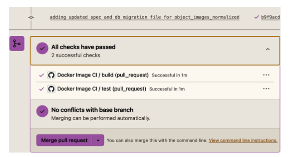

Ahora que las pruebas han pasado, es el momento de pedirle a un compañero que revise el código y, finalmente, fusionar este código con la rama `main`.

## Conclusión

¡Enhorabuena por implementar tu primer contrato de datos y completar el tutorial! En este capítulo, hemos proporcionado una guía completa de la implementación de una arquitectura de contrato de datos y sus scripts correspondientes. Además, hemos detallado cómo implementar tus propias especificaciones de contrato de datos con fines de aprendizaje y te hemos proporcionado las ventajas e inconvenientes de gestionar tus propias especificaciones de contrato de datos. Por último, hemos cerrado el capítulo con un escenario simulado que imita lo que experimentará un productor de datos a lo largo del flujo de trabajo de infracción del contrato de datos.

Al terminar este capítulo, deberías ser capaz de lograr lo siguiente:

- Comprende cómo implementar los cuatro componentes del contrato de datos: activos de datos, especificación del contrato de datos, detección y prevención.

- Crea una especificación de contrato de datos mediante JSON Schema como medio para comprender cómo evaluar las especificaciones disponibles en el mercado o si conviene crear una propia para casos de uso específicos.

- Aprender a aprovechar los metadatos de las bases de datos para crear tu propio «catálogo de datos» con el que comparar las especificaciones de los contratos de datos.

- Incrustar contratos de datos en pruebas unitarias para realizar pruebas locales e incrustarlos en el flujo de trabajo de CI/CD.

- Recorre completamente el flujo de trabajo de violación de contratos de datos en una solicitud de extracción.

Una vez más, queremos destacar que esta implementación y el entorno de pruebas tienen fines didácticos. Escalar más allá de unos pocos contratos de datos aumenta la complejidad de la gestión de sus ciclos de vida, por lo que debes considerar detenidamente las ventajas e inconvenientes de crear los tuyos propios, aprovechar una herramienta de código abierto o comprar un producto específico (por ejemplo, un servicio de catálogo de datos) para cada componente de la arquitectura de contratos de datos.

Además, insistimos en tener un repositorio de código para este libro, ya que una de las primeras quejas que escuchamos sobre los contratos de datos fue «Son demasiado teóricos». Especialmente entre otros equipos técnicos, como los ingenieros de software upstream, disponer de código para su exploración puede ayudarte a generar rápidamente aceptación e ilustrar cómo este trabajo se diferencia de las pruebas unitarias, las pruebas de control de calidad y la observabilidad de los datos. Además, puedes aprovechar este repositorio como plataforma de lanzamiento para poner en marcha rápidamente una prueba de concepto que te ayude a conseguir la aceptación dentro de tu organización (lo cual discutiremos en los capítulos 9 a 12).

En el siguiente capítulo, seguimos alejándonos de la teoría y presentamos tres casos prácticos reales de contratos de datos en producción de empresas que entrevistamos para el libro.
