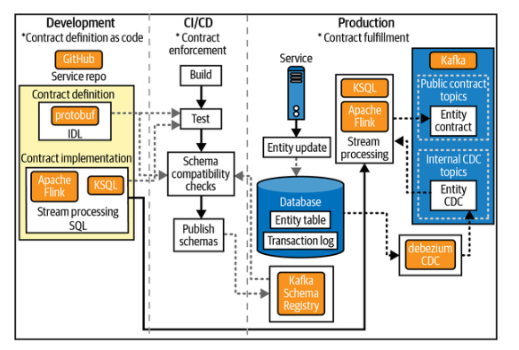
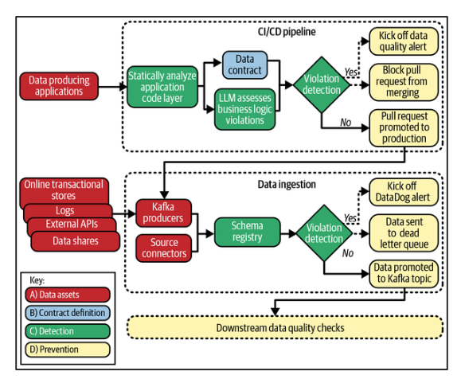
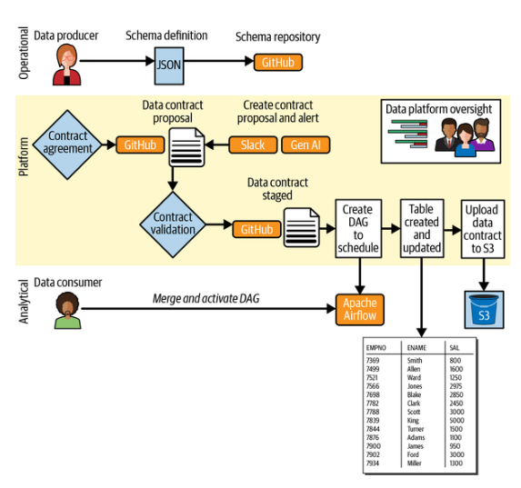
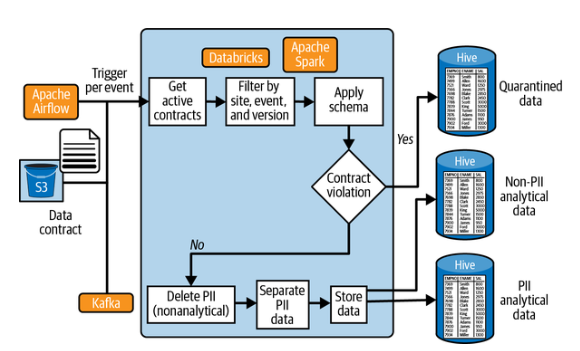

# Capítulo 8. Casos prácticos reales de contratos de datos en producción

Dado que este capítulo se encuentra entre la segunda y la tercera sección del libro, lo hemos diseñado para ayudar a pasar de los aspectos prácticos y técnicos de la implementación de contratos de datos a los aspectos centrados en las personas y las organizaciones que son necesarios para iniciar, impulsar y mantener una adopción duradera. Para ello, compartiremos tres historias sobre la adopción de contratos de datos, cada una de las cuales presenta un caso diferente en el que los profesionales de los datos se enfrentaron a la realidad de que el statu quo de la gestión de datos en su organización ya no era viable.

Presentadas como partes de un todo mayor, estas historias facilitan la visualización de las tendencias paralelas que las atraviesan, tendencias que están remodelando el mundo de los datos en tiempo real. Es posible que hayas percibido estas tendencias dentro de tu propia organización, lo que tal vez te haya inspirado a leer este libro. Como confirmaremos, no es tu imaginación. Estas historias sirven como prueba de que los líderes de datos como tú están replanteándose cómo abordan la calidad de los datos en sí, cómo estructuran sus equipos y qué se necesita dentro de una organización para pasar de la autonomía reactiva a la responsabilidad proactiva.

Los ejemplos evidencian un cambio que se está produciendo, en el que un número cada vez mayor de líderes, profesionales y equipos se ven obligados a tomar decisiones difíciles, cuestionar supuestos arraigados y arriesgarse de forma inteligente, estratégica e informada con algo nuevo. Esto es un cambio, y el cambio puede resultar intimidante, si no directamente aterrador.

El cambio también puede ser muy difícil de reconocer cuando te encuentras en medio de él. Postulamos que estas historias, además de otras similares que los profesionales de datos comparten en canales de Slack, artículos de blogs y redes sociales, no son solo historias. Son señales. No son señales fuertes, necesariamente, pero sin duda son persistentes. Y cuando las colocamos una al lado de la otra, como hemos hecho en este capítulo, se vuelven más fáciles de leer.

Al igual que las capas sedimentarias de las rocas, estas historias de adopción forman un patrón y actúan como estratos. Las experiencias acumuladas de diferentes equipos, industrias y puntos de inflexión, cuando se observan en secuencia, revelan las profundas ondas de un movimiento que ya está en marcha. Ofrecen más que anécdotas: ofrecen pruebas. El cambio en el trabajo con datos no es imaginario, aislado ni limitado a un nicho. Está ocurriendo ahora mismo, en toda la industria. Y si tú también lo estás experimentando, no estás solo.

Comenzamos con la historia de adopción del contrato de datos del coautor Chad Sanderson en Convoy, basada en su relato en primera persona de lo que sucede cuando la vieja forma de hacer las cosas se derrumba bajo la presión de una nueva empresa emergente. A continuación, pasaremos a Glassdoor, donde la necesidad de replantearse la propiedad de los datos y la responsabilidad operativa no surgió de una sola voz, sino de los líderes que atendieron colectivamente a una necesidad interna más amplia. Por último, viajaremos al otro lado del mundo, a Adevinta España, donde se produjeron presiones similares en circunstancias muy diferentes, lo que confirma que este movimiento no se limita a una red, una zona geográfica o un ámbito concretos.

## Historia del contrato de datos de Convoy

A través de su plataforma de software patentada « », Convoy permitió la reserva instantánea, la transparencia de precios y la asignación automática de cargas a los camiones disponibles, como si fuera un Uber para el transporte de mercancías. El objetivo era reducir el nivel de desperdicio e ineficiencia que se aceptaba anteriormente en el sector, al tiempo que se proporcionaban pagos más rápidos y una mejor comprensión de los datos a todas las partes implicadas. En esencia, Convoy utilizó datos y aprendizaje automático para crear un mercado competitivo en el que los proveedores presentaban sus ofertas y los camioneros aceptaban los trabajos.

Cuando Chad se incorporó a Convoy, la empresa contaba con 250 empleados y acababa de completar su ronda de financiación de la serie C. Sin embargo, nadie podía prever la intensidad del crecimiento que Convoy experimentaría en poco tiempo, pasando a tener aproximadamente 1000 empleados en los dos años siguientes. El equipo de la plataforma de datos que Chad fue contratado para dirigir pasó de solo 4 a más de 40 personas durante este tiempo.

Sin embargo, esta expansión paralela del equipo de datos no fue casual, ya que Convoy se construyó como una organización centrada en los datos, sentando unas bases sólidas comparables a las de las pilas de datos modernas actuales. Comenzó con equipos de datos que utilizaban Amazon Redshift antes de adoptar finalmente Snowflake. Para la coordinación de datos, Convoy confió en AWS junto con otras herramientas, como Airflow, Spark, dbt, Fivetran y Census. Además, la cultura en su conjunto estaba muy orientada a los datos, y los ejecutivos, muy comprometidos, utilizaban regularmente paneles de control vinculados a los OKR y los KPI.

Sin embargo, a medida que Convoy seguía creciendo, las grietas se hicieron más evidentes y numerosas en torno a sus productos de datos. A medida que la calidad de los datos se volvía inestable, los paneles de control ejecutivos empezaron a generar más preguntas que respuestas. Y a medida que estas preguntas se iban transmitiendo a lo largo de la cadena, pasando de la alta dirección a los gerentes y de los gerentes a los analistas, los empleados de Convoy al final de la cadena eran cada vez más incapaces de explicar qué estaba fallando.

Además del relato de Chad sobre la situación, también entrevistamos a su colega Adrian Kreuziger, ingeniero de software principal de Convoy en ese momento, que ayudó a dirigir la implementación de los contratos de datos. Como afirmó Adrian:

_Una vez que empezamos a ampliar el equipo de ciencia de datos, facilitando a las personas la escritura de modelos dbt, y luego también realizando este tipo de migración de microservicios, la complejidad de los datos empeoró considerablemente... Lo que le digo a la gente es que el problema de Convoy no era la escala. Solo hay un número limitado de envíos que se realizan cada día en Estados Unidos. El problema de Convoy era la complejidad del modelo de datos. Estás modelando toda la industria del transporte por carretera, desde conceptos abstractos como los envíos hasta las instalaciones, los conductores y la geolocalización. La industria del transporte de mercancías es increíblemente complicada. Así que, a medida que ampliábamos el negocio y la oferta de productos, teníamos que modelar cada vez más el sector del transporte por carretera. Y ahora tienes 150 desarrolladores que cambian este modelo de datos para incorporar nuevas funciones en este modelo de datos increíblemente complejo, mientras que los científicos de datos intentan construir algo sobre él. Era un movimiento constante._

A medida que los equipos de datos ponían en marcha más sistemas, les resultaba cada vez más difícil rastrear el origen de los problemas en curso. Hubo un momento en particular en el que esto quedó dolorosamente claro y sirvió como llamada de atención para toda la empresa.

Mientras que la oferta de servicios de Convoy y la necesidad de innovar continuamente se hacían cada vez más apremiantes, incluso los cambios relativamente pequeños en las fases iniciales pronto tenían el potencial de causar fallos inesperados en las fases posteriores. «Si entra basura, sale basura» fue como Chad, e , describió más tarde el problemático bucle en el que se encontraba Convoy en ese momento, en el que un silencioso cambio de esquema tenía el potencial de romper completamente un sistema de producción. Era una realidad a la que la empresa tenía que enfrentarse y en la que nadie tenía formas fiables de detectar de antemano estos riesgos críticos para el negocio.

A pesar de ampliar su oferta con el tiempo, el mercado de transporte de mercancías seguía siendo el motor principal de la empresa. Sin embargo, los problemas con los datos se acumularon hasta tal punto que, en última instancia, y quizás de forma inevitable, un panel de control clave comenzó a indicar de repente a las partes interesadas que la participación en las subastas estaba disminuyendo. Los directivos de la empresa concluyeron que probablemente se trataba de un problema de marketing. Desesperados por corregirlo, dieron instrucciones a los directores de marketing de la organización para que invirtieran fuertemente en una campaña diseñada para impulsar la participación y anular la caída del interés. Tras varias semanas y cientos de miles de dólares invertidos, se descubrió el verdadero problema: la caída se debía a un error en la tabla de datos que alimentaba el panel de control. El sistema no había fallado, sino los datos, lo que sacudió a la empresa. No solo se había llegado a un punto en el que los problemas podían surgir de cualquier parte, sino que ahora los directivos no podían estar seguros de su capacidad para diagnosticar correctamente lo que estaba sucediendo con el fin de corregir los problemas.

Desde un punto de vista técnico, Adrian describió cómo el punto de inflexión fue la introducción de Kafka:

_Creo que el verdadero motor fue la introducción de Kafka y el intento de que nuestros desarrolladores y nuestro equipo de ingeniería empezaran a emitir más eventos semánticos en lugar de eventos CDC. Antes, lo único que teníamos eran básicamente eventos de captura de datos de cambio sobre cómo se modificaban las cosas en la base de datos. Los eventos CDC son excelentes para indicar el estado del mundo en un momento determinado. Pero no son tan buenos para indicar por qué el mundo ha cambiado para que ese estado cambie._

_Y lo que acabó sucediendo fue que teníamos a gente intentando hacer ingeniería inversa de eventos del mundo real que habían ocurrido basándose en una serie de eventos CDC. Así que podrías tener un envío y recibir un evento CDC en el que el estado ha cambiado de «en curso» a «cancelado». Y entonces, conceptualmente, puedes decir: «Vale, el envío debe de haber sido cancelado». Puedes aplicar ingeniería inversa a partir del historial. Eso también se vuelve muy, muy complicado y muy propenso a errores._

La verdad era ahora dolorosamente clara. Todos trabajaban duro, pero nadie tenía el mapa completo. Las soluciones no duraban. Las herramientas de visibilidad ayudaban a detectar los síntomas, pero no las causas. Así que Chad, Adrian y el equipo de la plataforma de datos intentaron reunirse y hacer lo que cualquier buen profesional de los datos hace cuando se queda sin respuestas: empezaron a comprobar sus hipótesis. Como parte de estos esfuerzos, Chad comenzó a hablar con otros profesionales de los datos e intentó averiguar qué funcionaba, qué no y cómo pensaban otros equipos sobre problemas similares, cualquier cosa que pudiera ayudarles a comprender lo que realmente estaba pasando.

Tras llevar este aprendizaje a la empresa, los equipos de datos de Convoy comenzaron primero a intentar mejorar la visibilidad invirtiendo en mejores herramientas de linaje para rastrear cómo se movían los datos a través del sistema. Esto ayudó en cierta medida, pero no resolvió el problema de fondo al que se enfrentaba Convoy. Así que dieron un giro y se centraron en la documentación. Se crearon herramientas internas para que las fuentes y definiciones de datos fueran más accesibles. Sin embargo, una vez más, el impacto general fue limitado, ya que las nuevas herramientas aportaban claridad en algunos aspectos, pero seguían surgiendo problemas.

Finalmente, a través de este incansable proceso de prueba y error, y de un pensamiento basado en principios básicos, el equipo se dio cuenta de que el problema más profundo no era técnico en sí mismo. Se debía a una falta de responsabilidad: nadie e e era responsable del ciclo de vida completo de los conjuntos de datos en Convoy. Por lo tanto, no existía ningún mecanismo para hacer cumplir las expectativas de calidad entre los equipos: no había un entendimiento común de cómo debían ser los datos, ni líneas claras de responsabilidad sobre quién era el responsable cuando algo fallaba. Como recuerda Chad: «Esta constatación nos golpeó a todos como un mazazo. No solo necesitábamos mejores herramientas. Necesitábamos un acuerdo, algo que se estableciera desde el principio y que definiera qué significaba "correcto"».

Esta constatación llevó a Chad y al equipo de Convoy a empezar a poner a prueba los contratos de datos como acuerdos vinculantes entre un grupo selecto de productores y consumidores de datos, desplazando los controles de calidad a las fases iniciales para que se realizaran lo antes posible en el ciclo de vida de los datos. Para ello, empezaron a trabajar con ingenieros de software para implementar los contratos de datos directamente en el proceso de CI/CD. La figura 8-1, del artículo de Chad y Adrian, «An Engineer’s Guide to Data Contracts: Pt. 1»(Guía de un ingeniero sobre los contratos de datos: parte 1), ilustra su implementación e e en Convoy.



Los contratos se versionaron y se separaron de las bases de datos operativas, lo que creó una interfaz más estable y predecible entre los equipos de arriba y abajo. Como resultado, los contratos de datos comenzaron a proporcionar una capa de abstracción. Los consumidores definieron lo que necesitaban y los ingenieros lo implementaron en una interfaz clara.

A medida que la adopción de los contratos de datos ganaba terreno en Convoy, los equipos de toda la organización se dieron cuenta de que se trataba de un problema de alineación, no simplemente de herramientas. Como describe Adrian:

_Básicamente, hizo que los datos se convirtieran en algo mucho más importante en la mente de los desarrolladores. Así que, excepto algunos equipos seleccionados muy centrados en el aprendizaje automático, en los que los ingenieros y los científicos de datos trabajaban muy bien juntos, los demás ingenieros no tenían ni idea de que sus datos se enviaban al almacén. Solo se centraban en crear su servicio y su base de datos de producción. El hecho de que se reflejara en el almacén y se utilizara en fases posteriores... [era] una caja negra._

_Al realizar este ejercicio con un equipo y decir: «Oigan, replanteémonos vuestro modelo de datos, averigüemos qué queréis mostrar al resto del mundo», de repente, cuando los ingenieros realizan cambios para una nueva función, inmediatamente piensan en cosas como: «Oh, probablemente deberíamos añadir algunos eventos nuevos aquí» o «Tenemos que actualizar ese evento y probablemente hablar con el equipo de ciencia de datos». Eso lo hizo mucho más evidente y claro. Y como creamos herramientas de desarrollo en torno a esto, se convirtió en algo mucho más parecido a su flujo de trabajo estándar. Obtuvieron comentarios en tiempo de compilación cuando estaban haciendo cambios que sabíamos que no estaban permitidos._

Así que los contratos en Convoy cambiaron todo esto a un nivel fundamental, creando expectativas compartidas impuestas por el código, no dependientes de la conversación. Permitieron a los productores y consumidores de datos ponerse de acuerdo sobre el esquema, el significado y la responsabilidad. Y al desplazar los datos hacia la izquierda en la organización en general, se convirtió en algo normal que estas expectativas formaran parte del proceso de desarrollo en el futuro. Esto generó confianza en los equipos descendentes, ya que empezaron a confiar en que su trabajo no se vería interrumpido sin previo aviso. Sí, la adopción de contratos volvió a poner en marcha la gestión de datos en Convoy. Pero su éxito también impulsó la importancia de la calidad de los datos en la propia cultura.

Sin embargo, el cambio más importante fue psicológico: los equipos dejaron de esperar a que surgiera el siguiente problema o a que el sistema fallara. Los analistas dejaron de cuestionar los datos. Los ingenieros tenían menos tickets reactivos y más confianza en el impacto de su código. Las conversaciones pasaron de centrarse en los parches a centrarse en la planificación. Todo el sistema parecía más estable, porque lo era.

Los resultados no se limitaron a la prevención de errores. Se trataba de dar a los equipos de Convoy la capacidad de mantener su atención en las expectativas de sus datos y su código.

Además de la historia de Convoy, Adrian también compartió otros consejos sobre los que ha reflexionado desde que dejó Convoy:

_Según mi experiencia, es necesario que los contratos de datos formen parte del flujo normal de los desarrolladores. Deben considerarlos como una herramienta más para desarrolladores para que realmente se adopten. Y luego, otra cosa importante que quiero reiterar es que los contratos no deben verse como si fuéramos a coger todo lo que tenemos y ponerlo bajo contrato de una sola vez. En primer lugar, hay que abordarlo verticalmente, o solo poner contratos donde realmente tengan sentido. Y luego puedes utilizar los contratos como una forma de replantearte tus datos existentes y ayudar a impulsar el modelo de datos que deseas, en lugar del modelo de datos con el que estás atascado._

## Historia del contrato de datos de Glassdoor

Glassdoor es una de las primeras empresas en implementar contratos de datos que no solo están en producción, sino que también utilizan la captura avanzada de metadatos, como el análisis de código estático, para impulsar la prevención. Este caso práctico profundiza en la información pública disponible sobre su implementación a través de«Data Quality at Petabyte Scale: Building Trust in the Data Lifecycle» (Calidad de los datos aescala de petabytes: generar confianza enel ciclo de vida de los datos), una publicación en el blog de Glassdoor Engineering de Zakariah Siyaji, director de ingeniería de plataformas de datos en el momento de redactar este artículo. Además, tuvimos la suerte de que Zaki participara como ponente en nuestra conferencia Shift Left Data, donde proporcionó más información sobre la implementación a través de su charla titulada «Shifting From Reactive to Proactive at Glassdoor» (Pasar de reactivo a proact ivo en Glassdoor).

Glassdoor es una plataforma en línea para publicar ofertas de empleo y escribir reseñas sobre empleadores, ya sea como empleado o como alguien que ha pasado por una entrevista. Una de sus líneas de negocio que genera ingresos es la venta de anuncios de empleo en su plataforma. En lo que respecta a los datos, esto significa que las impresiones de los anuncios de marcas específicas son fundamentales y, por lo tanto, tienen un estándar más alto de calidad de datos. Este flujo se describió mejor en la charla de Zaki en la conferencia de la siguiente manera:

_Para nosotros, las impresiones de marca son muy importantes, ya que su flujo de datos pasa por muchas manos en Glassdoor. Así que pasa de las aplicaciones que producen datos, a través de otra aplicación, luego a través de [una] pasarela de API y una variedad de sistemas dentro de AWS, y luego pasa por ETL. Y entonces, cuando hay tantos traspasos, la pregunta que nos hacemos es: «Bueno, ¿cuál es el flujo de datos y cuáles son todos los puntos en los que... podría haber un fallo en los datos?»._

La cita destaca el problema que Glassdoor pretendía abordar mediante contratos de datos. Según la charla de Zaki, Glassdoor tenía tres componentes únicos que la posicionaban para adoptar prácticas de datos de desplazamiento a la izquierda y, por lo tanto, adoptar contratos de datos:

- Adopción de write-audit-publish (WAP), donde cada lote de datos se somete a revisión en un área de preparación antes de pasar a producción

- Incorporación del análisis de código estático (SCA) en el flujo de trabajo de CI/CD, donde los equipos pueden determinar cómo los cambios en el código frontend afectan a los sistemas backend y, por lo tanto, a los activos de datos.

- Uso de grandes modelos de lenguaje para tomar los metadatos capturados a través de contratos de datos y SCA, y proporcionar un contexto empresarial adicional para revelar cualquier impacto significativo en la lógica empresarial.

Esto coincide con una idea que nuestro coautor Chad plantea a lo largo del libro, en el sentido de que el cambio cultural, como el shift left, debe habilitarse a través de la tecnología. En concreto, la automatización que minimiza el cambio de comportamiento requerido por parte de los equipos upstream para incentivar aún más el uso continuado de nuevas herramientas, como los contratos de datos.

En tu charla en la conferencia, abordaste el cambio cultural:

_Una cosa realmente interesante que descubrimos en Glassdoor fue que la gente se inclinaba naturalmente hacia el paradigma del cambio a la izquierda. Por eso, cuando hablo del cambio a la izquierda en Glassdoor, la pregunta que me suelen hacer los expertos en datos es: ¿cómo vas a conseguir que se adopte el paradigma del cambio a la izquierda en las organizaciones de ingeniería de productos y control de calidad?_

_Lo que descubrimos fue que los equipos de ingeniería de productos están intrínsecamente motivados para crear sistemas fiables. Y los equipos de control de calidad, por su propia naturaleza, se centran en la prevención de defectos. Así que, en última instancia, el hecho de que estos equipos se responsabilicen de la producción de datos significa que están mejor informados y que se pueden prevenir las interrupciones en el suministro de datos en lugar de tener que abordarlas de forma activa._

_Todo esto se traduce en una colaboración fluida. Porque cuando los productores de datos hablan con los consumidores de datos, se puede garantizar de forma eficaz que el administrador de datos no se quede atascado en medio tratando de averiguar qué es lo que realmente quiere la gente._

En resumen, tanto los equipos ascendentes como los descendentes ya estaban alineados con respecto al valor de los datos dentro de la empresa y, concretamente, con respecto a qué productos de datos eran importantes para proteger. Sin embargo, a pesar de esta alineación, los equipos seguían teniendo dificultades sin la tecnología necesaria para permitir la colaboración a gran escala (recuerda nuestra discusión en el capítulo 3 sobre el número de Dunbar y la ley de Conway). Zaki destaca este problema en su artículo, donde afirma:

_Históricamente, los equipos de ingeniería de datos de Glassdoor han sido reactivos, enterándose de los problemas solo después de que estos afectaran a los sistemas posteriores. Este reto se ve agravado por el hecho de que el equipo de ingeniería de datos suele ser la primera línea de defensa contra todos los fallos de datos, incluso cuando la causa principal radica en problemas de calidad de los datos anteriores. En consecuencia, esta situación da lugar a una pérdida de tiempo, a la duplicación de esfuerzos, al aumento de los costes y a la pérdida de confianza en los datos, ya que los equipos se apresuran a solucionar problemas que podrían haberse abordado antes en el proceso._

Glassdoor se enfrentó a la «tormenta perfecta» para garantizar la adopción exitosa de los contratos de datos. En concreto, en primer lugar, la empresa tenía un entendimiento común de la importancia de los activos de datos, concretamente las opiniones sobre la marca, para el negocio. En segundo lugar, tanto los equipos de la plataforma de datos reactiva como los equipos de producción upstream, a los que los administradores de datos habían señalado problemas debidos a cambios en los datos, sentían el problema. Por último, y lo más importante, los directivos (según la charla de Zaki en la conferencia) pudieron ver que «menos caídas en las impresiones [de la marca]... significan menos pérdidas de ingresos», por lo que contaron con el apoyo de los altos cargos.

El problema estaba ahí, tenía un impacto significativo en los ingresos y se atribuía a los numerosos traspasos que se producían en el ciclo de vida de los datos de imagen de marca. Un problema que encajaba perfectamente con las prácticas de datos y los contratos de datos de Shift Left.

Esto creó la oportunidad que necesitaba el equipo de la plataforma de datos de Glassdoor, una que les permitió dejar claro que los problemas de datos de la empresa no eran el resultado de pequeños errores o deficiencias en las herramientas. El verdadero problema, como explicaron a las partes interesadas, se debía a la ausencia de un acuerdo claro y aplicable entre los productores de datos de la organización y sus consumidores, un «apretón de manos» entre ambas partes interesadas.

Para ilustrar cómo funcionó su implementación, el siguiente diagrama de arquitectura (Figura 8-2) está adaptado del artículo del blog de ingeniería de Glassdoor, «Data Quality at Petabyte Scale: Building Trust in the Data Lifecycle»(Calidad de los datos a escala de petabytes: generar confianza en el ciclo de vida de los datos), y destaca los cuatro componentes del contrato de datos detallados en capítulos anteriores:

- Activos de datos

- Definición de contratos

- Detección

- Prevención



La publicación de Glassdoor describe el éxito que la empresa obtuvo con este enfoque:

_La calidad proactiva de los datos no consiste en imponer normas en el último momento, sino en infundir confianza tanto a los productores como a los consumidores de datos, un enfoque que [ellos] han integrado en todo el ciclo de vida de los datos._

_Además, al abordar la dimensión psicológica de la confianza mediante la responsabilidad compartida, la validación transparente y los controles para fomentar la confianza, están escalando a petabytes sin comprometer la esencia de la fe en sus datos._

Así pues, una vez más vemos pruebas de que la adopción de contratos de datos conduce a mucho más que a simples mejoras técnicas. Estos cambios pronto comenzaron a poner de manifiesto una transformación cultural más profunda dentro de Glassdoor. Si la etapa de Chad en Convoy demostró la viabilidad de los contratos de datos, Zaki y Glassdoor han demostrado su repetibilidad. Dos empresas diferentes, en dos momentos diferentes, pudieron ampliar sus operaciones con confianza, aprovechando los contratos de datos para dar un giro a la izquierda y sacar la gestión y la calidad de los datos del caos.

En el siguiente caso práctico, destacaremos una implementación que se produjo sin nuestro conocimiento, pero que descubrimos mientras investigábamos para este libro.

## Historia del contrato de datos de Adevinta España

Nuestra tercera y última historia sobre la adopción de contratos de datos añade una capa interesante a la creciente concienciación entre los profesionales de los datos sobre la propiedad y la responsabilidad de los datos ascendentes. Aproximadamente al mismo tiempo que la implementación de Glassdoor, tuvo lugar una historia relacionada con Adevinta Spain de forma totalmente independiente a casi cinco mil millas de distancia. Mientras investigábamos para este libro, nos encontramos con el artículo «Creación de productos de datos alineados con la fuente en Adevinta Spain», escrito por Sergio Couto, y supimos que teníamos que ponernos en contacto con este equipo y presentar su implementación. Lo que sigue se basa en nuestra entrevista con Sergio y su colega de ingeniería de datos, Christian Herrera, así como en el artículo y las charlas públicas sobre su implementación.

> **Nota**

> Aunque Sergio y Christian son los entrevistados, dejaron muy claro en todo momento que el trabajo que describen fue un gran esfuerzo de equipo en Adevinta España.

Con sede en Barcelona, Adevinta Spain gestiona varios mercados online populares para el público europeo, incluidos los específicos de empleo, automóviles e inmobiliario. Como parte de su modelo de negocio, la organización recopila datos de eventos de comportamiento (clics, publicaciones, eliminaciones, etc.) a través de la actividad en cada mercado. Debido a la popularidad colectiva de estos sitios, los equipos se encontraron con que tenían que gestionar cantidades significativas de datos, y los sistemas internos ingestaban aproximadamente cuatro terabytes de datos del mercado al día.

Originalmente, Adevinta Spain utilizaba Segment (que todavía se utiliza hoy en día) para ingestar datos de eventos en tiempo real a través de un Kafk e y, a su vez, en un lago de datos central. Aunque este flujo de trabajo de ingesta puede parecer una práctica estándar, hay que tener en cuenta que la empresa trabaja a gran escala en múltiples unidades de negocio independientes, lo que dificulta bastante el seguimiento y la resolución de los problemas ascendentes. Sergio y Christian describieron el reto:

_Sergio: «Estamos consumiendo muchos eventos y la situación diaria típica [de la ingeniería es que]... algo no funciona... [Tenemos] muchos problemas [para encontrar] a los productores de cualquiera de los temas que estamos consumiendo. Por lo tanto... [poner los contratos] en primer lugar... [permite] disponer de un lugar donde almacenar el nombre del tema, el propietario del tema y los eventos que envían a él»._

_Christian: «Empezamos con una arquitectura totalmente de código abierto... [en la que] consumíamos todos los eventos, eventos de dominio y eventos de comportamiento en la plataforma de datos. Así que tuvimos muchos problemas para hacerlo automáticamente y llevar a cabo la evolución del esquema en todas las tablas. Fue muy, muy difícil... [y, por lo tanto,] decidimos cambiar a una arquitectura push»._

Cabe destacar el énfasis en que la arquitectura anterior era «totalmente de código abierto» y se convirtió en un cuello de botella para la gestión. Adevinta España acabó cambiando a una herramienta de pago que ofrecía una plataforma totalmente gestionada, lo que le permitió reducir los esfuerzos de intentar gestionar numerosas integraciones entre sistemas. Esto coincide con lo que comentamos en el capítulo 7 sobre lo complejo que resulta validar las expectativas de las especificaciones contractuales con respecto a numerosas formas de activos de datos, en comparación con la validación con respecto a un catálogo de datos que agrega los metadatos.

Aunque estos puntos de debate son bastante técnicos, el principal reto en torno a la calidad de los datos de la empresa era cultural. En concreto, los datos de eventos y su forma de procesamiento son fundamentales para el éxito de Adevinta Spain, al tiempo que ya aportan un enorme valor empresarial. Sin embargo, para seguir creciendo y evolucionando, el equipo de la plataforma de datos reconoció que la empresa debía cambiar su forma de entender cómo se deben aprovechar los datos, como destaca el comentario de Christian sobre la decisión de Adevinta de «cambiar a una arquitectura push». Mientras que una arquitectura pull se basa en que los consumidores acepten cualquier dato que reciban, la arquitectura push pone la propiedad en manos del productor, que debe decidir quién recibe los datos y los casos de uso posteriores que planea apoyar.

Para comprender mejor este cambio cultural, pedimos a Sergio y Christian que explicaran los cuatro principios rectores del artículo de Sergio:

_Tú lo produces, tú lo posees_

Cambio a una arquitectura push, en la que los productores de datos tratan los activos de datos como un producto que mantienen, en lugar de como un residuo de los registros de su software y operaciones comerciales.

_Equipos basados en datos sin analistas de datos_

No depender del trabajo manual de los analistas para validar la calidad de los datos de los productos de datos internos.

_Gobernanza de datos por diseño_

Reconocer que la gobernanza manual es menos eficaz que integrar la gobernanza en el propio código y, por consiguiente, en el diseño del software.

_Personal de datos que trabaja como ingeniería de software_

Realizar un esfuerzo adicional para tratar los datos de la misma manera que mantienes el código, mediante pruebas rigurosas, control de versiones y otras buenas prácticas de ingeniería de software

Todo esto coincide con lo que Chad suele destacar como la importancia de la tecnología para impulsar el cambio cultural. Los cambios muy manuales rara vez tienen éxito, dado que cambiar un comportamiento ya es bastante difícil. Por eso es necesario centrarse en aprovechar la tecnología para automatizar al máximo, reducir la fricción del cambio de comportamiento y, por tanto, el cambio cultural (por ejemplo, estableciendo contratos de datos). Sergio y Christian compartieron opiniones casi idénticas, afirmando que «centrarse en la automatización es clave porque, de lo contrario, la gente no se involucrará en tu proyecto» y «la experiencia del usuario... es lo más importante» para la adopción. En los próximos capítulos analizaremos con mucho más detalle cómo afrontar el cambio cultural.

Al final, el peso acumulado de estos problemas no recayó solo sobre los hombros del equipo de la plataforma de datos. Comenzó a pesar sobre toda la organización. Apagar incendios era casi lo normal, y la aplicación manual no podía escalarse. La confianza interna en el sistema se erosionó. La moral y la cultura se vieron mermadas. El equipo necesitaba una forma de incorporar la alineación y la responsabilidad en la propia plataforma, no mediante más horas dedicadas a la clasificación manual, sino dentro del código.

_Sergio: «Recuerdo... que todos los días [estaban llenos] de alertas, errores [y] datos faltantes... [Un día] nos dimos cuenta de que... [había] un mes de datos perdidos cuando un analista se percató de que no había comunicación, ni alertas, [ni] conciencia sobre el estado de la ingesta de datos. No sé si ese fue el punto de inflexión, pero era difícil trabajar... [cuando] llegabas a la oficina por la mañana [y] solo veías... [mensajes de] error, nada más»._

_Christian: «Recuerdo dos grandes problemas con la arquitectura antigua. En primer lugar, para que las personas sin conocimientos de ingeniería de software pudieran consultar tablas específicas, teníamos un canal que leía estas tablas en JSON con SQL y luego escribía en otra capa en parquet... Así que era muy difícil porque las reglas son diferentes en la capa JSON y en las tablas parquet. Y algunos usuarios se quejaban de que los datos están en tablas JSON, pero no en parquet porque el esquema no es correcto... Otro problema es que nuestro consumidor en la arquitectura de pool plantea muchos temas... desde Kafka, donde el proceso dura [mucho] tiempo... [Cuando] se trata de errores, no queremos detener el proceso si falla una tabla._

Estos retos, centrados en los datos críticos para el negocio, dieron al equipo de la plataforma de datos de Adevinta España la ventaja necesaria para empezar a implementar contratos de datos en todo el ciclo de vida de los datos. Consideraron los contratos de datos como un medio para orientarse hacia los productos de datos, en los que los datos no se limitan a almacenarse, sino que sirven activamente a un propósito y se mantienen a lo largo de su ciclo de vida entre un conjunto de usuarios. Esto requiere la propiedad de los activos de datos, el acuerdo entre productores y consumidores, la automatización del trabajo relacionado con la gestión del cambio, la estandarización de los patrones de procesamiento de datos en toda la empresa y la garantía de que todo ello sea seguro, ya que la empresa opera bajo el RGPD.

La implementación de contratos de datos e es de Adevinta España consta de dos etapas clave: el tiempo de definición y la ingesta en tiempo de ejecución. De forma similar a los diagramas que hemos mostrado en capítulos anteriores, la figura 8-3 (adaptada de las charlas de Sergio en conferencias) ilustra el siguiente proceso:

1. Los productores de datos definen sus datos mediante JSON Schema y los suben al repositorio de esquemas en GitHub.

2. A continuación, aprovechan la IA generativa para transformar el esquema en una propuesta de especificación de contrato que se envía a través de Slack al productor y al consumidor para su revisión.

3. Los productores y consumidores de datos acuerdan las restricciones del contrato de datos, lo que da inicio a un paso de validación automática del contrato.

4. Si el contrato de datos supera la validación, se crea automáticamente un DAG (es decir, un grafo acíclico dirigido o una orquestación de canalización de datos) de Airflow para ejecutar la ingestión de datos según las especificaciones del contrato, crear o actualizar el activo de datos y cargar el contrato de datos en Amazon S3.

5. El consumidor de datos fusiona y activa el DAG creado en el paso anterior para poner todo en funcionamiento.



Además, el artículo de Sergio proporcionaba la plantilla de especificaciones del contrato de datos real que utiliza su herramienta de IA generativa para crear la propuesta, que también es similar a la que implementamos en el capítulo 7. Cabe señalar que, dado que su equipo es uno de los primeros en adoptar este patrón de arquitectura, tuvieron que crear sus propias especificaciones de contrato, ya que las herramientas y formatos preconstruidos aún no se habían adoptado de forma generalizada:

```JSON
{
      "contract_name": "MyNewEvent",
      "contract_version": "1",
      "description": "Event published from microservice",
      "start_date": "2024-10-01T00:00:00+00:00",
      "schema": {
          "source": "url",
          "version": "1",
          "location": {
            "url": "https://schema.…/events/…/MyNewEvent-Event.json/1.json"
          },
          "format": "jsonSchema"
        },
      "landing_source":{
          "kafka_topic": "pub.mytopic"
        },
      "pii_fields": [<FILL or leave empty if there are no private fields> ],
      "source": "ms-mysource",
      "slas": {
        "owner": "team-myteam",
        "contact_support": "<FILL>",
        "data_periodicity": "<daily/hourly>",
        "Execution_hour": <FILL or remove if hourly>,
        "time_to_recover": "<FILL>",
        "retention": "<FILL>",
        "provider_ids": ["mymarketplace"]
      }
}
```

Una vez validado el contrato y preparada la orquestación, se activará un proceso diario/horario (según se defina en el contrato de datos) que ingestará los activos de datos mediante los siguientes pasos, tal y como se ilustra en la figura 8-4:

1. Cada evento activa un DAG de Airflow que extrae el contrato de datos pertinente y el canal de Kafka a Databricks, donde se ejecutan las operaciones de Spark.

2. Las especificaciones del contrato de datos se extraen de S3 y se filtran hasta los contratos activos para los datos de eventos relevantes.

3. El esquema definido se aplica al activo de datos, y las infracciones dan lugar a que los datos se pongan en cuarentena.

4. Los datos PII que no se utilizan para análisis se eliminan, y los datos PII restantes se separan para cumplir con el RGPD.

5. Los datos PII y los datos no PII se almacenan en la base de datos analítica.

Además, Adevinta España aprovecha las funciones de viaje en el tiempo de Delta Lake, ya que son especialmente útiles para permitir que las escrituras de ingestión sean atómicas y seguras para la reversión.



Mientras el equipo trabajaba para integrar estas mejoras, la visibilidad del estado de los contratos, el estado de la ingesta y el uso de los datos también recibió la atención que merecía, con el apoyo de paneles de observabilidad dedicados de Grafana y alertas de Slack.

Una cosa que apreciamos mucho al hablar con el equipo de Adevinta España fue su transparencia en torno a los retos iniciales para que se adoptara este proceso, que coincidían con retos similares a los que nosotros hemos encontrado al implantar los contratos de datos en toda la empresa. En concreto, el reto de determinar cuál sería el mejor equipo para poner en marcha la iniciativa dentro de Adevinta, cuando la organización cuenta con numerosas unidades de negocio que aprovechan los datos de eventos. Así lo describió Sergio:

_Dábamos servicio a varios sitios web que vendían productos, y cada equipo era casi independiente: tenemos un equipo inmobiliario, un equipo de motor y [otros] equipos diversos... Cada uno de los equipos tenía respuestas diferentes... [donde] algunos equipos [ya utilizaban las buenas]... prácticas y principios de ingeniería de software, y otros estaban menos comprometidos con ello._

Además, el equipo de la plataforma de datos tuvo que educar al resto de la empresa sobre cómo su trabajo se relaciona con la plataforma de datos, y también convencerlos de que la implementación en miles de tablas no requeriría mucho trabajo. Christian lo explica así:

_Creo que, desde el principio, todos los equipos comprendieron el valor de los contratos de datos. Pero el concepto era una nueva forma de trabajar. Y, por ejemplo, otro problema era [que ningún]... consumidor de datos... era capaz [de consumir] todos los eventos relacionados con la evolución del esquema... Otra preocupación... era: «De acuerdo, me gustan los contratos de datos, pero tengo miles de tablas que ya no tienen un contrato de datos». Así que empezamos a... realizar una migración automatizada de todas estas tablas y a crear un contrato de datos de forma automática, de modo que el trabajo que esto suponía... fuera mínimo._

Profundizando en el comentario de Christian, su producto mínimo viable se enfrentó a numerosas quejas relacionadas con el esfuerzo manual que suponía adoptar los contratos de datos, por lo que su siguiente iteración, que se muestra en la figura 8-3, tiene tantos pasos de automatización. En concreto, los pasos incluyen reutilizar la definición del esquema que ya utilizan los productores de datos, reducir el esfuerzo manual de crear una especificación de contrato mediante el uso de IA generativa y automatizar las alertas sobre la creación de contratos de datos a través de Slack.

La empresa en general consideró finalmente que los contratos de datos eran un éxito, ya que permitieron que el cumplimiento del RGPD ( ) se automatizara en mayor medida, en lugar de depender en gran medida del trabajo manual. Como señalaron Christian y Sergio:

_Christian: «El cumplimiento del RGPD del proceso... [es] muy importante porque es un reto para la empresa y es difícil de abordar en los datos»._

_Sergio: «Sí, es cierto. Es un tema muy importante aquí en Europa, y antes [de los requisitos del RGPD] no teníamos ni idea de dónde estaban los datos privados, en qué tablas y cuántos... Aplicar el RGPD suponía mucho trabajo manual... Ahora tenemos una forma y un lugar para especificar los campos privados y personales. [Por ejemplo], «¿Qué es un campo privado y qué es un campo personal?¿El nombre es privado? ¿La dirección está bien? La dirección puede estar bien, pero [¿qué pasa con] la provincia? Hay muchos problemas, dudas y debates al respecto. [Por lo tanto], poder comprobar la validez del esquema al principio del proceso, en lugar de al final, cuando se consumen los datos, fue algo muy importante para nosotros, porque así evitamos errores en lugar de corregirlos»._

Para el propio equipo de la plataforma de datos, el cambio en su trabajo supuso una mejora espectacular. Por ejemplo, el tiempo medio que un ingeniero dedicaba a cuestiones de calidad de los datos se redujo de dos días a la semana a solo medio día. En solo unos meses, el 40 % de la PII se identifica ahora correctamente y se gestiona de forma automática (en lugar de requerir un esfuerzo manual completo), y el 65 % de los productores afirman que ahora comprenden el valor analítico de sus datos (su referencia era del 0 % antes). Ahora, los equipos evalúan el coste frente al valor antes de incorporar nuevos conjuntos de datos, lo que modera el aumento artificial del volumen de datos y los costes de almacenamiento relacionados. Además, los paneles de control de Adevinta España muestran ahora de forma sistemática el volumen de incorporación, las tasas de error y el desglose de los costes, lo que refuerza aún más la transparencia y la responsabilidad entre equipos.

Adevinta España había sufrido una falta de alineación, confianza y responsabilidad, al igual que Convoy y Glassdoor, en contraposición a algunos fallos relacionados con la infraestructura. Y, al igual que en nuestras otras historias de adopción, la adopción directa y pragmática de los contratos de datos ayudó a crear una única fuente de verdad en torno al esquema, el valor de los datos y la responsabilidad. Teniendo en cuenta la difícil situación en la que se encontraban antes de adoptar los contratos de datos, el equipo de la plataforma de datos de Adevinta España finalmente sintió que había superado un hito crítico, ya que la gobernanza general pasó de ser una supervisión reactiva a un diseño de sistemas proactivo, un sistema que, en relativamente poco tiempo, recuperó la confianza de la organización al demostrar su transparencia, autovalidación y previsibilidad e .

## Conclusión

En este capítulo, hemos examinado tres casos distintos en los que los profesionales de datos de Convoy, Glassdoor y Adevinta Spain adoptaron contratos de datos para abordar los fallos relacionados con los datos en sus organizaciones. Aunque los sectores y los modelos de negocio de estas tres organizaciones eran muy diferentes, los factores que provocaron estos problemas eran muy similares. Concretamente, entre los factores se encontraban la inestabilidad de los esquemas, el aumento de las necesidades de resolución de problemas a posteriori, la aplicación manual de la gobernanza y la erosión de la confianza en los datos.

A lo largo de estas tres historias, surgieron varios patrones:

- Los equipos de datos perdían una cantidad inaceptable de tiempo y concentración reaccionando a los problemas en lugar de crear valor de forma proactiva.

- El impacto de la clasificación reactiva era muy limitado, ya que se basaba en conjeturas, ensayo y error, y documentación interna limitada.

- La falta de alineación entre los productores y los consumidores de datos era la causa principal, si no única, del caos con el que se enfrentaban los equipos de datos antes de la adopción de los contratos de datos.

- Las organizaciones no estaban realmente abiertas al cambio y a nuevas formas de pensar hasta que las personas adecuadas (es decir, los directivos, en la mayoría de los casos) pudieron sentir de forma tangible el miedo, el estrés y el dolor que suponía que las funciones críticas para el negocio comenzaran a fallar.

Los profesionales de datos de cada organización descubrieron de forma independiente que, en última instancia, las herramientas o la tecnología por sí solas podían remediar su situación. Permitir que la organización siguiera por el camino actual era inaceptable. En cada historia, el equipo de datos se dio cuenta de que lo que su organización necesitaba era un acuerdo a nivel de sistema, un medio para codificar las expectativas lo antes posible en el ciclo de vida de los datos y hacer que esas expectativas se cumplieran mediante la automatización, el control de versiones y la visibilidad. Por lo tanto, estos relatos por capas benefician nuestros esfuerzos de dos maneras.

En primer lugar, los paralelismos que comparten entre los problemas, los esfuerzos, los puntos de inflexión y los éxitos posteriores ponen de manifiesto una gran verdad: cuanto más cerca del punto de creación de los datos se alinean las expectativas, más resilientes se vuelven los sistemas y los equipos en las fases posteriores.

En segundo lugar, las historias proporcionan información que puedes utilizar para orientar tus propios esfuerzos de adopción potenciales. Al pensar en las necesidades, los impulsores y los cambios organizativos necesarios para desplazar los datos hacia la izquierda, vale la pena resistirse al instinto natural de sobredimensionar una solución. Además, debes ampliar tus esfuerzos más allá de la zona de confort técnico en la que operan por defecto muchos profesionales de los datos.

Empieza a pensar en la relación de los datos con el negocio en su conjunto. Empieza a pensar en los productos de datos de tu organización en función de cómo y en qué medida apoyan las funciones clave del negocio e impulsan el éxito empresarial, para lo cual ofrecemos orientación en el capítulo 11.

Por último, empieza a pensar en las personas, la cultura y los retos operativos que deben intervenir en la puesta en marcha de un cambio duradero en una organización. Porque una vez que te das cuenta de que tienes un papel importante que desempeñar en el movimiento de desplazamiento de los datos hacia la izquierda, el siguiente paso es aprender a crear y mantener el impulso necesario para impulsar la adopción de los contratos de datos.

Con el final de este capítulo, pasamos a la parte III del libro, donde detallamos en los capítulos 9 a 12 cómo conseguir la aceptación de los líderes, obtener tus primeras victorias con los contratos de datos, medir tu impacto y, en última instancia, conseguir que los contratos de datos se adopten en toda la organización.
