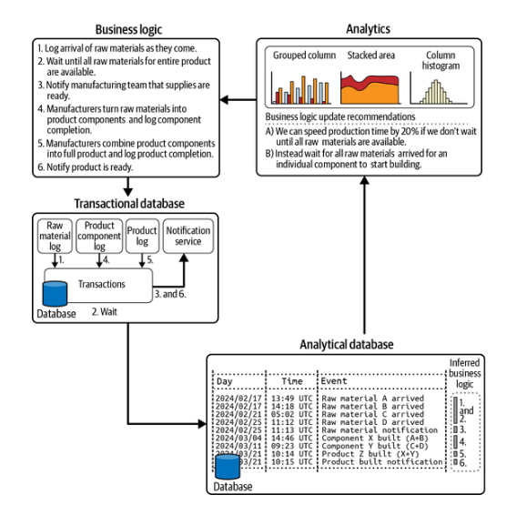

# Capítulo 9. Cambio hacia la izquierda: el cambio cultural necesario para los contratos de datos

En la Parte I, describimos los retos a los que se enfrentan hoy en día las organizaciones en materia de datos y dejamos claro por qué necesitan contratos de datos para abordar esos problemas. La Parte II abordó los detalles técnicos de los contratos de datos, proporcionó un proyecto práctico de codificación que implementaba contratos de datos con herramientas de código abierto y describió tres implementaciones reales en la industria. Una corriente subyacente a lo largo de las Partes I y II es el énfasis en cómo el patrón de arquitectura de contratos de datos está estrechamente vinculado a un cambio cultural en la forma en que se gestionan los datos en toda la organización.

Enla Parte III (capítulos 9 a 12) detallamos cómo llevar a cabo el cambio cultural que permita la arquitectura de contratos de datos, desarrollar una estrategia para conseguir la aceptación y tu primer contrato de datos exitoso y, por último, medir el éxito de tu implementación. Hemos denominado a este cambio cultural «shift left data» (datos desplazados a la izquierda), estableciendo un paralelismo con el ámbito DevSecOps (es decir, DevOps aplicado a la seguridad), que se enfrentó a retos en torno a la gestión y la aplicación de la seguridad, muy similares a los retos de datos de nuestra industria.

En este capítulo, queremos centrarnos en lo que debe suceder antes y durante el momento del cambio cultural hacia la izquierda de los datos dentro de una organización. Abordaremos lo que estamos haciendo para configurar la implementación de contratos de datos con éxito y lograr su adopción en toda la organización, más allá de los equipos de datos. Muchas de las lecciones que compartiremos provienen de haber encontrado y superado numerosos contratiempos en las implementaciones de diversas organizaciones, que esperamos que puedas evitar.

A continuación, abordaremos cómo nos dimos cuenta de la necesidad de abordar explícitamente la brecha de percepción entre los desarrolladores de software (por ejemplo, los productores de datos) y los desarrolladores de datos (por ejemplo, los consumidores de datos) antes de que se lleve a cabo cualquier implementación de contratos de datos en el código, todo ello en los términos de los ingenieros de software (SWE). Por último, este capítulo incluirá lecciones relevantes de la primera implementación de contratos de datos de Chad en una anterior startup de intermediación digital de transporte de mercancías, Convoy, donde se formó la base de nuestra comprensión de la arquitectura de los contratos de datos y el movimiento de datos hacia la izquierda.

## Lo que debe ser cierto: lo que pasamos por alto sobre el desplazamiento a la izquierda de los datos

A pesar de las pistas del « » (desde la época en que Chad trabajaba en Convoy y el cambio profesional de Mark de la ciencia de datos a la ingeniería de datos), nuestra hipótesis inicial sobre cómo debía llevarse a cabo la adopción del desplazamiento hacia la izquierda de los datos en las organizaciones resultó tener un pequeño fallo. Subestimamos la profundidad y la complejidad que tendría el proceso de adopción en la práctica.

Al hablar con los primeros en adoptar el « » —los equipos de datos iniciales a los que apoyamos en sus propios esfuerzos de «shift left»—, nos dimos cuenta rápidamente de que el proceso de adopción era mucho más complejo cuando se trataba de trabajar con ingenieros de software para poner en marcha una prueba de concepto. Nos enfrentamos a una curva de adopción mucho más alta y, como resultado, rápidamente quedó claro que la ingeniería de software debía asumir mucha más responsabilidad y propiedad de los datos en el proceso de adopción en sí. Cuando no lo hicieron, el proceso de adopción no se consolidó o se estancó por completo. Esto significa que la ingeniería de software debe tener un interés en la propiedad y comprender qué gana al asumir más complejidad y restricciones.

Independientemente de cómo los equipos de datos intentaran ajustar su propio enfoque estratégico para fomentar la adopción, habíamos pasado por alto lo importante que sería persuadir a los ingenieros de software para que se convirtieran en defensores de los contratos de datos. La pregunta entonces era cómo liderar exactamente este cambio.

Afortunadamente, fue en ese momento cuando decidimos revisar nuestras hipótesis previas sobre la adopción de contratos de datos e es con un pensamiento basado en principios fundamentales, muy necesario, o el proceso de descomponer una situación o un problema en sus elementos más básicos. Según nuestra experiencia, los principios fundamentales se mencionan mucho más a menudo de lo que se ponen en práctica, ya que lo primero es mucho más fácil que lo segundo.

Una analogía que Chad suele utilizar en torno al pensamiento basado en principios fundamentales es la pregunta: «¿Puedes llegar al fondo de esta masa de agua?». Sin profundizar más (por ejemplo, «¿El fondo de una piscina?», «¿El fondo del océano?», etc.), es probable que no se pueda alcanzar el éxito. Supongamos que se trata del fondo del océano, entonces la pregunta pasa a ser: «¿Qué debe existir para garantizar el éxito?». Sin entrar en detalles, es evidente que cada capa revela más y más supuestos sobre los requisitos para el éxito. Por eso nos preguntamos constantemente: «¿Podemos profundizar más?».

En nuestro contexto, necesitábamos aplicar los principios fundamentales para ayudarnos a profundizar en una verdad fundamental y llegar a ella lo más rápido posible. Por lo tanto, nos obligamos a seguir este razonamiento en su forma más pura, centrándonos en la siguiente pregunta clave: «¿Qué debe ser cierto para resolver el problema de la falta de adopción de los datos de shift left por parte de la ingeniería de software?».

Después de muchas iteraciones, llegamos a la siguiente conclusión: para resolver la adopción de los datos de desplazamiento hacia la izquierda, los ingenieros de software tendrían que verlos como algo tan beneficioso para su función que valiera la pena luchar por ellos. Sin embargo, para que eso sucediera, primero teníamos que comprender y apreciar plenamente por qué, por defecto, aún no lo veían así. Eso nos llevó a darnos cuenta de que no solo existía una importante brecha de percepción entre los equipos de software y los de datos , sino que también estábamos intentando actuar en el lado equivocado al centrarnos primero en el equipo de datos. La tabla 9-1 destaca las diferencias clave entre estos dos grupos con respecto al trabajo con datos.

Tabla 9-1. Comparación del trabajo de los equipos de software y datos

| Atributo                                 | Equipos de ingeniería de software                                                                                                                                                                                                                                                                                                                                                                                     | Equipos de datos                                                                                                                                                                                                                                                                                                                                                                                                                                                                                                     |
| :--------------------------------------- | :-------------------------------------------------------------------------------------------------------------------------------------------------------------------------------------------------------------------------------------------------------------------------------------------------------------------------------------------------------------------------------------------------------------------- | :------------------------------------------------------------------------------------------------------------------------------------------------------------------------------------------------------------------------------------------------------------------------------------------------------------------------------------------------------------------------------------------------------------------------------------------------------------------------------------------------------------------- |
| **Cargos de colaboradores individuales** | Ingeniero de front-end   Ingeniero de backend   Ingeniero full stack   Ingeniero de control de calidad                                                                                                                                                                                                                                                                                                       | Ingeniero de datos   Ingeniero analítico   Analista de datos   Científico de datos                                                                                                                                                                                                                                                                                                                                                                                                                          |
| **Ámbito**                               | Desarrollar código escalable y fácil de mantener que proporcione acciones discretas (por ejemplo, crear un usuario) que sean repetibles.                                                                                                                                                                                                                                                                              | Proporcionar a la organización y/o a las partes interesadas información relevante y/o recomendaciones basadas en información pasada                                                                                                                                                                                                                                                                                                                                                                                  |
| **Partes interesadas internas clave**    | Gerentes de producto   Otros equipos de ingeniería de diferentes servicios   Seguridad y DevOps                                                                                                                                                                                                                                                                                                                 | Partes interesadas del negocio que consumen datos   Ingenieros que ponen en producción los productos de datos   Expertos en la materia para informar sobre las hipótesis de datos                                                                                                                                                                                                                                                                                                                              |
| **Interacciones con datos**              | Bases de datos transaccionales ascendentes para operaciones CRUD, registros relacionados con eventos capturados dentro del código, API y posible ingestión de datos de terceros.    Poner los productos de datos en producción dentro de los servicios que poseen.                                                                                                                                              | Bases de datos analíticas descendentes que utilizan escaneos de tablas grandes, agregados y estadísticas.    I+D en torno a productos de datos, como el desarrollo de modelos de aprendizaje automático, análisis de productos, etc.                                                                                                                                                                                                                                                                           |
| **Cómo se crea valor**                   | Añadir y/u optimizar la funcionalidad de un producto y/o servicio que impulse directamente los ingresos del negocio.    Además, creación de herramientas internas para mejorar la experiencia y la velocidad de los desarrolladores; muchas herramientas de código abierto populares de las grandes tecnológicas provienen de este tipo de herramientas internas.                                               | Proporcionar información que cree una ventaja estratégica en el mercado, identifique riesgos potenciales u optimice la experiencia del cliente (por ejemplo, sistemas de recomendación).    Los equipos de datos pueden generar un valor directo y unos ingresos sustancialmente superiores a los de los equipos de software, mediante la implementación de productos de datos (por ejemplo, sistemas de recomendación), pero esto requiere una inversión inicial considerable en comparación con el software. |
| **Estilo de trabajo**                    | Entregables con un alcance claro (idealmente) para unidades discretas de cambio dentro del código de aplicación de un producto y/o servicio. Aunque son menos experimentales que los equipos de datos, la complejidad surge de la necesidad de coordinar un gran volumen de cambios entre múltiples ingenieros, equipos y/o microservicios, por lo que la ubicuidad del control de versiones es un estándar esperado. | I+D experimental con el entendimiento de que los proyectos pueden conducir a un callejón sin salida y verse obstaculizados por los datos disponibles y/o la calidad de los datos. Esta imprevisibilidad se compensa con el enorme impacto de los proyectos exitosos en la creación de una ventaja estratégica. Además, esta es la razón por la que es raro ver que los equipos de datos adopten metodologías como Agile.                                                                                             |

Quizás te preguntes: «¿Por qué los ingenieros de software necesitan aprender las buenas prácticas en materia de datos si ya contamos con ingenieros de datos?». Ampliar las capacidades de ingeniería de datos no es un proceso lineal: los directivos no pueden permitirse contratar a un nuevo ingeniero para cada equipo de datos, función de cumplimiento normativo o función empresarial que se añada a medida que crece su organización. Incluso si los presupuestos operativos lo permitieran, hipotéticamente, esto daría lugar a una sobrecarga e ineficiencias.

De hecho, Fred Brooks, en su libro The Mythical Man-Month ( Addison-Wesley), destaca cómo el desarrollo, por su propia naturaleza, se basa en un torbellino continuo de interrelaciones complejas, lo que convierte la sobrecarga de comunicación en una característica, no en un error. Dejando de lado las restricciones presupuestarias, esta es la razón por la que dedicar más personas a un problema de ingeniería de software tiene el efecto contrario al deseado: el tiempo que los ingenieros de software necesitan para gestionar la comunicación comienza a aumentar más rápidamente de lo que se puede reducir el tiempo de las tareas individuales al contar con más personal. Brooks concluye que «añadir más [ingenieros de software] a un proyecto a menudo alarga el calendario en lugar de acortarlo, porque el aumento de la complejidad de la coordinación supera cualquier ganancia en productividad».

En resumen, la ingeniería de software es una disciplina que no puede escalarse limpiamente junto con una organización en crecimiento. La atención abrumadora en este mundo gira en torno a las exigencias diarias del ciclo de vida del desarrollo de software. Estas exigencias diarias obligan a los ingenieros de software a alternar repetidamente entre la colaboración relacionada con el producto y las tareas específicas de la producción. Debido a esto, están sobrecargados de trabajo y a menudo trabajan a ciegas, desde el punto de vista de la utilización de datos, ya que cualquier cosa que no ayude a un ingeniero de software a codificar, probar, enviar o depurar un producto existente amenaza con complicar o retrasar los siguientes trabajos pendientes.

Y es aquí, al vislumbrar el mundo a través de los ojos de la ingeniería de software, donde nos preguntamos: ¿sigue siendo sorprendente que alguna nueva solicitud o iniciativa relacionada con los datos que se plantea como una «oportunidad» se perciba, en realidad, como otra responsabilidad más que se añade a vuestras ya desbordadas agendas? ¿Una responsabilidad que viene de equipos o departamentos que apenas, o nunca, se enfrentan a tus retos, obstáculos y expectativas diarios? ¿Es difícil entender por qué una respuesta reflexiva del tipo «yo no me apunté a esto» está totalmente justificada, si no es completamente natural?

No, por supuesto que no.

En la siguiente sección, exploraremos cómo se manifiestan en la práctica estas brechas de percepción e es basándonos en la experiencia de Chad al frente del equipo de la plataforma de datos de Convoy.

## Comprender lo que está en juego: tres ejemplos reales de complicaciones derivadas de la brecha de percepción

Ahora que está claro que existe una brecha de percepción e e entre los desarrolladores de datos y los de software, nuestro objetivo operativo cambia. Tenemos que resolver dicha brecha antes de intentar cambiar los datos a la izquierda en una organización. Porque cuando equipos altamente especializados no logran salvar la brecha entre sus diferentes formas de pensar, las consecuencias pueden ser enormes, paralizando la capacidad de iniciativas de alto nivel como el cambio de datos a la izquierda para que puedan ponerse en marcha.

Para ilustrar a fondo lo que está en juego, examinaremos proyectos relevantes de alto riesgo. Analizaremos situaciones que Chad experimentó al implementar contratos de datos en Convoy. También repasaremos los peligros catastróficos de las brechas desatendidas y proporcionaremos información práctica y relevante sobre el desplazamiento hacia la izquierda en relación con la implementación de contratos de datos.

### Las diferencias de percepción alimentan suposiciones erróneas

El objetivo de Convoy era aprovechar el aprendizaje automático y la automatización para optimizar la logística del transporte de mercancías y reducir los kilómetros en vacío, con el fin último de aumentar los ingresos de los transportistas y reducir los costes de los expedidores. Los fundadores de Convoy lo diseñaron para que funcionara como el primer mercado bilateral del mundo de la logística del transporte de mercancías, al igual que Uber y Airbnb.

El primer problema relacionado con las diferencias de percepción en Convoy comenzó de forma bastante sencilla, cuando los equipos internos adoptaron lo que consideraban un enfoque sencillo para estimar el tiempo que se tardaría en llegar del punto A al punto B. Con Convoy instalado en sus teléfonos, funciones como un panel de control que ayudaba a los transportistas a planificar sus rutas tenían mucho sentido. A nivel interno, cuando el equipo de análisis de Convoy necesitaba calcular la hora estimada de llegada, las rutas recomendadas o las asignaciones de carga para sus transportistas (es decir, los conductores de camiones), también tenía sentido combinar los datos de distancia disponibles con las velocidades medias.

Sin embargo, lo que no se les ocurrió a estos equipos internos fue que la realidad de sus transportistas era mucho más complicada en la práctica. Debido a una serie de factores incontrolables, como la congestión del tráfico, la disponibilidad de aparcamiento e incluso la distancia entre las áreas de descanso, los transportistas ajustaban y reajustaban constantemente sus rutas en tiempo real. Los paneles de datos que tenían mucho sentido en sus hojas de cálculo originales se desmoronaron cuando se pusieron en práctica. El objetivo de Convoy con el panel era ayudar a los transportistas a gestionar más envíos de forma más eficiente. Pero ocurrió exactamente lo contrario, lo que provocó un aumento de los retrasos en las recogidas.

Además, la startup sufrió un daño a su reputación. Los transportistas que intentaron utilizar esta primera versión del panel de datos sintieron que Convoy no los entendía. Los equipos de datos, gracias a esas suposiciones aparentemente lógicas hechas a distancia, se dieron cuenta rápidamente de que habían estado operando desde la ignorancia y que, literalmente, habían diseñado una función de la aplicación Convoy que alejaba activamente a la mitad de su base de usuarios.

Los equipos de análisis internos de Convoy pensaban que podían planificar las rutas de los transportistas utilizando una fórmula que les parecía lógica. Sin embargo, lo que tenía sentido para los equipos internos pasaba por alto las limitaciones en tiempo real que los transportistas experimentaban a diario. Esto demuestra que, cuando existen diferencias de percepción entre las partes clave, incluso las suposiciones más «sencillas» pueden ser muy erróneas.

### Las diferencias de percepción ocultan la complejidad del mundo real

Una de las razones por las que el sector del transporte y el flete estaba maduro para una disrupción era que muchos de los hitos de una cadena de suministro determinada se registraban manualmente o no se registraban en absoluto. Un ejemplo claro se daba en el punto operativo B, cuando un transportista llegaba a su destino para realizar la entrega. Lo ideal es que un transportista llegue siempre a su destino a la hora prevista o antes. Sin embargo, cuanto antes llegaba un conductor, más posibilidades tenía de tener que esperar en su destino para descargar su envío. Esto, a su vez, penalizaba a los conductores por ser eficientes. El tiempo que pasaban esperando en una cola era tiempo en el que no ganaban dinero.

El sector trató entonces de corregir esta situación con el «pago por demora», mediante el cual las empresas de transporte compensaban a los transportistas que perdían tiempo esperando a descargar sus envíos de esta manera. Se trataba de una solución bienintencionada, pero era demasiado fácil de falsear y a los transportistas les resultaba difícil contabilizarla a distancia. En otro intento, los ingenieros de datos de Convoy propusieron cómo la aplicación podría hacer que la paga por demora funcionara según lo previsto. Para ello, Convoy se asoció con las instalaciones de carga de la red de la aplicación para instalar hardware de geolocalización. Una vez que estos límites digitales estuvieron en línea, la aplicación Convoy en el teléfono de un conductor determinado emitía un pitido cuando llegaba a su destino, confirmando que el camión había llegado físicamente a una hora determinada. Esto mantenía la honestidad del tiempo de demora. Esta nueva marca de tiempo de llegada también podía ser un punto de datos interno muy valioso, que se incorporaba a todo, desde el panel de control del rendimiento puntual hasta los modelos de costes y mano de obra de Convoy.

Sin embargo, una vez más, la continua diferencia de percepción entre Convoy y sus transportistas empañó los problemas subyacentes con la lógica de la solución de geolocalización. Y, al igual que el panel de control de optimización de rutas, estos problemas se hicieron evidentes cuando Convoy implementó esta nueva solución, ya que los equipos internos pronto se dieron cuenta de que «llegar» a tu destino tenía muchos matices. Por ejemplo, en realidad, muchos transportistas que llegaban y se encontraban con que tenían que esperar a que se liberara un muelle optaban por aparcar cerca mientras esperaban su turno. Dado que el geofencing se limitaba a las instalaciones de carga y no a los alrededores, estos transportistas no habían llegado a su destino, según la aplicación, aunque el conductor estuviera estacionado justo fuera de él.

Por otra parte, no era raro que la señal del teléfono de un transportista se perdiera al llegar a las instalaciones, lo que indicaba que el conductor estaba en camino cuando, en realidad, ya había descargado y se había marchado para recoger su siguiente carga. A algunos conductores, como es comprensible, no les gustaba saber que había una aplicación en su teléfono que rastreaba dónde se encontraban en todo momento. Muchos conductores empezaron a cambiar la forma en que usaban la aplicación, asegurándose de que solo emitiera una señal cuando tú personalmente sentías que habías «llegado» al muelle. Otros desactivaron por completo el uso compartido de la ubicación.

Como resultado, la tan codiciada métrica de llegada se volvió cada vez más sesgada, con llegadas reales que a veces se desviaban una hora o más. Esto comenzó a causar caos para muchos de los consumidores de datos descendentes de Convoy hasta que, después de mucho tiempo y esfuerzo, el análisis de la causa raíz atribuyó el origen de las discrepancias a la función de geovalla.

Como todas las iniciativas de Convoy en ese momento, ofrecer una solución de geolocalización para mantener la honestidad en el pago de las detenciones era una buena intención. Sin embargo, aunque el hecho de que un conductor y una carga estuvieran en su destino era un concepto claro y sencillo a nivel interno, la realidad de la llegada era mucho más fluida para los transportistas. La brecha de percepción que se experimentaba en Convoy impedía a los ingenieros analizar con claridad toda la situación. Como resultado, las perspectivas matizadas de los usuarios, como el deseo de privacidad y la preocupación de que el Gran Hermano los estuviera vigilando, nunca llegaron a las conversaciones internas clave.

Sin embargo, los retos de Convoy con las diferencias de percepción no se limitaban a los equipos internos y los usuarios externos, aunque cualquier impacto en la aplicación afectaría, por supuesto, a los transportistas o a los expedidores (o a ambos). A veces, la diferencia daba lugar a situaciones en las que dos equipos acababan trabajando con objetivos contrapuestos. Esto es exactamente lo que ocurrió con nuestro último ejemplo, que tenía que ver con la subasta de trabajos de Convoy y la llegada de la función de puja automática.

### Las diferencias de percepción pueden enfrentar a los equipos entre sí

La función de subasta de Convoy era posiblemente el núcleo de la experiencia de la aplicación, ya que actuaba como un minimercado para transportistas y empresas de transporte. Las empresas de transporte y los conductores individuales podían utilizar la aplicación para ver una lista de envíos (es decir, cargas) que necesitaban ser transportados. Cada una de estas cargas tenía un plazo de puja durante el cual el transportista pagaba el precio que estaba dispuesto a pagar por transportarla.

Durante el plazo de puja, el sistema de Convoy comparaba simultáneamente las variables de las pujas teniendo en cuenta factores relacionados, como la ruta, las restricciones de tiempo, la fiabilidad de la conducción, etc. A continuación, la aplicación adjudicaba el trabajo al mejor postor, tras asegurarse de que este tuviera tiempo para desplazarse hasta el transportista y recoger la carga. En igualdad de condiciones, esto resultaba eficaz, al menos para los transportistas.

Los transportistas, por su parte, tenían que esforzarse un poco más para que la subasta de Convoy les resultara rentable. Las subastas eran manuales, lo que significaba que los transportistas tenían que estar muy atentos a la aplicación durante los periodos de puja abiertos, ajustando sus pujas en tiempo real para seguir siendo competitivos. Pocos conductores tenían tiempo para comprobar y volver a pujar continuamente cuando estaban en la carretera ocupándose de sus negocios.

Esta es precisamente la razón por la que Convoy introdujo la función de puja automática. En cierto sentido, se trataba de un ejemplo productivo de un equipo que iteraba sobre necesidades y perspectivas que no eran las suyas. Sin embargo, el problema fue que el equipo no tuvo en cuenta la perspectiva de cómo funcionaría la subasta en sí misma si las cosas pasaran a ser automáticas.

El reto recayó en un equipo de ingenieros de software internos, y la idea era la siguiente: la puja automática permitiría a los conductores fijar un precio inicial para transportar una carga. Una vez fijada esta cantidad (digamos 500 dólares), Convoy pujaría automáticamente en nombre del conductor, rebajando las pujas de la competencia en tiempo real hasta alcanzar un mínimo también especificado por el conductor (digamos 200 dólares). En cada caso concreto, esto tenía sentido: mientras los conductores se dedicaban a su trabajo, sabían que la puja automática de Convoy se mantendría dentro de los parámetros establecidos.

Esto funcionaba bien para los conductores. Sin embargo, como funcionaba bien, se hizo popular, lo que significó que la cantidad de pujas en la subasta pronto se disparó. Desgraciadamente, nadie había tenido en cuenta los efectos de esto, y menos aún en la funcionalidad de la propia subasta. Recuerda que, en la mayoría de los entornos de ingeniería de software, los ingenieros de software tienen poco o ningún conocimiento de lo que ocurre aguas abajo con respecto a los datos.

Prácticamente de la noche a la mañana, un número exponencialmente mayor de pujas comenzó a inundar cada ventana de subasta, ya que las cuentas de puja automática de los conductores luchaban entre sí para asegurar los envíos en nombre de sus propietarios. Para los ingenieros que crearon la puja automática, la adopción por parte de los usuarios y la consiguiente explosión de pujas que comenzó a producirse en un tiempo relativamente corto parecían un enorme éxito.

Esto tomó por sorpresa al equipo de datos responsable de la propia casa de subastas: el cambio brusco y masivo en el volumen de pujas se asemejaba a datos erróneos o a una anomalía en el proceso. Los modelos de aprendizaje automático de precios que habían entrenado meticulosamente con el ritmo relativamente lento de las pujas manuales y humanas se confundieron rápidamente y comenzaron a fijar precios erróneos para los precios máximos y mínimos de cada envío. Esto, a su vez, provocó que cada ventana de subasta durara más de lo que debería. Como el equipo de datos pensó al principio que se trataba de una anomalía, se necesitaron meses y millones de dólares para rastrear el problema hasta la implementación de la función de puja automática.

Técnicamente, la función de puja automática funcionaba exactamente como habían previsto sus diseñadores, liberando a los conductos de la carga de tener que estar al tanto del proceso de puja. Pero no tenían visibilidad de la funcionalidad del algoritmo de puja de la casa de subastas, ya que el equipo con ese conocimiento se encontraba firmemente asentado en el lado opuesto de esta brecha de percepción en particular. Debido a esta separación, al equipo de puja automática nunca se le ocurrió lo que un aumento repentino y exponencial de las pujas por usuario supondría para el propio proceso de subasta.

Ahora bien, para ser justos, Convoy, al estilo clásico de una startup, se había puesto el cinturón de seguridad y avanzaba rápidamente, rompiendo moldes. Sus éxitos, especialmente los de los equipos de datos, superaban con creces los contratiempos observados. Y, como suele ocurrir con cualquier oportunidad de alto riesgo, la inteligencia y la experiencia tampoco eran directamente culpables. Describimos este patrón en el capítulo 6, concretamente en el ciclo de vida de la lógica empresarial que se repite en la figura 9-1. En concreto, señalamos cómo «los problemas de calidad de los datos surgen cuando estos no se mantienen al día en un o que representa la lógica empresarial».

Desgraciadamente, lo que Convoy experimentó en la ruptura del ciclo de vida de la lógica empresarial es la norma para la mayoría de las organizaciones que trabajan con datos, y por eso recurrimos a los contratos de datos. En conjunto, estos tres ejemplos de la experiencia formativa, fascinante y, en ocasiones, angustiosa de Chad en Convoy sirven como una lección firme y definitiva del mundo real sobre por qué es necesario identificar y resolver las diferencias de percepción en cualquier organización basada en datos, especialmente cuando hay mucho en juego.

Si no se hace así, la adopción de datos shift left queda en una posición inaceptablemente poco clara. Pero no basta con ser consciente de las brechas, por lo que en la siguiente sección se describe cómo iniciar un o para cerrarlas.

## Facilitar la adopción: un enfoque estratégico para cerrar la brecha entre el software y los datos

En nuestra opinión, y de form e con nuestro pensamiento basado en principios fundamentales, lo siguiente debe ser cierto para resolver este segundo problema de datos de desplazamiento hacia la izquierda:

- Los equipos de datos deben dar el primer paso: trabajar para encontrar un puente entre ellos y la ingeniería de software y, a continuación, iniciar el proceso de creación de confianza.

- Todas las partes implicadas en cerrar la brecha de percepción con los ingenieros de software deben insistir en la toma de decisiones basada en pruebas.

- Una vez que todas las partes estén de acuerdo y comprendan cómo avanzar, deben establecerse reuniones periódicas y productivas con las principales partes interesadas en adoptar los contratos de datos para mantener el impulso de la colaboración.

- Los equipos de datos establecen por adelantado hitos clave (con el apoyo de los directivos) para que los esfuerzos de cambio evolucionen junto con las necesidades de la organización.

- Además de mejorar los indicadores de rendimiento relacionados con los contratos de datos, es necesario que los ingenieros de software acepten el cambio y se produzcan mejoras en la calidad de vida durante esas fases críticas de la adopción de los datos shift left.

Ten en cuenta que todo esto supone que cuentas con el apoyo de la dirección para impulsar el cambio dentro de la organización (en el capítulo 11 detallamos cómo conseguirlo). Es especialmente importante contar con una directiva de arriba abajo que establezca incentivos para que los ingenieros de software se preocupen por los contratos de datos; cerrar la brecha entre el software y los datos te ayuda a identificar cuáles deben ser esos incentivos.

A continuación, te explicaremos cada paso con consejos prácticos y aprendizajes que hemos adquirido hasta la fecha.

### Encontrar un puente y fomentar la confianza

Los mejores ingenieros de software , según nos informa Addy Osmani en su libro Ingeniería de Software: The Soft Parts (autoeditado), piensan primero en el usuario:

_Dejad que las necesidades de los clientes guíen todas las decisiones y prioridades. Poner a los usuarios en primer plano significa empezar por la empatía. Implica comprender en profundidad los problemas a los que se enfrentan los usuarios y el impacto que nuestro trabajo puede tener en sus vidas._

Esto es lógico, ya que nuestro objetivo, en un sentido simple, es posicionar con éxito y de forma sostenible a los ingenieros de software como los «usuarios» de los datos de desplazamiento hacia la izquierda en las organizaciones modernas. Para nuestros propósitos, tus primeros usuarios deben ser las partes interesadas clave en el proceso de ingeniería de software. Aunque pueda parecer contradictorio, no te bases en los organigramas para identificar a las primeras personas clave.

Como comentan Lili Duan, Emily Sheeren y Leigh M. Weiss en un artículo para McKinsey & Company, los «influencers ocultos» dentro de los equipos y departamentos de ingeniería de software pueden funcionar como mejores catalizadores internos y co-defensores de los datos de desplazamiento hacia la izquierda. El objetivo es «involucrarlos en estos esfuerzos desde las primeras etapas y... obtener sus opiniones y orientación sobre la planificación y la dirección, así como su ayuda en la ejecución. Los cambios realizados con el apoyo de estos empleados influyentes tienen muchas más probabilidades de tener éxito a largo plazo que los cambios impuestos desde arriba».

Para establecer un primer contacto con los equipos de ingeniería de software y las personas que forman parte de ellos con el fin de iniciar este debate, la regla 1-10-100 de la calidad de los datos es una forma excelente de establecer valores comunes entre el mundo de los datos y el de la ingeniería de software.

Desarrollada por Yu Sang Chang y George Labovitz en 1992, los profesionales de los datos conocen esta regla como un medio para cuantificar el coste creciente de la mala calidad de los datos. Pero ha sido fácilmente adoptada por los ingenieros de software, ya que se aplican los mismos principios de escalada de costes: los ingenieros de software pueden gastar 1 dólar en corregir un error durante las fases de codificación o diseño (por ejemplo, durante las pruebas unitarias). O 10 dólares para corregir el error durante las pruebas de control de calidad, quizás durante las pruebas de depuración o regresión. O, comparativamente, 100 dólares para corregir el error después del lanzamiento, mediante revisiones o gestión del daño a la reputación. Un ingeniero de software que aprecia esta forma de pensar aprecia los datos de desplazamiento a la izquierda. Simplemente aún no se dan cuenta.

Para ser muy claros desde el principio: los datos de desplazamiento hacia la izquierda no serán una situación en la que todo, en todas partes, se haga de una sola vez. Este enfoque disminuiría las posibilidades de éxito de todos los involucrados. Como veremos en el capítulo 11, la adopción y la implementación del contrato de datos deben ser intencionadamente conservadoras y estratégicas, centradas en los productos de datos de nivel 1 de la organización desde el principio, con el objetivo de transformar cada uno de ellos en lo que denominamos canalizaciones de nivel de producción.

Además de maximizar las posibilidades de éxito duradero del desplazamiento hacia la izquierda de los datos, las ventajas de este enfoque tan restringido son innumerables. En particular, será más fácil y rápido alinearse y fijar objetivos mutuos y expectativas compartidas. Los ingenieros de software que participen en estas primeras etapas experimentarán antes los efectos positivos netos del desplazamiento a la izquierda de los datos, las mejoras iniciales en los productos de nivel 1 (y el ROI relacionado) se harán evidentes más rápidamente, y tú y tus homólogos de ingeniería de software comenzarán a construir juntos un vocabulario común.

Por ejemplo, en su anterior puesto como científico de datos de productos, Mark tenía la tarea de crear la infraestructura de análisis de embudo para el proceso de incorporación de productos. Afortunadamente, este equipo se aseguró de que los ingenieros de software consultaran con el responsable del proyecto de datos durante la fase de definición del alcance del producto. Inicialmente, los ingenieros de software solo querían pasar los slugs de URL (por ejemplo, company.com/app/onboarding/step-1) sin un ID para la iteración del embudo de incorporación; los ingenieros de software hicieron hincapié en la simplicidad, dado que se trataba de la versión 1 de la nueva incorporación. Esto sería problemático desde el punto de vista de los datos, ya que requiere una lógica empresarial compleja y difícil de mantener que tenga en cuenta cualquier cambio posterior (e inevitable) en el embudo, las pruebas A/B o incluso los casos especiales del embudo para los clientes empresariales, lo que en última instancia haría que el análisis del embudo del producto fuera lento y poco fiable. Dicho esto, añadir un ID de embudo requeriría una refactorización que prolongaría el proyecto mucho más allá de la fecha límite, algo que los ingenieros de software no estaban dispuestos a hacer.

Por lo tanto, Mark se centró en argumentar a favor de evitar la ralentización de los ciclos de iteración de un producto clave que supervisan, en lugar de hacer hincapié en el impacto de la calidad de los datos en sí. Llegó a un compromiso en cuanto a su implementación: no formaría parte de la v1, pero se acoplaría al primer cambio del embudo. Si los hubiera conocido entonces, Mark habría querido contratos de datos de « » para este producto de datos clave.

### Trazar el rumbo con información objetiva

Cuando se inicia la búsqueda y la toma de decisiones basadas en datos de , todas las partes deben acordar que se basarán en pruebas. Los responsables de datos deben asegurarse de que los ingenieros de software perciban honestamente todas las acciones futuras como irreprochablemente justas e imparciales. No basta con saber que es cierto.

Nos hemos propuesto demostrar que es cierto. Además, sabemos que los equipos que participan en procesos de toma de decisiones transparentes, como los enfoques basados en pruebas, son más propensos a construir relaciones de confianza a lo largo del tiempo.

A medida que los equipos acuerdan definiciones objetivas y basadas en datos del éxito, estas definiciones se convierten naturalmente en parte del vocabulario compartido que seguirá creciendo entre los ingenieros de datos y de ingeniería de software. Resultarán muy valiosas una vez que se ponga en marcha el cambio de datos hacia la izquierda: afortunadamente, ya se dispondrá de un lenguaje común para evaluar si las iniciativas previstas van por buen camino.

Cuando trabajamos con equipos de datos, uno de los primeros conjuntos de datos que queremos capturar son:

- Número de incidentes de datos por semana, agrupados por gravedad

- Número medio de empleados que participan en el análisis de las causas fundamentales y en la resolución de los problemas, estratificado por función (por ejemplo, analistas de datos, ingenieros de software, etc.).

- Para cada función implicada, el salario medio (a menudo utilizamos métricas salariales públicas que no proceden de la empresa para mantener la privacidad y dar a los directivos la opción de introducir cifras salariales precisas).

- El número medio de horas dedicadas a resolver un problema, agrupadas por función

- Si es posible, el coste incurrido (por ejemplo, rellenos de datos) o la pérdida de ingresos de un activo de datos y/o producto que no está disponible debido a un incidente de datos (ten en cuenta que muchos equipos de datos con los que hablamos tienen dificultades con esto y, por lo tanto, recurrieron a contratos de datos)

Con estos datos, puedes crear un modelo financiero del impacto de los incidentes de datos con respecto a las horas de trabajo multiplicadas por el salario del personal, los costes de computación y almacenamiento, y el impacto en los ingresos. Además, puedes cuantificar el coste de oportunidad basándote en las horas de trabajo dedicadas a los incidentes de datos agrupados por función, lo que resulta especialmente pertinente para los líderes que sienten la presión del trabajo requerido pero no pueden obtener el presupuesto para contratar personal adicional.

### Evolución de los datos hacia la izquierda junto con tu organización

A medida que comienza la adopción del desplazamiento a la izquierda de los datos , los responsables de datos deben adoptar un enfoque tecnológico para mantener a los equipos de datos sincronizados con los ingenieros de software, que son y seguirán siendo los responsables directos de la implementación de los contratos de datos.

Además, aunque el proceso de adopción comienza mediante la colaboración directa de estos dos departamentos, no puede terminar ahí. Los responsables de datos también deben mantener el movimiento de desplazamiento hacia la izquierda alineado con la trayectoria actual de la propia organización. Tal y como ilustra claramente la experiencia de Chad en Convoy, la iteración y el cambio continuos deben aceptarse como una constante. Afortunadamente, a menudo solo se necesitan unas pocas iniciativas estratégicas para mantener el desplazamiento hacia la izquierda alineado con el negocio, ya que sus objetivos fluctúan con el tiempo.

Dicho esto, mantener estos esfuerzos de forma manual acabará ralentizando el impulso, por lo que muchos programas de gobernanza de datos que dependen únicamente de las personas y los procesos tienen dificultades para escalar. Además del patrocinio ejecutivo, es necesario hacer hincapié en la detección automática de cambios entre los activos de datos para destacar continuamente la necesidad de contratos de datos (a menudo el primer paso que dan los equipos de datos cuando elaboran un caso para la participación de la ingeniería de software).

Además, los líderes que participan en la iniciativa de desplazamiento hacia la izquierda deben aprovechar la base existente entre los equipos de datos y de ingeniería de software, añadiendo un mecanismo de gobernanza que incluya a los principales gestores de productos, a los propietarios de productos con visión de futuro y a los responsables de los ámbitos pertinentes. De este modo, se garantizará que estas terceras partes puedan opinar sobre cómo apoyar y ampliar el proceso de adopción. Una vez más, se debe hacer hincapié en cómo la tecnología puede impulsar el cambio cultural del desplazamiento hacia la izquierda, en lugar de depender únicamente de reuniones periódicas. Por ejemplo, los metadatos recopilados, los cambios posteriores en los activos de datos y las partes afectadas por dichos cambios pueden resaltarse automáticamente con contratos de datos, por lo que estas señales deben guiar las discusiones con estas terceras partes interesadas cuando sea más relevante. Ya hemos visto un patrón similar entre los ingenieros de software con protecciones de ramas para fusionar código, donde las pruebas automáticas imponen las expectativas de lo que implica un código de calidad, y culturalmente está muy mal visto anular manualmente esta protección.

Por lo tanto, recordemos nuestra pregunta fundamental: «¿Qué debe ser cierto para resolver el problema de la falta de adopción de los datos de shift left por parte de la ingeniería de software?». Los párrafos anteriores abordan esta cuestión destacando cómo el aprovechamiento de la tecnología reduce la fricción de la adopción de estas nuevas prácticas, al reducir significativamente los gastos generales mínimos para ponerlas en práctica y mantenerlas. En la siguiente sección trataremos cómo medir esta adopción entre los ingenieros de software.

### Medición de las mejoras en la calidad de vida de los ingenieros de software durante la adopción de los datos de desplazamiento hacia la izquierda

Suponiendo que cuentes con un patrocinio ejecutivo continu e, el éxito o el fracaso de los datos de desplazamiento hacia la izquierda en tu organización se reducirá en última instancia a una cosa: la rapidez y la tangibilidad con la que la ingeniería de software a la que has convencido para que asuma la responsabilidad necesaria del proceso de adopción comiencen a beneficiarse de él. Es decir, cuando los efectos netos positivos de la implementación del contrato de datos en el ciclo de vida del desarrollo de software comiencen a mejorar sus vidas. Lo ideal es que te enteres rápidamente de esto de primera mano. Pero sin duda merece la pena el esfuerzo necesario para medir realmente los efectos de estos beneficios a medida que comienzan a manifestarse. Y esto significa medir el momento en que se inicia el cambio hacia la izquierda observando tres áreas clave: la satisfacción y el compromiso de los ingenieros de software, la reducción de las repeticiones y las fricciones, y la reducción del tiempo de inactividad y de las incidencias.

Una forma fácil de empezar a hacerlo es realizar breves encuestas de opinión ( ) (de dos a tres preguntas) mensuales o trimestrales durante el periodo de adopción para mantener de forma eficiente una percepción diaria de cómo se sienten tus SWE clave respecto al proceso de adopción de datos del cambio a la izquierda. En estas encuestas, realiza un seguimiento de la «satisfacción» continua como KPI con una combinación de puntos de datos relacionados con temas como la calidad percibida de la colaboración y los niveles de impacto en los proyectos/expectativas existentes. Por último, compara los resultados de la encuesta con los datos más cualitativos obtenidos de las revisiones programadas de los hitos, los controles de progreso y las secciones de comentarios que tienen lugar durante el proceso de adopción.

A continuación, una vez completada la implementación inicial del contrato de datos en los productos de nivel 1 de la organización, deberían reducirse los incidentes relacionados con requisitos de datos poco claros o incumplidos. Al mismo tiempo, también debería reducirse la frecuencia del trabajo de SWE relacionado con estos productos. Por lo tanto, el volumen de tickets de relacionados con la revisión o la reimplementación de código por parte de los ingenieros de software durante la adopción constituye una forma sencilla pero informativa de medir las mejoras. En el caso de los tickets relacionados con productos que sí se producen, la reducción del tiempo de reparación durante la adopción del shift left se convierte en un indicador de una mejor alineación y una mayor colaboración dentro del ciclo de vida del desarrollo de software, lo que debería correlacionarse en las reuniones de retroalimentación con una menor carga de trabajo para los ingenieros de software y una mayor capacidad para centrarse en sus proyectos en curso.

La reducción de los problemas relacionados con los datos (es decir, menos estrés) que afectan a los productos clave de una organización puede aumentar la moral y la capacidad de colaboración, mejorando rápidamente las operaciones entre los equipos de ingeniería de software y datos. Como resultado, el tiempo necesario para que los equipos se recuperen de los problemas debería empezar a disminuir a medida que mejoren las condiciones de trabajo diarias de los ingenieros de software y los equipos.

Los incidentes de producción relacionados con problemas de datos de productos de nivel 1 también deberían disminuir drásticamente durante la adopción de datos de desplazamiento a la izquierda, ya que los contratos de datos controlan y dan cuenta de los problemas fundamentales causados anteriormente por la ingestión de datos defectuosos, la incompatibilidad de esquemas y otras causas fundamentales relacionadas con la calidad de los datos. Tener menos problemas de producción relacionados con los datos, incluso en unos pocos productos de datos seleccionados estratégicamente, significa menos emergencias nocturnas o durante los fines de semana para los ingenieros de software, lo que se convierte rápidamente en una mejora tangible y muy apreciada de la calidad de vida de los ingenieros de software.

De esta manera, los responsables de datos pueden garantizar que los ingenieros de software fundamentales sean los primeros en experimentar los beneficios del éxito del cambio hacia la izquierda de los datos. Además, los ingenieros de software deben verse a sí mismos como parte del éxito de los productos de datos y recibir incentivos para hacerlo. Por ejemplo, tradicionalmente se atribuye a los equipos de datos el mérito del buen funcionamiento de un modelo de aprendizaje automático. Si un modelo de aprendizaje automático aprovecha los activos de datos bajo contrato, entonces se puede relacionar su éxito con la disponibilidad de los activos de datos generados por los equipos de ingeniería de software upstream.

Dicho esto, es posible que algunos ingenieros de software sigan sin entenderlo y se pregunten: «Sí, pero ¿cómo puedes estar seguro de que todo saldrá como dices?».

«Esa es la mejor parte», suele decir Chad cuando un e responde a esta pregunta. «En DevSecOps, ya ha sucedido».

## Lo que demostró la creciente necesidad de DevSecOps

Comenzamos este capítulo preguntándonos qué es lo que realmente se necesita para resolver el problema del desplazamiento hacia la izquierda de los datos. Responder a esta pregunta implica que los líderes de datos aprovechen su comprensión y empatía para cerrar las brechas de percepción entre sus equipos y los ingenieros de software de sus organizaciones.

Ahora nos dirigimos directamente a los ingenieros de software (hola) para abordar la segunda pregunta de nuestro pensamiento basado en principios fundamentales. Es decir, si los líderes de datos aceptan lo que hemos discutido y sugerido a lo largo de este capítulo, ¿se resolverá realmente el problema del desplazamiento hacia la izquierda de los datos desde la perspectiva de los ingenieros de software, a quienes necesariamente debe afectar?

Creemos que sí, especialmente como lo demuestra el movimiento de desplazamiento hacia la izquierda que se fusionó en lo que ahora conocemos como DevSecOps alrededor de 2014. En nuestra opinión, los detalles relativos a la necesidad y al éxito del desplazamiento de la seguridad desde un proceso reactivo y posterior hacia el ciclo de vida del desarrollo de software son instructivos, ya que reflejan los problemas de calidad de los datos a los que nos enfrentamos hoy en día en las organizaciones.

Para comprender los paralelismos entre los dos patrones de desplazamiento hacia la izquierda, debemos remontarnos un poco antes de 2014, aproximadamente a 2012, cuando las presiones laborales que se experimentaban en el mundo de la ingeniería de software eran similares a las actuales. La experiencia de un ingeniero de software en ese momento era muy similar a la actual: plazos ajustados, turnos de guardia y una acumulación de trabajo cada vez mayor eran la norma. Y, al igual que ahora, los ingenieros de software de hace una década también tenían que ser buenos manteniendo una mentalidad respetuosa de «no es mi problema» para proteger su capacidad de realizar su propio trabajo.

Lo que alguien de otro departamento proponía como una nueva y brillante oportunidad (por ejemplo, todo en tiempo real, más plataformas de big data, el uso del aprendizaje automático para esto, etc.) era visto con una sospecha sana y de autoconservación por el ingeniero de software medio.

En esta época anterior al cambio hacia la izquierda, los e es en seguridad se situaban en el extremo derecho de la cadena de implementación. Esto significaba que las preocupaciones y las pruebas de seguridad se llevaban a cabo mucho tiempo después de que se escribiera el código.

Sin embargo, tres cambios clave en el sector —relacionados con cambios técnicos, deficiencias en los procesos y demandas de herramientas en evolución— causaron importantes problemas a los responsables de la seguridad y el cumplimiento de los datos. Repasemos esos cambios:

_Aceleración de los ciclos de desarrollo_

El auge de DevOps y las metodologías ágiles estaba reduciendo drásticamente los plazos de desarrollo. Como resultado directo, confiar en los controles de seguridad tradicionales en las últimas fases se estaba convirtiendo rápidamente en algo poco práctico. A medida que los procesos de CI/CD comenzaban a implementar código en producción varias veces al día, las vulnerabilidades descubiertas tras el desarrollo por los equipos de seguridad pasaron rápidamente de costar 10 a 100 dólares en más organizaciones. Los retrasos y los costes posteriores para solucionarlos aumentaron rápidamente. Los responsables de seguridad se enfrentaron a una encrucijada, al darse cuenta de que ya no podían permitirse actuar como guardianes al final del ciclo de vida del desarrollo de software. Esto les sirvió de prompt para cambiar su forma de pensar.

_Ampliación de las superficies de ataque de la nube y los contenedores_

A principios de la década de 2010, los equipos de seguridad se enfrentaron al problema de cómo la proliferación de arquitecturas modernas y nativas de la nube, como los microservicios y los contenedores, introducía nuevas vulnerabilidades que los modelos de seguridad basados en el perímetro no podían abordar. Por ejemplo, la contenedorización temprana (Docker, LXC) y las plataformas en la nube (AWS EC2, OpenStack) introdujeron nuevos vectores de ataque en 2012. Estos riesgos ampliaron directamente la superficie de ataque en las organizaciones que los adoptaron, lo que obligó a integrar la seguridad en una fase más temprana del desarrollo. Además, las populares canalizaciones de CI/CD que se utilizaban mucho en aquella época a menudo carecían de herramientas de seguridad nativas para los flujos de trabajo en la nube o en contenedores. Surgieron brechas explotables, como imágenes base sin parches y secretos en texto plano.

La creciente adopción de arquitecturas nativas de la nube trajo consigo un cambio radical en la forma en que se redactaban y aplicaban las regulaciones. Como resultado, los enfoques de seguridad estáticos basados en IP/host quedaron aún más obsoletos, lo que obligó a los equipos de seguridad a mirar más allá. Estos equipos necesitaban crear y mantener cadenas de herramientas de cumplimiento automatizadas para codificar las políticas en sus organizaciones.

_Aumento de las presiones normativas y de cumplimiento_

Al mismo tiempo, las leyes de protección de datos más estrictas (por ejemplo, el RGPD, la HIPAA o la PCI DSS) y las violaciones de seguridad de gran repercusión mediática pusieron de relieve el cumplimiento normativo y la gobernanza de los datos, dejando claro que debían convertirse en requisitos críticos para el negocio. Y lo que es más importante, esto llamó la atención de los directores generales y los ejecutivos no técnicos, que comenzaron a comprender las consecuencias potencialmente catastróficas de una violación de la seguridad o una fuga de datos. Esta atención resultaba incómoda para muchos de los responsables de la seguridad de los datos, ya que, cada vez más, las auditorías manuales no podían adaptarse a la velocidad de DevOps. Las prácticas de cumplimiento normativo como código se convirtieron rápidamente en la única alternativa.

Estos tres factores se fusionaron en un paradigma definitivo: la seguridad ya no podía seguir un proceso a posteriori. La solución, como sabemos, fue desplazar la seguridad hacia la izquierda y hacia el ciclo de vida del desarrollo de software, junto con la formalización de DevSecOps. Pero, incluso con esta inevitabilidad, seguía habiendo resistencia.

Los equipos de seguridad no podían imponer esta solución: se necesitaba tiempo, colaboración e integración. Mientras que los equipos de seguridad veían el futuro (el mismo futuro en el que ahora operamos), los ingenieros y desarrolladores de software tenían todo el derecho a resistirse a lo que, según ellos, era la incorporación de más tareas de seguridad en sus flujos de trabajo diarios.

Aquí, de nuevo, había una brecha de percepción que había que cerrar antes de que pudiera producirse el cambio hacia la seguridad. Esto requería que los equipos de seguridad emplearan la empatía y la comprensión. Teniendo en cuenta tanto lo que estaba en juego como el cambiante panorama de la seguridad, la adopción de DevOps era mucho más importante que la perfección desde el principio.

Al analizar la situación desde la perspectiva de los ingenieros y desarrolladores de software, quedó claro que proponer medidas de seguridad más pequeñas y específicas para cada fase, implementadas durante las primeras etapas del ciclo de vida del desarrollo de software, como el análisis estático, la gestión de dependencias o las pruebas unitarias, sería mucho más productivo (por no hablar de más fácil para los desarrolladores) que insistir en las pruebas de penetración manuales o las pruebas de integración a gran escala. Además, los líderes del cambio hacia la izquierda reconocieron que introducir un nuevo sistema de seguridad independiente que los desarrolladores de software tuvieran que aprender o realizar el monitoreo de forma aislada sería un fracaso. En su lugar, se centraron en soluciones que utilizaban herramientas ya en uso, como Git y los procesos de CI/CD.

Aprovechar esta ventaja local resultó fundamental para formalizar DevSecOps. El desplazamiento hacia la izquierda estaba ahora firmemente en el ámbito de competencia de los más afectados, lo que hacía que su adopción fuera un proceso continuo, natural y e e.

## Ver (y adoptar) el desplazamiento hacia la izquierda por lo que realmente es

Ahora, en un e regreso al futuro, tenemos pruebas de que nuestro enfoque propuesto para el desplazamiento hacia la izquierda de los datos resolverá un problema común para los equipos de ingeniería de software y datos. Pero, ¿cuál es la mejor manera de aprovechar los detalles de la historia de DevSecOps en beneficio y ventaja de los ingenieros de software y los departamentos? Comencemos por ver cómo cambiamos nuestra forma de pensar para sacar el máximo partido al desplazamiento hacia la izquierda de los datos:

_Adopción como propiedad_

Los ingenieros de software, en conjunto, no buscan más responsabilidades. Pero sin duda deberían buscar reconocimiento. Como resultado de estar encasillados en funciones por las crecientes demandas de productos de datos, el impacto y la influencia que tu trabajo tiene en toda la organización pueden ser en gran medida invisibles. El desplazamiento de los datos hacia la izquierda también es una oportunidad para dar más crédito a quien lo merece, ya que el resultado de los datos producidos por los ingenieros de software se transforma en valiosos productos de datos en las fases posteriores. Hazte dueño del código, claro. Pero, al hacerlo, aprovecha esta oportunidad para hacerte responsable y beneficiarte de cómo el trabajo esencial que realizas está ayudando a tu organización a prosperar. Además, este reconocimiento debe provenir de los líderes que establecen la directiva para que los ingenieros de software asuman más responsabilidades en materia de datos en las fases iniciales.

_La calidad de los datos como una característica, no como un error ajeno_

El desplazamiento de datos hacia la izquierda tiene mucho más sentido si pensamos en los datos como un producto en sí mismo, y no como algo secundario. Como ingenieros de software, los productos que diseñas generan datos esenciales para el análisis, el conocimiento del cliente y las iniciativas de aprendizaje automático. Si los datos que producen estos productos son impredecibles o están mal formados, esto se refleja negativamente en el producto. Y en ti. Aunque esto pueda parecer abrumador, dada la escala de los datos dentro de algunas organizaciones, los equipos pueden empezar poco a poco, centrándose únicamente en no romper los activos de datos pertenecientes a los productos de datos de nivel 1.

_Priorizar mantener las cosas intactas en lugar de limpiar los desastres_

Como deben tener en cuenta tus amigos de los datos, los ingenieros de software han estado atrapados durante demasiado tiempo en el viejo patrón de resolver problemas de 100 dólares a posteriori. En cambio, pueden adoptar una nueva forma de trabajar, en la que descubrir conjuntos de datos dañados semanas después de la implementación, lo que requiere parches de emergencia, reversiones o investigaciones, se convierta en cosa del pasado.

Los ingenieros de software pueden detectar fácilmente inconsistencias o cambios lógicos no deseados en las revisiones de código, las pruebas de integración o las comprobaciones en tiempo de ejecución. Tal y como ha demostrado y sigue demostrando DevSecOps, el desplazamiento hacia la izquierda es la forma óptima de operar. ¿Por qué no íbamos a querer lo mismo?

Es innegable: los datos están estrechamente vinculados al código. Y cuanto antes se sumen los ingenieros de software, antes empezarán a beneficiarse directamente del desplazamiento hacia la izquierda de los datos. No será fácil. Pero puede ser beneficioso para todos. Por lo tanto, cuando los responsables de datos convoquen una reunión para discutir el inicio de la adopción en tu propia organización, haz todo lo posible por bajar un poco la guardia, participar en un pensamiento basado en principios básicos e incorporar al equipo de datos a tu mundo.

## Conclusión

Este capítulo comenzó con una descripción detallada de cómo tuvimos que replantearnos nuestro enfoque del desplazamiento hacia la izquierda de los datos, al darnos cuenta de que debíamos asegurarnos de que los ingenieros de software estuvieran dispuestos a asumir mucha más responsabilidad durante el propio proceso de adopción. A continuación, explicamos cómo corregimos este error, qué aprendimos al hacerlo y, por último, nos dirigimos directamente a los ingenieros de software. Un proceso paralelo que condujo a DevSecOps es la prueba de que nuestro enfoque recalibrado del desplazamiento hacia la izquierda de los datos apunta, de hecho, en la dirección correcta.

Los detalles que hemos tratado en este capítulo incluyen:

- El pensamiento basado en principios fundamentales nos ayudó a diagnosticar por qué los profesionales de datos tenían dificultades para implementar los datos de desplazamiento hacia la izquierda en sus organizaciones.

- Los líderes de datos deben esforzarse por comprender los datos de desplazamiento hacia la izquierda desde la perspectiva de los ingenieros de software y el ciclo de vida del desarrollo de software.

- Las diferencias de percepción comprometen el progreso en los entornos basados en datos, y durante el mandato de Chad en Convoy se produjeron tres ejemplos instructivos de ello.

- Los líderes de datos deben elaborar estrategias para cerrar la brecha de percepción entre los equipos de datos y de ingeniería de software antes de que comience el proceso de adopción de los datos shift left.

- La historia del origen de DevSecOps debería animar a los ingenieros de software a que el desplazamiento hacia la izquierda de los datos no solo les beneficia directamente, sino que los beneficios son fundamentales para el éxito del propio proceso de adopción.

Un aspecto clave que hay que destacar aquí es que, aunque hemos hecho hincapié en la importancia de la perspectiva de la ingeniería de software en una visión general a nivel industrial, te recomendamos encarecidamente que comprendas los procesos y limitaciones únicos de los ingenieros de software dentro de tu organización. Si tú mismo eres ingeniero de software, ten en cuenta que estos procesos y limitaciones pueden no ser obvios para tus homólogos de los eslabones posteriores de la cadena (véase «OLTP frente a OLAP y sus implicaciones para la calidad de los datos»). En cualquier caso, para que la iniciativa de datos shift left tenga éxito, tanto el equipo de datos como el de software deben tener el deseo de trabajar juntos, con el apoyo de los directivos y de los principales defensores de los ingenieros de software.

Ahora que hemos cubierto lo que se necesita para que la adopción del desplazamiento a la izquierda de los datos sea un éxito, pasamos al siguiente capítulo para abordar la gestión del cambio de forma integral: cómo la gestión de la combinación de personas, procesos y tecnología dentro de una organización es fundamental para lograr el éxito a largo plazo del desplazamiento de datos.
