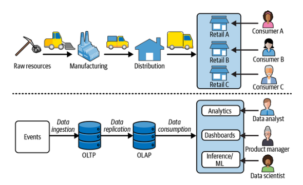
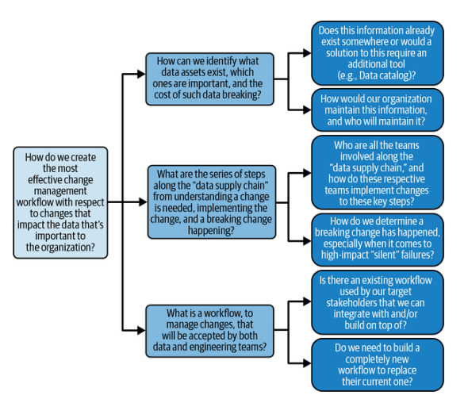
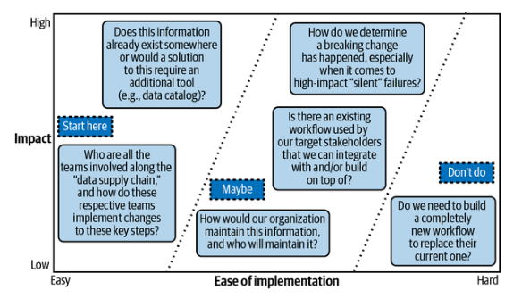
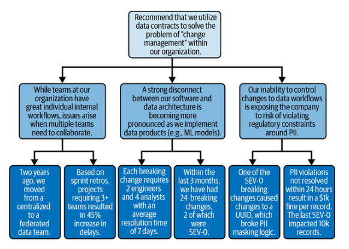

# Capítulo 10. Gestióndel cambio : el quid de la cuestión en cuanto a personas, procesos y tecnología

En la parte II de este libro, hemos abordado cómo implementar contratos de datos desde una perspectiva tecnológica. Aunque esto es extremadamente útil, la realidad de conseguir que se adopte un nuevo proceso dentro de una organización depende en gran medida de las personas. Esto es especialmente cierto en el caso de los contratos de datos, ya que sirven para tender puentes entre los silos de la organización, cada uno de los cuales tiene motivaciones y limitaciones diferentes (por ejemplo, los equipos de software y de datos).

En la parte III de este libro se detalla cómo conseguir la aceptación de los directivos para la arquitectura de contratos de datos y, en concreto, cómo crear una estrategia de calidad de los datos, obtener tus primeros éxitos con los contratos de datos y medir tu impacto. Hemos dedicado años a aprender cómo fomentar la adopción de los contratos de datos dentro de las organizaciones, desde la implementación de la arquitectura por parte de Chad en su anterior trabajo en una startup, hasta nuestro trabajo en implementaciones en empresas de la lista Fortune 100. Esperamos que esta sección del libro te ayude a navegar por el camino de la adopción y, en el mejor de los casos, a evitar las duras lecciones que hemos aprendido por el camino.

Una de las lecciones que más nos llamó la atención fue que, aunque era relativamente fácil conseguir la aceptación de los contratos de datos por parte de los ingenieros de datos, los directivos seguían mostrándose reacios a invertir. Ahora nos resulta obvio que los directivos no invierten en tecnología, sino en resolver problemas estratégicos, y la tecnología es una de las muchas palancas para hacerlo. Una y otra vez, el problema estratégico que llamó la atención de los directivos y, en última instancia, la inversión en contratos de datos fue la gestión del cambio.

En este capítulo se detalla esta lección clave, que servirá de marco para las secciones siguientes de este libro. Para que quede claro, la idea de la gestión del cambio no es nueva, pero es un concepto extremadamente poderoso que traduce fácilmente las dificultades que experimentan los ingenieros de software, los desarrolladores de datos y las partes interesadas no técnicas de la empresa. Partiendo de la base de la gestión del cambio, terminaremos el capítulo con cómo puedes crear tu estrategia de calidad de datos.

## La importancia de la gestión del cambio

¿Qué tipo de producto es GitHub? La mayoría de la gente diría que es una plataforma DevOps. Después de todo, todo lo que facilita GitHub es un componente de DevOps: revisión de código, pruebas unitarias, pruebas de integración, diferencias de código, repositorios, fusiones y ramificaciones, suscriptores y registros de cambios. Pero nosotros lo vemos de otra manera. GitHub puede ser una herramienta DevOps, pero es una plataforma federada de gestión del cambio. Su razón de ser es crear procesos automatizados que reduzcan el riesgo de cambiar el código en una base de código compleja y heterogénea.

¿Ramificación y fusión? Estás paralelizando el cambio. ¿Solicitudes de extracción, revisión de código y diferencias de código? Revisión de cambios con intervención humana. ¿Suscriptores, registros de cambios, notificaciones? Sistemas para recibir notificaciones de cambios.

¿Por qué es importante la gestión de cambios e ? Porque los cambios no gestionados son la causa principal de los problemas de calidad y gobernanza. Ya se trate de problemas de calidad de los datos, de gobernanza, de cumplimiento normativo u otros problemas reglamentarios, todos ellos pueden relacionarse con el cambio: cambio en la base de código, cambio en la lógica empresarial, cambio en los usuarios de datos, cambio en las expectativas, cambio en los productores y cambio en los consumidores.

Esto supone un problema para los sistemas de software, ya que la tecnología no impide el cambio. De hecho, no debería hacerlo. El cambio es una parte inevitable de nuestro sector. Como se destaca en el ciclo de vida de la lógica empresarial del capítulo 6, el producto y la empresa evolucionarán, al igual que nuestras herramientas, infraestructura, marcos e ideas. Este mismo libro representa un cambio que puede motivarte a crear sistemas para gestionar el cambio.

Dado que el cambio es una parte tan omnipresente de la industria de los datos, es sorprendente que la gestión del cambio no se discuta más abiertamente. Después de todo, según el consultor de gestión del cambio Al Lee-Bourke, «el porcentaje más común que se destina a la adopción y la gestión del cambio [en los grandes proyectos] es el 10 % [de su presupuesto]». Muchas empresas han emprendido proyectos de migración de datos de sistemas locales a la nube, con un coste de miles de millones, pero la gestión del cambio de datos sigue siendo un componente difícil de definir en esos proyectos.

Los contratos de datos, los productos de datos, la gobernanza de datos y otras técnicas que hemos comentado entran dentro de la gestión del cambio. Como se ha mencionado anteriormente, la intención de los contratos de datos no es impedir el cambio, sino ayudar a los equipos a comprenderlo, comunicar cuándo se producen los cambios y sus repercusiones, y prepararse para los cambios que, de otro modo, provocarían el fallo de los sistemas posteriores. Eso es la gestión del cambio, en toda su extensión.

Las empresas que más necesitan la gestión del cambio suelen ser las más grandes. Cuanto más grande es una empresa, más datos genera. Cuanto más federada es una empresa, mayor es la complejidad y la replicación. A medida que los datos se vuelven más valiosos, con el tiempo surge más código espagueti, lo que aumenta el impacto que un solo cambio puede tener en los consumidores posteriores. Hemos tratado este tema con más detalle en el capítulo 3, donde hemos hablado de las implicaciones del número de Dunbar y la ley de Conway.

Esto no quiere decir que las pequeñas empresas no necesiten gestionar el cambio. Al fin y al cabo, GitHub es el estándar mundial para la gestión de cambios en el código. Incluso en las pequeñas empresas, la gestión de cambios en el código es necesaria desde el primer día, ya que el código es crucial para la existencia de la empresa, por lo que procesos como las solicitudes de extracción y la revisión del código se consideran necesarios para lanzar cualquier funcionalidad. El riesgo de simplemente conectarse a un repositorio y fusionar el código directamente en la rama principal es demasiado grande.

En las empresas cuyo producto principal es un bien físico, como un sofá o un televisor, la gestión del cambio es una parte importante del ciclo de vida del producto. ¿Quieres cambiar el funcionamiento del sistema de frenos de un coche? Prepárate para meses o incluso años de revisiones, pruebas, confirmaciones normativas, comunicaciones a los clientes, etc. En otras palabras, cuanto más crítico es el sistema para la empresa, más obvia se vuelve la gestión del cambio.

Aunque pueda sorprender a algunos lectores en 2025, muchos equipos de ingeniería siguen sin utilizar una plataforma DevOps ni tener código controlado por versiones. ¿Sabes por qué? Si has pensado que es porque esas empresas dan prioridad a los productos físicos o a las relaciones basadas en servicios que no dependen del código, estás en lo cierto.

¿Qué significa eso en el ámbito de los datos? Afortunadamente, gracias a los productos de datos (es decir, el empaquetado de datos, modelos y/o conocimientos como un producto), estamos viendo un aumento en la utilidad y el valor de los datos. Con el auge de la IA generativa, esperamos que la IA se convierta en un motor de ingresos equivalente a las aplicaciones y los sitios web. Además, dado que los datos son absolutamente esenciales para todos los modelos, la importancia de los datos aumenta significativamente y es probable que los preceptos de la gestión del cambio se vuelvan más frecuentes.

Mientras tanto, enmarcar tus iniciativas de gestión de datos en términos de productos de datos críticos para el negocio proporciona la razón más sólida para invertir en este ámbito. Trataremos este tema más a fondo en el capítulo 11, donde hablaremos de cómo conseguir tus primeros éxitos con los contratos de datos. Por ahora, cambiemos de tema para hablar de otro asunto que nos interese especialmente: la cadena de suministro de datos.

## Los datos como cadenas de suministro

En 1975, Gunpei Yokoi, de Nintendo , acuñó el término «pensamiento lateral con tecnología obsoleta». Desarrolló el concepto tras una serie de éxitos de la empresa de videojuegos en una época en la que la mayoría de los juegos eran sencillos y se clasificaban en unas pocas categorías : juegos de puzles, de lucha, de carreras, etc. Pero Yokoi encontró experiencias de juego divertidas en lugares inesperados: campos con tareas repetitivas que no se consideraban nada divertidas. Yokoi descubrió que aplicar una idea antigua en un nuevo contexto podía darle una nueva vida. Encontró la inspiración en el entorno cotidiano en lugar de seguir los patrones habituales de la industria de los videojuegos.

Creemos que el campo de los datos también podría beneficiarse de un poco de pensamiento lateral. Es habitual que los desarrolladores de datos miremos a nuestros primos de la ingeniería de software e intentemos aprender de sus buenas prácticas. Sin embargo, ¡incluso los ingenieros de software son novatos en la gestión del cambio! Otras industrias, como la sanitaria, la manufacturera y la logística, llevan cientos de años lidiando con cuestiones de calidad, con mucho más en juego. Cambiar la forma de tratar a un paciente con una enfermedad peligrosa conlleva el riesgo de causarle daño si no se tiene mucho cuidado. Cambiar una ruta de transporte puede retrasar la entrega, o el barco podría chocar contra aguas rocosas y volcar. Cuando hay vidas en juego, los procesos de cambio se toman muy en serio.

Una de las áreas más sofisticadas en las que entra en juego la gestión del cambio es la cadena de suministro. Una cadena de suministro es una red interconectada de productores y consumidores que trabajan juntos para garantizar que un producto físico llegue al cliente con un cierto grado de calidad y puntualidad (¿te suena?). Los productores comienzan extrayendo materias primas de la tierra, como la agricultura, la minería y la tala de árboles. Una vez recolectadas, las materias primas se transportan a un fabricante. Dado que las personas no pueden utilizar troncos o mineral de hierro en bruto, una planta de procesamiento convierte los materiales en algo útil. Por lo general, hay varios pasos entre la transformación de la materia prima y el producto final que puede consumir el usuario final. Una planta puede tratar un producto químico, otra puede encargarse del embotellado y el envasado, y una tercera puede comprobar la calidad de la mezcla. Después de la fabricación, el producto se envía a un distribuidor. El distribuidor suele tener un almacén o una tienda central donde guarda diversos materiales transformados, poniéndolos a disposición de los minoristas cuando los solicitan.

Los minoristas están en contacto con los consumidores. Son la interfaz entre los compradores y los productos. Cuando entras en un negocio como Walmart, piensa en los problemas que debe resolver: mantener un gran inventario con alta disponibilidad, garantizar que los productos que vende son de buena calidad y no están contaminados, saber quién compra qué productos y qué proveedor ha suministrado un determinado producto y a qué precio. Debe realizar un seguimiento de todos sus costes, incluidos los de almacenamiento de mercancías y su traslado entre ubicaciones físicas. La empresa también debe asegurarse de que sus productos estén claramente etiquetados y sean fáciles de encontrar, de modo que cualquier comprador pueda encontrar rápidamente lo que necesita y pasar por caja.

Por último, los consumidores son las partes interesadas que obtienen utilidad del producto. Son los que van a la tienda, se encargan de buscar, comprar y seleccionar los artículos. Si lo que eligen no satisface sus necesidades, pueden devolverlo o quejarse.

La figura 10-1 ilustra estos paralelismos e es entre las cadenas de suministro y los flujos de trabajo de datos. Todos los componentes de una cadena de suministro están presentes en el espacio de datos. Los mineros o agricultores son equivalentes a los productores de datos; los camiones que transportan mercancías entre los centros de procesamiento y los minoristas son el canal de datos; los fabricantes son los ingenieros de datos, que aceptan los datos brutos y los convierten en algo utilizable por un cliente posterior; el distribuidor es nuestro almacén de datos. De hecho, incluso se llama almacén, por si el paralelismo no fuera lo suficientemente obvio. Los minoristas son las herramientas y los sistemas que proporcionan utilidades para aprovechar los datos de forma valiosa, como Tableau, Microsoft Power BI, Amazon SageMaker, etc. Y, por supuesto, nuestros clientes finales son los científicos de datos, los analistas y los gestores de productos a los que prestamos servicio cada día.

¿Por qué es útil pensar en nuestro trabajo en el contexto de las cadenas de suministro de datos? Empezamos a darnos cuenta de que la gestión de la cadena de suministro es tanto (si no más) un problema de personas como un problema tecnológico. De hecho, los gestores de la cadena de suministro aprovecharon los contratos entre productores y consumidores mucho antes de que existieran en la ingeniería de software. Un agricultor firmará un contrato con una empresa cerealista, por ejemplo, para suministrar una determinada cantidad de grano en un plazo concreto, con un grado de calidad definido por el consumidor (recuerda nuestra definición del capítulo 2 de que la calidad de los datos es «adecuada para el uso por parte de los consumidores»). Al fin y al cabo, son los restaurantes los que saben lo que es adecuado para servir a sus clientes, no los agricultores que se sientan lejos de los cocineros.

Lo esencial es comprender cómo los cambios se propagan a lo largo de la cadena de suministro, quiénes se ven afectados, qué significa eso para los equipos afectados y qué medidas debe tomar cada parte a continuación. Comunicar libremente esta información, hacer un seguimiento de cómo se han aplicado los cambios y crear una comunicación abierta es imprescindible en una cadena de suministro que evoluciona rápidamente, en la que las interrupciones son habituales y los equipos necesitan poder colaborar en tiempo real, ya que los desastres climáticos o los acontecimientos geopolíticos modifican su capacidad de producir o consumir.

Una buena gestión de los cambios en los datos pone a las personas en el centro, no a la tecnología. Facilitar la conversación y el libre flujo de información es más importante que las pruebas. Ayudar a las personas a comprender cómo se ven afectadas es más importante que los catálogos, y es esencial dar a todas las partes afectadas la distribución adecuada del poder para decidir qué medidas tomar a continuación. En la siguiente sección, analizaremos cómo se traduce esto en la práctica a lo largo de las etapas de implementación de los contratos de datos.

## Niveles de implementación de contratos de datos

El primer paso para implementar contratos de datos es exigir que se coloquen en fuente de datos para que esos datos se transfieran a una plataforma. Este es un excelente punto de partida por varias razones. En primer lugar, está bajo el control del equipo de la plataforma de datos. Tú creaste la plataforma, por lo que tú decides qué se incluye en ella. ¡Así de sencillo! Si un productor de datos quiere que sus datos estén disponibles para consultas, tal vez porque un gestor de productos los necesita para realizar análisis, tiene que pasar por el proceso de crear un contrato, asumir la responsabilidad y gestionar la comunicación de los cambios al equipo en general.

Un patrón excelente que hemos visto implementar con éxito en varias empresas a gran escala es que el equipo de la plataforma de datos ( ) mantenga un grupo de gestores de productos de datos. Cuando alguien rellena y envía un nuevo contrato de datos a través de un portal (o catálogo), el gestor de productos de datos colabora con el productor para definir los datos, aclarar su significado, establecer la perspectiva del productor sobre la propiedad e incluso crear la versión YAML del contrato almacenado en Git. Existen implementaciones más sofisticadas en las que los equipos exigen a los productores que carguen una instantánea de sus datos, y el equipo de la plataforma recopila automáticamente estadísticas y descripciones útiles sobre los datos. Esto puede utilizarse como base para elaborar las especificaciones iniciales del contrato y las normas de calidad de los datos.

Este enfoque plantea algunos retos importantes, que abordaremos en un momento. Pero primero, vamos a utilizar una metáfora que esperamos que facilite la comprensión de los diferentes niveles de implementación. Estas categorías no son exclusivas de los contratos de datos, sino que representan la forma en que los equipos suelen pensar sobre la implementación interna de tecnologías en diversos campos, lo que podría explicar por qué muchas de estas iniciativas tienden a fracasar.

### Proyectos de aviones y aerolíneas

En 1903, Orville y Wilbur Wright volaron el primer avión funcional, despegando de Kitty Hawk, Carolina del Norte, y aterrizando 120 pies más tarde. Este invento fue un momento trascendental en la historia de la aviación. Los hermanos descubrieron que disponer las alas con una forma aerodinámica específica, superficies de control como elevadores y timones, y un armazón ligero pero resistente permitía al vehículo elevarse, mantener el equilibrio y ser dirigido en vuelo. El diseño hace que el aire que pasa por encima y por debajo de las alas cree una presión diferencial, lo que genera sustentación. La combinación de estos factores hizo posible el vuelo.

Una década más tarde surgió la primera aerolínea, la St. Petersburg-Tampa Airboat Line. Creada por Percival Fansler, la aerolínea se enfrentó a diferentes problemas. ¿Cómo hacer que la gente se sintiera lo suficientemente segura como para volar entre ciudades? Al fin y al cabo, la seguridad de los aviones a principios del siglo XX no era la misma que la actual. Los aviones carecían de sistemas de navegación avanzados y estaban fabricados con madera y tela, por lo que los accidentes eran frecuentes. Fansler tenía que abordar este problema. La empresa invirtió en medidas de seguridad, como una formación rigurosa de los pilotos, un mantenimiento regular de las aeronaves y el establecimiento de procedimientos operativos estándar.

Pero eso fue solo el comienzo. Las aerolíneas tenían que tener en cuenta los incentivos que impulsaban a la gente a comprar billetes: una excelente experiencia del cliente, precios asequibles y el conocimiento de las opciones de la competencia. La comodidad es extremadamente importante en los viajes, por ejemplo, ya que a menudo una persona está dispuesta a sacrificar tiempo a cambio de una experiencia agradable. Asientos que no eran rígidos ni incómodos, comidas a bordo y auxiliares de vuelo atentos hacían que la experiencia fuera superior a los viajes en tren o en barco. Más tarde, el sector adoptó tecnologías como las cabinas presurizadas y aviones más fiables para reducir las turbulencias y el ruido.

En segundo lugar estaban los precios de los billetes. Las aerolíneas abordaron la asequibilidad ofreciendo clases como la económica para hacer accesibles los vuelos y utilizando subvenciones gubernamentales para reducir los precios de los billetes. Se fijaron como objetivo lograr una economía de escala, ofreciendo vuelos a muchas ciudades, estados y países con el fin de reducir los precios para ser competitivos con otras formas de transporte. Para ello, necesitaban crear horarios, seguir rutas de vuelo estrictas y mejorar los sistemas de venta de billetes y la velocidad de embarque para que la gente subiera y bajara más rápido.

Para convencer a la gente de que volara con más frecuencia, las aerolíneas lanzaron campañas de marketing que hacían hincapié en los registros de seguridad, mostraban la velocidad y la comodidad de los viajes en avión frente a los trenes o los barcos, utilizaban el respaldo de celebridades y presentaban los vuelos como una experiencia glamurosa y moderna. Por ejemplo, el anuncio de 1950 de Eastern Air Lines con el eslogan «Probado y comprobado... No hay sustituto para la experiencia de Eastern» incluía los siguientes aspectos destacados:

- «Vuela en los nuevos aviones Constellation de Eastern, los más fiables del mundo».

- «La experiencia de Eastern te ofrece doble fiabilidad: aviones fiables y personal fiable».

- «Probados y comprobados» a lo largo de miles de millones de millas de pasajeros.

> **Nota**

> Puede ver el anuncio en cuestión en la colección Ad\*Access del Centro John W. Hartman para la Historia de las Ventas, la Publicidad y el Marketing de la Universidad de Duke.

En resumen, los hermanos Wright se centraron en demostrar la viabilidad técnica, mientras que Percival Fansler se centró en la viabilidad comercial o la adopción. La viabilidad técnica es un subconjunto de la viabilidad comercial. El hecho de haber demostrado que algo se puede hacer no significa que se hayan resuelto los innumerables requisitos necesarios para que los clientes utilicen regularmente tu invento en lugar de otras alternativas. Con ese fin, lo que hemos denominado «proyecto de avión» se centra en la implementación de una tecnología concreta sin tener en cuenta otros factores, mientras que los proyectos de aerolíneas van más allá de proporcionar una capacidad tecnológica y se centran en lo que incentiva a los clientes a utilizar esa tecnología.

Algunos proyectos son principalmente esfuerzos técnicos. Por ejemplo, la mayoría de las herramientas ETL/ELT son proyectos de avión. Siempre que puedas mover datos casi en tiempo real entre sistemas, el equipo de ingeniería de datos o de la plataforma que ha creado la tecnología puede implementarla donde sea conveniente. Otros ejemplos podrían ser las herramientas de optimización de costes. Si puedes optimizar el coste de tus instancias de Snowflake, habrás resuelto el problema más crítico. No es necesario pensar mucho en la capa de interacción, ya que es poco probable que haya usuarios fuera del equipo que ha creado el proyecto.

Sin embargo, abordar un proyecto de aerolínea como un proyecto de avión puede ser desastroso. Una de las razones por las que fracasan la mayoría de las implementaciones de catálogos de datos e es es porque son proyectos de avión. No se trata tanto de si algún sistema puede catalogar todos los datos de tu base de datos analítica, sino de qué incentivará a las partes interesadas del negocio y a los equipos de datos a utilizar el catálogo y obtener valor de él. Hay una larga lista de problemas y retos que tus clientes pueden experimentar y que no tienen nada que ver con la viabilidad técnica. Por ejemplo, tal vez tu herramienta pueda facilitar la adición de metadatos descriptivos para cada tabla, pero ¿los clientes se toman la molestia de hacerlo? ¿Por qué sí o por qué no?

Los contratos de datos entran dentro de la categoría de proyectos de aerolíneas. A primera vista, implementar un contrato es sencillo, quizá incluso trivial. Un contrato puede incluirse en una hoja de cálculo de Excel o en una página de Confluence. Pero el objetivo de un contrato es que los productores asuman la responsabilidad y los consumidores obtengan valor de él. La ingeniería de software debe estar dispuesta a crear y gestionar estos contratos de forma iterativa. Por lo tanto, los equipos de datos deben plantearse las siguientes preguntas:

- ¿Por qué los ingenieros de software trabajarían con contratos de datos?

- ¿Por qué podría ser difícil trabajar con contratos de datos?

- ¿En qué aspectos podrían los ingenieros de software resistirse a esa responsabilidad?

- ¿Tienen tiempo los ingenieros de software para asumir más responsabilidades?

- ¿Sabéis siquiera qué debería ser un contrato de datos?

- ¿Cómo decidís qué incluir en un contrato de datos?

- ¿Son útiles para los consumidores los contratos creados?

- ¿La implementación de contratos de datos resuelve los problemas posteriores?

- ¿Se aplican los contratos a los conjuntos de datos que realmente necesitáis los consumidores?

- ¿Se abordan las infracciones de manera oportuna?

Las respuestas a estas preguntas hipotéticas dependen de vuestro caso de uso y organización específicos, pero, independientemente de ello, todos los equipos de datos deben considerar las implicaciones del contrato de datos más allá del propio equipo de datos.

### Problemas prospectivos y retrospectivos

Teniendo en cuenta el contexto de las aerolíneas , volvamos a nuestra implementación anterior de los contratos de datos. Para una implementación inicial, no está mal como proyecto de aerolíneas, ya que tiene en cuenta el porqué. La razón por la que un productor rellena un contrato es porque quiere trasladar sus datos al equipo de la plataforma de datos. Estupendo. Pero eso plantea las siguientes preguntas:

- ¿Qué pasa si el productor de datos no quiere exponer sus datos a la empresa en general?

- ¿Qué pasa si no tienes un gestor de productos que te impulse a utilizar los datos para el análisis?

- ¿Qué ocurre si el productor decide cambiar sus datos con respecto al contrato inicial?

- ¿Qué pasa cuando los contratos caducan?

- ¿Qué pasa con todos los datos antiguos que no tienen contrato?

- ¿Cómo se comunican los productores de datos cuando hay que realizar cambios?

- ¿Cómo saben los consumidores de datos qué datos tienen contrato y cuáles no?

A estos los llamamos el problema prospectivo y el problema retrospectivo. Los problemas prospectivos se refieren a cómo lidiar con los cambios en los datos o con los nuevos datos que se añaden y que no están incluidos en la plataforma. Los problemas retrospectivos se refieren a cómo los consumidores acceden a los datos que desean y que no están incluidos en el contrato, o incluso a cómo averiguar qué datos de origen están disponibles y cómo deben utilizarlos.

Otro gran problema es la falta de escalabilidad e . Por lo general, no hay muchos gestores de productos de datos o ingenieros de datos en un equipo. Estas organizaciones centrales de plataformas de datos ya son cuellos de botella, abrumadas por los problemas de calidad de los datos y las interrupciones que tienen que gestionar. Si este equipo, ya de por sí saturado, se convierte ahora en el agente central de control de todos los cambios de datos que se realizan en toda la empresa, se producirá una situación muy similar a la de los equipos DevOps centralizados, responsables de aprobar todas las relaciones públicas. Lo que tenemos que hacer es desplazarnos hacia la izquierda (ahí está esa frase otra vez) y distribuir parte de la responsabilidad de la gestión de datos entre todos.

### Retos de las implementaciones que dan prioridad a la tecnología

La segunda implementación « » que hemos visto es más tecnológica. Los equipos pueden crear un marco de pruebas automatizado o utilizar herramientas como Protobuf y Apache Avro para gestionar esquemas, y luego documentar esos contratos basados en esquemas en algún catálogo central que mantenga el productor de datos. Sin duda, esto supone un desplazamiento hacia la izquierda, pero estas implementaciones suelen encontrarse con una serie de retos diferentes, como por ejemplo:

- ¿Por qué el productor de datos adoptaría un sistema como este? ¿Cuál es el incentivo?

- ¿Cómo entiendes el productor cuál debe ser el contrato?

- ¿Qué ocurre cuando el productor necesita realizar un cambio radical?

- ¿Qué ocurre cuando se producen cambios ajenos al esquema? ¿Cambios semánticos o contextuales?

- ¿Cómo se adapta un sistema como este a todos los ingenieros de la empresa?

Las empresas que siguen este camino suelen decir lo mismo: «Hemos creado la tecnología, pero nos cuesta incorporarla». En las organizaciones impulsadas por la ingeniería, en las que se toman muchas decisiones de construcción, se escucha esta frase a menudo. Esto se debe a que el problema se está tratando como un proyecto de avión cuando en realidad es un proyecto de aerolínea. Es equivalente a preguntar: «Oye, hemos construido un avión destartalado en el que caben un par de personas sin medidas de seguridad y que no lleva a la gente a donde quiere ir... ¿por qué nadie vuela con nosotros?».

Para responder mejor a esa pregunta, es útil explorar un concepto llamado fricción, o los obstáculos de e e que impiden que tu público objetivo realice la acción o el flujo de trabajo deseados. Chad aprendió por primera vez sobre la fricción gracias a Peep Laja, que dirigió el instituto CXL para la optimización de la conversión entre principios y finales de la década de 2010. La optimización de la tasa de clics es una disciplina de análisis y desarrollo de sitios web que se centra en examinar las experiencias de los usuarios, crear hipótesis sobre cómo mejorar esas experiencias, probar diversas opciones y medir los resultados con el objetivo final de aumentar la conversión, o el porcentaje de usuarios que completan una tarea del total de usuarios que podrían completarla.

Usemos un ejemplo de la experiencia personal de este autor: las donaciones a organizaciones benéficas. Yo (Chad) no siempre dono a organizaciones benéficas con la frecuencia que debería porque me resulta abrumador el proceso de buscar y evaluar organizaciones benéficas y luego decidir cuánto donar y con qué frecuencia. Sin embargo, cuando compro en un supermercado, el escáner de la tarjeta de crédito me pregunta con frecuencia si quiero redondear mi compra para apoyar a una de las dos o tres organizaciones benéficas que han sido preseleccionadas para mí. Cuando esto ocurre, casi siempre dono. ¿Por qué? Fricción.

Si quisiera donar a una organización benéfica por mi cuenta, primero tendría que encontrar una a la que donar. Esto puede resultar abrumador, dado que hay miles de organizaciones benéficas, algunas con mucha más reputación que otras, y todas ellas trabajando en proyectos que pueden ser más o menos importantes para mí. Tendría que investigar estas organizaciones y encontrar una con una causa convincente. Luego tendría que elegir el importe de la donación. ¿Debería donar un dólar (parece demasiado poco) o una cantidad suficiente para que me salga en la declaración de la renta? Si es una cantidad mayor, ¿tengo que hablarlo primero con mi pareja? Después tendría que pasar por el proceso de hacer la donación. Con suerte, será fácil y habrá una integración con PayPal, pero si no es así, tendría que añadir mi número de tarjeta de crédito y otros datos, como mínimo la dirección de facturación y posiblemente otros datos adicionales.

Compáralo con la experiencia de donar al hacer compras. He pasado mi tarjeta de crédito para pagar, por lo que no necesito introducir ninguna información adicional. Las organizaciones benéficas y la cantidad están preseleccionadas para mí. La cantidad es insignificante, por lo que no requiere ninguna confirmación adicional externa. El coste de la donación (aparte de los 45 céntimos aproximadamente) es pulsar un botón en la pantalla que dice «Me gustaría donar». La diferencia en la fricción entre las dos opciones es como la noche y el día.

El concepto de fricción es increíblemente importante en los proyectos orientados a las aerolíneas. Siempre que se pide a un cliente o a una parte interesada que haga algo que no le resulta natural, cualquier fricción en la experiencia del usuario reducirá significativamente la probabilidad de que lo haga. Si se intenta animar a los productores de datos a que sean propietarios de sus datos y sean más considerados con los equipos de consumidores posteriores, hay muchos ejemplos de posibles puntos de fricción con los que te encontrarás, como pedir a los ingenieros que:

- Gestionar sistemas con los que no están familiarizados

- Ser cuidadoso con los datos que producen

- Comprender quién utiliza tus datos y derivar contratos a partir de ello

- Adoptar un proceso que les impida enviar código

- Adoptar una solución que les impida realizar los cambios necesarios

- Adoptar un proceso que dependa de que los seres humanos tomen decisiones correctas de forma sistemática

- Preocuparse por los consumidores cuando no sabes quiénes son los consumidores de esos datos

En última instancia, la adopción de contratos de datos se reduce a incentivos y fricciones. Si puedes alinear los incentivos de las distintas partes interesadas en la cadena de suministro de datos y, al mismo tiempo, hacer que lo correcto sea lo fácil, serás mucho más eficaz que si simplemente propones el uso de determinadas tecnologías y esperas e e que «si lo construimos, vendrán» (consejo profesional: esto nunca sucede).

### La trampa de los estándares

Queremos dedicar un poco de tiempo a abordar las normas. Inevitablemente, para todos los nuevos paradigmas de ingeniería de software o ingeniería de datos, surge algún sistema que afirma ser una norma o que aspira a convertirse en una. Podemos respetar el esfuerzo de los equipos que imponen estos estándares a los demás, ya sea Protobuf, Avro, Iceberg o uno de los muchos estándares oportunistas de contratos de datos que han surgido en los últimos años a medida que este concepto ha ganado popularidad. Sin embargo, según nuestra experiencia, los ganadores de las guerras de estándares surgen de forma natural con el tiempo, a medida que los desarrolladores comprenden los casos de uso y resuelven activamente los problemas utilizando ese estándar.

Por ejemplo, OpenAPI se ha convertido en un estándar porque proporciona una forma unificada de describir las API RESTful (transferencia de estado representacional), lo que facilita a los desarrolladores la creación, prueba e integración de servicios. Data build tool (dbt) es otra tecnología de código abierto que se está convirtiendo rápidamente en el estándar para la ingeniería analítica. La estandarización no surge porque la industria tome la decisión explícita de seguir una herramienta, sino porque la herramienta añade tanto valor que todo el mundo la adopta para resolver sus problemas. Hemos trabajado con muchas empresas que siguen un estándar de contrato de datos y, para ser sinceros, ese tipo de estándar añade muy poco valor adicional en comparación con la simple definición de tu propia especificación YAML con tus propios casos de uso incorporados. El problema mucho mayor no es qué especificación decide utilizar la industria, sino cómo resolver los problemas de adopción, propiedad, visibilidad y gestión del cambio que hemos estado discutiendo a lo largo de este capítulo.

En otras palabras, céntrate en los difíciles problemas existenciales que determinarán el éxito de la implementación de tu contrato de datos. Una vez resueltos los problemas que hemos discutido, la industria se unirá en torno a una especificación que tenga sentido para los casos de uso comunes que hemos descubierto colectivamente.

### Requisitos para una implementación exitosa del contrato de datos

Ahora que conocemos los retos, vamos a establecer algunos de los requisitos para que el sistema tenga éxito. En la siguiente sección, entraremos en detalle sobre cómo implementar un sistema de este tipo partiendo de cero, pero empecemos centrándonos en las necesidades generales basadas en lo que necesitan los productores de datos para su adopción y lo que necesitan los consumidores de datos para mejorar la usabilidad de los mismos.

#### Visibilidad

Los productores de datos necesitan saber adónde van tus datos y quién los utiliza. En otras palabras: ¡un gráfico de flujo de código fuente! Los ingenieros están familiarizados con el concepto de gráfico de flujo de código fuente y lo utilizan en muchas áreas de su trabajo diario, como la gestión y la seguridad de las API. Si comprendes los servicios, sistemas, aplicaciones, equipos y productos que aprovechan los datos que se producen, puedes empezar a tomar decisiones de forma proactiva teniendo en cuenta el impacto que tu sistema tiene en otros miembros de la organización.

La segunda fase de la visibilidad de los datos es el análisis del impacto. Como se ha mencionado en otros capítulos, los productores de datos rara vez comprenden cómo se utilizan sus datos. Sin este contexto, es difícil tomar decisiones informadas. Si realizo un cambio en los esquemas o en la lógica empresarial, ¿quién debe saberlo? ¿Cuándo debo comunicárselo a la gente? ¿A quién debo decírselo? ¿Qué información debo comunicar? ¿Qué medidas debo tomar para minimizar cualquier daño que se esté causando?

#### Comunicación de cambios

Cuando cambian las fuentes de datos , los productores deben saber con quién hablar, qué comunicar y cuándo comunicarlo. Los ingenieros son buenos comunicando sus cambios, pero si el proceso de gestión del cambio consiste en enviar las actualizaciones a un canal central de Slack o por correo electrónico, eso simplemente no va a funcionar. La razón principal es que hay muchas transformaciones entre el productor y el equipo que finalmente utiliza los datos. Si el software realiza cambios en Java, que envía los datos a una base de datos MySQL, que envía los datos a un tema de Kafka, que envía los datos a un bucket S3, donde se configura una canalización ELT para volcar los datos en Snowflake, donde estos datos se transforman una y otra vez en un modelo de datos y finalmente terminan en datos de entrenamiento para un modelo de precios crítico, ninguna de las partes de la cadena de suministro de datos tendrá el contexto que les resulte útil.

Una opción para resolver este problema es canalizar todas las comunicaciones de cambios a la plataforma de datos central que funciona como «puerta» al almacén de datos, pero, en última instancia, esto se enfrenta a los retos de escala que hemos mencionado anteriormente. Si los datos cambian constantemente y es responsabilidad de una organización de plataformas sobrecargada gestionar la comunicación en nombre de los productores, estos se convierten en el cuello de botella. Recomendamos este enfoque para empresas más pequeñas y startups en las que la tasa de cambio o el número de casos de uso posteriores es bajo.

#### Políticas

Una cita de un distinguido ingeniero de un gran banco: «Tenemos muchas políticas. El problema es su aplicación». Una política es un requisito sobre cómo se gestionan, analizan, modifican o crean los datos. Las políticas establecen los requisitos normativos y de cumplimiento, las especificaciones de control de acceso, las permisos de consulta y mucho más. Para que la implementación del contrato de datos sea un éxito, debes disponer de una forma de definir las normas y políticas que puedan catalogarse y consultarse en los contratos de datos. La empresa debe crear estas políticas de forma centralizada, debe contar con patrocinadores ejecutivos y debe estar vinculada explícitamente a un mecanismo de aplicación en el sistema de gestión de datos elegido. Las políticas deben funcionar a un nivel superior de abstracción, con la capacidad de transpilarse hacia y desde las tecnologías subyacentes donde se produce la aplicación. Esto permite a los equipos de gobernanza crear políticas basadas en reglas de negocio sin necesidad de convertirse ellos mismos en ingenieros de software o datos en toda regla.

#### Evolución del contexto

En la mayoría de los casos, la evolución de los esquemas es relativamente sencilla. Dependiendo de los eventos que rellenen los desarrolladores de aplicaciones, pueden evolucionar los tipos de datos, actualizar valores específicos para operaciones CRUD y/o crear o eliminar nuevos esquemas. Sin embargo, hay otros cambios en la lógica empresarial que quedan fuera de este contexto. Por ejemplo, ¿qué ocurre cuando cambia el significado subyacente de un campo o se crean características que modifican la forma en que se debe aprovechar una propiedad en otras partes del código base? Por ejemplo, imagina que el campo « promo_code » cambia de modo que solo es válido si « promo_expiry_date » es en el futuro. Se trata de un cambio lógico que podría afectar significativamente al número de códigos promocionales válidos en el futuro. Las simples comprobaciones de los esquemas no serían suficientes para detectar este cambio, ya que no se modifica ni se elimina ningún tipo. Deben existir sistemas de software que no solo detecten los cambios en los datos a nivel de esquema y de fila, sino que también dispongan de medios para detectar desviaciones semánticas en objetos empresariales importantes.

#### Gestión de contratos

La adopción se estancará si no se crea un sistema de gestión para manejar la evolución de los propios contratos, incluso si se implementan todos los demás requisitos de los contratos de datos. Los contratos deben tener un propietario, ser muy visibles y estar versionados. Debe haber una forma de asociar los contratos de datos con los activos subyacentes que respaldan, es decir, sistemas para realizar un seguimiento de cómo han evolucionado esos activos a lo largo del tiempo y si los cambios se han realizado de conformidad con las políticas. Además, la gestión de contratos debe registrar los cambios de propiedad, documentar los incidentes y comunicar las interrupciones. El contrato es tu fuente de verdad sobre lo que representa un producto de datos, pero esa verdad solo tiene valor si el contexto completo del cambio es visible y claro para todas las partes. Del mismo modo, debe haber mecanismos para detectar cuándo faltan contratos de datos o cuándo es necesario modificarlos. Debe haber sistemas para realizar solicitudes de datos que actualmente no existen o solicitudes para modificar datos existentes. Como hemos dicho anteriormente, el poder de los contratos de datos reside en su capacidad para promover la colaboración en torno al significado de los datos y cómo se gestionan. Sin embargo, esto requiere procesos que permitan a una variedad de actores técnicos y no técnicos diferentes hacer oír su voz y participar en el proceso de gestión de datos.

En la siguiente sección, analizaremos con más detalle cómo reunir a los actores técnicos y no técnicos proporcionando un marco para introducir los contratos de datos en tu organización.

## Desarrollo de una estrategia para introducir contratos de datos

En las secciones anteriores de este capítulo de « », detallamos las consideraciones para una implementación exitosa de los contratos de datos, pero ¿cómo se consigue realmente el apoyo de los directivos para empezar? En las siguientes secciones se ilustra un conjunto de marcos que puedes utilizar para empezar a conseguir la aceptación desde la perspectiva de la introducción de contratos de datos en tu empresa. Se trata de los marcos que utilizan las consultoras McKinsey & Company y Boston Consulting Group, siguiendo lo que se denomina el enfoquebasado en hipótesis. Tal y como describen antiguos consultores de ambas empresas, el enfoque consta de los siguientes pasos:

1. Definir el problema: ¿qué pregunta clave debemos responder?

2. Estructurar el problema: ¿cuáles podrían ser los elementos clave del problema?

3. Priorizar las cuestiones: ¿qué cuestiones son más importantes para el problema?

4. Desarrollar un análisis de los problemas [y] un plan de trabajo: ¿dónde y cómo debemos dedicar nuestro tiempo?

5. Realizar análisis: ¿qué estamos tratando de demostrar [o] refutar?

6. Sintetizar los resultados: ¿qué implicaciones tienen nuestros resultados?

7. Desarrollar recomendaciones: ¿qué debemos hacer?

Utilizaremos este marco para realizar un ejercicio de reflexión que ilustre cómo puedes desarrollar tu estrategia de contratos de datos. Ten en cuenta que este es solo uno de los muchos marcos que podemos utilizar, y en las secciones siguientes se explica principalmente cómo adaptarlo a las necesidades de la implementación de tu contrato de datos.

### Definir el problema

Una frase que utilizamos entre nosotros, , al formular planteamientos de problemas es la idea de «profundizar» cuando intentamos comprender qué merece la pena resolver. Este proceso es engañosamente difícil, ya que uno puede decidir rápidamente un planteamiento de problema atractivo que, en última instancia, no aborda la raíz del problema. Este proceso es precisamente lo que nos llevó a cambiar la gestión como factor clave de los contratos de datos entre las organizaciones que han adoptado la arquitectura.

La siguiente lista de enunciados es un ejemplo de cómo profundizar nos llevó a considerar la gestión del cambio como el problema central, donde cada enunciado posterior profundiza más en el tema:

1. La calidad de los datos es difícil para los equipos de datos, a pesar de que los datos son su especialidad, y este problema persiste desde hace décadas.

2. La gobernanza de datos existe y es eficaz a la hora de proporcionar un marco para gestionar los problemas de calidad de los datos, pero su aplicación es limitada.

3. La gobernanza de datos es difícil de aplicar, ya que muchos cambios importantes en los datos provienen de flujos de trabajo ascendentes, como el código de las aplicaciones y la lógica empresarial, que no son propiedad de los equipos de datos.

4. Enseñar las buenas prácticas en materia de datos a los equipos ascendentes sería ineficaz, ya que existe una gran inercia para cambiar los flujos de trabajo actuales, especialmente cuando los problemas descendentes no afectan directamente a quienes han realizado el cambio.

5. Es necesario que exista un mecanismo para hacer cumplir automáticamente las expectativas en materia de datos a todas las partes que tengan previsto realizar cambios que afecten a los datos (es decir, contratos de datos).

6. Es probable que los equipos de desarrollo no acepten fácilmente la inercia que supone cambiar los flujos de trabajo y asumir dependencias adicionales sin un contexto adecuado que les permita comprender qué ventajas les reporta.

7. La gestión programática de los contratos de datos y su aplicación a través del flujo de trabajo de CI/CD es fundamental para adaptarse al flujo de trabajo de los desarrolladores y abordar el problema de la inercia.

8. Si posicionamos los contratos de datos para que apliquen los flujos de trabajo solo a los activos de datos más importantes (por ejemplo, los que generan ingresos o mitigan riesgos), podemos explicar por qué es importante y qué ventajas les reporta .

9. La raíz del cambio que estamos solicitando a nuestras partes interesadas en las fases iniciales es el proceso de gestión del cambio.

10. Tenemos que determinar cómo crear el flujo de trabajo de gestión del cambio más eficaz con respecto a los cambios que afectan a los datos que son importantes para la organización.

Ahora te preguntarás: «¿En qué momento debo dejar de profundizar para encontrar la raíz del problema?». Siempre se puede profundizar más, pero hemos descubierto que solo está justificado cuando no se ha encontrado una solución con el nivel en el que se está trabajando actualmente. Por ejemplo, nuestra cadena de pensamientos cada vez más profundos fue la culminación de más de cuatro años de ensayo y error en la implementación de contratos de datos en diversas organizaciones.

En una ocasión nos detuvimos en la afirmación 5, «Es necesario que exista un mecanismo para... automáticamente», ya que inicialmente pensamos que era suficiente para resolver los problemas de calidad de los datos. Si bien esto era cierto entre los equipos de datos, la ampliación de la implementación más allá de ellos nos dejó atascados una vez más, lo que nos llevó a revisar y validar nuestras hipótesis más profundamente. Unos años después de publicar este libro, es muy posible que hayamos descubierto que todavía necesitamos profundizar más a medida que descubrimos más información a través de implementaciones adicionales de .

### Estructurar el problema

A partir del proceso de profundización, hemos identificado la siguiente pregunta: «¿Cómo podemos crear el flujo de trabajo de gestión del cambio más eficaz con respecto a los cambios que afectan a los datos importantes para la organización?». Con esta pregunta en mente, debemos identificar las palancas clave que podemos accionar para resolverla. El equipo de McKinsey sugiere utilizar un «árbol de problemas» en el que desglosas un problema en sus subcomponentes. La figura 10-2 ofrece un ejemplo simplificado de este ejercicio.

Una nota importante para crear esta estructura es la presencia de una jerarquía en la forma en que se organizan los problemas. Tener una jerarquía nos informa aún más sobre los requisitos previos para resolver un problema en particular y, por lo tanto, es un punto de partida para explorar una pregunta más a fondo.

### Priorizar los problemas

En el paso anterior del ejercicio de reflexión, determinamos los elementos clave de un problema que es necesario comprender para poder actuar. Aunque nuestro sencillo ejemplo dio como resultado solo seis elementos, una implementación en el mundo real probablemente daría lugar a un número considerablemente mayor de elementos, y con recursos aún más limitados que restringirían las cuestiones que se pueden abordar. Por lo tanto, lo mejor es tomar estos elementos y priorizarlos mediante una matriz, como la de la figura 10-3, con criterios relevantes como eje (por ejemplo, el impacto y la facilidad de implementación).

Basándonos en la posición de los elementos de la matriz, podemos determinar por dónde empezar y delegar tareas entre el equipo en el paso siguiente. Además, esta priorización también permite identificar rápidamente qué elementos no se van a abordar.

### Desarrollar un plan de trabajo para el análisis de problemas y realizar los análisis

Esta es la etapa en la que el desarrollo de la estrategia pasa del pensamiento a la ejecución, y en la que estableceremos un plan de trabajo para validar las diversas preguntas y suposiciones dentro de la estrategia. A continuación se presentan ejemplos con los elementos «empezar aquí» que identificamos dentro de la matriz de priorización:

«¿Esta información ya existe en algún lugar o se necesitaría una herramienta adicional (por ejemplo, un catálogo de datos) para resolverlo?».

- Busca documentación existente relacionada con los activos de datos que utilizamos.

- Determina si la organización ya utiliza una herramienta existente para gestionar esta información y si esta herramienta se utiliza en toda la organización o solo en equipos específicos.

- Entre los activos de datos que utilizamos, identifica las distintas bases de datos de la organización en las que se crean, ingestan, replican y transforman los datos.

- Si no existe una herramienta, evalúa los requisitos de dicha herramienta y determina si se trata de una decisión de crear o comprar.

- Si se decide comprarla, comenzar a investigar varios proveedores e iniciar conversaciones tempranas de adquisición.

«¿Quiénes son todos los equipos involucrados en la cadena de suministro de datos y cómo implementan estos equipos respectivos los cambios en estos pasos clave?».

- Entre los activos de datos que utilizamos, identifica las distintas bases de datos dentro de la organización donde se crean, ingestan, replican y transforman los datos.

- Entre las bases de datos identificadas, identifica qué equipos dentro de la organización interactúan con las bases de datos, las gestionan y son responsables de los datos respectivos dentro de las bases de datos.

- Entre los equipos identificados, identifica con cuáles ya tenemos una relación, con cuáles necesitamos establecer una relación y quiénes son los responsables clave de la toma de decisiones dentro de estos equipos.

- Identifica cualquier documentación interna existente sobre cómo estos equipos respectivos implementan cambios en los flujos de trabajo relacionados con las bases de datos.

Todas estas tareas generarán más información que deberá sintetizar en el siguiente paso.

### Sintetiza tus hallazgos

Otro marco muy utilizado por los consultores de McKinsey es el principio piramidal, en el que la información se sintetiza de forma que se enfatiza la persuasión. El principio se estructura en tres capas:

1. La decisión que quieres que tome el público.

2. Argumentos que respaldan la decisión.

3. Datos que respaldan los argumentos.

En la figura 10-4, ilustramos el principio piramidal, utilizando los pasos anteriores de este ejercicio de reflexión.

Ten en cuenta que tendrás que adaptar los argumentos y las pruebas que presentes en función del público al que quieras persuadir. Dicho esto, la orientación anterior es un medio para estructurar tu síntesis, pero el siguiente paso se centrará en cómo presentarla.

### Desarrollar recomendaciones

El marco final utilizado en « » por los consultores de McKinsey es el SCQA (también conocido como marco SCR), que significa «situación, complicación, pregunta y respuesta». Aplicado a nuestro caso de uso, quedaría así:

_Situación_

En los últimos tres meses se han producido numerosos cambios importantes que, en el mejor de los casos, requieren alrededor de ocho mil horas de trabajo para resolverse y, en el peor, han expuesto a la empresa a una multa reglamentaria de 10 millones de dólares.

_Complejidad_

Se ha producido una fuerte desconexión entre los equipos de software y de datos con nuestro cambio a estructuras de equipos federados, donde se ha identificado que la gestión del cambio entre equipos es la causa principal. Lo hemos visto en las retrospectivas de sprint, donde se observó que los proyectos que requerían tres o más equipos provocaban un aumento del 45 % en los retrasos.

_Pregunta_

¿Hay alguna forma de resolver este problema sin revertir nuestra decisión sobre los equipos federados en los que hemos invertido mucho?

_Respuesta_

Sí, podemos gestionar mejor la gestión del cambio entre varios equipos a gran escala mediante contratos de datos, lo que evitaría cambios disruptivos como el reciente SEV-0, que expuso a la empresa a una posible multa de 10 millones de dólares si no se resolvía en menos de 24 horas.

A lo largo de este ejercicio de reflexión, hemos aplicado el enfoque basado en hipótesis para desarrollar una estrategia para introducir contratos de datos en una organización y elaborar mensajes para persuadir a las partes interesadas de que vale la pena seguir esta estrategia. Si deseas otro ejemplo de este proceso, Mark escribió el artículo «Cómo hacer que los líderes presten atención a tu próxima iniciativa de datos», en el que aplicó el mismo proceso a un caso de uso fallido de una iniciativa de IA de .

## Conclusión

En este capítulo hemos analizado la importancia de la gestión del cambio a la hora de plantearse la implementación de contratos de datos, así como cómo hemos llegado a esta conclusión a través de nuestra implementación de contratos de datos en diversas empresas. Además, hemos aplicado los marcos utilizados por las consultoras McKinsey & Company y Boston Consulting Group para ilustrar cómo desarrollar una estrategia para introducir contratos de datos en tu organización. En resumen, este capítulo ha tratado los siguientes temas:

- La importancia de la gestión del cambio y cómo es la raíz del problema que resuelven los contratos de datos

- Ver los flujos de trabajo de datos como cadenas de suministro dentro de tu organización

- Los niveles de implementación de los contratos de datos y sus diversas ventajas e inconvenientes

- Desarrollar una estrategia para introducir la implementación de contratos de datos

Aunque hemos proporcionado ejemplos concretos, es fundamental que apliques estos conceptos desde la perspectiva de los matices específicos de tu organización. Creemos que las pilas de datos son similares a las huellas dactilares: hay categorías de patrones de huellas dactilares, pero cada huella es diferente. Los matices específicos de tu organización y la forma en que esta gestiona el cambio son las palancas clave que puedes accionar para conseguir la adopción de los contratos de datos. En el próximo capítulo, analizaremos exactamente cómo conseguir tus primeras victorias con los contratos de datos.
