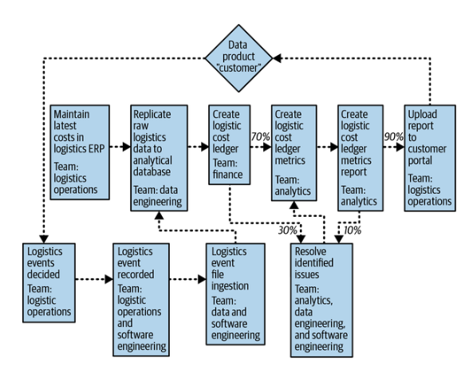
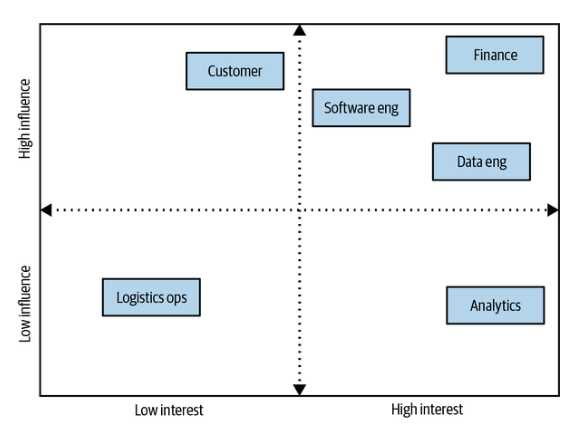
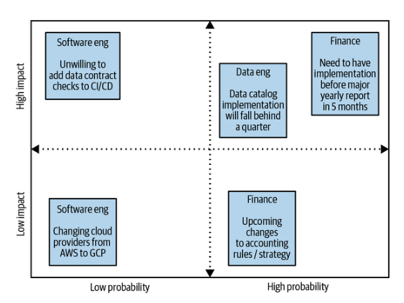

# Capítulo 11. Cómo obtener tus primeros éxitos con los contratos de datos

Queremos dejar claro que este capítulo está dirigido específicamente a los líderes que implementan contratos de datos en las empresas. Aunque este capítulo puede resultarte útil aunque no seas un líder empresarial, ten en cuenta que se centra en profundidad en el aspecto administrativo de la implementación de contratos de datos partiendo de esta premisa. Las razones por las que prestamos especial atención a esta faceta de la implementación de contratos de datos son las siguientes.

Los últimos años dedicados a escribir este libro y a implementar contratos de datos en diferentes organizaciones han dejado muy claro que la tecnología de los contratos de datos es relativamente sencilla, pero que su adopción es bastante compleja. Si recordás el capítulo 3, destacamos la ley de Conway (es decir, cómo la estructura del equipo y la comunicación dan forma a los sistemas) y el número de Dunbar (es decir, la ruptura de la comunicación entre más de 150 empleados) como fuerzas impulsoras que hacen que los contratos de datos sean necesarios para la gestión del cambio en los sistemas de software basados en datos.

Aunque las organizaciones de cualquier tamaño pueden implementar contratos de datos, hemos descubierto que las organizaciones a escala empresarial son las que más probabilidades tienen de aplicarlos con seriedad. Las empresas cuentan con un gran número de desarrolladores de software y datos distribuidos en múltiples equipos y ubicaciones (a veces incluso en diferentes países). Además, más allá de la escala de los sistemas, la diversidad de herramientas y el mantenimiento de los sistemas heredados dentro de las empresas es enorme. A todo esto se suma el hecho de que las empresas también tienen mayores necesidades de gobernanza (por ejemplo, auditorías, regulaciones, etc.) y están más expuestas al riesgo. Por lo tanto, las organizaciones a escala empresarial tienen un claro retorno de la inversión que justifica el esfuerzo de implementar, mantener e impulsar la adopción de contratos de datos en múltiples equipos y unidades de negocio que suelen estar aislados.

En el capítulo anterior, nos centramos en por qué la gestión del cambio une los elementos clave del desplazamiento de los datos hacia la izquierda en las organizaciones: las personas, los procesos y la tecnología. También discutimos cómo la comunicación eficaz constituye la base crucial para la propia gestión del cambio.

Ahora, en este capítulo, partiremos de esa base para esbozar un enfoque sencillo y pragmático que puedes utilizar para seleccionar estratégicamente el producto de datos adecuado, en torno al cual centrarás una prueba de concepto (POC) inicial del contrato de datos. Además, detallaremos cómo los líderes obtienen la información y el apoyo necesarios para vender esa prueba de concepto y, en última instancia, aprovechar su éxito posterior para impulsar la adopción de contratos de datos en toda la organización.

## Determinar tu primer caso de uso del contrato de datos

En primer lugar, y lo más importante, debes seleccionar un candidato que sirva de base para tu programa piloto de contratos de datos, una prueba de concepto que te proporcione un éxito fundamental sobre el que puedas construir en un futuro próximo.

Pero antes de seleccionar un candidato, necesitamos una definición clara y viable de lo que realmente es un producto de datos dentro de tu organización. Necesitarás una definición que te permita filtrar y analizar cientos, si no miles, de activos de datos. Resulta que llegar a una definición puede ser algo sorprendentemente difícil.

### Definición de productos de datos

Si le preguntas a diez profesionales del e o de datos qué constituye un producto de datos en sus propias organizaciones, recibirás diez respuestas diferentes que, aunque comparten una intención común, tienen entidades distintas.

En el entorno adecuado, con el grupo adecuado de profesionales de datos, participar en el esfuerzo cognitivo necesario para conciliar diferentes opiniones y experiencias sobre una definición integral de producto de datos puede ser un ejercicio agradable. Creemos que este no debería ser tu objetivo, ya que solo los profesionales de datos disfrutan profundizando en los matices pedantes.

Para nuestros propósitos aquí, simplemente necesitamos una definición práctica que filtre todos los posibles productos de datos de tu organización para obtener un conjunto inicial y manejable de consideraciones. Las etapas iniciales de la curva de madurez de los contratos de datos de una organización se nutren del progreso iterativo, no de la perfección.

Por lo tanto, como definición mínima viable para cumplir nuestro objetivo de determinar tus primeros activos de datos que proteger, proponemos la siguiente definición de producto de datos:

_Un flujo de trabajo y/o proceso empaquetado que consiste en un activo de datos, un medio para poner en práctica estos datos y un método para servir los datos a un consumidor. Además, debe ser reutilizable, propiedad del dominio y estar vinculado a un resultado verificable de alto valor dentro de la organización._

La aplicación de esta definición garantiza que cualquier producto de datos que participe en la siguiente fase del proceso de filtrado será cuantificablemente relevante para el negocio, y que su ciclo de vida lógico implicará a productores y consumidores de datos que están muy involucrados en el propio producto de datos.

Este último punto es especialmente crucial para los diseños de tu contrato de datos piloto, principalmente porque los niveles de inversión se correlacionan con los niveles de retroalimentación. Cuanta más retroalimentación recibas a medida que se desarrolla el proceso piloto, y cuanto más a menudo la recibas, mejor posicionado estarás para realizar los pequeños pero vitales ajustes que determinan su éxito o fracaso.

Nuestros amigos de los círculos de ingeniería de software reconocen desde hace tiempo el poder de la retroalimentación continua y real en este sentido. Tanto es así que se refieren a ella de una manera muy específica: «balas trazadoras». Así es como David Thomas y Andrew Hunt describen las balas trazadoras en su libro The Pragmatic Programmer (O'Reilly):

_Las balas trazadoras muestran lo que estás alcanzando. Puede que no siempre sea el objetivo. Entonces ajustas tu puntería hasta que den en el blanco. Esa es la clave. Utilizas la técnica en situaciones en las que no estás 100 % seguro de hacia dónde te diriges. No debe sorprenderte si tus primeros intentos fallan: el usuario dice «eso no es lo que quería decir», o los datos que necesitas no están disponibles cuando los necesitas, o parece probable que haya problemas de rendimiento. Así que cambia lo que tienes para acercarte al objetivo._

Por lo tanto, nuestra definición práctica de productos de datos te ayudará a superar la primera fase, que consiste en centrarte en los activos de tu organización que puedes considerar seguros para una prueba piloto. Para profundizar aún más, tomaremos prestado otro concepto del mundo de la ingeniería de software que te ayudará a separar los resultados de alto valor de los que son fundamentales para la misión de tu organización.

### Identificar tus hilos de acero

Mediante la aplicación e e de nuestra definición de producto de datos, cualquier activo incluido en tu lista de posibles candidatos para la prueba piloto se vinculará a resultados de alto valor en tu organización (es decir, productos de datos de «nivel 1»). Para reducir aún más la lista, ahora debes identificar cuáles de estos productos de datos funcionan cualitativamente como hilos de acero organizativos.

El término «hilos de acero» tiene su origen en la construcción de puentes, concretamente en los puentes colgantes. La construcción se basaba en cables de diferentes materiales tendidos entre anclajes a ambos lados de una extensión determinada, como se ilustra en la figura 11-1. Una vez fijados, estos cables actúan como una subestructura vital, permitiendo la construcción del propio puente, a través y por encima de ellos. Como tales, estos hilos de acero son fundamentales para la integridad estructural de los puentes.

Los ingenieros de software han adoptado el concepto de hilos de acero y lo han aplicado a la arquitectura de sistemas (recomendamos encarecidamente el artículo de Jade Rubick sobre el tema). Se utiliza en las organizaciones para identificar y demostrar las rutas de ejecución de extremo a extremo que respaldan la funcionalidad básica y se alinean con los objetivos empresariales. Al «recorrer el hilo», los ingenieros trazan flujos de trabajo críticos, documentan los componentes clave del sistema, descubren riesgos potenciales y validan cualquier decisión arquitectónica potencial antes de ampliar un sistema determinado.

A efectos de nuestro análisis, los productos de datos se consideran hilos de acero si su fallo causara una interrupción inmediata y cuantificable de las operaciones comerciales, la toma de decisiones o la experiencia del cliente.

Para ilustrar lo que está en juego, imagina que trabajas como gerente de logística en una gran empresa fabricante de automóviles. En tu puesto, eres responsable de supervisar la cadena de suministro, asegurándote de que las piezas y los vehículos terminados se entreguen de manera eficiente.

Comienzas la semana temprano cada lunes con la ayuda de un panel de control que integra datos de múltiples fuentes, incluidos datos de producción en tiempo real, niveles de inventario y datos de la cadena de suministro del fabricante. Con este panel de control, elaboras un informe que destaca cualquier cuello de botella en la fabricación debido a una serie de posibles problemas, como sobrecargas de equipos, escasez de inventario o retrasos en el transporte, por ejemplo. A su vez, entregas este informe a tus proveedores, cada uno de los cuales lo utiliza para optimizar sus propios programas de producción y reasignar los recursos según sea necesario para garantizar la entrega puntual de los componentes críticos.

Debido a la escala y la complejidad de la cadena de suministro, cualquier retraso o inexactitud en el informe que proporcionas podría dar lugar a retrasos en los envíos, ralentizaciones en la producción o incluso paradas totales en la planta de fabricación. En este sentido, el informe único y aparentemente sencillo que permite este producto de datos no solo es crítico, sino que es esencial para las operaciones comerciales.

Ahora imagina que el e e de datos que alimenta el panel de control deja de ser fiable debido a cambios en el esquema, discrepancias en la ingesta de datos o un fallo en el sistema ascendente. Sin darte cuenta, es posible que no tengas forma de detectar que el informe semanal que estás generando es inexacto. Envías el informe sin darte cuenta de que el producto de datos en el que confías está comprometido. Y el daño se agrava rápidamente. Tus proveedores comienzan a realizar ajustes mal informados y el proceso de producción se interrumpe, con repercusiones en toda la organización. ¿Cuánto tiempo tardará en identificarse y corregirse el problema? ¿Minutos? ¿Horas? ¿Días laborables completos?

Teniendo en cuenta que los costes de las paradas de fabricación en la industria automovilística ascendían a una media de 22 000 dólares de beneficio por minuto hace más de 20 años (podemos suponer que hoy en día son sustancialmente mayores), es un eufemismo decir que incluso los problemas más pequeños que afectan a los productos de datos de hilos de acero pueden provocar pérdidas económicas sustanciales y daños a la reputación.

Pero este es el objetivo de nuestro ejemplo, ya que este es precisamente el nivel de impacto empresarial que debe determinar qué productos de datos de tu propia organización decides identificar como hilos de acero y cuáles no. Como segunda fase de nuestro proceso de filtrado iterativo, tu lista de candidatos para el programa piloto de contratos de datos debería parecer ahora mucho más manejable.

Por supuesto, existe la posibilidad de que ya hayas llegado a tu candidato principal. Si es así, no dudes en pasar a la siguiente sección. Pero cuando te enfrentes a un puñado de hilos de acero convincentes, el uso de una sencilla matriz de decisión ponderada puede aclarar el proceso de selección e.

### Tomar la decisión final

La matriz de decisión ponderada es una herramienta sencilla pero muy versátil dentro de la toma de decisiones multicriterio. Como tercera y última fase de filtrado de candidatos a productos de datos, proporciona una forma eficaz de evaluar y comparar los criterios de los hilos de acero que siguen en liza para tu piloto, y hacerlo con el menor sesgo posible. Tu objetivo es pasar de un pequeño grupo de buenos candidatos a piloto al mejor, y hacerlo de una manera que tenga en cuenta las necesidades únicas de tu organización.

En primer lugar, define tus criterios de comparación de hilos de acero centrándote tanto en el impacto empresarial como en la viabilidad del piloto. Entre los factores relacionados suelen figurar los siguientes:

_Criticidad empresarial_

Un mayor impacto operativo se correlaciona con una mayor aceptación potencial y la urgencia que puede generar su programa piloto de contratos de datos.

_Compromiso de productores y consumidores_

Los productores y consumidores de datos altamente comprometidos estarán más inclinados a ver los beneficios potenciales de la adopción de contratos de datos. Como tal, es más probable que estén motivados para actuar como fuentes valiosas de detalles clave necesarios para planificar tu prueba de concepto y maximizar la retroalimentación de tracer bullet mientras está en curso.

_Baja volatilidad de los datos_

Los hilos de acero altamente dinámicos pueden requerir actualizaciones frecuentes, lo que aumenta los riesgos durante el propio proceso piloto o requiere más versiones en comparación con otros candidatos. Ten en cuenta que se trata de un equilibrio de riesgos, ya que la volatilidad de un activo de datos es la razón por la que se beneficiaría de los contratos de datos.

_Problemas de calidad de los datos existentes_

Es muy posible que los productos de datos de alto valor y hilos de acero se vean afectados por problemas de calidad de los datos. El grado en que la implementación de contratos de datos podría solucionar estos problemas determina si esta categoría es un beneficio o un peligro.

_Complejidad de las dependencias_

Por regla general, los productos de datos con menos interdependencias reducen el riesgo de su uso en un piloto de contrato de datos. Dicho esto, la complejidad podría reducirse si las múltiples dependencias recayeran en un solo equipo.

_Facilidad de implementación_

Esto mide aproximadamente cuánto esfuerzo de ingeniería y herramientas se necesitará para configurar el programa piloto. Aquí es donde a menudo hemos recibido más rechazo por parte de la ingeniería de software upstream.

_Visibilidad organizativa_

En última instancia, cuanto más dependan los equipos de los datos de un producto de datos concreto, más claras serán las ventajas de un programa piloto de adopción de contratos de datos.

Una vez que hayas capturado todos los criterios clave, determina una ponderación para cada criterio en una escala del 1 al 10, siendo 1 un criterio débil y 10 un criterio fuerte para la selección de hilos de acero. Cuanto más importante sea un criterio determinado para las posibilidades de éxito de tu piloto en tu organización, mayor deberá ser su ponderación. A continuación, puntúa cada uno de los hilos de acero que quedan en tu conjunto de consideración del 1 al 5 en función de cómo cumple los criterios enumerados, siendo 1 una adecuación deficiente y 5 una adecuación excelente.

A modo de ejercicio mental, ilustraremos la matriz de decisión ponderada en la práctica volviendo a recurrir al ejemplo de la logística de la empresa automovilística. La tabla 11-1 representa la matriz de decisión potencial de números brutos creada por el líder que explora los hilos de acero potenciales.

Tabla 11-1. Valores brutos de la matriz de decisión

| Producto de datos                                               | Importancia para el negocio (ponderación: 10) | Compromiso de los productores y consumidores (ponderación: 7) | Baja volatilidad de los datos (ponderación: 2) | Problemas existentes en la calidad de los datos (ponderación: 6) | Complejidad de las dependencias (ponderación: 4) | Facilidad de implementación (ponderación: 4) | Visibilidad organizativa (ponderación: 7) | Total |
| :-------------------------------------------------------------- | :-------------------------------------------: | :-----------------------------------------------------------: | :--------------------------------------------: | :--------------------------------------------------------------: | :----------------------------------------------: | :------------------------------------------: | :---------------------------------------: | :---: |
| Libro mayor de costes logísticos                                |                       4                       |                               4                               |                       3                        |                                4                                 |                        5                         |                      5                       |                     3                     |  28   |
| Previsión de ventas de concesionarios                           |                       4                       |                               5                               |                       4                        |                                3                                 |                        5                         |                      5                       |                     1                     |  27   |
| Métricas de rendimiento de los operadores                       |                       4                       |                               4                               |                       4                        |                                2                                 |                        3                         |                      5                       |                     3                     |  25   |
| Eventos del ciclo de vida del envío                             |                       5                       |                               2                               |                       2                        |                                3                                 |                        2                         |                      5                       |                     2                     |  21   |
| Opiniones de clientes sobre concesionarios                      |                       1                       |                               4                               |                       3                        |                                4                                 |                        5                         |                      1                       |                     3                     |  21   |
| Basededatosparala gestión del inventario de piezas de automóvil |                       5                       |                               2                               |                       2                        |                                3                                 |                        4                         |                      1                       |                     4                     |  21   |
| Informes de incidentes de seguridad                             |                       3                       |                               2                               |                       5                        |                                1                                 |                        4                         |                      1                       |                     4                     |  20   |
| Instantánea del inventario del almacén                          |                       5                       |                               2                               |                       2                        |                                2                                 |                        3                         |                      1                       |                     4                     |  19   |
| Registros de mantenimiento de la máquina                        |                       3                       |                               1                               |                       4                        |                                2                                 |                        4                         |                      3                       |                     2                     |  19   |
| Flujo de telemetría del vehículo                                |                       1                       |                               1                               |                       1                        |                                2                                 |                        3                         |                      5                       |                     3                     |  16   |

Después de registrar la justificación de la puntuación para cada hilo de acero potencial, puedes tabular los valores totales por hilo de acero (es decir, puntuación × valor de peso) para cada criterio y sumarlos todos.

El hilo de acero con la cantidad agregada más alta es el producto de datos con la mayor probabilidad relativa de éxito y la opción que producirá la máxima cantidad de pruebas de tu prueba de concepto. En el caso de la Tabla 11-2, parece que el producto de datos del libro mayor de costos logísticos es el hilo de acero más prometedor.

Tabla 11-2. Valores ponderados de la matriz de decisión (la fila superior resaltada)

| Producto de datos                                               | Importancia para el negocio (ponderación: 10) | Compromiso de productores y consumidores (ponderación: 7) | Baja volatilidad de los datos (ponderación: 2) | Problemas existentes en la calidad de los datos (ponderación: 6) | Complejidad de las dependencias (ponderación: 4) | Facilidad de implementación (ponderación: 4) | Visibilidad organizativa (ponderación: 7) | Total |
| :-------------------------------------------------------------- | :-------------------------------------------: | :-------------------------------------------------------: | :--------------------------------------------: | :--------------------------------------------------------------: | :----------------------------------------------: | :------------------------------------------: | :---------------------------------------: | :---: |
| Libro mayor de costes logísticos                                |                      40                       |                            28                             |                       6                        |                                24                                |                        20                        |                      20                      |                    21                     |  159  |
| Previsión de ventas de concesionarios                           |                      40                       |                            35                             |                       8                        |                                18                                |                        20                        |                      20                      |                     7                     |  148  |
| Métricas de rendimiento de los operadores                       |                      40                       |                            28                             |                       8                        |                                12                                |                        12                        |                      20                      |                    21                     |  141  |
| Basededatosparala gestión del inventario de piezas de automóvil |                      50                       |                            14                             |                       4                        |                                18                                |                        16                        |                      4                       |                    28                     |  134  |
| Eventos del ciclo de vida del envío                             |                      50                       |                            14                             |                       4                        |                                18                                |                        8                         |                      20                      |                    14                     |  128  |
| Instantánea del inventario del almacén                          |                      50                       |                            14                             |                       4                        |                                12                                |                        12                        |                      4                       |                    28                     |  124  |
| Opiniones de clientes sobre concesionarios                      |                      10                       |                            28                             |                       6                        |                                24                                |                        20                        |                      4                       |                    21                     |  113  |
| Informes de incidentes de seguridad                             |                      30                       |                            14                             |                       10                       |                                6                                 |                        16                        |                      4                       |                    28                     |  108  |
| Registros de mantenimiento de la máquina                        |                      30                       |                             7                             |                       8                        |                                12                                |                        16                        |                      12                      |                    14                     |  99   |
| Flujo de telemetría del vehículo                                |                      10                       |                             7                             |                       2                        |                                12                                |                        12                        |                      20                      |                    21                     |  84   |

Este proceso puede requerir un poco de experimentación para hacerlo bien. Pero es tiempo bien empleado, ya que puedes añadir y ampliar tu matriz de decisión ponderada durante las fases iniciales de tu proceso piloto, revisando, añadiendo y ampliando tus conocimientos generales. Ganarás seguridad a medida que te reúnas con los productores y consumidores de datos y trazas completamente el ciclo de vida del producto de datos, al tiempo que te aseguras de tomar la decisión correcta para un ar tu piloto de contrato de datos.

En la siguiente sección se explica exactamente cómo abordar esta cuestión.

## Determinar tu caso de negocio y tus requisitos

Una vez que tengas el hilo conductor e , debes cambiar de marcha para construir un caso de negocio a prueba de balas en torno a él. Como se estableció en el capítulo anterior, los líderes invierten en soluciones, no en tecnología. Tendrás que demostrar la viabilidad técnica de tu primera implementación de contratos de datos. Pero la oportunidad de demostrar el potencial bruto que tendrán los contratos de datos en este caso de uso inicial depende de tu capacidad para alinear a todos los líderes y responsables de la toma de decisiones necesarios en tu organización con tu causa.

Tienes que hacer algo más que esbozar los problemas, los resultados y los pasos de implementación del proyecto piloto. También tienes que convencer a los líderes de tu organización para que no solo den su visto bueno, sino que también se comprometan personalmente a garantizar tu éxito. Todo esto puede parecer mucho. Y lo es. Pasar del candidato que has elegido para tu proyecto piloto al proyecto piloto en sí es todo un viaje.

Para apoyar tus esfuerzos, hemos resumido en cuatro pasos el proceso de creación de una base sólida para la implementación inicial de tu hilo de acero:

1. Recopila información y planifica tu participación.

2. Planifica dónde encajan las partes interesadas clave en el ciclo de vida de los datos.

3. Determina la influencia, el interés y los riesgos de las partes interesadas clave.

4. Consigue la alineación y el apoyo de los directivos.

Observa cómo tres de los cuatro pasos giran en torno a las personas. En las siguientes secciones se detalla cómo llevar a cabo cada paso basándonos en nuestra experiencia y en la de personas con las que hemos hablado de todo el sector.

### Recopila información y planifica tu participación

Tu primer paso debe consistir en recopilar información específica sobre el sistema del producto de datos elegido y sus procesos relacionados. La clave aquí es conocer los supuestos y requisitos críticos que debes validar, así como identificar a las partes interesadas cruciales.

Hazte una idea de quién produce los datos que alimentan el producto de datos, quiénes son las personas que los consumen y cómo todo esto se relaciona con las necesidades empresariales. Y utilizamos deliberadamente el término «esbozar», ya que el objetivo es orientarte. Esa orientación te evitará tener que buscar el camino y solicitar la aceptación en un vacío contextual. Además, este trabajo de preparación te protege contra los malentendidos y las resistencias, al dar prioridad a las necesidades y los compromisos existentes de todos los demás.

En muchas organizaciones, puedes recopilar una cantidad considerable de información analizando los artefactos técnicos y los patrones operativos de un producto de datos determinado, sobre todo porque ya has invertido el tiempo necesario para asegurarte de que el producto en cuestión es fundamental para tu organización. Dicho esto, también hemos hablado con muchos equipos de datos que no sabían por dónde empezar o que temían que esos datos no se hubieran recopilado. Si te encuentras en esta última situación, te sugerimos los siguientes puntos de partida:

- Quién tiene acceso de lectura/escritura a las bases de datos de interés

- Registros de auditoría de una base de datos (por ejemplo, «¿Quién ha leído la base de datos XYZ en los últimos 90 días?»)

- Colaboradores recientes en repositorios de código específicos (por ejemplo, `git blame`)

- Determinación de métricas relacionadas con el producto de datos y responsables de dichas métricas

- Patrones de ingestión de datos y registros de coordinación (por ejemplo, trabajos por lotes diarios frente a semanales)

- Informes de incidentes de guardia que mencionan código y/o activos de datos relacionados con el producto de datos

- Documentos de requisitos del producto relacionados con el código y los datos utilizados para el producto de datos

Además, intenta determinar cuáles parecen ser las principales limitaciones relacionadas con el dominio del producto e . Lee los tickets anteriores. Revisa Slack y otros canales de comunicación relacionados. Y sé realista, ya que estos esfuerzos iniciales pueden representar solo una cuarta parte de la realidad organizativa total que rodea a tu piloto. En puestos anteriores, Mark solía crear un canal de Slack donde reenviaba los mensajes clave que encontraba (también animaba a otros a añadir más). A continuación, incluía capturas de pantalla de estas conversaciones públicas de la empresa en sus propuestas para que el problema pareciera más real.

En última instancia, este proceso de esbozar nuestra parte inicial de conocimiento te permitirá planificar cómo interactuar con tus productores y consumidores de datos e identificar con quién empezar exactamente. Lo ideal es aprovechar la información que has recopilado para establecer un plan básico de participación e . Este plan debe incluir los siguientes componentes:

- La misión, el objetivo y el alcance de tu prueba de concepto piloto

- Listas separadas de todos los productores de datos, consumidores de datos y personal relacionado que hayas identificado durante tu proceso de recopilación de información, a quienes puedas necesitar contactar y en qué orden

- Conocimientos específicos del dominio que hayas adquirido hasta la fecha.

- Versiones concisas y breves de tu misión y objetivo, que puedas utilizar cuando te pongas en contacto por primera vez con los productores y consumidores de datos

- Una forma clara de expresar tu necesidad de establecer conversaciones breves e iniciales, adaptadas según sea necesario para que sean inmediatamente inteligentes y relevantes tanto para los productores como para los consumidores de datos

- Una forma coherente de llevar a cabo estas reuniones y conversaciones (Mark solía recurrir a su experiencia en investigación cualitativa utilizando entrevistas semiestructuradas).

- Claridad sobre cómo documentarás los puntos débiles de los productores y consumidores de datos, además de cómo un proyecto piloto exitoso podría beneficiar a todas las partes relevantes

- Un calendario de trabajo aproximado, que puedas actualizar fácilmente y utilizar para recapitular los siguientes pasos, entrevistas y planes.

En el siguiente paso describiremos cómo organizar un taller de participación ( ) y aprovechar la información recopilada y el plan de participación.

### Identifica dónde encajan las partes interesadas clave en el ciclo de vida de los datos

El proceso de asignación de la lógica empresarial a tu producto de datos de hilo de acero te ayudará a tender un puente entre el rigor técnico y las prioridades empresariales. Este proceso te obliga a cambiar tu perspectiva y alejarte de las llamadas de función y las transformaciones de datos hacia las que puedes sentirte atraído inicialmente cuando te reúnas con tus primeros productores y consumidores de datos. Por supuesto, esos datos son importantes. Pero ahora debes centrarte en el significado empresarial que hay detrás de esos datos. No puedes permitir que tu piloto sea solo la pila de «soluciones técnicas» que se lanzan con demasiada frecuencia a los directivos.

Por lo tanto, te sugerimos que traces la serie de pasos necesarios para entregar tu producto de datos a un consumidor de datos, lo que también se conoce como mapeo del flujo de valor. A medida que visualices el flujo de valor de tu producto de datos, captarás de forma natural las acciones clave que tienen lugar en cada etapa y comenzarás a comprender cuáles son críticas para el negocio. Además, en este punto también deberías tener claros cuáles son tus propietarios de dominio clave.

Volviendo al ejemplo de la logística de la empresa automovilística, la figura 11-2 ilustra cómo sería un posible mapa de flujo de valor de alto nivel para el producto de datos del libro mayor de costes logísticos elegido como hilo conductor.

En la siguiente sección, utilizaremos este mapa de flujo de valor de alto nivel para identificar la influencia, el interés y los riesgos de tus partes interesadas clave en lo que respecta a la implementación de tu contrato de datos.

### Determina la influencia, el interés y los riesgos de las partes interesadas clave

Debes comprender cómo gestionar a tus partes interesadas clave y cualquier problema que pueda afectar al curso del proyecto piloto en curso. Te recomendamos que utilices una sencilla matriz 2 × 2 de dos maneras diferentes. La primera determinará qué partes interesadas son potenciales obstáculos o facilitadores. La segunda resaltará qué problemas (es decir, riesgos) debes estar preparado para gestionar o mitigar.

Comienza con las conversaciones que mantuviste con tus productores y consumidores de datos, y sitúa a todas las partes interesadas en los cuatro cuadrantes de una matriz de influencia frente a interés, como se muestra en la Figura 11-3.

Puedes interpretar los distintos cuadrantes de esta matriz de la siguiente manera:

_Gran influencia, gran interés_

Las partes interesadas del cuadrante superior derecho son tus defensores del programa piloto, tus facilitadores. Proporciona a estas personas información actualizada periódicamente y participa en la toma de decisiones, ya que tienen una influencia significativa y son las más interesadas en el éxito de tu programa piloto. Es muy probable que, en este momento, estas personas ya estén alineadas con tu visión y tus objetivos para el programa piloto de contratos de datos. Sin embargo, merece la pena dedicar el tiempo y el esfuerzo necesarios para mantener esa alineación, ya que te ayudan a avanzar.

_Gran influencia, poco interés_

Estas partes interesadas deben recibir actualizaciones periódicas a medida que avanzas en el proceso piloto. Tu objetivo es mantener su alto nivel de apoyo sin abrumarlas. Además, asegúrate de que las partes interesadas con bajo interés en este cuadrante no trabajen inadvertidamente en tu contra. Los obstáculos clásicos en este sentido suelen enmarcarse como antagonistas abiertos. Las partes interesadas influyentes con bajo interés pueden afectar potencialmente a recursos, decisiones u opiniones clave si no se controlan.

_Baja influencia, alto interés_

Estas partes interesadas son aquellas que están muy comprometidas con tu piloto y su éxito en la organización. Aunque su impacto puede ser limitado, procura mantenerlas informadas e involucradas en la medida de lo posible para garantizar que se escuchen sus opiniones. Esto puede resultar especialmente importante después del piloto, cuando comiences a ampliar la adopción del contrato de datos en toda la organización.

_Baja influencia, bajo interés_

Estas partes interesadas son las que menos atención requieren por tu parte en el futuro. No obstante, debes seguir realizando el monitoreo de ellas hasta el final del proceso piloto. Como partes interesadas relacionadas con un hilo conductor en tu organización, pueden seguir influyendo en la opinión informal. Ofrecer a estas partes interesadas una cortesía básica (por ejemplo, una breve actualización mensual sobre el proceso piloto del contrato de datos) fomenta la confianza y la buena voluntad.

A continuación, profundiza en las partes interesadas del cuadrante de alta influencia y alto interés utilizando una matriz de probabilidad frente a impacto, como se muestra en la Figura 11-4. Utiliza el mismo enfoque 2 × 2 y traza todos los problemas potenciales en consecuencia, ya sean relacionados con las partes interesadas, técnicos o puramente operativos. Ten en cuenta que la matriz del ejemplo es mucho más escasa que la que tú puedes crear.

Una vez más, así es como puedes interpretar los siguientes cuadrantes:

_Alta probabilidad, alto impacto_

Los riesgos requieren atención inmediata. Cualquier problema asignado a este cuadrante que no pueda resolverse antes de presentar tu propuesta piloto merece su propio plan de mitigación concreto, ya que puede impedir o erosionar activamente la alineación y la aceptación a nivel directivo.

_Alta probabilidad, bajo impacto_

Los riesgos pueden ser probables o incluso esperados. Por lo tanto, considera la posibilidad de establecer pequeñas medidas de protección para los problemas que asignes a este cuadrante, ya que (individualmente o colectivamente) no deberían poner en peligro activamente la presentación o la ejecución de tu piloto.

_Baja probabilidad, alto impacto_

Los riesgos merecen un plan de contingencia, ya que cualquier problema en este cuadrante sería catastrófico (si llegara a ocurrir). Crea un plan claro de «si... entonces» para cada problema y, cuando sea posible, establece un medio para el monitoreo de cualquier señal de alerta temprana relevante.

_Baja probabilidad, bajo impacto_

Los riesgos siguen siendo factores potenciales que pueden obstaculizar o afectar tus esfuerzos. Por esta razón, anota cada uno de ellos en una «lista de vigilancia» que puedas consultar y revisar según sea necesario.

Ten en cuenta que la influencia y el interés de las partes interesadas pueden cambiar, por lo que es posible que tengas que volver a realizar este ejercicio a medida que surja nueva información pertinente.

> **Nota**

> Ten en cuenta que estos consejos son sugerencias para abordar los retos que puedan surgir con las partes interesadas. Debes equilibrar los esfuerzos en torno a la estrategia y el análisis con formas pragmáticas de lograr resultados.

En última instancia, el objetivo es crear una narrativa e e y convincente para tus partes interesadas clave más adecuadas y determinar los resultados o garantías imprescindibles para que respalden con confianza tu propuesta de implementación del contrato de datos. En la siguiente sección detallaremos cómo utilizar esta narrativa para conseguir el apoyo de los directivos a tu propuesta y proporcionaremos una plantilla de presentación.

### Consigue el patrocinio de los directivos

Los líderes rara vez tienen tiempo libre y deben equilibrar numerosas demandas ajenas a tu caso de uso. Por lo tanto, es fundamental que sintetices tu caso de negocio en una narrativa que permita hacer fácilmente lo siguiente:

- Comienza por el problema (o los problemas clave) y la alineación del caso de negocio.

- Posiciona los resultados piloto como soluciones.

- Comunica qué se puede esperar y cuándo.

- Asegura a los responsables de la toma de decisiones que tu enfoque mitiga los riesgos.

- Deja claro el retorno de la inversión, ya que se comparará con el retorno de la inversión de las propuestas de la competencia.

Te sugerimos que utilices una presentación de diapositivas, ya que es un recurso fácil de compartir con las partes interesadas, pero siempre respeta las normas de tu organización (por ejemplo, Amazon prefiere documentos). La siguiente barra lateral es un esquema de presentación de diapositivas que nos ha dado buenos resultados a la hora de conseguir que se aceptara una propuesta de contrato de datos. Ten en cuenta que esta presentación es un formato ideal para directores, vicepresidentes y líderes de niveles similares, pero deberá adaptarse a un breve resumen o a una página para los ejecutivos de alto nivel.

La siguiente plantilla de presentación se basa en presentaciones exitosas que hemos utilizado para obtener la aprobación de los altos directivos ( ) para la implementación de contratos de datos.

> Esquema de Shift Left Data para la aprobación del programa piloto

_Diapositiva del título_

- Empieza con un título breve, relevante y que llame la atención.

- Incluye tu nombre, la fecha y los patrocinadores clave del programa piloto.

_Resumen ejecutivo_

Una descripción general de alto nivel que detalle el problema, la solución propuesta y los beneficios comerciales, adaptada a un público ejecutivo que tal vez no revise toda la presentación.

_Alineación de problemas y casos de uso_

- Indica los problemas empresariales u operativos fundamentales que tu proyecto piloto pretende abordar.

- Proporciona tus principales pruebas sobre el problema (métricas afectadas en la situación actual):
    - Describe claramente el impacto que tiene tu hilo conductor en las necesidades de la empresa.
    - Establece el estado actual de la relación del producto de datos con el negocio, proporciona contexto y crea urgencia aprovechando los problemas, las fricciones y los puntos débiles.

- Aporta pruebas complementarias del problema (efectos secundarios del estado actual).

- Expone el origen del problema: proporciona pruebas previas del problema (problemas heredados/incidentes pasados).

_Casos de uso (repite por cada caso de uso, máximo tres)_

- Nombra el caso de uso.
- Ofrece un escenario rápido y realista que ilustre cómo el programa piloto (solución) beneficiará al negocio (alineación) al resolver el problema o los problemas.
- Menciona las métricas previstas que se verán afectadas.

_Resultados (máximo tres)_

- Enumera los resultados empresariales previstos: resume los beneficios a nivel empresarial (clasificados por urgencia/tiempo de amortización).

- Enumera los resultados técnicos esperados: resume los beneficios a nivel técnico (clasificados por urgencia/tiempo de amortización).

_Fases de implementación_

- Ofrece una visión general de alto nivel del proceso.

- Asigna las fases individuales al calendario y a los equipos involucrados.

- Ofrece una descripción detallada de los factores clave: estado actual, problemas en curso, solución propuesta e impacto previsto.

Además, incluye cualquier información más detallada que pueda ser útil o no ese día en un apéndice al final de la presentación. Será fácil consultarla si es necesario, pero no obstaculizará, por defecto, la urgencia y la claridad de tu enfoque.

Por último, planifica la presentación en sí. Decide si presentarás tu proyecto piloto en directo en una reunión de liderazgo (lo ideal) o si distribuirás la presentación de forma asíncrona con un breve resumen. No dejes que el éxito te pille desprevenido. Describe los pasos posteriores a la aprobación con el mayor detalle posible. Tener estos detalles pensados y preparados reforzará ante los líderes la idea de que están depositando su confianza en la persona y el proceso adecuados.

Tras la aprobación, es posible que alguien te pregunte si el éxito de tu prueba de concepto se puede ampliar. La respuesta correcta es «sí», ya que puedes aprovechar los logros de tu piloto de hilo de acero modificando y repitiendo este proceso hasta que hayas implementado con éxito los contratos de datos en todos los productos de datos críticos para el negocio de tu organización.

En este punto, es posible que tengas o no un momento para celebrar antes de que los líderes empiecen a preguntar: «¿Y ahora qué hacemos?».

Es una gran pregunta. En nuestra opinión, la respuesta pasa por formalizar tu enfoque para dar pasos adelante y pasar de realizar proyectos piloto a cambiar la cultura de la organización en torno a las prácticas de datos «shift left». En la siguiente sección describiremos cómo tú, como responsable de la gestión de datos ( ), puedes abordar ese cambio organizativo.

## Ocho pasos para la adopción del Shift Left en toda la organización

Ahora ya sabes cómo emprender el viaje desde la identificación de los hilos de acero hasta la obtención de la alineación y la aceptación necesarias para la implementación del contrato de datos. Los beneficios obtenidos en cada caso no solo benefician directamente al negocio, sino que son necesarios tanto para tu capacidad de impulsar la adopción del contrato de datos como para ampliar las prácticas de datos de desplazamiento a la izquierda en toda la organización en su conjunto.

Los hilos de acero son un comienzo, una forma de hacer posible el progreso. A pesar de su valor sustantivo en la organización, no pueden crear por sí solos la infraestructura más amplia necesaria para impulsar un cambio duradero. Esta infraestructura debe conectar a los equipos, mantener la energía y obligar a las personas a cambiar su forma de trabajar, pensar y relacionarse entre sí. Dicha infraestructura organizativa será, por tanto, el tema central de esta sección.

Para guiarte en estos esfuerzos, recurrimos a un marco bien establecido para el cambio organizativo: el proceso de ocho pasos de John Kotter. Desarrollado originalmente para ayudar a los líderes a abordar transformaciones empresariales a gran escala, consideramos que su enfoque es especialmente relevante debido a su énfasis en el valor de la visión y el liderazgo. Los ocho pasos, tal y como se destacan en el libro de Kotter Leading Change (Harvard Business Review Press), son los siguientes:

1. Establecer un sentido de urgencia

2. Crear la coalición rectora

3. Desarrollar una visión y una estrategia

4. Comunicar la visión del cambio

5. Empoderar a los empleados para que emprendan acciones de amplio alcance

6. Generar logros a corto plazo

7. Consolidar los logros y generar más cambios

8. Afianzar los nuevos enfoques en la cultura

Sin embargo, ten en cuenta que lo que sigue en esta sección no pretende ser una lista de verificación. Tampoco es un desglose y análisis exhaustivo del enfoque, la investigación y las metodologías de Kotter. En cambio, considéralo como un camino a seguir, una metodología probada para adaptar y adoptar cuando llegue el momento de pasar de demostrar que las prácticas de datos de desplazamiento a la izquierda funcionan a garantizar su longevidad.

### Establecer un sentido de urgencia

Una vez que hayas establecido los hilos de acero, inevitablemente llegará el momento de pasar a ampliar los contratos de datos en toda la organización. El primer paso para hacerlo debe consistir en cultivar y gestionar la urgencia relacionada con el cambio a la izquierda a medida que avanzas.

La urgencia es fundamental para las iniciativas de gestión de toda la organización y alimenta el motor que impulsa el cambio. Según la investigación de Kotter, tendrás que convencer al menos al 75 % de la dirección de tu organización de que el statu quo es insostenible para que se produzca un cambio a gran escala. Y como esta aceptación es una de las métricas clave para la adopción de contratos de datos que trataremos en el próximo capítulo, tendrás que mantenerla a lo largo del tiempo.

Otra forma en que Kotter enmarca la urgencia es como una «eliminación de la complacencia» para que la organización reconozca la verdadera urgencia que requiere una situación. Por ejemplo, en el puesto anterior de Mark, el principal canal de replicación diaria de datos por lotes desde la aplicación a la base de datos analítica se caía constantemente y paralizaba gran parte del trabajo de datos de su equipo. Mes tras mes, su equipo se enfrentaba a datos extraordinariamente obsoletos o incompletos, trabajaba con las partes interesadas para determinar alternativas y, a continuación, proporcionaba resultados con los datos disponibles.

El equipo de datos aceptaba la complacencia en torno a la falta de fiabilidad del canal de replicación de datos y, por lo tanto, el resto de la empresa no reconocía el problema, hasta que el jefe de Mark se hartó. Con la aprobación de la dirección, el equipo de datos dejó de utilizar soluciones provisionales y simplemente dejó de proporcionar trabajo a los equipos posteriores a menos que los datos fueran suficientemente recientes y completos. Después de un mes en el que el canal de datos estuvo inoperativo, la empresa ya no pudo ignorar el problema y rápidamente asignó a un ingeniero de software para que actualizara el canal de datos problemático.

> **Nota**

> Como breve inciso, una trampa común que vemos es dar urgencia a otro proyecto complejo. En innumerables ocasiones nos hemos encontrado con organizaciones que se encontraban en la fase de planificación de una gran migración y, por lo tanto, estaban muy entusiasmadas con los contratos de datos, dado que por fin contaban con el presupuesto y el patrocinio ejecutivo para mejorar su infraestructura. En todas las ocasiones, la implementación de los contratos de datos acababa perdiendo prioridad, ya que la migración inevitablemente se salía del presupuesto y los plazos se alargaban considerablemente en extensión. Creemos que implementaciones como los contratos de datos y otros cambios importantes tienen mucho más sentido como desarrollos graduales que como migraciones a gran escala.

Por último, la proximidad en las grandes organizaciones complica el impacto natural de la urgencia. En cualquier momento dado, a medida que se escala, algunas personas estarán más cerca que otras de las partes interesadas clave, los puntos débiles y los avances que desempeñan un papel en el propio proceso de adopción. En las grandes organizaciones, la urgencia no puede estar en todas partes ni ser percibida por todos al mismo tiempo.

Por lo tanto, tu objetivo al adoptar el primer paso de Kotter consiste en aprender a depender menos de los valiosos pero limitados impulsos producidos hasta la fecha por tu prueba de concepto inicial y los éxitos de la fase piloto. En cambio, para empezar a crecer, tendrás que empezar a cultivar la urgencia eliminando la complacencia e e en torno al statu quo de la empresa.

### Creación de la coalición rectora

Con la urgencia e e proporcionando el impulso, tendrás que crear coaliciones interfuncionales para establecer la tracción. Al hacerlo, construirás tus esfuerzos continuos de adopción del contrato de datos en la dirección correcta a lo largo del tiempo.

Esto significa que debes seleccionar estratégicamente a los miembros de tu coalición. Resiste la tentación natural de centrarte únicamente en los expertos técnicos e incluye también a altos ejecutivos por su autoridad presupuestaria y política, además de a líderes influyentes de nivel medio que comprendan las realidades de primera línea. Es una ventaja si estos ejecutivos o líderes de nivel medio tienen experiencia en análisis de datos y pueden comprender inmediatamente los problemas que señalas, incluso si ya no realizan consultas a diario.

Adoptar un enfoque estratégico para la creación de coaliciones, tal y como describe Kotter, garantiza que no se creará una versión más dorada de lo que, en realidad, es otro equipo de proyecto temporal. En su lugar, se organizará un grupo dinámico de personas con un propósito común, que ayudará a salvar la distancia entre el éxito de la prueba piloto y la adopción en toda la organización gracias a su experiencia, credibilidad y/o autoridad.

### Desarrollo de una visión y una estrategia

Ya hemos tratado cómo desarrollar una estrategia en el capítulo 10, por lo que aquí nos centraremos en cómo ampliar esas ideas en el contexto de una creciente adopción en toda la empresa. En concreto, tu coalición interfuncional debe exigir a sus miembros que se alineen con una visión compartida que siga siendo relevante para la organización en general a lo largo del tiempo. Esto servirá de base para la planificación y garantizará que las iniciativas de contratos de datos en curso sigan alineadas con el estado final deseado, además de facilitar una mejor comunicación y toma de decisiones continuas. Lo ideal es que tu visión sea fácil de entender y compartir, y que haga referencia a la importancia del enfoque «shift left» y su relación con las decisiones empresariales cotidianas.

Y lo que es más importante, una adopción más amplia requiere que los equipos y las personas de toda la organización se vean a sí mismos desempeñando un papel activo en esta visión. Un gran ejemplo real de una visión y una estrategia compartidas exitosas es la implementación de Data Mesh de JPMorgan Chase. Recomendamos encarecidamente la entrada del blog de la empresa, «La evolución de la arquitectura de Data Mesh puede generar un valor significativo en la empresa moderna», que detalla cómo la empresa alineó su arquitectura de datos con su estrategia de productos de datos.

Además, esta cita del libro de Kotter resume exactamente por qué es esencial una visión sólida: «[Sirve] para facilitar cambios importantes motivando acciones que no necesariamente redundan en el interés personal a corto plazo de las personas». Por ejemplo, en el caso de los ingenieros de software, a menudo se ven sometidos a una enorme presión para ofrecer constantemente nuevas funciones y enviar código. La visión desarrollada debe resonar tanto en los líderes, que deben cambiar los incentivos para permitir que la calidad de los datos se desplace hacia la izquierda, como en los ingenieros, que deben aceptar que añadir más restricciones hoy aumentará la velocidad de desarrollo mañana.

### Comunicar la visión del cambio

Si bien los pasos anteriores conducen a este punto, la comunicación de tu visión sobre la adopción de prácticas de datos de desplazamiento hacia la izquierda dentro de tu organización determinará el éxito o el fracaso de tu iniciativa. Esta tarea es aparentemente difícil. No subestimes la cantidad de refinamiento que requerirá el mensaje, ni el esfuerzo necesario para difundir e interiorizar el mensaje en toda la organización.

Esto es especialmente cierto en el caso de los líderes técnicos, que pueden caer en la comodidad de sus conocimientos especializados. Los esfuerzos de comunicación relativos a tu visión deben ser lo suficientemente sólidos y adaptables como para influir en las decisiones estratégicas de los líderes y en las operaciones de los colaboradores individuales que se encuentran fuera de tu ámbito.

Por ejemplo, volvamos al ejemplo de la logística de la empresa automovilística para demostrar la diferencia:

_Mala comunicación_

«Debemos corregir nuestros informes logísticos, ya que la mala calidad de los datos del libro mayor de costes logísticos está provocando altos índices de error en nuestras métricas logísticas. Esto ha dado lugar a un gasto innecesario en nuestra cadena de suministro, lo que agrava aún más el riesgo que supone el aumento del coste del acero».

_Buena comunicación_

«Es fundamental que reduzcamos el desperdicio en nuestras cadenas de suministro para contrarrestar el aumento del costo del acero».

El primer mensaje se basa en una jerga prolija y pone el énfasis únicamente en el equipo de análisis, a pesar de que nuestro ejercicio de mapeo de la cadena de valor ilustra que hay seis partes interesadas diferentes. Además, la responsabilidad también recae principalmente en el equipo de análisis y no muestra una conexión con el liderazgo. El segundo mensaje es conciso, transmite un sentido de urgencia mediante los términos «fundamental» y «aumento del coste del acero», y establece una iniciativa para toda la empresa que deben cumplir las funciones individuales, al tiempo que la vincula a un resultado estratégico que compete a la dirección.

Ahora bien, este ejemplo era un simple ejercicio de reflexión, y lo ideal es que dediques más tiempo a perfeccionar tu propio mensaje del que hemos dedicado aquí. Pero incluso con ese esfuerzo, no debes detenerte ahí. Tu mensaje estratégico debe repetirse a menudo y en múltiples contextos para que se mantenga. Si se hace correctamente, este mensaje desempeñará un papel clave en tu capacidad para mitigar la resistencia a tus esfuerzos, evitar que los esfuerzos en curso se fragmenten o desalineen, y fomentar el compromiso con el cambio cultural hacia la izquierda en todos los niveles de la organización.

### Empoderar a los empleados para una acción generalizada

Una vez establecida tu estrategia y bien comunicada tu visión, habrá equipos que estarán listos para actuar. Estupendo: contar con un amplio grupo de profesionales sobre el terreno entusiasmados con tu visión es fundamental para el éxito. Sin embargo, como cualquier cambio, habrá inercia dada la situación actual de la empresa. Tu coalición rectora debe identificar los posibles obstáculos y cuellos de botella en la adopción de contratos de datos dentro de los respectivos equipos. A continuación se presentan algunos de los obstáculos que hemos identificado en la adopción de contratos de datos:

_Tecnología sin soporte_

Uno de los primeros obstáculos para la adopción generalizada de los contratos de datos es el componente de detección, dada su variabilidad. Esto se agrava aún más en las grandes empresas, donde la expansión de las TI suele verse agravada por décadas de deuda técnica y sistemas heredados. ¿Apoyas el sistema ERP de desarrollo propio? ¿Cuántos lenguajes de programación puedes cubrir de forma realista con el análisis de código estático? ¿Quizás se trate de una base de datos NoSQL con complejos blobs JSON anidados? Tener una hoja de ruta clara es clave para superar esto.

_Ingenieros de software escépticos_

Como se ha indicado en capítulos anteriores, los ingenieros de software son uno de los grupos de interés más importantes a la hora de aceptar el cambio hacia el shift left y los contratos de datos. Afortunadamente, los contratos de datos ya se ajustan a sus buenas prácticas de control de versiones, pruebas y acuerdos de API entre servicios (a los que también llaman contratos, de ahí el origen del término). Por lo tanto, su escepticismo no se refiere a la solución, sino a si vale la pena darle prioridad, dadas sus exigencias competitivas. Innumerables ingenieros de software nos han dicho que un diseño adecuado de los datos de sus servicios facilita el desarrollo posterior, pero no tienen incentivos para llevarlo a cabo. Esta consideración por los datos debe provenir del liderazgo de ingeniería para incentivar las prácticas de datos de desplazamiento hacia la izquierda.

_Mala experiencia de incorporación_

Incluso con el éxito inicial de tu primer hilo de acero, es probable que haya sido necesario un esfuerzo considerable para que la implementación de tu contrato de datos funcionara de principio a fin. Esto es de esperar, ya que formalizas cómo es esta implementación dentro de tu propia empresa. Desgraciadamente, no tendrás este lujo cuando realices implementaciones posteriores en nuevos equipos. No subestimes el papel de la experiencia de los desarrolladores y trabaja para garantizar que el tiempo hasta la primera implementación de un contrato de datos se acorte hasta alcanzar un tiempo aceptable.

_Liderazgo territorial_

A pesar de que los tecnólogos aspiran a ser lógicos y basarse en los méritos, la realidad es que los negocios son muy emocionales. Nos hemos encontrado con situaciones en las que las partes interesadas clave se convierten en fuertes detractores a pesar de que creemos que se beneficiarían de los contratos de datos. Al profundizar más, hemos descubierto que a menudo les preocupa que los contratos de datos puedan hacer que el importante trabajo de su equipo quede obsoleto. En el mejor de los casos, puedes trabajar con las partes interesadas para comprender cómo encaja su trabajo en la visión de «shift left» y reconocer públicamente el arduo trabajo que ya estaban realizando. En el peor de los casos, es posible que necesites que los altos cargos tomen medidas.

Por último, Kotter recomienda adoptar un enfoque sistematizado para identificar los obstáculos, ya sea mediante encuestas, talleres o entrevistas. Cada punto de contacto crea oportunidades para analizar los procesos, las normas culturales y los sistemas que pueden entrar en conflicto (o que ya lo están) con los esfuerzos de cambio. Como tal, la identificación de obstáculos tendrá una doble función en este sentido, ya que te ayudará a trabajar con los directivos para garantizar que se prioricen y asignen los presupuestos y recursos suficientes según sea necesario. Los empleados que están en primera línea de la adopción de contratos de datos obtienen lo que necesitan (herramientas, formación e información e e) para contribuir activamente al proceso.

### Generar victorias a corto plazo

Aunque el éxito de un cambio organizativo se mide en años, es prudente recordar que el éxito no es algo binario que solo se ve al final, sino más bien una cartera de éxitos con logros a corto plazo intercalados. Como establece Kotter, los éxitos sucesivos y repetibles benefician a todos los demás aspectos clave de tus esfuerzos por escalar, cuando se aprovechan adecuadamente, de varias maneras:

- Añaden detalles prácticos, especificaciones y matices al corpus de información necesario para perfeccionar tu visión y mantenerla tremendamente relevante.

- Aumentan la credibilidad de los cambios nuevos y adicionales que tu prueba de concepto previa y tus experiencias piloto con hilos de acero por sí solas no respaldan directamente.

- En conjunto, facilitan que las partes interesadas te apoyen y que los directivos de todos los niveles necesarios para llevar a cabo la adopción sigan comprometidos.

Kotter proporciona una metodología sencilla para generar un volumen de logros suficiente para escalar. Planifica los éxitos definiendo hitos clave y dividiendo los objetivos a largo plazo en metas más pequeñas y alcanzables. Además, elabora estrategias para asignar recursos, realizar el monitoreo del progreso y celebrar los logros de los contratos de datos de formas que realmente importen. Aunque «planificar el éxito» puede parecer obvio, es bastante difícil llegar a un acuerdo en toda la organización sobre la definición de logros y éxito a largo plazo.

Al pasar por el proceso de establecer criterios relevantes, centrarte en la alineación estratégica e involucrar juiciosamente a las partes interesadas, podrás priorizar los tipos de éxito que tienen más probabilidades de producir un cambio duradero. Esto vuelve a poner de relieve por qué es fundamental que la coalición rectora esté formada por diversos puntos de vista organizativos y líderes con influencia.

### Consolidar los logros y generar más cambios

Las últimas etapas de un cambio organizativ e son siempre las más difíciles. Esto se debe a que la distribución del esfuerzo se convierte en un reto fundamental. El progreso depende del compromiso y las contribuciones de personas cada vez más alejadas de tus equipos piloto originales. En algunos casos, estarán aún más alejadas de las funciones básicas de datos e ingeniería que han sido el motor de tus esfuerzos hasta la fecha.

En línea con el enfoque de Kotter, esta etapa de adopción marcará un cambio en la estrategia, pasando de proporcionar una dirección descendente a apoyar el descubrimiento ascendente. Por lo tanto, es posible que tengas que ayudar a más personas relacionadas con la ingeniería de datos a adoptar una mentalidad de «construir-medir-aprender» en sus propias funciones dentro de la organización. Esto incluye que hagan más preguntas relacionadas con los datos, que realicen pruebas en su propio contexto y que lleguen a la conclusión de que los contratos de datos no son tanto una solución personalizada puntual como un producto interno de la empresa, que pueden utilizar para abordar sus propios puntos débiles, necesidades y objetivos.

Dependiendo del tamaño de la organización, apoyar esta fase puede implicar animar a tus defensores internos a cuestionar algunas de sus suposiciones planteando preguntas clave como:

- ¿Puedenlos equipos servirse a sí mismos según sea necesario?

- ¿Estamos proporcionando ejemplos de contratos de datos fáciles de encontrar y comprensibles?

- ¿Nuestros recursos de comunicación para la visión de cambio hacia la izquierda ayudan a las personas a aprender de los primeros en adoptar e influyentes?

- ¿Estamos creando estratégicamente formas claras para que aquellos con una participación menos directa puedan observar lo que hacemos y participar?

Afortunadamente, este patrón de descubrimiento ascendente ya se ha producido dentro de DevOps, lo que puede servir de ejemplo orientativo. DevOps surgió alrededor de 2008 y, al igual que los equipos de datos, las operaciones de TI y los desarrolladores trabajaban de forma aislada. Además, al igual que los contratos de datos, era necesario monitorear los cambios en el código y hacer cumplir las expectativas dentro del flujo de trabajo de CI/CD. Por lo tanto, se necesitaba el mismo patrón de desplazar estos mecanismos de aplicación hacia la izquierda e integrarlos más estrechamente en el flujo de trabajo de desarrollo. Si bien se necesita una directiva descendente de los patrocinadores ejecutivos para poner en marcha una iniciativa de este tipo, la adopción ascendente entre los desarrolladores se debió al hecho de que DevOps les proporcionaba valor, ya que agilizaba las implementaciones, las hacía más incrementales y detectaba los problemas importantes antes de que se implementara el código.

En última instancia, deberás asegurarte de que tus defensores y partes interesadas recuerden que cuanto más cerca mantengas la visión del desplazamiento hacia la izquierda del trabajo, más relevante seguirá siendo.

### Anclar los nuevos enfoques en la cultura

Con el enfoque ascendente « » en pleno vigor, una vez más, debemos facilitar que toda la organización adopte y afiance los contratos de datos como una práctica formalizada dentro del modelo operativo de la empresa. Existen muchos marcos, pero el más relevante para nuestros propósitos es el modelo operativo objetivo, ya que el concepto de «personas, procesos y tecnología», que ya hemos discutido, se deriva de este marco. Además, nuestros ejercicios de mapeo de las partes interesadas y la cadena de valor sirven como aportaciones a este marco. Dicho esto, detallar este marco y desarrollar un modelo operativo queda fuera del alcance de este libro, pero creemos que vale la pena señalar aquí el mecanismo de incorporación de los cambios del desplazamiento hacia la izquierda y los contratos de datos en las operaciones comerciales.

Además, un anclaje exitoso establece las prácticas de datos de desplazamiento hacia la izquierda como una señal cultural. En la práctica, como impulsores de valor principales claramente documentados, los contratos de datos se citarán en las revisiones de lanzamiento, se discutirán durante las evaluaciones de rendimiento de los empleados y se señalarán como «la forma en que hacemos las cosas aquí».

En resumen, los líderes deben reconocer el comportamiento deseado como la cultura, porque este comportamiento ha demostrado grandes resultados. Esta es la raíz del anclaje de los contratos de datos en tu forma de trabajar.

Es posible que la adopción de los contratos de datos nunca tenga un punto final definitivo. Pero el resultado final se produce cuando las prácticas de datos de desplazamiento hacia la izquierda informan la cultura, además de los resultados de la organización. Por estas razones, el octavo y último paso de Kotter no implica llevar a cabo el cierre. En cambio, guiará la forma en que logras la continuidad del desplazamiento hacia la izquierda y cómo los contratos de datos sobrevivirán a los cambios en la tecnología, las estructuras de los equipos, el liderazgo o el propio negocio.

Como el propio Kotter destaca, este anclaje no se mantendrá a menos que el liderazgo siga reconociendo los comportamientos relacionados con el cambio hacia la izquierda como factores clave del éxito. Y esto requiere adoptar una relación casi obsesiva con la atribución de los acontecimientos más cualitativos que actúan como síntomas positivos del proceso de adopción de contratos de datos.

Debes asegurarte de que el liderazgo no solo sea consciente de que tus esfuerzos generales marcan la diferencia. Más bien, la conexión entre los esfuerzos de desplazamiento hacia la izquierda y la excelencia organizativa es innegable. Al aprovechar todo el marco de Kotter, desarrollarás algo más que una hoja de ruta para la adopción de contratos de datos. También establecerás un patrón dinámico que promueva un cambio duradero y se adapte a las necesidades, retos y objetivos únicos de tu organización.

Sin embargo, todo esto es irrelevante sin reconocimiento. Las personas de tu organización querrán sentir y medir los efectos de la adopción de los contratos de datos. Por lo tanto, en la siguiente y última sección de este capítulo, abordaremos esos indicadores cualitativos iniciales que aparecerán cuando la adopción de los contratos de datos comience a funcionar.

## Atribución en acción: la importancia de hacer tangible el éxito

El cambio cultural duradero en el cambio de datos no proviene solo de comprender los contratos de datos y las prácticas de datos de desplazamiento hacia la izquierda, sino de sentir su valor. Ningún éxito inicial garantiza que el cambio se mantenga. Y los primeros logros no dictan necesariamente la rapidez con la que la organización adoptará las prácticas de datos de desplazamiento hacia la izquierda en su conjunto. Esto hace que sea difícil, si no imposible, establecer plazos precisos.

Tu función principal como líder del cambio es mantener vivo el impulso de la adopción haciendo todo lo posible para evitar que el cambio se prolongue más de lo necesario o se estanque por completo. Para ello, deberás repetir, reforzar y reconocer sin cesar los hitos y comportamientos clave que indican el progreso, especialmente cuando comienzan a producirse por sí solos.

A medida que la cultura de datos shift left florece en toda tu organización, las implementaciones continuas de contratos de datos deberían volverse tan comunes como su mención en conversaciones informales de trabajo, la forma en que tus compañeros piensan en resolver problemas y la forma en que los equipos colaboran más allá de las fronteras. Los cambios culturales se hacen evidentes cuando el éxito es observable, no solo posible, y, por lo tanto, se pueden atribuir fácilmente a los comportamientos adecuados que se producen en el momento adecuado.

En este punto de tu trayectoria, la adopción organizativa puede seguir siendo algo desigual. Algunos equipos pueden impulsar o mantener directamente la adopción de contratos de datos. Otros pueden seguir trabajando en cómo abordarlo. Esto es natural. Porque, una vez más, la visibilidad siempre debe tener prioridad sobre la uniformidad.

Cambios como estos suelen comenzar a producirse antes de que se noten. Surgen primero como patrones, luego como comportamientos más uniformes y, finalmente, como normas organizativas. Por lo tanto, la autorreflexión constante, ya sea de manera informal o como parte de la colaboración con tu coalición interfuncional, puede resultar muy valiosa para hacerse una idea de lo arraigado que está el proceso de adopción en un momento dado.

Para ello, pregúntate:

- ¿Notas algún cambio en el ambiente de la organización a medida que avanzas en tus ocho pasos?

- ¿Las personas se están mostrando más abiertas a probar, adoptar y desarrollar prácticas de datos de desplazamiento a la izquierda en sus propios ámbitos?

- ¿Se están reduciendo los incidentes? ¿Son más tranquilas las analíticas posteriores?

- ¿Los productores de datos discuten con más frecuencia y de forma espontánea las posibles preocupaciones posteriores?

- ¿Los consumidores de datos están empezando a preguntar sobre la cobertura de los contratos, mientras que tus gerentes de producto hacen referencia a los contratos durante la planificación de las características?

Ninguno de estos son hitos formales. Y ciertamente no son métricas en el sentido clásico. Pero todos son importantes. Sirven como señales informales de que se está produciendo una proximidad contractual y de que la lógica de las prácticas de datos de desplazamiento a la izquierda se está reflejando de manera holística más allá de las barreras tradicionales de la implementación de contratos de datos.

Por ejemplo, volviendo a nuestros casos prácticos del capítulo 8, el éxito se veía así:

_Convoy_

Los datos se convirtieron en una «prioridad» en la mente de los desarrolladores, y el cambio cultural entre ellos les llevó a pensar en el modelo de datos subyacente y en cómo sus cambios afectaban a los demás. Esto fue fundamental, ya que los principales retos a los que se enfrentaba Convoy se derivaban del enorme esfuerzo que suponía modelar todo el sector del transporte de mercancías por carretera.

_Glassdoor_

La implementación de contratos de datos restableció la confianza en los datos que calculaban los ingresos y permitió a Glassdoor aumentar la complejidad y el volumen de datos hasta alcanzar la escala de petabytes. En concreto, tecnologías como el análisis de código estático, los patrones de datos de escritura-auditoría-publicación y los contratos de datos impulsaron la automatización que hizo posible la adopción de prácticas de datos de desplazamiento hacia la izquierda tanto en las fases posteriores como en las anteriores dentro de los flujos de trabajo de ingeniería de productos.

_Adevinta España_

Más allá de reducir los problemas de calidad de los datos, la introducción de los contratos de datos dio lugar a la automatización de una parte sustancial del cumplimiento del RGPD. En concreto, antes de los contratos de datos, se dedicaba mucho tiempo a abordar de forma reactiva y manual los problemas relacionados con el RGPD para mantener el cumplimiento, hasta el punto de que esto era casi todo en lo que trabajaba el equipo de la plataforma de datos. El equipo pasó de solucionar tickets de forma reactiva a centrarse en hacer más robusta la plataforma de datos.

Estos indicadores cualitativos tempranos también pueden pasar desapercibidos si no se buscan. Por eso es tan importante promover la atribución activa durante las fases finales de la curva de adopción del contrato de datos. Tu propio papel consiste en profundizar en la tutela, al tiempo que proteges y amplías las condiciones que permiten que estos acontecimientos sigan prosperando. A medida que la adopción se profundiza, también anticiparás la necesidad de cuantificar cómo funciona todo este e o, qué tan bien funciona y qué debería suceder a continuación.

## Conclusión

En este capítulo, hemos abordado las tres fases principales por las que pasarán los líderes en su proceso de adopción del contrato de datos y el cambio a la izquierda. En primer lugar, seleccionar el mejor producto de datos para una prueba de concepto inicial del contrato de datos. En segundo lugar, pasar de la selección del producto a la presentación de la prueba de concepto y a los pilotos de seguimiento rápido (es decir, los hilos de acero). Por último, dar un giro para ampliar las prácticas de datos de cambio a la izquierda en toda la organización.

Exploramos las siguientes ideas:

- La importancia de definir los productos de datos como la primera fase de un proceso de filtrado iterativo

- Cómo la recopilación de información y los planes de participación son fundamentales en las primeras fases de la planificación de la prueba de concepto

- Formas valiosas y eficaces de mapear la influencia de las partes interesadas y los riesgos potenciales

- Un enfoque de producto mínimo viable para crear una prueba de concepto y presentaciones piloto que hablen el lenguaje del liderazgo y las necesidades empresariales

- Por qué el enfoque central del marco de gestión del cambio de ocho pasos de Kotter, centrado en mantener el compromiso de los líderes y producir un cambio duradero, lo hace perfecto para ampliar la adopción de contratos de datos

- Por qué cada uno de los ocho pasos de Kotter es importante y cómo los líderes de datos pueden anticipar la necesidad de aplicarlos

- Cómo el cambio debe ser experiencial (no simplemente comprensible) y cómo los ejemplos cualitativos indican cuándo los esfuerzos de ampliación de los contratos de datos cumplen su promesa

El trabajo de Kotter, en concreto, debe ser considerado por el lector como una posible solución para escalar, y no como una receta. Cualquier marco de gestión del cambio debe ser estudiado, cuestionado, comprendido y adaptado a las necesidades específicas del lector y su organización.

En los próximos años, esperamos que los partidarios de las prácticas de datos shift left se unan en torno a un marco común para ampliar los contratos de datos en sus respectivas organizaciones, de modo que podamos dedicar mucho más tiempo a trabajar juntos en probar, aprender y compartir la mejor manera de utilizarlos, en lugar de debatir sin cesar qué marco podría ser el mejor.

En el siguiente capítulo, pasaremos a explorar las métricas que intervienen en las fases y los marcos del cambio. Además, el capítulo se centra en lo que hay que medir durante el proceso de adopción, la mejor manera de medirlo y por qué el uso de métricas para contar historias convincentes desempeñará un papel tan importante en la consecución de tus objetivos.
