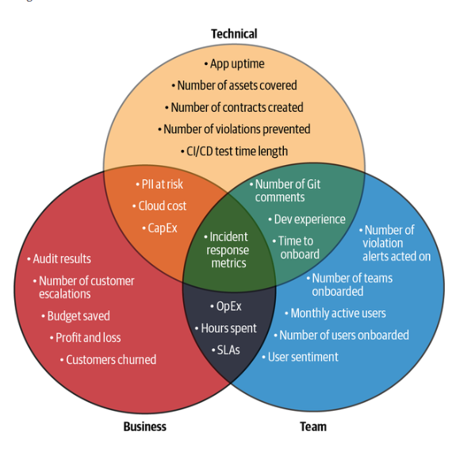
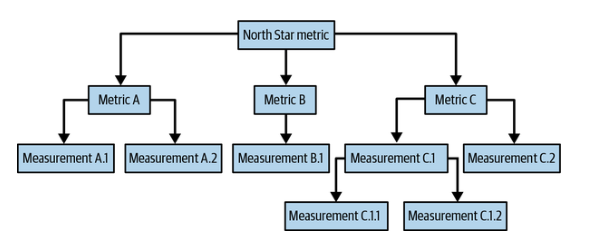
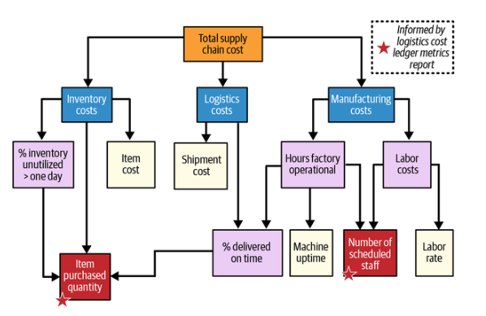

# Capítulo 12. Medición del impacto de los contratos de datos

La medición no es solo una función de información, sino un mecanismo para respaldar el cambio organizativo que describimos en el capítulo 11, los cambios culturales que analizamos en el capítulo 10 y los cambios de percepción que destacamos en el capítulo 9. Además, los líderes comprenden que las métricas no se crean en el vacío, por lo que requieren una planificación y una comunicación cuidadosas. En concreto, los líderes reconocen que las personas dentro de la empresa deben aceptar la validez de sus métricas y ponerse de acuerdo sobre su significado.

A lo largo de este capítulo, exploraremos cómo puedes complementar los resultados cualitativos que surgieron en implementaciones anteriores de contratos de datos con mediciones cuantitativas. Además, detallaremos cómo puedes comunicar eficazmente estas cifras y garantizar que toda la empresa comprenda el impacto positivo de las prácticas de datos de desplazamiento a la izquierda y los contratos de datos.

## ¿Qué vale la pena medir?

En lo que respecta a los contratos de e o de datos, agrupamos las mediciones en las tres categorías siguientes:

_Técnico_

es métricas que son indicativas de la cobertura, la fiabilidad y la funcionalidad de cualquier implementación de contratos de datos en sí misma (por ejemplo, duración de la prueba, número de activos cubiertos, etc.).

_Equipo_

Métricas operativas relacionadas con la eficiencia, el comportamiento o la carga de trabajo de los equipos relacionados con los productos de datos y/o los contratos de datos implementados

_Negocio_

Métricas de resultados que demuestran directamente el valor empresarial de la implementación de tu contrato de datos

Como punto de partida, la figura 12-1 describe las posibles mediciones que puedes utilizar para cuantificar el impacto de los contratos de datos entre las tres categorías.

Sin embargo, también queremos advertir a los lectores que eviten caer en la trampa del conocimiento previo. Es muy fácil suponer que, como tú comprendes el valor de lo que se debe medir y por qué, este valor será compartido y igualmente evidente para todos los demás miembros de la organización de gestión de datos.

### Por dónde empezar si tienes pocas mediciones existentes

Un primer paso inestimable para comprender por qué las métricas tienden a mencionarse mucho más que a medirse implica un enfoque POSIWID ( ), acrónimo que significa «el propósito de un sistema es lo que hace». Acuñado por Stafford Beer, el término actúa como una lente heurística. Fomenta que se preste atención al comportamiento y los resultados de un sistema en lugar de a las intenciones de sus creadores, lo que ayuda a contrarrestar los sesgos y facilita evaluaciones más objetivas.

Para nuestros propósitos, POSIWID establece correctamente las expectativas de que, si bien la medición es elogiada en el mundo empresarial, su aplicación práctica a menudo se queda corta. Esto se debe a que las organizaciones están diseñadas para generar beneficios, no mediciones. Esta desalineación se manifiesta en forma de vacilaciones, sesgos y resistencias cotidianas cuando se pide a las personas que midan lo que realmente importa.

Haciéndose eco del contenido del capítulo 10, y demostrado rigurosamente en How to Measure Anything: Finding the Value of Intangibles in Business (Wiley), de Douglas W. Hubbard, la mayor parte, si no toda, de esta disonancia puede descomponerse en vacilaciones. En su libro, Hubbard detalla cómo la desinformación y los sesgos cognitivos relacionados con la medición crean barreras significativas. Por ejemplo, las organizaciones que se han acostumbrado a que las personas confíen en métodos inconsistentes e imprecisos, como la intuición por sí sola o datos disponibles pero incorrectos.

En conjunto, estas dudas organizativas pueden, con el tiempo, dificultar el cambio y dar lugar a comentarios y opiniones como los siguientes:

- «Ya sabemos que esto es un problema».

- «Creo que es demasiado difuso como para cuantificarlo».

- «No importará, ya que nada va a cambiar si lo medimos».

- «Sin una base de referencia, no podemos medir la mejora».

- «De acuerdo. Bueno. Nadie ha intentado medir eso antes».

- «No confiamos en vuestra métrica, deberíais confiar en la nuestra».

En nuestra propia experiencia trabajando con empresas que implementan contratos de datos, hemos encontrado casos en los que los equipos de datos a menudo tenían opiniones similares, como «Sabemos que tenemos un problema con la calidad de los datos, pero nunca lo hemos medido ni sabemos por dónde empezar». Esto puso de relieve un problema aún mayor cuando las conversaciones se prolongaban en este punto. En pocas palabras, no estaba claro cómo el equipo de datos aportaba valor a la organización en general, más allá de ser considerado un coste necesario para el funcionamiento del negocio. Esta es una razón más por la que resulta fundamental averiguar cómo medir su impacto. Los contratos de datos centran la conversación en cuáles de los activos de datos críticos de la empresa merecen ser protegidos primero de forma e .

Entonces, ¿por dónde puede empezar un equipo si se encuentra en esta situación? Partiendo del concepto de cadenas de aclaración de Hubbard, nuestro primer paso es reconocer que, si las personas se preocupan por un resultado o proceso en una organización, entonces esa entidad es, por definición, detectable. Como afirma Hubbard en su libro: «Si tenemos motivos para preocuparnos por alguna cantidad desconocida, es porque creemos que se corresponde de alguna manera con resultados deseables o indeseables».

Su cadena de clarificación avanza entonces de la siguiente manera:

1. Si una entidad es detectable, debe ser observable.

2. Si una entidad es observable, se puede observar más de ella.

3. Si una entidad es más observable, entonces debe ser medible.

Esta lógica proporciona una justificación sencilla pero lógica de la necesidad de medir el impacto de un activo de datos crítico de . Aplicando la propia destilación de Hubbard de su heurística desde la perspectiva de un contrato de datos, podemos decir:

- Un producto de datos que se considera crítico para el negocio está demostrando, en sí mismo, que su valor es detectable.

- Dado que este valor es detectable, podemos observar más a fondo el producto de datos y expresar estas observaciones como cantidades o rangos.

- Como cantidades o rangos expresables, estas son métricas de contrato de datos e es que podemos medir (por ejemplo, «las incidencias relacionadas con el producto de datos se redujeron de una tasa de 14 a 2 incidencias al mes»).

En conjunto, el POSIWID de Beer y las cadenas de aclaración de Hubbard proporcionan a cualquier equipo un punto de partida sobre qué medir, consejos sobre cómo medir lo que se observa en lugar de lo que se pretende, y una justificación empresarial sobre por qué vale la pena medir.

Pero recuerda que, como hemos dicho anteriormente, las métricas no se crean en el vacío. Debe quedar claro cómo se relacionan con los objetivos generales de la empresa que ya se consideran valiosos para el negocio en general. Para ayudarte a establecer esta conexión, en la siguiente sección se detallan lo que denominamos árboles de métricas mínimamente viables.

### Árboles de métricas mínimamente viables

Los árboles de métricas han sido populares en algunos círculos de análisis (con Abhi Sivasailam impulsando el concepto, descrito en su charla de la conferencia Data Council 2023 «Diseño y construcción de árboles de métricas»), y tienen paralelismos con el análisis DuPont, creado por la empresa homónima DuPont en la década de 1920, y el concepto de árboles de KPI de Bernie Smith de la década de 2010. Destacamos esto para subrayar explícitamente que el árbol métrico mínimo viable (MVMT) no es un concepto nuevo creado por nosotros y, lo que es más importante, queremos hacer hincapié en la palabra «mínimo». El análisis DuPont y los árboles KPI pueden ser de una extensión considerable y, al igual que en el capítulo 11, queremos centrarnos en la practicidad y optar por una acción informada en lugar de un análisis profundo.

Por lo tanto, sostenemos que el MVMT proporciona una visión ligera y estructurada de cómo tus esfuerzos en materia de contratos de datos se conectan con resultados empresariales medibles. Comienza con una métrica clara de North Star que refleja el objetivo de la implementación de tu contrato de datos y se construye hacia abajo para mapear las aportaciones que contribuyen y sus dependencias.

Además, los MVMT ayudan a los equipos a centrarse en lo que importa en el momento sin perderse en lo que podría medirse en algún momento en el futuro. También crean una visibilidad compartida al aclarar la lógica del impacto tanto para las partes interesadas técnicas como no técnicas. Además, garantizan que la retroalimentación que generas siga siendo significativa a medida que las condiciones a tu alrededor continúan evolucionando. La figura 12-2 ofrece una visión general de alto nivel de cómo se ve esto, y proporcionaremos un ejemplo de contrato de datos en las secciones siguientes.

Como ejemplo, retomemos el caso de uso de logística de la empresa automovilística del capítulo 11, en el que los directivos afirmaban: «Es fundamental que reduzcamos los residuos dentro de nuestras cadenas de suministro para contrarrestar el aumento del coste del acero». La figura 12-3 ilustra cómo sería un posible MVMT.

Aquí podemos ver que nuestra métrica North Star es el coste total de la cadena de suministro, que descomponemos en costes de inventario, costes logísticos y costes de fabricación. Esta primera capa es relativamente sencilla, pero es en la siguiente serie de capas donde empieza a surgir la complejidad y donde hacemos hincapié en lo mínimo. Tendrás que trabajar con tus partes interesadas para determinar los factores clave de las métricas que les interesan. En el caso de la empresa automovilística del ejemplo, se trataría del equipo responsable de los costes de la cadena de suministro: el equipo de operaciones logísticas. Repite este proceso hasta llegar a un nodo que se vea directamente afectado por el producto de datos que intentas proteger mediante contratos de datos, en este caso el informe de métricas del libro mayor de costes logísticos.

Ten en cuenta que existe una gran suposición de que este proceso acabará conduciendo a tu producto de datos de interés como nodo. Estamos seguros de que esta suposición se mantendrá, dado el esfuerzo realizado para decidir estratégicamente qué producto de datos merece la pena proteger. Si te cuesta llegar a ese punto, puede ser una señal de que el producto de datos no es tan crítico para el negocio como se pensaba inicialmente. Dicho esto, puede haber casos en los que las mediciones y métricas no puedan derivarse de datos internos, por lo que las organizaciones aprovecharán los datos disponibles, como referencias anteriores, informes de prácticas o industrias similares, o incluso información pública de empresas de la competencia.

En este ejemplo, podemos vincular claramente cómo la protección del informe de métricas del libro mayor de costes logísticos, a través de contratos de datos, se relaciona con el objetivo general de la empresa de «reducir el desperdicio en nuestras cadenas de suministro». En concreto, el equipo de operaciones logísticas utiliza el informe para informar de la cantidad de artículos comprados y el número de personal programado, lo que a su vez repercute en las operaciones de la fábrica y en la utilización del inventario. Se podría argumentar que la reducción de los errores en este informe permitiría al equipo de operaciones logísticas mejorar la asignación de recursos dentro de la cadena de suministro y, en última instancia, reducir el desperdicio.

Con este ejercicio de reflexión como base, en las siguientes secciones se reunirá todo esto explicando cómo evoluciona la medición de un a a lo largo de cada una de las tres fases principales de medición del proceso de adopción de un contrato de datos: 1) medición de la viabilidad, 2) medición de la repetibilidad de un a y 3) medición de la escalabilidad.

## Medición a lo largo de las tres fases de adopción

En el capítulo 11, dividimos el proceso de adopción de en tres fases precisamente por las diferentes facetas que evolucionan en cada una de ellas. Cada fase —la prueba de concepto inicial, la ampliación de esos logros a otros proyectos piloto y, finalmente, la ampliación de la adopción de los contratos de datos en toda la organización— también se corresponde con un objetivo de medición distinto: la viabilidad, la repetibilidad y la escalabilidad de los contratos de datos. Por lo tanto, teniendo en cuenta este marco, sugerimos el siguiente esquema que se puede aplicar en cada fase de la adopción:

1.  _Adoptar un punto de vista de medición._
    Una instantánea sencilla pero significativa del negocio que te ayuda a identificar los resultados relevantes para el negocio que un determinado producto de datos apoya o de los que es responsable. Como parte de tu estrategia de medición, seleccionarás estos resultados para que actúen como métricas de referencia.

    _Alinearse con una métrica North Star._

    Cada MVMT comienza con una métrica North Star a la que se suman todas las entradas. Además, este resultado relevante para el negocio debe ser muy visible para la empresa y estar relacionado con el producto de datos que deseas incluir en el contrato.

    _Descomponer todas las aportaciones clave relacionadas._

    Desglosa cada uno de los resultados empresariales orientativos en sus métricas y palancas clave. Como parte del proceso de diagramación de MVMT, esto te ayuda a diagnosticar claramente cómo se produce realmente un resultado y, por extensión, a validar sus métricas y partes interesadas relacionadas.

2.  _Esbozar un árbol de métricas._

    En este punto, tu objetivo es codificar la información obtenida en los pasos anteriores en un árbol de métricas. Estos mapas simples, jerárquicos y específicos del contexto pueden resultar muy valiosos, ya que te ayudarán a ti y a tus defensores del contrato de datos a mantener todos los esfuerzos de implementación firmemente vinculados a los resultados empresariales en los que finalmente estás trabajando para influir.

    _Trazar las intersecciones de los contratos de datos._

    Una vez definidas las entradas, ahora rastrea cómo cada métrica se basa lógicamente en otras (no más de lo necesario para los fines de una oportunidad de implementación específica). Esto mantiene tu MVMT basado en resultados observables que puedes señalar directamente.

    _Colabora de forma iterativa._

    Una vez más, las métricas no se producen en el vacío. Obtén periódicamente comentarios de tus partes interesadas clave para comprender qué vale la pena priorizar para la implementación del contrato de datos correspondiente.

3.  _Validar tus hipótesis._

    Si bien las métricas North Star en una organización pueden ser bastante obvias, la red de métricas clave que alimentan cada una de ellas puede no serlo. Asegúrate de que las que se utilicen sean significativas, observables y relevantes para tus necesidades de adopción específicas de cada fase.

    _Valida las métricas seleccionadas._

    Una vez que hayas mapeado la estructura del MVMT, evalúa si cada métrica y relación sigue reflejando el problema que estás tratando de resolver. Evita la tentación de establecer tus mediciones y olvidarte de ellas. En su lugar, céntrate en ajustar tus métricas a lo largo del tiempo para reflejar mejor cómo es el éxito a medida que avanza la adopción.

    _Prepárate para el monitoreo y la reporting._

    Da prioridad a una comunicación coherente y concisa con las partes interesadas identificadas en tu árbol de métricas.

Al aprovechar este marco práctico , podrás adaptar tu estrategia de medición a medida que maduren tus esfuerzos de implementación. Pero, ¿cómo se ve eso en las diferentes fases? La tabla 12-1 proporciona una guía que puedes consultar a lo largo de tu propio proceso de adopción de contratos de datos.

Tabla 12-1. Consideraciones de medición a lo largo del proceso de adopción del contrato de datos

| Consideraciones sobre la medición                                    | Fase 1: Viabilidad                                                                                                                                                                                                                           | Fase 2: Repetibilidad                                                                                                                                                                                                                                                                                                                                                                                  | Fase 3: Escalabilidad                                                                                                                                                                                                                                                                                                                        |
| :------------------------------------------------------------------- | :------------------------------------------------------------------------------------------------------------------------------------------------------------------------------------------------------------------------------------------- | :----------------------------------------------------------------------------------------------------------------------------------------------------------------------------------------------------------------------------------------------------------------------------------------------------------------------------------------------------------------------------------------------------- | :------------------------------------------------------------------------------------------------------------------------------------------------------------------------------------------------------------------------------------------------------------------------------------------------------------------------------------------- |
| **1. Alinearse con una métrica North Star**                          | En la fase POC, esta debe centrarse exclusivamente en la métrica clave relacionada con el resultado o impacto comercial principal de tu hilo conductor.                                                                                      | Las métricas North Star en esta fase deben centrarse cada vez más en los resultados entre equipos para destacar su generalización en toda la organización.                                                                                                                                                                                                                                             | ¿Cómo contribuye la adopción de una práctica de datos de desplazamiento hacia la izquierda a los objetivos generales de la empresa? Por lo tanto, tus métricas North Star se centran ahora en el cambio organizativo general y en cómo dicho cambio reposiciona mejor la empresa.                                                            |
| **2. Descomponer las entradas**                                      | Identifica y descompone no más de tres resultados críticos posteriores, junto con sus métricas o palancas clave que contribuyen a ellos. Pregúntate: «¿Qué entradas de mi conjunto de consideraciones serían más dolorosas de equivocarme?». | Recuerda que ahora estás lidiando con señales organizativas y puntos débiles compartidos. Por lo tanto, trabaja para descomponer cada North Star en mediciones recurrentes que surjan en todos los equipos.                                                                                                                                                                                            | La descomposición debe tener en cuenta los factores que contribuyen en todos los ámbitos. Al mismo tiempo, debes tener en cuenta las ambigüedades que se cuelan en las definiciones de tus métricas, es decir, los datos que se comportan de forma diferente según el contexto del equipo (por ejemplo, «¿Quién se considera cliente?»).     |
| **3. Traza un mapa de las intersecciones de los contratos de datos** | En la fase 1, céntrate solo en las métricas mínimas necesarias. Se trata de una o dos fuentes clave que alimentan la métrica North Star seleccionada y que afectan directamente al resultado de la prueba de concepto.                       | Céntrate en las dependencias entre sistemas y límites de propiedad, identificando, por ejemplo, dónde una sola métrica se alimenta de diferentes canalizaciones o dónde la aplicación requerirá coordinación.                                                                                                                                                                                          | Esta fase requiere centrarse en los puntos de fallo conocidos, los límites de aplicación y las interdependencias del sistema. Aunque esto comienza a verse en la fase 2, en la fase 3 es lo que se espera al ver la cobertura del contrato a nivel de la organización.                                                                       |
| **4. Validar las métricas**                                          | Asegúrate de que las métricas que deseas mostrar demuestren la viabilidad de la implementación y también se ajusten a la métrica North Star.                                                                                                 | Aquí se hace hincapié en el entendimiento y las creencias compartidas sobre las métricas entre los equipos. Una métrica puede ser fundamental para un equipo y secundaria para otro.                                                                                                                                                                                                                   | La escalabilidad hacia y a través de las últimas fases de la curva de madurez de los contratos de datos en su conjunto requiere una validación automatizada, integrada y continua. Es la única forma de garantizar que los gastos generales no se conviertan en un obstáculo para los esfuerzos de mantenimiento.                            |
| **5. Colaborar de forma iterativa**                                  | Trabaja en estrecha colaboración con tu defensor o con uno o dos interesados, dando prioridad a los comentarios informales, pero directos y honestos.                                                                                        | En la fase 2, el desplazamiento de los datos hacia la izquierda se convierte en un esfuerzo colaborativo. Punto. Por lo tanto, debes empezar a mantener definiciones compartidas y documentar las decisiones, además de crear bucles de retroalimentación entre los equipos. La formalización aquí puede evolucionar a medida que la organización avanza en la curva de madurez del contrato de datos. | A medida que la colaboración evoluciona hacia estructuras de gobernanza, mantente alerta ante cualquier indicio de aumento de los gastos generales. Los esfuerzos de colaboración en sí mismos deben apoyar siempre y de forma activa la resiliencia, no ralentizarla. Por lo tanto, esfuérzate por diseñar con autonomía y responsabilidad. |
| **6. Monitoreo e informar**                                          | Basándote en tu punto de vista de medición, ofrece un resultado claro, centrado y observable que facilite la comprensión del impacto de la implementación del contrato de datos.                                                             | Los informes de la fase 2 deben comenzar a permitir la comparación y el reconocimiento de patrones. Trabaja para crear paneles de control o rastreadores que comiencen a demostrar dónde se están aplicando los contratos de datos, qué equipos se benefician de tus esfuerzos continuos y dónde se producen las infracciones.                                                                         | En esta fase, es fundamental garantizar que tus métricas mantengan su capacidad para ayudar a contar historias convincentes y relacionadas con los resultados que puedan ser utilizadas por los directivos.                                                                                                                                  |

En las siguientes secciones, desglosaremos cada fase, proporcionaremos consideraciones adicionales para cada una de ellas y sugeriremos posibles métricas que puedes utilizar.

### Objetivo de la fase 1: medir la viabilidad

En la fase 1, tu objetivo e e es simplemente demostrar que un contrato de datos puede funcionar según lo previsto cuando se aplica a un caso de uso crítico para el negocio y bien definido. Esta fase del proceso de adopción del contrato de datos es posiblemente la que requiere más disciplina, ya que tu objetivo no es más que demostrar la viabilidad de un contrato de datos en un hilo de acero seleccionado estratégicamente (como se explica en el capítulo 11). Antes de que las cosas se compliquen, es conveniente validar que la implementación del contrato de datos puede funcionar según lo previsto en un área concreta del negocio. Esto demuestra que ofrece un rendimiento fiable y un valor medible en condiciones limitadas y claras.

A continuación se incluyen algunas preguntas que pueden servir de guía:

- «¿Cuál es el riesgo empresarial que intentamos mitigar o prevenir?».

- «¿Esta métrica se acerca a algo que ya se está siguiendo o percibiendo?».

- «¿Quién debe quedar convencido en última instancia de la eficacia de esta prueba de concepto y en qué se basarán para confiar en ella?».

> **Nota**

> Si las respuestas aquí resultan difíciles de encontrar, te sugerimos que revises los criterios del capítulo 11para seleccionar tu hilo conductor de acero POC. Además, es posible que también tengas que revisar y modificar la matriz de influencia/interés de las partes interesadas desarrollada como parte del propio proceso de propuesta POC. Todo esto forma parte del proceso a medida que aprendes más sobre lo que realmente importa a tus partes interesadas.

Además, aquí tienes algunas métricas potenciales que pueden ser útiles más allá de las mediciones específicas del negocio vinculadas a tu hilo conductor:

- Número de activos de datos detectados

- Número de contratos de datos redactados, aceptados, implementados, modificados o archivados (es decir, un embudo)

- Tiempo hasta el primer contrato (la fecha de inicio suele negociarse)

- Número de desarrolladores incorporados a los contratos de datos

- Número de ejecuciones de CI/CD que se iniciaron, dieron error, superaron las comprobaciones o revelaron infracciones

- Número de alertas que fueron precisas o falsos positivos

- Puntuación Likert de satisfacción de los desarrolladores (por ejemplo, «En una escala del 1 al 5...»).

El énfasis de estas mediciones se centra en la viabilidad de los contratos de datos, en contraste con el ejercicio del árbol de métricas, que se centra en el impacto de los contratos de datos.

Tras la implementación del POC, las dificultades relacionadas con tu hilo conductor deberían ser notablemente menores. En esta estela operativa, permanece atento a las señales de mayor confianza por parte de las partes interesadas que antes se mostraban reticentes, en particular las que se encuentran en la fase inicial o adyacentes al hilo conductor. ¿Están haciendo menos preguntas aclaratorias? ¿Parecen tener más confianza en los resultados del sistema? Estos sutiles cambios son importantes.

Presta también atención a los primeros indicios de impulso de adopción, concretamente, al interés o la alineación que comienza a surgir de forma orgánica en partes de la organización en las que no has participado activamente. Esto puede adoptar la forma de consultas informales, referencias a tu POC en reuniones de equipos adyacentes o la voluntad de participantes sin influencia de defender iniciativas de adopción similares en otros lugares. Estos momentos de apoyo espontáneo suelen ser los primeros indicios de que la fase 2 será más fácil de iniciar de lo previsto.

Vale la pena señalar que la presentación de informes va más allá de documentar lo que sucedió y cambió. La presentación de informes también sirve como mecanismo de retroalimentación para informar a los equipos sobre posibles nuevas métricas (o aquellas que no vale la pena medir). Esto es fundamental a medida que avanzas hacia la repetibilidad de tus esfuerzos de adopción ( ).

### Objetivo de la fase 2: medir la repetibilidad

En la fase 2, tu enfoque debe cambiar hacia la repetibilidad de la prueba de concepto ( ), ya que aplicas tu enfoque inicial a productos y dominios de datos adicionales de alto valor, comprobando si tu enfoque es viable en condiciones más amplias y variadas. Después de la prueba de concepto, ahora deberías estar en una posición privilegiada gracias a todo el trabajo duro, la planificación y las discusiones con tus compañeros que has realizado. Habrá demostrado la viabilidad de la implementación de contratos de datos en su organización, y lo habrá hecho con uno de sus productos de datos más valiosos.

Tu objetivo operativo ahora es diferente. Has demostrado que los contratos de datos pueden funcionar en un contexto altamente controlado. Ahora es el momento de ampliar ese éxito. Esto significa ir más allá del POC y recalibrar tu enfoque de implementación, idealmente con tantos hilos de acero restantes como sea posible. Ya no estás tratando de demostrar que los contratos de datos pueden funcionar, ahora estás demostrando que pueden funcionar una y otra vez, con diferentes productos de datos, propietarios de dominios y presiones continuas del mundo real.

Por extensión, esto significa prepararte para abordar una mayor complejidad organizativa, más partes interesadas y riesgos que, aunque ya son elevados debido a tu enfoque de priorizar los hilos de acero, no harán más que aumentar a medida que tu organización madure a lo largo de la curva del contrato de datos. A medida que avanzas con los proyectos piloto, es posible que te veas en la necesidad de ampliar rápidamente tus esfuerzos más allá de los primeros usuarios e influencers. Al hacerlo, empezarás a encontrar más dudas o incluso rechazo entre los productores y consumidores de datos a los que estás presentando tus esfuerzos de adopción continua.

Debido a este cambio hacia un público más amplio y menos inclinado de forma natural, tus esfuerzos de medición deben centrarse ahora en métricas que destaquen la coherencia, la alineación entre equipos y la confianza operativa, y no solo en aquellas vinculadas a los resultados empresariales directos. Algunos ejemplos son:

- Tiempo hasta la resolución de un incidente en varios equipos

- Número de equipos designados como propietarios dentro de las especificaciones del contrato

- Número de escalamientos relacionados con clientes frente a escalamientos internos

- Reducción de las escaladas repetidas a lo largo del tiempo

- Tiempo dedicado a gestionar las infracciones de contrato

- Disminución de los eventos reactivos de guardia por ventana de X semanas

- Estimación de horas de ingeniería ahorradas gracias a la aplicación de las infracciones trimestre tras trimestre

Además, tras una prueba de concepto satisfactoria, es tentador precipitarse. Pero en la fase 2, debes hacer una pausa y reajustar lo que se considera un éxito en condiciones más amplias. Por lo tanto, dedica tiempo a volver a cuestionarte a ti mismo basándote en lo que has establecido ahora a través de tus objetivos evolucionados, tu instantánea y tu punto de vista de medición:

- «¿Qué significaría que [la métrica] mejorara en un área de la organización pero no en otra?».

- ¿Todos los equipos definen [métrica] de esta manera? ¿O será necesario traducirla?

- «¿Esta métrica tendría sentido para alguien ajeno a los datos?».

- «¿Podemos medir esto con la frecuencia suficiente para informar la toma de decisiones? ¿O es demasiado lento o manual?».

Además, puede ser tentador estandarizar tus esfuerzos de medición demasiado pronto y de forma demasiado rígida. Habrá tiempo suficiente para perfeccionar en la fase 3, donde comienza el largo proceso de adopción en toda la organización. En la fase 2, en comparación, todavía estás en modo de aprendizaje de la implementación. Forzar la coherencia antes de poder validar la adecuación puede fomentar una resistencia innecesaria y unas implementaciones de contratos de datos que carecen de la flexibilidad necesaria para desarrollarlas.

Por último, a medida que se multiplican las implementaciones exitosas, es fácil dejar de dar prioridad al tiempo y la energía necesarios para mantener el compromiso de las partes interesadas. Como se explica en los capítulos 10 y 11, aprovechar la medición es fundamental, pero requiere una comunicación clara para aumentar la confianza que los demás tienen en tus esfuerzos. Por diseño, las MVMT deben ser lo más ágiles y eficaces posible. Pero si tus esfuerzos de medición comienzan a omitir el contexto humano que hay detrás de los datos (las necesidades reales, los riesgos y las relaciones que impulsan cada caso de uso), corres el riesgo de perder por completo el sentido subyacente de tus esfuerzos.

Por el contrario, ampliar con éxito tus esfuerzos a través de la segunda fase del proceso de adopción del contrato de datos proporciona más señales de éxito que debes tener en cuenta. La implementación debe comenzar a formar un perímetro de proactividad, con más equipos que, con el tiempo, te busquen para solicitar contratos de datos. Muchos menos deberían seguir tratando de justificarlo preguntando: «¿Qué hay para mí?».

A medida que te acerques a la fase 3, las métricas compartidas deberían empezar a cobrar sentido y los paneles de control deberían mostrar las tendencias de todos los equipos. Una vez que hayas definido una métrica clave, deberías ver cómo más equipos informan sobre ella, con menos confusión o gastos de traducción necesarios con el tiempo.

### Objetivo de la fase 3: medir la escalabilidad

Por último, en la fase 3, es posible realizar esfuerzos más amplios para adoptar el contrato de datos ( ) y tu atención se centra en la escalabilidad y en la incorporación de prácticas de medición y aplicación en todos los sistemas y en la cultura.

En la fase final del proceso de adopción de los contratos de datos, comenzarás a pasar a la escala. Ahora es el momento de hacer evolucionar tus esfuerzos de adopción de contratos de datos, pasando de la elaboración de implementaciones individuales al establecimiento de prácticas culturales. Al pasar de la prueba de concepto al éxito repetible en todos los hilos de acero y en otros productos de datos piloto, tus esfuerzos de medición deben ahora integrar la aplicación, la gobernanza y la observabilidad en los sistemas y prácticas más amplios de tu organización.

En la práctica, esto significará navegar por las complejidades a medida que se agravan de forma natural. Sí, los equipos pueden empezar a adoptar e implementar contratos de datos de forma independiente. Pero a medida que se extiende la adopción, también lo hacen los riesgos de desviación en la implementación, inconsistencias en la aplicación y fatiga de las señales. Por lo tanto, el papel de la medición en esta fase no es solo apoyar la adopción, sino que también debe ayudar a reforzar la confianza, sacar a la luz fallos invisibles y fortalecer la resiliencia a largo plazo.

A medida que las prácticas de adopción de contratos de datos comienzan a integrarse en la organización, y el valor de los contratos de datos y las prácticas de datos de desplazamiento a la izquierda se vuelven capaces de reforzarse a sí mismas, tus esfuerzos de medición pueden servir a un propósito más amplio, pero no menos vital. Por lo tanto, las métricas en esta fase deben responder cada vez más a las necesidades del liderazgo, mostrando el valor de los equipos de la plataforma de datos en su conjunto. Esto parece consistir en proporcionar visibilidad del retorno de la inversión, dar forma a las decisiones de la hoja de ruta y apoyar el desarrollo de políticas de gobernanza de datos.

Como tal, esto puede implicar centrarse en métricas como:

- Porcentaje de todos los hilos de acero sujetos a la aplicación completa del contrato de datos

- Ahorro trimestral en costes gracias a la prevención

- Porcentaje de los activos de datos de la empresa sujetos a contrato (es decir, cobertura contractual)

- Tiempo medio de resolución de problemas relacionados con productos de datos

- Tiempo de incorporación de nuevos equipos

- Volumen de infracciones recurrentes a lo largo del tiempo

- Porcentaje de alertas resueltas sin escalar

También es importante señalar que la fase 3 requiere aceptar que las presiones motivadoras de las fases 1 y 2 se distribuirán más, si no se aplazan por completo en favor de prioridades competidoras. Ahora, debes rechazar el pensamiento presuntivo, la confianza ciega y, como se señala en el capítulo 11 sobre la adopción del marco de ocho pasos de Kotter, los efectos antimomentum de la complacencia.

Además de tu vigilancia ante la complacencia, debes centrarte en tu capacidad para detectar si la maduración del contrato de datos se está produciendo realmente y si se mantiene el impulso:

- «¿Qué está pasando bajo la superficie de nuestros esfuerzos que hemos dejado de ver con claridad?».

- «¿Las métricas que informamos siguen impulsando la acción? ¿O simplemente estamos cumpliendo con las expectativas?».

- «Si [el equipo relacionado con los hilos de acero] dejara de cumplir con su contrato de datos mañana, ¿cuánto tiempo tardaríamos en darnos cuenta?».

En primer lugar, y quizás lo más importante, sé consciente de los retos que conlleva la adopción de contratos de datos a gran escala. La automatización es esencial, pero también puede crear puntos ciegos si se miden los aspectos equivocados o se ignoran las señales de fallo. Este riesgo se solapa con el de un sutil deslizamiento cultural hacia la suposición de confianza, a medida que los equipos y las partes interesadas amplían la adopción en toda la organización. Del mismo modo, los paneles de control y las métricas acordadas pueden degradarse hasta convertirse en ruido organizativo si no se revalidan periódicamente en función de los riesgos y resultados reales del negocio.

Teniendo en cuenta estos puntos, las señales de éxito en la fase final del proceso de adopción de contratos de datos pueden resultar excepcionalmente gratificantes porque, además de mejorar la salud y el bienestar general de las operaciones comerciales, se hacen cada vez más visibles en toda la cultura de la organización. Los comportamientos autocorrectivos deben aparecer y volverse cada vez más comunes. Los equipos deben actualizar los contratos de forma proactiva, señalar las infracciones y refinar las definiciones de las métricas de abajo hacia arriba, en lugar de requerir una iniciativa de arriba hacia abajo. Además, recordando los retos de la fase 2, los nuevos equipos deben seguir incorporándose más rápidamente, mientras que los falsos positivos por incumplimiento de contratos disminuyen.

En última instancia, las métricas y las mediciones también evolucionan, pasando de ser una obligación retrospectiva a convertirse en una ventaja estratégica orientada al futuro y allanando el camino para la implementación continua y el impulso de la adopción. Independientemente de la fase en la que te encuentres, recuerda la idea central de Hubbard: medir cualquier cosa, especialmente aquellas cosas que parecen intangibles, se trata en última instancia de reducir la incertidumbre para tomar mejores decisiones.

Pero para impulsar a una organización a través de la curva de madurez de los contratos de datos, necesitamos comunicar esas ideas de forma clara y persuasiva a los demás. Los viajes, por definición, requieren un impulso hacia adelante. Los éxitos de medición de cada fase de adopción de los contratos de datos deben contribuir a establecer y mantener un progreso constante y coherente. En la siguiente sección te proporcionaremos un marco para apoyar tus esfuerzos de comunicación « » y mantener el impulso hacia adelante.

## Narrativa para medir el impacto

Una de las razones por las que la medición no es más autosuficiente dentro de las organizaciones es que los conocimientos y la información no se venden por sí solos. De hecho, como Hubbard también analiza en su trabajo, aunque la información basada en datos reduce sin duda la incertidumbre en las organizaciones, no puede superar por sí sola los sesgos humanos, los malentendidos o la resistencia al cambio. Quienes dirigen los esfuerzos de adopción de contratos de datos tienden a apreciar el potencial de estos y son los primeros en ser testigos de su éxito, pero volver a demostrar tus esfuerzos a lo largo del tiempo puede resultar frustrante. Quizás te preguntes:

- «¿Por qué la gente no entiende lo que estamos haciendo aquí?».

- «¿No ve todo el mundo por qué esto funciona tan bien?».

- «¿Por qué tengo que seguir demostrando el valor una y otra vez?».

Estas frustraciones son comprensibles. Como se detalla en el capítulo 9, las diferencias de percepción entre los equipos y las personas que trabajan en diferentes partes de la organización pueden ser sorprendentemente grandes. La única forma probada de salvar estas diferencias es la empatía.

En última instancia, es necesario reducir la resistencia de los demás abordando las cuestiones de una manera que tenga sentido para ellos. Utiliza temas, cuestiones y perspectivas que resuenen con la realidad de sus experiencias profesionales. Además de estar preparados para medir y utilizar métricas como prueba, también debemos estar preparados y ser capaces de utilizarlas para persuadir. Para ello, pasamos ahora de la ciencia de la medición a una disciplina complementaria: el arte de contar historias.

Al igual que los árboles métricos ofrecen una fórmula estructurada para medir lo que es importante para la empresa, proponemos una estructura igualmente intencionada para la narración de historias. Aquí, presentamos la narración de historias como un mecanismo estratégico y repetible para transmitir tu mensaje a toda la empresa. Si se hace bien, se convierte en una forma de poner de manifiesto la alineación, generar confianza y superar las prioridades contrapuestas y las fricciones políticas de una manera que las métricas por sí solas a menudo no pueden. Y, como mostraremos en breve, esta estructura narrativa no solo respalda la narración, sino que refleja las realidades prácticas del propio proceso de adopción del contrato de datos, alineándose de forma natural con las tres fases fundamentales que ya hemos establecido.

Por lo tanto, nos basamos en las ideas pioneras de Joseph Campbell para crear una historia cautivadora. A lo largo de su vida dedicada al estudio de la mitología, las religiones y los arquetipos culturales, Campbell descubrió que ciertos personajes, puntos de la trama y temas narrativos aparecen repetidamente a lo largo de la historia en las historias que más atraen a la gente.

En El héroe de las mil caras (Princeton University Press), Campbell sintetizó los patrones narrativos más comunes en el «monomito», también conocido como «el viaje del héroe». Su objetivo al hacerlo era totalmente práctico: proporcionar una hoja de ruta mitológica de atractivo casi universal, arraigada en la psicología humana compartida y en los ritos culturales atemporales. En resumen, ideó la fórmula definitiva para contar historias, una fórmula que ha demostrado ser invaluable para miles de escritores y cineastas y, sí, también para profesionales de los negocios, que necesitan formas eficaces y repetibles de persuadir a los demás que sean estimulantemente sencillas pero extremadamente adaptables.

A esta estructura narrativa tan persuasiva se le atribuye directamente la creación de algunas de las narrativas más influyentes y perdurables de nuestra era reciente. No es casualidad que, en 2012, Disney considerara que valía la pena gastar 4040 millones de dólares en la compra de Star Wars, una de las franquicias cinematográficas más exitosas de la historia. George Lucas, su creador, atribuye el éxito de la franquicia a la estructura narrativa de Campbell.

Estas tácticas narrativas ayudan al público a comprender por qué una historia es importante y por qué vale la pena prestarle atención. Utilizaremos el monomito para hacer lo mismo aquí, asegurándonos de que nuestros esfuerzos de medición no solo sean concisos y claros, sino también óptimamente convincentes.

Antes de analizar a Campbell a través del prisma del contrato de datos, desglosemos primero cada acto del monomito de « »: partida, transformación y regreso.

_Salida_

En primer lugar, establece una sensación de normalidad. Esto ayuda al público a apreciar el cambio que está a punto de producirse. Conocemos a los personajes principales y aprendemos cuáles son sus necesidades y objetivos básicos. Pero entonces ocurre algo inesperado que enfrenta a los protagonistas. Un cambio, un acontecimiento o una perturbación les obliga a abandonar el mundo que conocen para intentar salvarlo.

_Transformación_

A continuación, se desarrolla un viaje. Los protagonistas se enfrentan a pruebas, encuentran resistencia y se ven obligados a afrontar cambios internos o externos. El momento en que nuestros héroes se enfrentan al momento de la transformación es el punto álgido de la historia del monomito, donde se ponen a prueba rasgos positivos del carácter como la confianza, la resiliencia o la fe.

_Retorno_

Una transformación e a exitosa en la historia del monomito da como resultado la muerte y el renacimiento, y el protagonista a menudo hace un gran sacrificio para lograr algo heroico. Al hacerlo, frustran aquello que los llevó a abandonar el mundo normal en primer lugar. Luego regresan a casa y el mundo que los rodea cambia en beneficio de todos los que lo habitan.

Ahora vamos a partir de esos tres actos y desglosar cómo puedes aplicar las diferentes fases del proceso de adopción del contrato de datos a esta estructura. Nos aseguraremos de que la narración sea relevante para la medición según sea necesario.

### Partida

El objetivo de la primera fase de la historia del monomito, la partida, es dejar claro a tu público que algo nuevo tiene que suceder. Para ello es necesario establecer los antecedentes. Los antecedentes deben incluir la identificación de nuestros personajes principales —un hilo conductor o producto de datos y sus principales partes interesadas, productores de datos y consumidores— y el mundo en el que operan. Es fundamental proporcionar primero esta información a tu público, ya que crea el contexto para todo lo demás que sucede en la historia. Los antecedentes hacen que la historia tenga sentido y, por extensión, que sea importante para el público.

La clave para establecer la primera parte de un patrón monomítico es introducir una complicación que funcione como catalizador. Se trata de un fracaso de nuestros personajes que pone en riesgo la estabilidad del mundo que hemos establecido y los objetivos y necesidades de nuestros personajes. Aquí es donde entran en juego nuestros problemas inmediatos o retroactivos, donde dejamos claro a tu público que no es aceptable no actuar. Debemos actuar juntos, alejándonos de la seguridad y la tranquilidad de cómo han sido las cosas hasta ahora para, literalmente, evitar que ocurran cosas malas.

### Transformación

Esta « » nos lleva a la segunda parte de la estructura narrativa, cuando debe producirse una transformación. En el monomito, esto implica clásicamente que nuestros héroes obtengan una poción mágica, una herramienta o la ayuda de un mentor o un personaje de apoyo. Los héroes se sacrifican para renacer de nuevo, transformados con el poder, el conocimiento o las habilidades necesarias para marcar la diferencia fundamental en la historia.

La implementación de contratos de datos puede resultar absolutamente transformadora en las organizaciones modernas. Como ventaja adicional, no requieren el nivel de sacrificio y renacimiento que se encuentra tan a menudo en galaxias muy, muy lejanas. Pero sí requieren absolutamente que utilicemos métricas y mediciones como herramientas que permitan hacer posibles las transformaciones. Esto es paralelo a cómo la narración inspirada en el monomito guía la forma en que incluimos a los actores clave relacionados con los productos de datos como personajes activos y de apoyo en nuestras historias.

Además, para que nuestras historias de adopción de contratos de datos sean persuasivas, la necesidad de transformación debe parecer inevitable, no opcional. Tras la partida en el segundo acto, el público debe sentir que no hay vuelta atrás, porque la forma en que eran las cosas ya no es aceptable. Cualquier dolor, incomodidad o sacrificio a corto plazo que requiera la puesta en marcha del cambio vale la pena por los beneficios que reportará en un futuro próximo. Aunque el conflicto en cuestión solo afecte a unas pocas personas, es toda la organización la que se beneficiará. Por lo tanto, cuando se elabora correctamente, una historia relacionada con los contratos de datos que alcanza su punto álgido en el segundo acto deja al público preguntándose: «¿Por qué no lo estamos haciendo ya?», en lugar de «¿Por qué íbamos a hacerlo?».

Esta es la creencia que estás transmitiendo: que la implementación del contrato de datos cumplirá su promesa en cada oportunidad de implementación. Si bien tus esfuerzos narrativos en las fases iniciales de adopción pueden beneficiarse del interés inherente a tus productos de datos, que son hilos de acero, la belleza de este enfoque narrativo es que puede crear urgencia e inspirar la acción, independientemente de la naturaleza de los resultados empresariales e es que estén en juego.

### Retorno

Para persuadir a tu público de que la implementación del contrato de datos debe llevarse a cabo, debes utilizar métricas y mediciones para ilustrar lo que implicará la fase de retorno en tu historia. A los ojos de Campbell, el retorno resuelve y libera la tensión psicológica acumulada en el público durante los dos primeros actos. Es donde los héroes devuelven el conocimiento, el tesoro o la sabiduría al lugar de donde proceden, en beneficio de todos.

El retorno es donde describirás a tu público los efectos reales, medibles y tangibles que la implementación del contrato de datos tendrá en una métrica norte determinada, además de ofrecer pruebas de la nueva normalidad, ya sea una menor tasa de incidentes, tuberías más fiables o una mayor confianza en las métricas. Estos resultados potenciales deben parecer lo más tangibles posible cuando se utilizan estas historias para persuadir.

## Poniendo todo junto

Por diseño, la narración de datos aclarará lo que más importa y cómo medirlo. Ahora ya entiendes qué y por qué medir, así como los medios para transmitir ese conocimiento a través de un marco persuasivo y repetible. Con estos recursos, no terminarás presentando logros técnicos solo para frustrarte porque tus compañeros no parecen conectar con ellos de la manera que tú necesitas. Podemos resumir las necesidades de cada uno de los tres actos con unas cuantas preguntas clave:

_Salida_

¿Qué ineficiencia, problema, dificultad o riesgo relacionado con este producto de datos es más inaceptable? ¿Quién lo siente más?

_Transformación_

¿Qué medidas concretas pueden cambiar la realidad en este caso? ¿Habrá resistencia al cambio? ¿Qué tendrás que hacer para superar esta resistencia?

_Regreso_

¿Qué cambiará para siempre cuando se implemente el contrato de datos? ¿Qué métricas indicarán mejor que la transformación está teniendo el efecto deseado y proporcionando beneficios duraderos que las partes interesadas y otras personas pueden percibir?

Para ayudar a que todo esto sea más práctico, la Tabla 12-2 muestra tres marcos de historias cortas, cada uno construido en torno a escenarios reales de contratos de datos. Considera estos puntos de partida, que abordan la mentalidad necesaria para estructurar historias basadas en mediciones que inspiren al público a apoyar los esfuerzos de adopción de contratos de datos en tu propia organización.

Tabla 12-2. Ejemplos de narración de historias con respecto a los contratos de datos

| Actúa             | Propósito                                                                                                                          | Narrativa basada en métricas                                                                                                                                                                                                                                                                                             |
| :---------------- | :--------------------------------------------------------------------------------------------------------------------------------- | :----------------------------------------------------------------------------------------------------------------------------------------------------------------------------------------------------------------------------------------------------------------------------------------------------------------------- |
| **Ejemplo 1**     |                                                                                                                                    |                                                                                                                                                                                                                                                                                                                          |
| 1. Partida        | Establece los antecedentes, el contexto, los personajes y lo que está en juego. ¿Qué pasa si nada cambia?                          | «Nuestra métrica estrella, los datos críticos de uso de los clientes, se retrasaba repetidamente durante los ciclos de presentación de informes, lo que ponía en peligro las revisiones trimestrales del negocio».                                                                                                       |
| 2. Transformación | Muestra el efecto convincente que la implementación del contrato de datos hará posible.                                            | «La implementación del contrato de datos, que garantiza la vigencia de los acuerdos de nivel de servicio (SLA) en materia de datos, estabilizará los ciclos de presentación de informes en un plazo de dos meses, lo que restablecerá la confianza de los ejecutivos».                                                   |
| 3. Rentabilidad   | Tras la implementación, ¿qué cambiará inmediatamente para mejor? ¿Cómo se beneficiará la organización en su conjunto en el futuro? | «En el futuro, los equipos de finanzas y marketing tratarán las infracciones de los contratos como alarmas de humo, lo que permitirá soluciones proactivas en lugar de escaladas reactivas».                                                                                                                             |
| **Ejemplo 2**     |                                                                                                                                    |                                                                                                                                                                                                                                                                                                                          |
| 1. Partida        | Establece los antecedentes, el contexto, los personajes y lo que está en juego. ¿Qué pasa si no cambia nada?                       | «A pesar de sus buenas intenciones, los equipos que gestionan los datos de facturación de los clientes no tienen visibilidad de los procesos fallidos hasta que los clientes escalan los problemas».                                                                                                                     |
| 2. Transformación | Muestra el efecto convincente que permitirá la implementación de contratos de datos.                                               | «Los contratos de datos y la validación proactiva de esquemas pueden reducir las escaladas de los clientes en un 35 % durante los dos próximos trimestres, lo que reduciría la carga de las llamadas en un 20 %».                                                                                                        |
| 3. Rentabilidad   | Tras la implementación, ¿qué cambiará inmediatamente para mejor? ¿Cómo se beneficiará la organización en su conjunto en el futuro? | «La adopción de medidas proactivas permitirá a los equipos de asistencia detectar los problemas relacionados con los datos antes de que afecten a los clientes, lo que protegerá la confianza en la marca y reducirá las situaciones de emergencia».                                                                     |
| **Ejemplo 3**     |                                                                                                                                    |                                                                                                                                                                                                                                                                                                                          |
| 1. Partida        | Establece los antecedentes, el contexto, los personajes y lo que está en juego. ¿Qué pasa si no cambia nada?                       | «Debido a supuestos de esquema no documentados y a la falta de normas aplicables, la incorporación de nuevas funciones a los productos lleva actualmente una media de más de tres meses. Esto está costando impulso y confianza a los equipos, ya que tienen que volver constantemente atrás para solucionar problemas». |
| 2. Transformación | Muestra el efecto convincente que permitirá la implementación de contratos de datos.                                               | «La implementación de contratos de datos y puntos de control de cumplimiento puede reducir el tiempo de entrega en un 15 %, lo que permite lanzamientos y escalados de funciones más rápidos».                                                                                                                           |
| 3. Rentabilidad   | Tras la implementación, ¿qué cambiará inmediatamente para mejor? ¿Cómo se beneficiará la organización en su conjunto en el futuro? | «La incorporación de contratos de datos permitirá a los equipos de producto lanzar nuevos servicios de forma rápida y fiable, sin correr el riesgo de que surjan problemas de integración posteriores».                                                                                                                  |

Si se combinan, el poder de una medición clara y una narración persuasiva elevarán tus esfuerzos más allá de la simple presentación de resultados. Como punta de lanza de la adopción de contratos de datos, tú les darás forma. Esto garantiza que tus esfuerzos continuos se vean cada vez más como una historia que, cuando se cuenta bien, genera confianza, fomenta la adopción continua y sostiene un cambio duradero y e e a lo largo del tiempo.

## Conclusión

A lo largo de este capítulo, hemos explorado por qué las métricas y la medición son fundamentales no solo para implementar contratos de datos, sino también para impulsar a una organización a lo largo de la curva de madurez de los contratos de datos.

Hemos establecido por qué la medición es importante: reduce la incertidumbre, mantiene visible el progreso y genera confianza en la organización. A continuación, hemos vuelto a presentar las tres fases fundamentales del proceso de adopción mencionadas por primera vez en el capítulo 11 (viabilidad, repetibilidad y escalabilidad de los contratos de datos) y hemos proporcionado una estrategia específica para cada fase con el fin de alinear la medición con cada una de ellas. A partir de ahí, hemos introducido los árboles de métricas mínimas viables como una forma práctica y repetible de basar cada esfuerzo de implementación en resultados observables.

Partiendo de esa base, pasamos a la narración de historias adaptando el famoso monomito de Joseph Campbell como fórmula estratégica para aclarar el valor, invitar a la alineación e inspirar la aceptación necesaria para un cambio cultural duradero.

Nuestro énfasis en la persuasión, a través de métricas significativas y la narración de historias, se basa en nuestra comprensión de los problemas de calidad de los datos: que se trata de retos relacionados con las personas y los procesos que se disfrazan de problemas técnicos. Además, hemos descubierto que los equipos no tienen dificultades con la primera implementación de los contratos de datos, sino con la ampliación de la solución a más equipos. Resolver estos problemas requiere un cambio de comportamiento dentro de la empresa y, por lo tanto, es necesario 1) incentivar los comportamientos deseados y 2) facilitar al máximo su aplicación mediante la automatización.

Hemos abordado las siguientes ideas:

- Por qué la medición eficaz, a pesar de considerarse sacrosanta en todo el mundo empresarial, tiende a ser difícil y a escasear

- Por qué los esfuerzos y estrategias de medición adecuados deben desempeñar un papel esencial en los esfuerzos de adopción de contratos de datos

- Por qué la medición a lo largo del proceso de adopción de contratos de datos puede y debe gestionarse en tres fases distintas

- Cómo crear árboles de métricas mínimamente viables para estructurar y orientar eficazmente los esfuerzos de medición sin complicarlos

- Por qué las métricas derivadas de la medición no son, por sí solas, capaces de persuadir a los líderes y a las partes interesadas clave y, por lo tanto, cómo una narración clara e intencionada ayuda a salvar la brecha entre la claridad de la adopción y el impulso

- Cómo estructurar historias relacionadas con los contratos de datos para mantener la aceptación y acelerar la creación de confianza.

Esto nos lleva también a la conclusión de la tercera y última sección de este libro. Hemos abordado las diferencias de percepción que debes identificar antes de iniciar los esfuerzos de adopción, hemos abordado los retos inherentes a la gestión del cambio, hemos discutido los pasos estratégicos necesarios para abordar una prueba de concepto inicial y hemos tratado la traducción de ese primer contrato de datos exitoso en una mayor adopción por parte de la propia organización.

Pero, como en cualquier viaje, siempre habrá más pasos que dar. Terminaremos este libro con lo que creemos que será el futuro de la adopción de los contratos de datos y lo que debemos preparar para aprender más en un futuro próximo.
